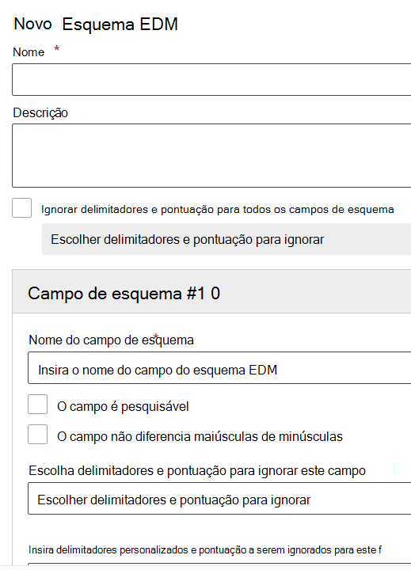

# Use o Assistente de Correspondência Exata de Dados e Tipo de Informação Confidencial

[Criar um tipo personalizado de informação confidencial com classificação baseada em EDM (Correspondência Exata de Dados) ](create-custom-sensitive-information-types-with-exact-data-match-based-classification.md)  envolve várias etapas.  Você pode usar este assistente para criar o esquema e os arquivos de padrão do tipo de informações confidenciais (pacote de regra) para ajudar a simplificar o processo.

> [!NOTE]
> O Assistente de Correspondência Exata de Dados e Tipo de Informações Confidenciais está disponível apenas para as nuvens WW E GCC.

Esse assistente pode ser usado em vez do:

- [Definição do esquema para seu banco de dados de informações confidenciais](create-custom-sensitive-information-types-with-exact-data-match-based-classification.md#define-the-schema-for-your-database-of-sensitive-information)
- [Configurar um padrão (pacote de regras)](create-custom-sensitive-information-types-with-exact-data-match-based-classification.md#set-up-a-rule-package)

etapas na [Parte 1: configurar a classificação baseada em EDM](create-custom-sensitive-information-types-with-exact-data-match-based-classification.md#part-1-set-up-edm-based-classification).

## Pré-requisitos

1. Familiarize-se com as etapas para criar um tipo personalizado de informações confidenciais com o EDM [fluxo de trabalho em um relance](create-custom-sensitive-information-types-with-exact-data-match-based-classification.md#the-work-flow-at-a-glance).

2. Execute as etapas na seção [Salvar dados confidenciais no formato .csv](create-custom-sensitive-information-types-with-exact-data-match-based-classification.md#save-sensitive-data-in-csv-format).

## Use o esquema exato de correspondência de dados e o assistente do padrão do tipo de informações confidenciais

1. No centro de Conformidade do Microsoft 365 para seu locatário, acesse **Classificação de dados** > **Correspondência de dados exata**.

2. Escolha **Criar o esquema EDM** para abrir o submenu configuração do assistente de esquema.

3. Preencha um **Nome** e uma **Descrição** apropriados.

4. Escolha **Ignorar delimitadores e pontuações de todos os campos do esquema** se desejar esse comportamento. Para saber mais sobre como configurar o EDM para ignorar maiúsculas e minúsculas ou delimitador, consulte [Criar um tipo personalizado de informações confidenciais com classificação baseada em EDM (Correspondência Exata de Dados)](create-custom-sensitive-information-types-with-exact-data-match-based-classification.md).

5. Preencha os valores desejados para seu **Campo de esquema #1** e adicione mais campos, conforme necessário. 

> [!IMPORTANT]
> Pelo menos um, mas não mais de cinco campos de esquema devem ser designados como pesquisáveis.

6. Escolha salvar. O esquema agora será listado.

7. Escolha **Tipos de informações confidenciais do EDM** e **Criar tipo de informações confidenciais EDM** para abrir o assistente de configuração do tipo de informações confidenciais.

8. Escolha **Escolher um esquema EDM existente** e escolha o esquema criado nas etapas 2-6 da lista.

9. Escolha **Próximo** e escolha **Criar padrão**.

10. Escolha o **Nível de confiança** e **Elemento principal**.  Para saber mais sobre como configurar um padrão, consulte [Criar um tipo personalizado de informações confidenciais no Centro de Conformidade](create-a-custom-sensitive-information-type.md)

11.  Escolha o **Tipo de informações confidenciais do elemento principal** para associá-lo. Consulte [Definições da Entidade de Tipo de Informações Confidenciais](sensitive-information-type-entity-definitions.md) para saber mais sobre os tipos de informações confidenciais disponíveis..

12. Escolha **Concluído**.

13. Escolha o **Nível de confiança e a proximidade de caractere** desejados.  Esse será o valor padrão para todo o tipo de informações confidenciais do EDM

13. Escolha **Criar padrão** se quiser criar padrões adicionais para o tipo de informações confidenciais do EDM.

14. Escolha **Próximo** e preencha o **Nome** e **Descrição para os administradores**.

15. Examine e escolha **Enviar**.

Você pode excluir ou editar o padrão de tipo de informações confidenciais, selecionando-o que superfícies os controles editar e excluir.

> [!IMPORTANT]
> Se você quiser remover um esquema e já estiver associado a um tipo de informações confidenciais do EDM, primeiro é necessário excluir o tipo de informações confidenciais do EDM. em seguida, você pode excluir o esquema.

## Etapas da postagem

Depois de usar o assistente para criar o esquema EDM e os arquivos padrão (pacote de regras), você ainda precisará executar as etapas na [Part 2: hash e carregar os dados confidenciais](create-custom-sensitive-information-types-with-exact-data-match-based-classification.md#part-2-hash-and-upload-the-sensitive-data) antes de poder usar o tipo personalizado de informações confidenciais do EDM.