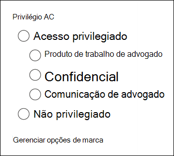

# Marcar documentos em um conjunto de revisão na Descoberta Avançada

Organizar o conteúdo em um conjunto de revisão é importante para concluir vários fluxos de trabalho no processo de Descoberta Eletrônico. Isso inclui:

- Selecionando conteúdo desnecessário

- Identificando conteúdo relevante
 
- Identificar o conteúdo que deve ser revisado por um especialista ou advogado

Quando especialistas, advogados ou outros usuários revisam o conteúdo em um conjunto de revisão, suas opiniões relacionadas ao conteúdo podem ser capturadas usando marcas. Por exemplo, se a intenção for eliminar conteúdo desnecessário, um usuário poderá marcar documentos com uma marca como "não responsiva". Depois que o conteúdo tiver sido revisado e marcado, uma pesquisa de conjunto de revisão poderá ser criada para excluir qualquer conteúdo marcado como "não responsivo", o que elimina esse conteúdo das próximas etapas no fluxo de trabalho de Descoberta Eletrônico. O painel de marca pode ser personalizado para cada caso para que as marcas possam dar suporte ao fluxo de trabalho de revisão pretendido.

## Tipos de marca

A Descoberta Avançada fornece dois tipos de marcas:

- **Marcas de escolha única** - Restringe os usuários a selecionar uma única marca dentro de um grupo. Isso pode ser útil para garantir que os usuários não selecionem marcas conflitantes, como "responsiva" e "não responsiva". Eles serão exibidos como botões de rádio.

- **Marcas de múltipla escolha** - Permitem que os usuários selecionem várias marcas dentro de um grupo. Elas serão exibidas como caixas de seleção.

## Estrutura de marca

Além dos tipos de marca, a estrutura de como as marcas são organizadas no painel de marca pode ser usada para tornar os documentos de marcação mais intuitivos. As marcas são agrupadas por seções. A pesquisa do conjunto de revisão oferece suporte à capacidade de pesquisar por marca e por seção de marca. Isso significa que você pode criar uma pesquisa de conjunto de revisão para recuperar documentos marcados com qualquer marca em uma seção.

As marcas podem ser mais organizadas aninhando-as em uma seção. Por exemplo, se a intenção for identificar e marcar conteúdo privilegiado, o aninhamento pode ser usado para deixar claro que um usuário pode marcar um documento como "Privilegiado" e selecionar o tipo de privilégio verificando a marca aninhada apropriada.

## Aplicando marcas

Há várias maneiras de aplicar uma marca ao conteúdo.

### Marcando um único documento

Ao exibir um documento em um conjunto de revisão, você pode exibir as marcas que uma revisão pode usar clicando no **painel de marcação.**

Isso permitirá que você aplique marcas ao documento exibido no visualizador.

### Marcação em massa

A marcação em massa pode ser feita selecionando vários arquivos  na grade de resultados e, em seguida, usando as marcas no painel de Marcação semelhantes à marcação de documentos individuais. A desa marcação em massa pode ser feita selecionando-se as marcas duas vezes; o primeiro clique aplicará a marca e a segunda seleção garantirá que a marca seja limpa para todos os arquivos selecionados.

> [!NOTE]
> Ao marcar em massa, o painel de marcação exibirá uma contagem de arquivos marcados para cada marca no painel.

### Marcação em outros painéis de revisão

Ao revisar documentos, você pode usar os outros painéis de revisão para revisar outras características dos documentos na grade de resultados. Isso inclui a revisão de outros documentos relacionados, threads de email, duplicatas próximas e duplicatas de hash. Por exemplo, ao revisar documentos relacionados (usando  o painel de revisão da família de documentos), você pode reduzir significativamente o tempo de revisão marcando documentos relacionados em massa. Por exemplo, se uma mensagem de email tiver vários anexos e você quiser garantir que toda a família seja marcada consistentemente.

Por exemplo, veja como exibir o painel **marcação ao** usar o painel de revisão da **família** de documentos:

1. Com o painel de revisão aberto para um documento selecionado (por  exemplo, exibindo  a lista de conteúdo relacionado no painel de revisão da família de documentos, clique em Marcar documentos no painel de revisão da família de documentos.

   O painel de marcação é exibido como uma janela pop-up.

2. Escolha uma ou mais marcas para aplicar o documento selecionado. 

3. Para marcar todos os documentos,  selecione todos os documentos no painel da família de documentos, clique em Marcar documentos e, em seguida, escolha as marcas a aplicar a toda a família de documentos.

