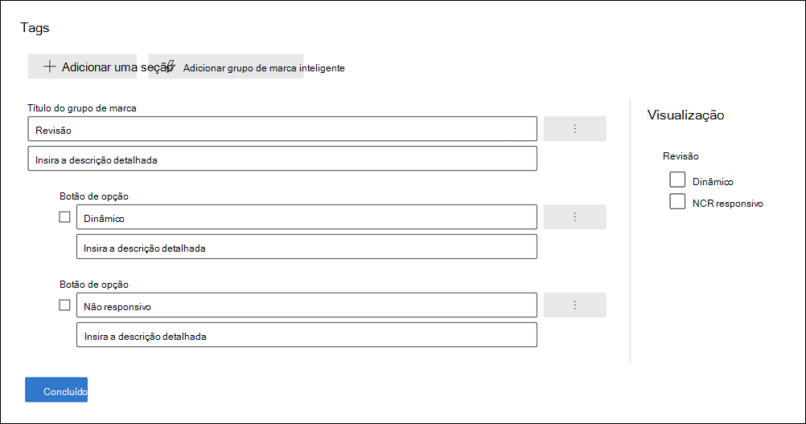

# Marcar documentos em um conjunto de revisão em Advanced eDiscoveryTag documents in a review set in Advanced eDiscovery

Organizar conteúdo em um conjunto de revisão é importante para concluir vários fluxos de trabalho no processo de Descoberta Eletrônico.Organizing content in a review set is important to complete various workflows in the eDiscovery process. Isso inclui:This includes:

- Selecionando conteúdo desnecessárioCulling unnecessary content

- Identificar conteúdo relevanteIdentifying relevant content

- Identificar conteúdo que deve ser revisado por um especialista ou advogadoIdentifying content that must be reviewed by an expert or attorney

Quando especialistas, advogados ou outros usuários revisam conteúdo em um conjunto de revisão, suas opiniões relacionadas ao conteúdo podem ser capturadas usando marcas.When experts, attorneys, or other users review content in a review set, their opinions related to the content can be captured by using tags. Por exemplo, se a intenção for eliminar conteúdo desnecessário, um usuário poderá marcar documentos com uma marca como "não responsiva".For example, if the intent is to cull unnecessary content, a user can tag documents with a tag such as "non-responsive". Depois que o conteúdo é revisado e marcado, uma pesquisa de conjunto de revisão pode ser criada para excluir qualquer conteúdo marcado como "não responsivo".After content has been reviewed and tagged, a review set search can be created to exclude any content tagged as "non-responsive". Esse processo elimina o conteúdo não responsivo das próximas etapas no fluxo de trabalho de Descoberta Eletrônico.This process eliminates the non-responsive content from the next steps in the eDiscovery workflow. O painel de marcação em um conjunto de revisão pode ser personalizado para cada caso para que as marcas suportem o fluxo de trabalho de revisão pretendido para o caso.The tagging panel in a review set can be customized for every case so that the tags support the intended review workflow for the case.

> [!NOTE]
> O escopo das marcas é Advanced eDiscovery caso.The scope of tags is an Advanced eDiscovery case. Isso significa que um caso só pode ter um conjunto de marcas que os revisadores podem usar para marcar documentos de conjunto de revisão.That means a case can only have one set of tags that reviewers can use to tag review set documents. Não é possível configurar um conjunto diferente de marcas para uso em conjuntos de revisão diferentes no mesmo caso.You can't set up a different set of tags for use in different review sets in the same case.

## Tipos de marcaTag types

Advanced eDiscovery fornece dois tipos de marcas:Advanced eDiscovery provides two types of tags:

- **Marcas de opção única**: Restringe os revisadores a selecionar uma única marca dentro de um grupo.**Single choice tags**: Restricts reviewers to selecting a single tag within a group. Esses tipos de marcas podem ser úteis para garantir que os revisadores não selecionem marcas conflitantes, como "responsiva" e "não responsiva".These types of tags can be useful to ensure that reviewers don't select conflicting tags such as "responsive" and "non-responsive". Marcas de opção única aparecem como botões de opção.Single choice tags appear as radio buttons.

- **Marcas de várias opções**: Permitir que as avaliações selecionem várias marcas em um grupo.**Multiple choice tags**: Allow reviews to select multiple tags within a group. Esses tipos de marcas aparecem como caixas de seleção.These types of tags appear as checkboxes.

## Estrutura de marcaTag structure

Além dos tipos de marca, a estrutura de como as marcas são organizadas no painel de marcas pode ser usada para tornar a marcação de documentos mais intuitiva.In addition to the tag types, the structure of how tags are organized in the tag panel can be used to make tagging documents more intuitive. As marcas são agrupadas por seções.Tags are grouped by sections. A pesquisa de conjunto de revisão dá suporte à capacidade de pesquisar por marca e por seção de marca.Review set search supports the ability to search by tag and by tag section. Isso significa que você pode criar uma pesquisa de conjunto de revisão para recuperar documentos marcados com qualquer marca em uma seção.This means you can create a review set search to retrieve documents tagged with any tag in a section.

Você pode organizar ainda mais as marcas aninhando-as em uma seção.You can further organize tags by nesting them within a section. Por exemplo, se a intenção for identificar e marcar conteúdo privilegiado, o aninhamento pode ser usado para deixar claro que um revistor pode marcar um documento como "Privileged" e selecionar o tipo de privilégio verificando a marca aninhada apropriada.For example, if the intent is to identify and tag privileged content, nesting can be used to make it clear that a reviewer can tag a document as "Privileged" and select the type of privilege by checking the appropriate nested tag.

## Criar marcasCreate tags

Antes de aplicar marcas a documentos no conjunto de revisão, você precisa criar uma estrutura de marca.Before applying tags to documents in the review set, you need to create a tag structure.

1. Abra um conjunto de revisão e navegue até a barra de comandos e selecione **Marcar por consulta**.Open a review set and navigate to the command bar and select **Tag by query**.

2. No painel de marcação, selecione **Gerenciar opções de marca**In the tagging panel, select **Manage tag options**

3. Selecione **Adicionar seção de marca**.Select **Add tag section**.

4. Digite um título de grupo de marca e uma descrição opcional e clique em **Salvar**.Type a tag group title and an optional description, and then click **Save**.

5. Selecione o menu suspenso ponto triplo ao lado do título do grupo de marca e clique em **Adicionar** caixa de seleção ou **no botão Adicionar opção**.Select the triple dot dropdown menu next to the tag group title and click **Add check box** or **Add option button**.

6. Digite um nome e uma descrição para a caixa de seleção ou botão de opção.Type a name and description for the checkbox or option button.

7. Repita esse processo para criar novas seções de marca, opções de marca e caixas de seleção.Repeat this process to create new tag sections, tag options, and checkboxes.

   

## Aplicando marcasApplying tags

Com a estrutura de marca no local, os revisadores podem aplicar marcas a documentos em um conjunto de revisão.With the tag structure in place, reviewers can apply tags to documents in a review set. Há duas maneiras diferentes de aplicar marcas:There are two different ways to apply tags:

- Arquivos de marcaTag files

- Marca por consultaTag by query

### Arquivos de marcaTag files

Se você selecionar um único item ou vários itens em um conjunto de revisão, poderá aplicar marcas à seleção deles clicando em **Arquivos de** marca na barra de comandos.Whether you select a single item or several items in a review set, you can apply tags to their selection by clicking **Tag files** in the command bar. No painel de marcação, você pode selecionar uma marca e ela é aplicada automaticamente aos documentos selecionados.In the tagging panel, you can select a tag and it is automatically applied to the selected documents.

> [!NOTE]
> As marcas serão aplicadas somente a itens selecionados na lista de itens.Tags will be applied only to selected items in the list of items.

### Marca por consultaTag by query

A marcação por consulta permite que você aplique marcas a todos os itens exibidos por uma consulta de filtro aplicada no momento no conjunto de revisão.Tagging by query lets you apply tags to all items displayed by a filter query that's currently applied in the review set.

1. Desmarque todos os itens no conjunto de revisão e vá para a barra de comandos e selecione **Marcar por consulta**.Unselect all items in the review set and go to the command bar and select **Tag by query**.

2. No painel de marcação, selecione a marca que você deseja aplicar.In the tagging panel, select the tag that you want to apply.

3. Na lista **suspenso Seleção de** marca, há três opções que determinam a quais itens aplicar a marca.Under the **Tag selection** dropdown, there are three options that dictate which items to apply the tag to.

   - **Itens que corresponderem à consulta aplicada**: aplica marcas a itens específicos que corresponderem às condições de consulta do filtro.**Items that match applied query**: Applies tags to specific items that match the filter query conditions.

   - **Inclua itens da família associados**: Aplica marcas a itens específicos que corresponderem às condições de consulta do filtro e seus itens de família associados.**Include associated family items**: Applies tags to specific items that match the filter query conditions and their associated family items. *Itens da* família são itens que compartilham o mesmo valor de metadados FamilyId.*Family items* are items that share the same FamilyId metadata value.  

   - **Inclua itens de conversa associados:** aplica marcas a itens que corresponderem às condições de consulta do filtro e seus itens de conversa associados.**Include associated conversation items**: Applies tags to items that match the filter query conditions and their associated conversation items. *Os itens de* conversa são itens que compartilham os mesmos valores de metadados ConversationId.*Conversation items* are items that share the same ConversationId metadata values.

   

4. Clique **em Iniciar o trabalho de marcação** para disparar o trabalho de marcação.Click **Start tagging job** to trigger the tagging job.

## Filtro de marcaTag filter

Use o filtro de marca no conjunto de revisão para encontrar ou excluir rapidamente itens dos resultados da consulta com base em como um item é marcado.Use the tag filter in review set to quickly find or exclude items from the query results based on how an item is tagged. 

1. Selecione **Filtros** para expandir o painel de filtro.Select **Filters** to expand the filter panel.

2. Selecione e **expanda propriedades de item**.Select and expand **Item properties**.

3. Role para baixo para encontrar o filtro chamado **Tag,** selecione a caixa de seleção e clique em **Feito**.Scroll down to find the filter named **Tag**, select the checkbox, and then click **Done**.

4. Para incluir ou excluir itens com uma marca específica de uma consulta, faça um dos seguintes:To include or exclude items with a specific tag from a query, do one of the following:

   - **Incluir itens**: selecione o valor da marca e selecione **Igual a qualquer um** no menu suspenso.**Include items**: Select the tag value and select **Equal any of** in the dropdown menu.

      OuOr

   - **Excluir itens**: selecione o valor da marca e selecione Igual a **nenhum no** menu suspenso.**Exclude items**: Select the tag value and select **Equals none of** in dropdown menu.

     

> [!NOTE]
> Certifique-se de atualizar a página para garantir que o filtro de marca exibe as alterações mais recentes na estrutura de marca.Be sure to refresh the page to ensure that the tag filter displays the latest changes to the tag structure.
