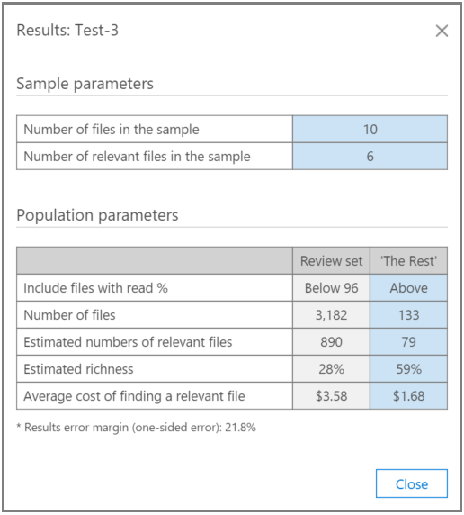

# Testar a análise de relevância na Descoberta AvançadaTest Relevance analysis in Advanced eDiscovery
  
A guia Teste na Descoberta Avançada permite testar, comparar e validar a qualidade geral do processamento.The Test tab in Advanced eDiscovery enables you to test, compare, and validate the overall quality of processing. Esses testes são executados após o cálculo em lotes.These tests are performed after Batch calculation. Ao marcar os arquivos na coleção, um especialista faz o parecer final sobre se cada arquivo marcado é relevante para o caso.By tagging the files in the collection, an expert makes the final judgment about whether each tagged file is relevant to the case.
  
Em cenários individuais e com vários problemas, os testes geralmente são executados por problema.In single and multiple-issue scenarios, tests are typically performed per issue. Os resultados podem ser exibidos após cada teste, e os resultados do teste podem ser reformulados com arquivos de teste de amostra especificados.Results can be viewed after each test, and test results can be reworked with specified sample test files.
  
## Testando o restanteTesting the rest

O teste "Testar o Restante" é usado para validar as decisões de recortar, por exemplo, para revisar somente os arquivos acima de uma pontuação de corte de relevância específica com base nos resultados finais da Descoberta Avançada.The "Test the Rest" test is used to validate culling decisions, for example, to review only files above a specific Relevance cutoff score based on the final Advanced eDiscovery results. O especialista revisa um exemplo de arquivos em uma pontuação de corte selecionada para avaliar o número de arquivos relevantes dentro desse conjunto.The expert reviews a sample of files under a selected cutoff score to evaluate the number of relevant files within that set.
  
Este teste fornece estatísticas e uma comparação entre o conjunto de revisão e a população Test the Rest.This test provides statistics and a comparison between the Review set and the Test the Rest population. Os resultados do conjunto de revisão são aqueles calculados pela Relevância durante o Treinamento.The results of the review set are those calculated by Relevance during Training. Os resultados incluem cálculos com base em configurações e parâmetros de entrada, como:The results include calculations based on settings and input parameters, such as:
  
- Teste as estatísticas de amostra do número de arquivos em uma amostra e identifique os arquivos relevantes.Test sample statistics of the number of files in a sample and identified relevant files.

- Comparação tabular dos parâmetros Population do conjunto de Revisão e o Restante, por exemplo, o número de arquivos, o número estimado de arquivos relevantes, a riqueza estimada e o custo médio de localizar outro arquivo relevante.Tabular comparison of the Population parameters of the Review set and the Rest, for example, the number of files, estimated number of relevant files, estimated richness, and the average cost of finding another relevant file. As configurações de parâmetro de custo podem ser definidas pelo administrador.Cost parameter settings can be set by the administrator.

Para executar o teste "Testar o Restante":To run the "Test the Rest" test:

1. Abra a **guia Teste \> de Relevância.**Open the **Relevance \> Test** tab.

2. Na guia **Teste,** clique em **Novo teste.**In the **Test** tab, click **New test**. A **caixa de** diálogo Criar teste é exibida, conforme mostrado no exemplo a seguir.The **Create test** dialog is displayed, as shown in the following example.

    
  
3. Em **Nome do teste** e **descrição,** digite o nome e a descrição.In **Test name**, and **Description**, type the name and description.

4. Na lista **de tipos de** teste, selecione Testar o **Restante**In the **Test type** list, select **Test the Rest**

5. Na lista **Problema/Categoria,** selecione o nome do problema.In the **Issue / Category** list, select the issue name.

6. Na lista **Carregar,** selecione o carregamento.In the **Load** list, select the load. 

7. Em **% de** leitura, aceite o valor padrão ou selecione um valor para a pontuação de relevância de corte.In **Read %**, accept the default value or select a value for the cutoff Relevance score. 

8. Em **Definir tamanho,** ou aceite o valor padrão.In **Set size**, or accept the default value. Os ícones de restauração restaurarão os valores padrão.The restore icons will restore the default values.

9. Clique **na marcação Iniciar.**Click **Start tagging**. Um exemplo de teste é gerado.A test sample is generated.

10. Revise e marque cada um dos arquivos na **guia \>** Marca de Relevância e, quando terminar, clique em **Calcular**.Review and tag each of the files in the **Relevance \> Tag** tab and when done, click **Calculate**.

11. Na guia Teste, você pode clicar em Exibir **resultados** para ver os resultados do teste.In the Test tab, you can click **View results** to see the test results. Um exemplo é mostrado na captura de tela a seguir.An example is shown in the following screenshot.

    
  
Na captura de tela anterior, a seção Exemplos de parâmetros da tabela contém detalhes sobre o número de arquivos na amostra marcados pelo especialista e o número de arquivos **relevantes** encontrados nesse exemplo.In the previous screenshot, the **Sample parameters** section of the table contains details about the number of files in the sample tagged by the expert, and the number of relevant files found in that sample.
  
A **seção Parâmetros** População da tabela contém os resultados do teste, incluindo a população de conjunto de revisão de arquivos com uma pontuação abaixo da pontuação selecionada e a população de arquivos "O Restante" com uma pontuação acima do corte selecionado.The **Population parameters** section of the table contains the test results, including the Review set population of files with a score below the selected cutoff and "The Rest" population of files with a score above the selected cutoff. Para cada população, os seguintes resultados são exibidos:For each population, the following results are displayed:
  
- Inclui arquivos com % de leitura - Corte declaradoIncludes files with read % - Stated cutoff

- O número total de arquivosThe total number of files

- O número estimado de arquivos relevantesThe estimated number of relevant files

- A riqueza estimadaThe estimated richness

- O custo médio de revisão para localizar outro arquivo relevanteThe average review cost of finding another relevant file

## Testando a fatiaTesting the slice

O teste "Testar a Fatia" realiza testes semelhantes ao teste "Testar o Restante", mas a um segmento do conjunto de arquivos, conforme especificado pelo %de Leitura de Relevância.The "Test the Slice" test performs testing similar to the "Test the Rest" test, but to a segment of the file set as specified by Relevance Read %.

Para executar o teste "Testar a fatia":To run the "Test the Slice" test:
  
1. Abra a **guia Teste \> de Relevância.**Open the **Relevance \> Test** tab.

2. Na guia **Teste,** clique em **Novo teste.**In the **Test** tab, click **New test**. A **caixa de diálogo** Criar teste é exibida.The **Create test** dialog is displayed.

3. Em **Nome do teste** e **descrição,** digite as informações.In **Test name** and **Description**, type the information.

4. Na lista **De tipo de** teste, selecione Testar a **fatia**.In the **Test type** list, select **Test the Slice**.

5. Na lista **Problema,** selecione o nome do problema.In the **Issue** list, select the issue name.

6. Na lista **Carregar,** selecione o carregamento.In the **Load** list, select the load.

7. Em **% de leitura entre**, aceite os valores padrão de intervalo baixo e alto ou selecione valores para as pontuações de relevância de corte.In **Read % between**, accept the default low and high range values or select values for the cutoff Relevance scores.

8. Em **Definir tamanho,** selecione um valor ou aceite o valor padrão.In **Set size**, select a value or accept the default value.

    Os ícones de restauração restaurarão o valor padrão.The restore icons will restore the default value.

9. Clique **na marcação Iniciar.**Click **Start tagging**. Um exemplo de teste é gerado.A test sample is generated.

10. Revise e marque cada um dos arquivos na **guia \>** Marca de Relevância e, quando terminar, clique em **Calcular**.Review and tag each of the files in the **Relevance \> Tag** tab and when done, click **Calculate**.

11. Na guia Teste, você pode clicar em Exibir **resultados** para ver os resultados do teste.In the Test tab, you can click **View results** to see the test results.
