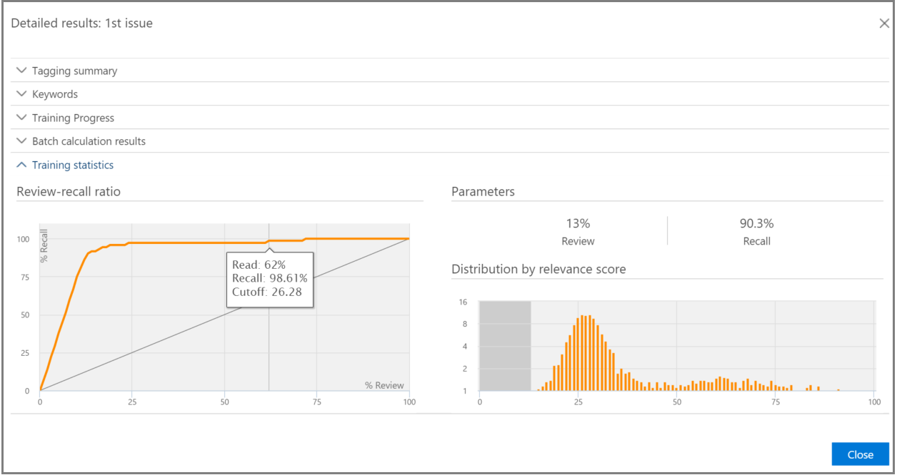

# Controlar a análise de relevância na Descoberta Avançada
  
Na Descoberta Avançada, a guia Faixa de Relevância exibe a validade calculada do treinamento de Relevância realizado na guia Marca e indica a próxima etapa a ser realizada no processo de treinamento iterativo em Relevância. 
  
## Rastreando o status de treinamento de relevância

1. Veja os seguintes detalhes em Controle de Relevância para os problemas de caso, conforme mostrado no exemplo a seguir de uma caixa de diálogo de **nome de** problema abaixo.

   - **Avaliação:** esse indicador de progresso mostra até que ponto o treinamento de relevância realizado até esse ponto atingiu a meta de avaliação em termos de margem de erro. A riqueza dos resultados do treinamento de relevância também é exibida.

   - **Treinamento**: este indicador de progresso codificado por cores e a dica de ferramenta indica a estabilidade dos resultados do treinamento de relevância e uma escala numérica mostrando o número de amostras de treinamento de relevância marcadas para cada problema. O especialista monitora o progresso do processo de treinamento de relevância iterativa. 
  
   - **Cálculo em lote:** esse indicador de progresso fornece informações sobre a conclusão do cálculo em lotes.
  
   - **Próxima etapa:** exibe a recomendação para a próxima etapa a ser executada. 
  
    No exemplo, uma Avaliação concluída com êxito para um problema é mostrada, indicada pelo indicador de progresso de cor concluído e pela marca de seleção. A marcação está em andamento, mas o caso ainda é considerado instável (o status de estabilidade também é mostrado em uma dica de ferramenta). A próxima recomendação de etapa é "Treinamento". 
  
    
  
    A exibição expandida exibe informações e opções adicionais. A margem de erro atual exibida é a margem de erro do recall no estado atual da avaliação, considerando os arquivos de avaliação existentes (já marcados).
  
    > [!NOTE]
    >  O estágio Avaliação pode ser ignorado des limpando a **caixa** de seleção Avaliação por problema e, em seguida, para "todos os problemas". No entanto, como resultado, não haverá estatísticas para esse problema. > a caixa **de seleção Avaliação** só pode ser feita antes da avaliação ser executada. Quando vários problemas existirem em um caso, a avaliação será ignorada somente se a caixa de seleção estiver des limpa para cada problema 
  
    Quando a avaliação não é concluída com o primeiro conjunto de amostras de arquivos, a avaliação pode ser a próxima etapa para marcar mais arquivos.
  
    No **Controle de Relevância,** o indicador de progresso do treinamento e a dica de ferramenta indicam o número estimado de amostras adicionais \> necessárias para alcançar a estabilidade. Essa estimativa fornece uma diretriz para o treinamento adicional necessário.
  
    
  
2. Quando terminar a marcação e se precisar continuar o treinamento, clique em **Treinamento.** Outro conjunto de amostra de arquivos é gerado a partir do conjunto de arquivos carregado para treinamento adicional. Em seguida, você é retornado para a guia Marca para marcar e treinar mais arquivos.

### Atingindo níveis estáveis de treinamento

Depois que os arquivos de avaliação atingirem um nível estável de treinamento, a Descoberta Avançada estará pronta para o cálculo em lotes.
  
> [!NOTE]
> Normalmente, após três amostras de treinamento estáveis, a próxima etapa é "Cálculo em lotes". Pode haver exceções, por exemplo, quando houve alterações na marcação de arquivos de exemplos anteriores ou quando arquivos de dados foram adicionados. 
  
### Executando o cálculo em lotes

O cálculo em lote é executado como a próxima etapa após a conclusão bem-sucedida do treinamento (quando um status de treinamento estável é mostrado pela barra de progresso, uma marca de seleção e o status estável na dica de ferramenta.) O cálculo em lote aplica o conhecimento adquirido durante o treinamento de relevância para toda a população de arquivos, para avaliar a relevância dos arquivos e atribuir pontuações de relevância.
  
Quando há mais de um problema, o cálculo em lotes é feito por problema. Durante o cálculo em lote, o andamento é monitorado durante o processamento de todos os arquivos. 
  
Aqui, a próxima etapa recomendada é "None", que indica que nenhum treinamento adicional de relevância iterativa é necessário neste ponto. A próxima fase é a guia **\> Decisão de** Relevância. 
  
Se você deseja importar novos arquivos após o cálculo em lotes, o administrador pode adicionar os arquivos importados a uma nova carga.
  
> [!NOTE]
> Se você clicar em **Cancelar** durante o cálculo em lote, o processo salvará o que já foi executado. Se você executar o cálculo em lotes novamente, o processo continuará do último ponto executado. 
  
### Avaliando a consistência de marcação

Se houver inconsistências na marcação do arquivo, isso poderá afetar a análise. O processo de consistência de marcação da Descoberta Avançada pode ser usado quando os resultados não são ideais ou a consistência está em dúvida. Uma lista de possíveis arquivos marcados inconsistentemente é retornada e eles podem ser revisados e reatribuentes, conforme necessário.
  
> [!NOTE]
> Após sete ou mais rodadas de treinamento após  a avaliação, a consistência de marcação pode ser visualizada no progresso do treinamento de resultados detalhados do controle de \>  \>  \>  \> **relevância.** Essa revisão é feita para um problema de cada vez.
  
1. Em **Controle de \> Relevância,** expanda a linha de um problema.
  
2. À direita da **próxima etapa, clique** em **Modificar.**
  
3. Selecione **Inconsistências de** marca como **a opção próxima etapa,** após sete exemplos de treinamento e clique em **OK**.
  
4. Selecione **inconsistências de marca.** A **guia Marca** é aberta exibindo uma lista das inconsistências a fim de marcar a marca conforme necessário.
  
5. Clique **em Calcular** para enviar as alterações. A próxima etapa após a marcação de inconsistências é "Treinamento". 
  
## Exibindo e usando resultados de relevância

Na guia **Controle de \> Relevância,** expanda a linha de um problema e, ao lado dos resultados **detalhados,** clique em **Exibir**. Os painéis de resultados detalhados são exibidos, conforme mostrado e descrito abaixo.
  

  
### Resumo de marcação

 No exemplo mostrado abaixo, o resumo de Marcação exibe os totais para cada um dos processos de marcação de arquivo de Avaliação, Treinamento e Captura de Arquivo. 
  

  
### Palavras-chave

Uma palavra-chave é uma cadeia de caracteres exclusiva, palavra, frase ou sequência de palavras em um arquivo identificado pela Descoberta Avançada como um indicador significativo de se um arquivo é relevante. As colunas "Incluir" listam palavras-chave e pesos em arquivos marcados como Relevantes, e as colunas "Excluir" listam palavras-chave e pesos em arquivos marcados como Não Relevantes.
  
A Descoberta Avançada atribui valores de peso de palavra-chave negativos ou positivos. Quanto maior o peso, maior a probabilidade de um arquivo no qual a palavra-chave aparece ser atribuída a uma pontuação de Relevância maior durante o cálculo em lotes.
  
A lista de palavras-chave da Descoberta Avançada pode ser usada para complementar uma lista criada por um especialista ou como uma verificação de responsabilidade indireta em qualquer momento do processo de revisão do arquivo.
  
### Progresso do treinamento

O **painel Progresso** do Treinamento inclui um gráfico de progresso de treinamento e uma exibição do indicador de qualidade, conforme mostrado no exemplo a seguir.
  

  
**Indicador de qualidade de** treinamento: exibe a classificação da consistência de marcação da seguinte forma:
  
- **Bom:** os arquivos são marcados consistentemente. (Luz verde exibida)
  
- **Médio:** alguns arquivos podem ser marcados inconsistentemente. (Luz amarela exibida)

- **Aviso:** muitos arquivos podem ser marcados de forma inconsistente. (Luz vermelha exibida)

**Gráfico de progresso do** treinamento: mostra o grau de estabilidade do treinamento de relevância após muitos ciclos de treinamento de relevância em comparação com o valor da medida F. À medida que nos movemos da esquerda para a direita no gráfico, o intervalo de confiança se estreita e é usado, juntamente com a medida F, pela Relevância avançada da Descoberta Eletrônico para determinar a estabilidade quando os resultados do treinamento de relevância são otimizados.
  
> [!NOTE]
> A relevância usa F2, uma métrica de medida F em que Recall recebe o dobro de peso que Precision. Para casos com alta riqueza (mais de 25%), a Relevância usa F1 (taxa de 1:1). A taxa de medida F pode ser configurada nas **configurações avançadas de** \> **configuração de relevância.**
  
### Resultados de cálculo em lote

O **painel de resultados de** cálculo em lotes inclui o número de arquivos que foram pontuados para Relevância, da seguinte forma: 
  
- **Success**
  
- **Vazio:** não contém texto, por exemplo, somente espaços/guias
  
- **Falha:** devido ao tamanho excessivo ou não foi possível ler
  
- **Ignorado:** devido ao tamanho excessivo
  
- **Nebulous**: Contém texto sem sentido ou nenhum recursos relevantes para o problema
  
> [!NOTE]
> Empty, Failed, Ignored ou Nebulous will receive a Relevance score of -1.
  
### Estatísticas de treinamento

O **painel De treinamento de** estatísticas exibe estatísticas e gráficos com base nos resultados do treinamento de Relevância de Descobertas EDiscovery Avançada. 
  

  
Esta exibição mostra o seguinte:
  
- **Taxa de reavaliação-recall**: comparação dos resultados de acordo com as pontuações de relevância em uma revisão hipotética linear. O recall é estimado devido ao conjunto de tamanhos do conjunto de revisão.
  
- **Parâmetros:** Estatísticas calculadas cumulativas referentes ao conjunto de revisão em relação à população de arquivos de todo o caso.
  
- **Revisão:** Porcentagem de arquivos a analisar com base nesse corte.
  
- **Recall**: Porcentagem de arquivos relevantes no conjunto de revisão. 
  
- **Distribuição por pontuação de relevância:** os arquivos na exibição cinza escuro à esquerda estão abaixo da pontuação de recorte. Uma dica de ferramenta exibe a pontuação de relevância e a porcentagem relacionada de arquivos no conjunto de arquivos de revisão em relação ao total de arquivos.
