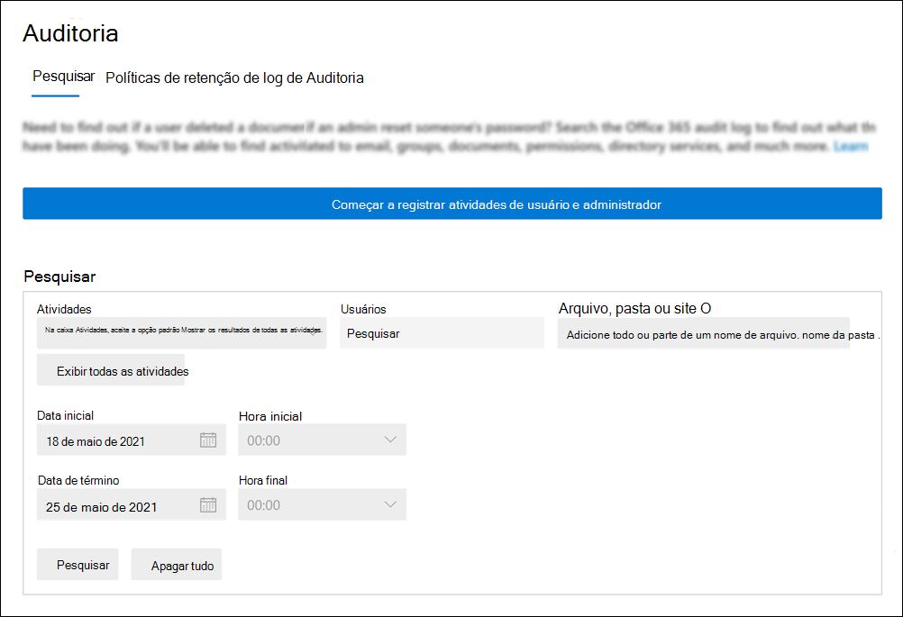

# <a name="turn-auditing-on-or-off"></a><span data-ttu-id="b8796-103">Ativar ou desativar a auditoria</span><span class="sxs-lookup"><span data-stu-id="b8796-103">Turn auditing on or off</span></span>

<span data-ttu-id="b8796-104">O log de Auditoria é ativado por padrão para organizações empresariais Microsoft 365 e Office 365.</span><span class="sxs-lookup"><span data-stu-id="b8796-104">Audit logging is turned on by default for Microsoft 365 and Office 365 enterprise organizations.</span></span> <span data-ttu-id="b8796-105">Quando a auditoria no Centro de conformidade do Microsoft 365 é ativeda, a atividade de usuário e administrador da sua organização é registrada no log de auditoria e mantida por 90 dias e até um ano, dependendo da licença atribuída aos usuários.</span><span class="sxs-lookup"><span data-stu-id="b8796-105">When auditing in the Microsoft 365 compliance center is turned on, user and admin activity from your organization is recorded in the audit log and retained for 90 days, and up to one year depending on the license assigned to users.</span></span> <span data-ttu-id="b8796-106">No entanto, sua organização pode ter motivos para não querer registrar e reter dados de log de auditoria.</span><span class="sxs-lookup"><span data-stu-id="b8796-106">However, your organization may have reasons for not wanting to record and retain audit log data.</span></span> <span data-ttu-id="b8796-107">Nesses casos, um administrador global pode decidir desativar a auditoria no Microsoft 365.</span><span class="sxs-lookup"><span data-stu-id="b8796-107">In those cases, a global admin may decide to turn off auditing in Microsoft 365.</span></span>

<span data-ttu-id="b8796-108">Ao configurar uma nova Microsoft 365 ou Office 365, você pode verificar o status de auditoria para sua organização.</span><span class="sxs-lookup"><span data-stu-id="b8796-108">When setting up a new Microsoft 365 or Office 365 organization, you can verify the auditing status for your organization.</span></span> <span data-ttu-id="b8796-109">Para obter instruções, consulte [a seção Verificar o status de auditoria para sua](#verify-the-auditing-status-for-your-organization) organização neste artigo.</span><span class="sxs-lookup"><span data-stu-id="b8796-109">For instructions, see the [Verify the auditing status for your organization](#verify-the-auditing-status-for-your-organization) section in this article.</span></span>

> [!IMPORTANT]
> <span data-ttu-id="b8796-110">Se você desativar a auditoria no Microsoft 365, não poderá usar a API de Atividade de Gerenciamento Office 365 ou o Azure Sentinel para acessar dados de auditoria para sua organização.</span><span class="sxs-lookup"><span data-stu-id="b8796-110">If you turn off auditing in Microsoft 365, you can't use the Office 365 Management Activity API or Azure Sentinel to access auditing data for your organization.</span></span> <span data-ttu-id="b8796-111">Desligar a auditoria seguindo as etapas deste artigo significa que nenhum resultado será retornado quando você pesquisar o log de auditoria usando o Centro de conformidade do Microsoft 365 ou quando você executar o cmdlet **Search-UnifiedAuditLog** no Exchange Online PowerShell.</span><span class="sxs-lookup"><span data-stu-id="b8796-111">Turning off auditing by following the steps in this article means that no results will be returned when you search the audit log using the Microsoft 365 compliance center or when you run the **Search-UnifiedAuditLog** cmdlet in Exchange Online PowerShell.</span></span> <span data-ttu-id="b8796-112">Isso também significa que os logs de auditoria não estarão disponíveis por meio da API de Atividade de Gerenciamento Office 365 ou do Azure Sentinel.</span><span class="sxs-lookup"><span data-stu-id="b8796-112">This also means that audit logs won't be available through the Office 365 Management Activity API or Azure Sentinel.</span></span>
  
## <a name="before-you-turn-auditing-on-or-off"></a><span data-ttu-id="b8796-113">Antes de ativar ou desativar a auditoria</span><span class="sxs-lookup"><span data-stu-id="b8796-113">Before you turn auditing on or off</span></span>

- <span data-ttu-id="b8796-114">Você precisa ter a função Logs de Auditoria Exchange Online ativar ou desativar a auditoria em sua Microsoft 365.</span><span class="sxs-lookup"><span data-stu-id="b8796-114">You have to be assigned the Audit Logs role in Exchange Online to turn auditing on or off in your Microsoft 365 organization.</span></span> <span data-ttu-id="b8796-115">Por padrão, essa função é atribuída aos grupos de  função Gerenciamento de Conformidade e Gerenciamento de Organização na página Permissões no Exchange de administração.</span><span class="sxs-lookup"><span data-stu-id="b8796-115">By default, this role is assigned to the Compliance Management and Organization Management role groups on the **Permissions** page in the Exchange admin center.</span></span> <span data-ttu-id="b8796-116">Os administradores globais no Microsoft 365 são membros do grupo de função Gerenciamento da Organização no Exchange Online.</span><span class="sxs-lookup"><span data-stu-id="b8796-116">Global admins in Microsoft 365 are members of the Organization Management role group in Exchange Online.</span></span>

    > [!NOTE]
    > <span data-ttu-id="b8796-117">Os usuários devem ter permissões atribuídas Exchange Online ativar ou desativar a auditoria.</span><span class="sxs-lookup"><span data-stu-id="b8796-117">Users have to be assigned permissions in Exchange Online to turn auditing on or off.</span></span> <span data-ttu-id="b8796-118">Se você atribuir aos usuários  a função Logs de Auditoria na página Permissões no Centro de conformidade do Microsoft 365, eles não poderão ativar ou desativar a auditoria.</span><span class="sxs-lookup"><span data-stu-id="b8796-118">If you assign users the Audit Logs role on the **Permissions** page in the Microsoft 365 compliance center, they won't be able to turn auditing on or off.</span></span> <span data-ttu-id="b8796-119">Isso porque o cmdlet subjacente é um cmdlet Exchange Online PowerShell.</span><span class="sxs-lookup"><span data-stu-id="b8796-119">This is because the underlying cmdlet is an Exchange Online PowerShell cmdlet.</span></span>

- <span data-ttu-id="b8796-120">Para obter instruções passo a passo sobre como pesquisar o log de auditoria, consulte [Pesquisar o log de auditoria](search-the-audit-log-in-security-and-compliance.md).</span><span class="sxs-lookup"><span data-stu-id="b8796-120">For step-by-step instructions on searching the audit log, see [Search the audit log](search-the-audit-log-in-security-and-compliance.md).</span></span> <span data-ttu-id="b8796-121">Para obter mais informações sobre a API Microsoft 365 Atividade de Gerenciamento, consulte [Get started with Microsoft 365 Management APIs](/office/office-365-management-api/get-started-with-office-365-management-apis).</span><span class="sxs-lookup"><span data-stu-id="b8796-121">For more information about the Microsoft 365 Management Activity API, see [Get started with Microsoft 365 Management APIs](/office/office-365-management-api/get-started-with-office-365-management-apis).</span></span>

## <a name="verify-the-auditing-status-for-your-organization"></a><span data-ttu-id="b8796-122">Verificar o status de auditoria para sua organização</span><span class="sxs-lookup"><span data-stu-id="b8796-122">Verify the auditing status for your organization</span></span>

<span data-ttu-id="b8796-123">Para verificar se a auditoria está 100%, você pode executar o seguinte comando no [Exchange Online PowerShell](/powershell/exchange/connect-to-exchange-online-powershell):</span><span class="sxs-lookup"><span data-stu-id="b8796-123">To verify that auditing is turned on for your organization, you can run the following command in [Exchange Online PowerShell](/powershell/exchange/connect-to-exchange-online-powershell):</span></span>

```powershell
Get-AdminAuditLogConfig | FL UnifiedAuditLogIngestionEnabled
```

<span data-ttu-id="b8796-124">Um valor de `True` para a  _propriedade UnifiedAuditLogIngestionEnabled_ indica que a auditoria está ativa.</span><span class="sxs-lookup"><span data-stu-id="b8796-124">A value of `True` for the  _UnifiedAuditLogIngestionEnabled_ property indicates that auditing is turned on.</span></span> <span data-ttu-id="b8796-125">Um valor de `False` indica que a auditoria não está ativas.</span><span class="sxs-lookup"><span data-stu-id="b8796-125">A value of `False` indicates that auditing is not turned on.</span></span>

## <a name="turn-on-auditing"></a><span data-ttu-id="b8796-126">Ativar a auditoria</span><span class="sxs-lookup"><span data-stu-id="b8796-126">Turn on auditing</span></span>

<span data-ttu-id="b8796-127">Se a auditoria não estiver Centro de conformidade do Microsoft 365 sua organização, você poderá a Exchange Online.</span><span class="sxs-lookup"><span data-stu-id="b8796-127">If auditing is not turned on for your organization, you can turn it on in the Microsoft 365 compliance center or by using Exchange Online PowerShell.</span></span> <span data-ttu-id="b8796-128">Pode levar várias horas após ativar a auditoria antes de poder retornar resultados ao pesquisar o log de auditoria.</span><span class="sxs-lookup"><span data-stu-id="b8796-128">It may take several hours after you turn on auditing before you can return results when you search the audit log.</span></span>
  
### <a name="use-the-compliance-center-to-turn-on-auditing"></a><span data-ttu-id="b8796-129">Usar o centro de conformidade para ativar a auditoria</span><span class="sxs-lookup"><span data-stu-id="b8796-129">Use the compliance center to turn on auditing</span></span>

1. <span data-ttu-id="b8796-130">Acesse <https://compliance.microsoft.com> e entre.</span><span class="sxs-lookup"><span data-stu-id="b8796-130">Go to <https://compliance.microsoft.com> and sign in.</span></span>

2. <span data-ttu-id="b8796-131">No painel de navegação esquerdo do Centro de conformidade do Microsoft 365, clique em **Auditoria**.</span><span class="sxs-lookup"><span data-stu-id="b8796-131">In the left navigation pane of the Microsoft 365 compliance center, click **Audit**.</span></span>

   <span data-ttu-id="b8796-132">Se a auditoria não estiver 100% 100%, um banner será exibido solicitando que você inicie a gravação da atividade de usuário e administrador.</span><span class="sxs-lookup"><span data-stu-id="b8796-132">If auditing is not turned on for your organization, a banner is displayed prompting you start recording user and admin activity.</span></span>

   

3. <span data-ttu-id="b8796-134">Clique no **banner Iniciar gravação do usuário e da atividade do** administrador.</span><span class="sxs-lookup"><span data-stu-id="b8796-134">Click the **Start recording user and admin activity** banner.</span></span>

   <span data-ttu-id="b8796-135">Pode levar até 60 minutos para que a alteração entre em vigor.</span><span class="sxs-lookup"><span data-stu-id="b8796-135">It may take up to 60 minutes for the change to take effect.</span></span>

### <a name="use-powershell-to-turn-on-auditing"></a><span data-ttu-id="b8796-136">Usar o PowerShell para ativar a auditoria</span><span class="sxs-lookup"><span data-stu-id="b8796-136">Use PowerShell to turn on auditing</span></span>

1. <span data-ttu-id="b8796-137">[Conectar-se ao Exchange Online PowerShell](/powershell/exchange/connect-to-exchange-online-powershell).</span><span class="sxs-lookup"><span data-stu-id="b8796-137">[Connect to Exchange Online PowerShell](/powershell/exchange/connect-to-exchange-online-powershell).</span></span>

2. <span data-ttu-id="b8796-138">Execute o seguinte comando do PowerShell para ativar a auditoria.</span><span class="sxs-lookup"><span data-stu-id="b8796-138">Run the following PowerShell command to turn on auditing.</span></span>

    ```powershell
    Set-AdminAuditLogConfig -UnifiedAuditLogIngestionEnabled $true
    ```

    <span data-ttu-id="b8796-139">Uma mensagem é exibida dizendo que pode levar até 60 minutos para que a alteração entre em vigor.</span><span class="sxs-lookup"><span data-stu-id="b8796-139">A message is displayed saying that it may take up to 60 minutes for the change to take effect.</span></span>
  
## <a name="turn-off-auditing"></a><span data-ttu-id="b8796-140">Desativar a auditoria</span><span class="sxs-lookup"><span data-stu-id="b8796-140">Turn off auditing</span></span>

<span data-ttu-id="b8796-141">Você precisa usar o Exchange Online PowerShell para desativar a auditoria.</span><span class="sxs-lookup"><span data-stu-id="b8796-141">You have to use Exchange Online PowerShell to turn off auditing.</span></span>
  
1. <span data-ttu-id="b8796-142">[Conectar-se ao Exchange Online PowerShell](/powershell/exchange/connect-to-exchange-online-powershell).</span><span class="sxs-lookup"><span data-stu-id="b8796-142">[Connect to Exchange Online PowerShell](/powershell/exchange/connect-to-exchange-online-powershell).</span></span>

2. <span data-ttu-id="b8796-143">Execute o seguinte comando do PowerShell para desativar a auditoria.</span><span class="sxs-lookup"><span data-stu-id="b8796-143">Run the following PowerShell command to turn off auditing.</span></span>

    ```powershell
    Set-AdminAuditLogConfig -UnifiedAuditLogIngestionEnabled $false
    ```

3. <span data-ttu-id="b8796-144">Depois de um tempo, verifique se a auditoria está desativada (desabilitada).</span><span class="sxs-lookup"><span data-stu-id="b8796-144">After a while, verify that auditing is turned off (disabled).</span></span> <span data-ttu-id="b8796-145">Há duas maneiras de fazer isso:</span><span class="sxs-lookup"><span data-stu-id="b8796-145">There are two ways to do this:</span></span>

    - <span data-ttu-id="b8796-146">No Exchange Online PowerShell, execute o seguinte comando:</span><span class="sxs-lookup"><span data-stu-id="b8796-146">In Exchange Online PowerShell, run the following command:</span></span>

      ```powershell
      Get-AdminAuditLogConfig | FL UnifiedAuditLogIngestionEnabled
      ```

      <span data-ttu-id="b8796-147">O valor da  `False`  _propriedade UnifiedAuditLogIngestionEnabled_ indica que a auditoria está desligada.</span><span class="sxs-lookup"><span data-stu-id="b8796-147">The value of  `False` for the  _UnifiedAuditLogIngestionEnabled_ property indicates that auditing is turned off.</span></span>

    - <span data-ttu-id="b8796-148">Vá para a **página Auditoria** no Centro de conformidade do Microsoft 365.</span><span class="sxs-lookup"><span data-stu-id="b8796-148">Go to the **Audit** page in the Microsoft 365 compliance center.</span></span>

      <span data-ttu-id="b8796-149">Se a auditoria não estiver 100% 100%, um banner será exibido solicitando que você inicie a gravação da atividade de usuário e administrador.</span><span class="sxs-lookup"><span data-stu-id="b8796-149">If auditing is not turned on for your organization, a banner is displayed prompting you start recording user and admin activity.</span></span>
