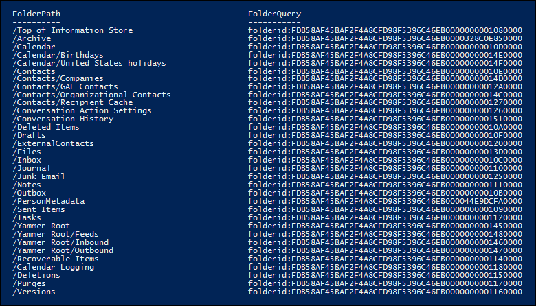

# <a name="use-content-search-for-targeted-collections"></a>Usar a pesquisa de conteúdo para coleções direcionadas

A ferramenta de pesquisa de conteúdo no centro de conformidade do Microsoft 365 não fornece uma maneira direta na interface do usuário de pesquisar pastas específicas em Exchange caixas de correio ou SharePoint e sites OneDrive for Business. No entanto, é possível pesquisar pastas específicas (chamadas de uma coleção direcionada *)* especificando a propriedade ID da pasta para a propriedade email ou caminho (DocumentLink) para sites na sintaxe de consulta de pesquisa real. Usar a Pesquisa de Conteúdo para executar uma coleção direcionada é útil quando você tem certeza de que os itens que respondem a uma ocorrência ou itens privilegiados estão localizados em uma caixa de correio ou pasta de site específica. Você pode usar o script neste artigo para obter a ID da pasta para pastas de caixa de correio ou o caminho (DocumentLink) para pastas em um SharePoint e OneDrive for Business site. Em seguida, você pode usar a ID da pasta ou o caminho em uma consulta de pesquisa para retornar itens localizados na pasta.

> [!NOTE]
> Para retornar o conteúdo localizado em uma pasta em um SharePoint ou OneDrive for Business site, o script neste tópico usa a propriedade gerenciada DocumentLink em vez da propriedade Path. A propriedade DocumentLink é mais robusta do que a propriedade Path porque retornará todo o conteúdo em uma pasta, enquanto a propriedade Path não retornará alguns arquivos de mídia.

## <a name="before-you-run-a-targeted-collection"></a>Antes de executar uma coleção direcionada

- Você precisa ser membro do grupo de funções do Gerenciador de Descobertas e No Centro de Conformidade & Segurança para executar o script na Etapa 1. Para obter mais informações, confira [Atribuir permissões de descoberta eletrônica](assign-ediscovery-permissions.md).

- Você também precisa receber a função Destinatários de Email em sua Exchange Online organização. Isso é necessário para executar o cmdlet **Get-MailboxFolderStatistics,** que está incluído no script. Por padrão, a função Destinatários de Email é atribuída aos grupos de função Gerenciamento da Organização e Gerenciamento de Destinatários Exchange Online. Para obter mais informações sobre a atribuição de permissões Exchange Online, consulte [Gerenciar membros do grupo de função](/exchange/manage-role-group-members-exchange-2013-help). Você também pode criar um grupo de função personalizado, atribuir a função Destinatários de Email a ele e, em seguida, adicionar os membros que precisam executar o script na Etapa 1. Para obter mais informações, consulte [Manage role groups](/Exchange/permissions-exo/role-groups).

- O script neste artigo dá suporte à autenticação moderna. Você pode usar o script como está se você for um Microsoft 365 ou uma organização Microsoft 365 GCC. Se você for uma organização Office 365 Alemanha, uma organização Microsoft 365 GCC alta ou uma organização Microsoft 365 do DoD, será necessário editar o script para executar com êxito. Especificamente, você precisa editar a linha e usar o parâmetro `Connect-ExchangeOnline` *ExchangeEnvironmentName* (e o valor apropriado para o tipo de organização) para se conectar ao Exchange Online PowerShell.  Além disso, você precisa editar a linha e usar os `Connect-IPPSSession` parâmetros *ConnectionUri* e *AzureADAuthorizationEndpointUri* (e os valores apropriados para o tipo de organização) para se conectar ao Centro de Conformidade e Segurança & do PowerShell. Para obter mais informações, consulte os exemplos em [Conexão para Exchange Online PowerShell](/powershell/exchange/connect-to-exchange-online-powershell#connect-to-exchange-online-powershell-without-using-mfa) e Conexão para o Centro de Conformidade e [Segurança & PowerShell](/powershell/exchange/connect-to-scc-powershell#connect-to-security--compliance-center-powershell-without-using-mfa).

- Sempre que você executar o script, uma nova sessão remota do PowerShell é criada. Isso significa que você pode usar todas as sessões remotas do PowerShell disponíveis para você. Para impedir que isso aconteça, execute o seguinte comando para desconectar suas sessões remotas ativas do PowerShell.

  ```powershell
  Get-PSSession | Remove-PSSession
  ```

    Para saber mais, confira [Conectar-se ao Exchange Online usando o PowerShell Remoto](/powershell/exchange/connect-to-exchange-online-powershell).

- O script inclui tratamento mínimo de erros. O principal objetivo do script é exibir rapidamente uma lista de IDs de pasta de caixa de correio ou caminhos de site que podem ser usados na sintaxe de consulta de pesquisa de uma Pesquisa de Conteúdo para executar uma coleção direcionada.

- O script de exemplo fornecido neste tópico não é suportado em qualquer programa ou serviço de suporte padrão da Microsoft. O script de amostra é fornecido COMO ESTÁ, sem garantia de nenhum tipo. A Microsoft também se isenta de todas as garantias implícitas, incluindo, sem limitação, quaisquer garantias implícitas de comercialização ou adequação a uma finalidade específica. Todo o risco decorrente do uso ou desempenho do script de amostra e da documentação permanece com você. De modo algum a Microsoft, seus autores ou qualquer outra pessoa envolvida na criação, produção ou veiculação dos scripts serão considerados responsáveis por quaisquer danos (incluindo sem limitações danos por perda de lucros comerciais, interrupção de negócios, perda de informações comerciais ou outras perdas pecuniárias) resultantes do uso ou da incapacidade de uso da documentação ou scripts de exemplo, mesmo que a Microsoft tenha sido alertada sobre a possibilidade de tais danos.

## <a name="step-1-run-the-script-to-get-a-list-of-folders-for-a-mailbox-or-site"></a>Etapa 1: Executar o script para obter uma lista de pastas para uma caixa de correio ou site

O script executado nesta primeira etapa retornará uma lista de pastas de caixa de correio ou pastas SharePoint e OneDrive for Business e a ID de pasta ou caminho correspondente para cada pasta. Quando você executar esse script, ele solicitará as seguintes informações.

- **Endereço de email ou URL do site**: Digite um endereço de email do custodiado para retornar uma lista de pastas Exchange de caixa de correio e IDs de pasta. Ou digite a URL de um site SharePoint ou um site OneDrive for Business para retornar uma lista de caminhos para o site especificado. Aqui estão alguns exemplos:

  - **Exchange**: stacig@contoso.onmicrosoft <spam> <spam> .com

  - **SharePoint:** https <span>://</span>contoso.sharepoint.com/sites/marketing

  - **OneDrive for Business**: https <span>://</span>contoso-my.sharepoint.com/personal/stacig_contoso_onmicrosoft_com

- **Suas credenciais de usuário**: o script usará suas credenciais para se conectar Exchange Online PowerShell ou Security & Centro de Conformidade do PowerShell usando a autenticação moderna. Conforme explicado anteriormente, você precisa ter as permissões apropriadas para executar esse script com êxito.

Para exibir uma lista de pastas de caixa de correio ou nomes de link de documento do site (caminho:

1. Salve o texto a seguir em um arquivo Windows PowerShell script usando um sufixo de nome de arquivo de .ps1; por exemplo, `GetFolderSearchParameters.ps1` .

   ```powershell
   #########################################################################################################
   # This PowerShell script will prompt you for:                                #
   #    * Admin credentials for a user who can run the Get-MailboxFolderStatistics cmdlet in Exchange    #
   #      Online and who is an eDiscovery Manager in the Security & Compliance Center.            #
   # The script will then:                                            #
   #    * If an email address is supplied: list the folders for the target mailbox.            #
   #    * If a SharePoint or OneDrive for Business site is supplied: list the documentlinks (folder paths) #
   #    * for the site.                                                                                    #
   #    * In both cases, the script supplies the correct search properties (folderid: or documentlink:)    #
   #      appended to the folder ID or documentlink to use in a Content Search.                #
   # Notes:                                                #
   #    * For SharePoint and OneDrive for Business, the paths are searched recursively; this means the     #
   #      the current folder and all sub-folders are searched.                        #
   #    * For Exchange, only the specified folder will be searched; this means sub-folders in the folder    #
   #      will not be searched.  To search sub-folders, you need to use the specify the folder ID for    #
   #      each sub-folder that you want to search.                                #
   #    * For Exchange, only folders in the user's primary mailbox will be returned by the script.        #
   #########################################################################################################
   # Collect the target email address or SharePoint Url
   $addressOrSite = Read-Host "Enter an email address or a URL for a SharePoint or OneDrive for Business site"
   # Authenticate with Exchange Online and the Security & Compliance Center (Exchange Online Protection - EOP)
   if ($addressOrSite.IndexOf("@") -ige 0)
   {
      # List the folder Ids for the target mailbox
      $emailAddress = $addressOrSite
      # Connect to Exchange Online PowerShell
      if (!$ExoSession)
      {
          Import-Module ExchangeOnlineManagement
          Connect-ExchangeOnline
      }
      $folderQueries = @()
      $folderStatistics = Get-MailboxFolderStatistics $emailAddress
      foreach ($folderStatistic in $folderStatistics)
      {
          $folderId = $folderStatistic.FolderId;
          $folderPath = $folderStatistic.FolderPath;
          $encoding= [System.Text.Encoding]::GetEncoding("us-ascii")
          $nibbler= $encoding.GetBytes("0123456789ABCDEF");
          $folderIdBytes = [Convert]::FromBase64String($folderId);
          $indexIdBytes = New-Object byte[] 48;
          $indexIdIdx=0;
          $folderIdBytes | select -skip 23 -First 24 | %{$indexIdBytes[$indexIdIdx++]=$nibbler[$_ -shr 4];$indexIdBytes[$indexIdIdx++]=$nibbler[$_ -band 0xF]}
          $folderQuery = "folderid:$($encoding.GetString($indexIdBytes))";
          $folderStat = New-Object PSObject
          Add-Member -InputObject $folderStat -MemberType NoteProperty -Name FolderPath -Value $folderPath
          Add-Member -InputObject $folderStat -MemberType NoteProperty -Name FolderQuery -Value $folderQuery
          $folderQueries += $folderStat
      }
      Write-Host "-----Exchange Folders-----"
      $folderQueries |ft
   }
   elseif ($addressOrSite.IndexOf("http") -ige 0)
   {
      $searchName = "SPFoldersSearch"
      $searchActionName = "SPFoldersSearch_Preview"
      # List the folders for the SharePoint or OneDrive for Business Site
      $siteUrl = $addressOrSite
      # Connect to Security & Compliance Center PowerShell
      if (!$SccSession)
      {
          Import-Module ExchangeOnlineManagement
          Connect-IPPSSession
      }
      # Clean-up, if the script was aborted, the search we created might not have been deleted.  Try to do so now.
      Remove-ComplianceSearch $searchName -Confirm:$false -ErrorAction 'SilentlyContinue'
      # Create a Content Search against the SharePoint Site or OneDrive for Business site and only search for folders; wait for the search to complete
      $complianceSearch = New-ComplianceSearch -Name $searchName -ContentMatchQuery "contenttype:folder" -SharePointLocation $siteUrl
      Start-ComplianceSearch $searchName
      do{
          Write-host "Waiting for search to complete..."
          Start-Sleep -s 5
          $complianceSearch = Get-ComplianceSearch $searchName
      }while ($complianceSearch.Status -ne 'Completed')
      if ($complianceSearch.Items -gt 0)
      {
          # Create a Compliance Search Action and wait for it to complete. The folders will be listed in the .Results parameter
          $complianceSearchAction = New-ComplianceSearchAction -SearchName $searchName -Preview
          do
          {
              Write-host "Waiting for search action to complete..."
              Start-Sleep -s 5
              $complianceSearchAction = Get-ComplianceSearchAction $searchActionName
          }while ($complianceSearchAction.Status -ne 'Completed')
          # Get the results and print out the folders
          $results = $complianceSearchAction.Results
          $matches = Select-String "Data Link:.+[,}]" -Input $results -AllMatches
          foreach ($match in $matches.Matches)
          {
              $rawUrl = $match.Value
              $rawUrl = $rawUrl -replace "Data Link: " -replace "," -replace "}"
              Write-Host "DocumentLink:""$rawUrl"""
          }
      }
      else
      {
          Write-Host "No folders were found for $siteUrl"
      }
      Remove-ComplianceSearch $searchName -Confirm:$false -ErrorAction 'SilentlyContinue'
   }
   else
   {
      Write-Error "Couldn't recognize $addressOrSite as an email address or a site URL"
   }
   ```

2. No computador local, abra Windows PowerShell e vá para a pasta onde você salvou o script.

3. Execute o script; por exemplo:

   ```powershell
   .\GetFolderSearchParameters.ps1
   ```

4. Insira as informações que o script solicita.

    O script exibe uma lista de pastas de caixa de correio ou pastas de site para o usuário especificado. Deixe essa janela aberta para que você possa copiar uma ID de pasta ou um nome de link de documento e colar-a em uma consulta de pesquisa na Etapa 2.

    > [!TIP]
    > Em vez de exibir uma lista de pastas na tela do computador, você pode direcionar a saída do script para um arquivo de texto. Esse arquivo será salvo na pasta onde o script está localizado. Por exemplo, para redirecionar a saída do script para um arquivo de texto, execute o seguinte comando na Etapa 3: Em seguida, você pode copiar uma ID de pasta ou um link de documento do arquivo a ser usado em uma consulta de  `.\GetFolderSearchParameters.ps1 > StacigFolderIds.txt` pesquisa.

### <a name="script-output-for-mailbox-folders"></a>Saída de script para pastas de caixa de correio

Se você estiver recebendo IDs de pasta de caixa de correio, o script se conecta ao Exchange Online PowerShell, executa o cmdlet **Get-MailboxFolderStatisics** e exibe a lista das pastas da caixa de correio especificada. Para cada pasta na caixa de correio, o script exibe o nome da pasta na coluna **FolderPath** e a ID da pasta na coluna **FolderQuery.** Além disso, o script adiciona o prefixo **de folderId** (que é o nome da propriedade de caixa de correio) à ID da pasta. Como a **propriedade folderid** é uma propriedade pesquisável, você usará em uma consulta de pesquisa na  `folderid:<folderid>` Etapa 2 para pesquisar essa pasta. O script exibe no máximo 100 pastas de caixa de correio.

> [!IMPORTANT]
> O script neste artigo inclui a lógica de codificação que converte os valores de ID de pasta de 64 caracteres retornados por **Get-MailboxFolderStatistics** para o mesmo formato de 48 caracteres indexado para pesquisa. Se você apenas executar o cmdlet **Get-MailboxFolderStatistics** no PowerShell para obter uma ID de pasta (em vez de executar o script neste artigo), uma consulta de pesquisa que usa esse valor de ID de pasta falhará. Você precisa executar o script para obter as IDs de pasta formatadas corretamente que podem ser usadas em uma Pesquisa de Conteúdo.

Aqui está um exemplo da saída retornada pelo script para pastas de caixa de correio.



O exemplo na Etapa 2 mostra a consulta usada para pesquisar a subpasta Limpa na pasta Itens Recuperáveis do usuário.

### <a name="script-output-for-site-folders"></a>Saída de script para pastas de site

Se você estiver recebendo o caminho da propriedade **documentlink** de sites SharePoint ou OneDrive for Business, o & script se conectará ao PowerShell de Conformidade e Segurança do PowerShell, criará uma nova Pesquisa de Conteúdo que pesquisa pastas no site e exibe uma lista das pastas localizadas no site especificado. O script exibe o nome de cada pasta e adiciona o prefixo **de documentlink** à URL da pasta. Como a **propriedade documentlink** é uma propriedade pesquisável, você usará o par property:value em uma consulta de pesquisa na Etapa 2 para `documentlink:<path>` pesquisar essa pasta. O script exibe no máximo 200 pastas de site. Se houver mais de 200 pastas de site, as mais novas serão exibidas.

Aqui está um exemplo da saída retornada pelo script para pastas de site.


## <a name="step-2-use-a-folder-id-or-documentlink-to-perform-a-targeted-collection"></a>Etapa 2: Usar uma ID de pasta ou um link de documento para executar uma coleção direcionada

Depois de executar o script para coletar uma lista de IDs de pasta ou links de documento para um usuário específico, a próxima etapa é ir para o centro de conformidade Microsoft 365 e criar uma nova Pesquisa de Conteúdo para pesquisar uma pasta específica. Você usará o par ou property:value na consulta de pesquisa que você configurar na caixa de palavra-chave Pesquisa de Conteúdo (ou como o valor do parâmetro ContentMatchQuery se você usar o `folderid:<folderid>` `documentlink:<path>` cmdlet **New-ComplianceSearch).**  Você pode combinar a  `folderid` propriedade ou com outros  `documentlink` parâmetros de pesquisa ou condições de pesquisa. Se você incluir apenas a propriedade ou na consulta, a pesquisa retornará todos os  `folderid`  `documentlink` itens localizados na pasta especificada.

1. Acesse e entre usando a conta e as credenciais que você usou para executar <https://compliance.microsoft.com> o script na Etapa 1.

2. No painel esquerdo do centro de conformidade, clique em **Mostrar toda** a pesquisa de conteúdo e clique em  >  Nova **pesquisa**.

3. Na caixa **Palavras-chave,** colar o valor ou que foi retornado pelo `folderid:<folderid>` script na Etapa  `documentlink:<path>` 1.

    Por exemplo, a consulta na captura de tela a seguir procurará qualquer item na subpasta Limpezas na pasta Itens Recuperáveis do usuário (o valor da propriedade da subpasta Purges é mostrado na captura de tela na Etapa `folderid` 1):

    

4. Em **Locais,** selecione **Locais específicos** e clique em **Modificar**.

5. Faça um dos seguintes, com base em se você está pesquisando uma pasta de caixa de correio ou uma pasta de site:

    - Ao lado **Exchange email,** clique em Escolher usuários, grupos ou equipes e, em **seguida,** adicione a mesma caixa de correio especificada quando você correu o script na Etapa 1.

      Ou

    - Ao lado **SharePoint sites,** clique em Escolher **sites** e, em seguida, adicione a mesma URL de site que você especificou quando você correu o script na Etapa 1.

6. Depois de salvar o local de conteúdo para pesquisar, clique em Salvar &  **executar,** digite um nome para a Pesquisa de Conteúdo e clique em Salvar para iniciar a pesquisa de coleção direcionada.

### <a name="examples-of-search-queries-for-targeted-collections"></a>Exemplos de consultas de pesquisa para coleções direcionadas

Aqui estão alguns exemplos de uso das propriedades e em uma consulta de pesquisa  `folderid` para executar uma coleção  `documentlink` direcionada. Espaços reservados são usados para  `folderid:<folderid>` e  `documentlink:<path>` para economizar espaço.

- Este exemplo pesquisa três pastas de caixa de correio diferentes. Você pode usar uma sintaxe de consulta semelhante para pesquisar as pastas ocultas na pasta Itens Recuperáveis de um usuário.

  ```powershell
  folderid:<folderid> OR folderid:<folderid> OR folderid:<folderid>
  ```

- Este exemplo pesquisa uma pasta de caixa de correio em busca de itens que contenham uma frase exata.

  ```powershell
  folderid:<folderid> AND "Contoso financial results"
  ```

- Este exemplo pesquisa uma pasta de site (e quaisquer subpastas) para documentos que contenham as letras "NDA" no título.

  ```powershell
  documentlink:<path> AND filename:nda
  ```

- Este exemplo pesquisa uma pasta de site (e qualquer subpasta) em busca de documentos que foram alterados dentro de um intervalo de datas.

  ```powershell
  documentlink:<path> AND (lastmodifiedtime>=01/01/2017 AND lastmodifiedtime<=01/21/2017)
  ```

## <a name="more-information"></a>Mais informações

Lembre-se das seguintes coisas ao usar o script neste artigo para executar coleções direcionadas.

- O script não remove pastas dos resultados. Portanto, algumas pastas listadas nos resultados podem não ser pesquisadas (ou retornar itens zero) porque contêm conteúdo gerado pelo sistema ou porque contêm apenas subpastas e não itens de caixa de correio.

- Esse script retorna apenas informações de pasta para a caixa de correio principal do usuário. Ele não retorna informações sobre pastas na caixa de correio de arquivo morto do usuário. Para retornar informações sobre pastas na caixa de correio de arquivo morto do usuário, você pode editar o script. Para fazer isso, altere a linha `$folderStatistics = Get-MailboxFolderStatistics $emailAddress` para e salve e execute o script `$folderStatistics = Get-MailboxFolderStatistics $emailAddress -Archive` editado. Essa alteração retornará as IDs de pasta para pastas e subpastas na caixa de correio de arquivo morto do usuário. Para pesquisar toda a caixa de correio de arquivo morto, você pode conectar todas as propriedades de ID de pasta:pares de valores com um operador em uma `OR` consulta de pesquisa.

- Ao pesquisar pastas de caixa de correio, somente a pasta especificada (identificada por sua propriedade) será `folderid` pesquisada; as subpastas não serão pesquisadas. Para pesquisar subpastas, você precisa usar a ID da pasta para a subpasta que deseja pesquisar.

- Ao pesquisar pastas de site, a pasta (identificada por sua propriedade) e `documentlink` todas as subpastas serão pesquisadas.

- Ao exportar os resultados de uma pesquisa na qual você especificou apenas a propriedade na consulta de pesquisa, você pode escolher a primeira opção de exportação: "Todos os itens, excluindo aqueles que têm um formato não-reconheceu, são criptografados ou não `folderid` foram indexados por outros motivos". Todos os itens na pasta sempre serão exportados independentemente do status de indexação, pois a ID da pasta sempre é indexada.
