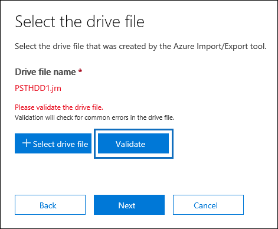

# <a name="use-drive-shipping-to-import-your-organizations-pst-files"></a>Usar o envio de unidade para importar arquivos PST da sua organização

**Este artigo é para administradores. Você está tentando importar arquivos PST para sua própria caixa de correio? Confira [importar email, contatos e calendário de um arquivo. pst do Outlook](https://go.microsoft.com/fwlink/p/?LinkID=785075)**
   
Use o serviço de importação do Office 365 e a unidade de envio para arquivos PST de importação em massa para caixas de correio do usuário. O Envio de Unidade significa que você copia os arquivos PST em uma unidade de disco rígido e, em seguida, envia essa unidade fisicamente para a Microsoft. Quando a Microsoft recebe seu disco rígido, a equipe do Data Center copia os dados do disco rígido para uma área de armazenamento na nuvem da Microsoft. Em seguida, você tem a oportunidade de aparar os dados de PST importados para as caixas de correio de destino, definindo filtros que controlam quais dados são importados. Depois de iniciar o trabalho de importação, o serviço de importação importa os dados de PST da área de armazenamento para as caixas de correio do usuário. Usar o envio de unidade para importar arquivos PST para caixas de correio do usuário é uma maneira de migrar o email da sua organização para o Office 365.
  
Estas são as etapas necessárias para usar o envio de unidade para importar arquivos PST para caixas de correio do Microsoft 365:
  
[Etapa 1: baixar a chave de armazenamento seguro e a ferramenta de importação de PST](#step-1-download-the-secure-storage-key-and-pst-import-tool)

[Etapa 2: copiar os arquivos PST no disco rígido](#step-2-copy-the-pst-files-to-the-hard-drive)

[Etapa 3: criar o arquivo de mapeamento de importação de PST](#step-3-create-the-pst-import-mapping-file)

[Etapa 4: criar um trabalho de Importação de PST no Office 365](#step-4-create-a-pst-import-job-in-office-365)

[Etapa 5: enviar o disco rígido para a Microsoft](#step-5-ship-the-hard-drive-to-microsoft)

[Etapa 6: Filtrar os dados e iniciar o trabalho de importação de PST](#step-6-filter-data-and-start-the-pst-import-job)
  
> [!IMPORTANT]
> Você precisa executar a etapa 1 uma vez para desativar o carregamento da chave de armazenamento seguro e da ferramenta de importação. Após executar essas etapas, siga a etapa 2 até a etapa 6 cada vez que quiser enviar um disco rígido para a Microsoft. 
  
Para perguntas frequentes sobre como usar o envio de unidade para importar arquivos PST para o Office 365, confira [perguntas frequentes sobre como usar o envio de unidade para importar arquivos PST](faqimporting-pst-files-to-office-365.md#using-drive-shipping-to-import-pst-files). 
  
## <a name="before-you-import-pst-files"></a>Antes de importar arquivos PST

- Você deverá ter a função Exportação Importação da Caixa de Correio no Exchange Online para importar arquivos PST para as caixas de correio do Microsoft 365. Por padrão, essa função não é atribuída a nenhum grupo de funções no Exchange Online. Você pode adicionar a função Importação e Exportação de Caixa de Correio no grupo de função Gerenciamento da Organização. Ou você pode criar um grupo de função, atribuir a função de exportação de importação de caixa de correio e adicionar a si mesmo como membro. Para mais informações, confira as seções "Adicionar uma função a um grupo de funções" ou as seções "Criar um grupo de funções" em [Gerenciar grupos de funções](https://go.microsoft.com/fwlink/p/?LinkId=730688).
    
    Além disso, para criar trabalhos de importação no Centro de Conformidade e Segurança, uma das alternativas a seguir deve ser verdadeira:
    
  - Você precisa ter a função Destinatários de email no Exchange Online. Por padrão, essa função é atribuída aos grupos de funções Gerenciamento da Organização e Gerenciamento de Destinatários.
    
    Ou
    
  - É necessário que você seja um administrador global na sua organização.
    
    > [!TIP]
    > Considere a criação de um novo grupo de função no Exchange Online destinado especificamente a importar os arquivos PST para o Office 365. Para o nível mínimo de privilégios necessários para importar os arquivos PST, atribua as funções de Exportação Importação de Caixa de Correio e Destinatários de email ao novo grupo de função e, em seguida, adicione membros. 
  
- Armazene os arquivos PST que pretende copiar no disco rígido, em um servidor de arquivos ou pasta compartilhada da organização. Na etapa 2, você executa a ferramenta de importação e exportação do Azure (WAImportExport.exe) que copia os arquivos PST armazenados nesse servidor de arquivos ou na pasta compartilhada para a unidade de disco rígido.

- Arquivos PST muito grandes podem afetar o desempenho do processo de importação de PST. Portanto, recomendamos que cada arquivo PST que você copiar para o disco rígido na etapa 2 não tenha mais de 20 GB.
    
- Apenas unidades de estado sólido (SSDs) de 2,5 polegadas ou discos rígidos internos SATA II/III de 2,5 polegadas ou 3,5 polegadas têm suporte para uso com o serviço de importação do Office 365. Use discos rígidos de até 10 TB. Para trabalhos de importação, somente o primeiro volume de dados do disco rígido será processado. O volume de dados deve ser formatado com NTFS. Ao copiar dados para uma unidade de disco rígido, você pode anexá-los diretamente usando um conector de 2,5-polegadas ou de 2,5 polegadas ou 3,5-polegada SATA II/III, ou você pode anexá-lo externamente usando um adaptador USB II/III SSD de 2,5 polegadas ou 2,5 polegadas externo.
    
    > [!IMPORTANT]
    > As unidades de disco rígido com um adaptador USB interno não são compatíveis com o serviço de importação do Office 365. Além disso, o disco dentro da caixa do disco rígido externo não pode ser utilizado. Não remova discos rígidos externos. 
  
- O disco rígido no qual você copiar os arquivos PST deve ser criptografado com o BitLocker. A ferramenta WAImportExport.exe usada na etapa 2 o ajudará a configurar o BitLocker. Ele também gera uma chave de criptografia BitLocker que o Microsoft Data Center utiliza para acessar a unidade para carregar os arquivos PST na área de armazenamento do Azure na nuvem da Microsoft.
    
- O envio de unidades está disponível por meio de um Microsoft Enterprise Agreement (EA). O envio de unidade não está disponível por meio de um Contrato de Produtos e Serviços da Microsoft (MPSA).
    
- O custo para importar arquivos PST para as caixas de correio do Microsoft 365 usando o envio de unidade é de $2 dólares por GB de dados. Por exemplo, se você enviar um disco rígido contendo 1.000 GB (1 TB) de arquivos PST, o custo será de US$ 2.000. Você pode trabalhar com um parceiro para pagar a taxa de importação. Para obter mais informações sobre como encontrar um parceiro, confira [Encontrar seu parceiro ou revendedor do Microsoft 365](https://go.microsoft.com/fwlink/p/?LinkId=785197).
    
- Você ou a organização devem ter uma conta da FedEx ou da DHL. 
    
  - As organizações nos Estados Unidos, Brasil e Europa devem ter contas do FedEx.
    
  - Organizações no leste asiático, Sudeste Asiático, Japão, República da Coréia e Austrália devem ter contas da DHL.
    
    A Microsoft usa (e encargos) esta conta para retornar a unidade de disco rígido de volta para você.
    
- O disco rígido que você envia para a Microsoft pode cruzar bordas internacionais. Nesse caso, você é responsável por garantir que o disco rígido e os dados que ele contém sejam importados e/ou exportados de acordo com as leis aplicáveis. Antes de enviar um disco rígido, peça aos seus consultores para verificar se a unidade e os dados podem ser enviados legalmente para o datacenter identificado da Microsoft. Isso ajuda a garantir que ele chegue à Microsoft de maneira oportuna.
    
- Esse procedimento implica copiar e salvar uma chave do armazenamento seguro e uma chave de criptografia BitLocker. Não deixe de tomar medidas para proteger estas chaves, do mesmo modo que o faria com senhas ou outras informações relacionadas à segurança. Por exemplo, você pode salvá-las em um documento do Microsoft Word protegido por senha ou em uma unidade USB criptografada. Consulte a seção [mais informações](#more-information) para obter um exemplo dessas chaves. 
    
- Depois que os arquivos PST são importados para uma caixa de correio do Microsoft 365, a configuração de retenção da caixa de correio é ativada por uma duração indefinida. Isso significa que a política de retenção atribuída à caixa de correio não será processada até que o bloqueio de retenção seja desativado ou que uma data para a desativação seja definida. Por que fazemos isso? Se as mensagens importadas para uma caixa de correio forem antigas, poderão ser excluídas permanentemente (eliminadas) porque o período de retenção expirou com base nas configurações de retenção definidas para a caixa de correio. Colocar a caixa de correio no bloqueio de retenção dará ao proprietário tempo de gerenciar essas mensagens importadas recentemente ou tempo para alterar as configurações de retenção da caixa de correio. Consulte a seção [mais informações](#more-information) para obter sugestões sobre como gerenciar a retenção. 
    
- Por padrão, o tamanho máximo da mensagem que pode ser recebida por uma caixa de correio do Microsoft 365 é 35 MB. Isso ocorre porque o valor padrão da *Propriedade MaxReceiveSize* de uma caixa de correio está definida como 35 MB. No entanto, o limite para o tamanho máximo de recebimento de mensagens no Microsoft 365 é 150 MB. Portanto, se você importar um arquivo PST que contenha um item com mais de 35 MB, o serviço de importação do Office 365 altera automaticamente o valor da propriedade *MaxReceiveSize* na caixa de correio de destino para 150 MB. Isso permite que mensagens de até 150 MB sejam importadas para as caixas de correio dos usuários. 
    
    > [!TIP]
    > Para identificar o tamanho de recebimento da mensagem de uma caixa de correio, execute esse comando no Exchange Online PowerShell:  `Get-Mailbox <user mailbox> | FL MaxReceiveSize`. 
  
- É possível importar arquivos PST para uma caixa de correio inativa no Office 365. Isso é feito especificando o GUID da caixa de correio inativa no `Mailbox` parâmetro no arquivo de mapeamento de importação de PST. Consulte [etapa 3: criar o arquivo de mapeamento de importação de PST](#step-3-create-the-pst-import-mapping-file) para obter mais informações. 
    
- Em uma implantação híbrida do Exchange, você pode importar arquivos PST para uma caixa de correio de arquivo morto baseada na nuvem para um usuário cuja caixa de correio principal esteja no local. Para isso, faça o seguinte no arquivo de mapeamento de Importação de PST:
    
  - Especifique o endereço de email para a caixa de correio local do usuário no `Mailbox` parâmetro. 
    
  - Especifique o valor **VERDADEIRO** no `IsArchive` parâmetro. 
    
    Consulte [etapa 3: criar o arquivo de mapeamento de importação de PST](#step-3-create-the-pst-import-mapping-file) para obter mais informações. 

## <a name="step-1-download-the-secure-storage-key-and-pst-import-tool"></a>Etapa 1: baixar a chave de armazenamento seguro e a ferramenta de importação de PST

A primeira etapa é baixar a chave de armazenamento seguro e a ferramenta e que você usa na etapa 2 para copiar os arquivos PST no disco rígido.
  
> [!IMPORTANT]
> Você precisa usar a ferramenta de importação/exportação do Azure versão 1 (WAimportExportV1) para importar arquivos PST com êxito usando o método de envio de unidade. A versão 2 da ferramenta de importação/exportação do Azure não é suportada e usá-la fará com que a unidade de disco rígido seja preparada incorretamente para o trabalho de importação. Certifique-se de baixar a ferramenta de importação/exportação do Azure no centro de conformidade de & de segurança, seguindo os procedimentos nesta etapa. 
  
1. Vá para [https://protection.office.com/](https://protection.office.com/) e entre usando as credenciais de uma conta de administrador em sua organização. 
    
2. No painel esquerdo do Centro de Conformidade e Segurança, clique em **Governança de informações** \> **Importar** \> **Importar arquivos PST**.
    
    > [!NOTE]
    > Conforme mencionado anteriormente, você precisa ter recebido as permissões apropriadas para acessar a página de **importação** no centro de conformidade do & de segurança. 
  
3. Na página **Importar arquivos PST**, clique em  **Novo trabalho de importação**.
    
4. No assistente de importação de trabalho, digite um nome para o trabalho de importação de PST e clique em **Avançar**. Use letras minúsculas, números, hifens e sublinhados. Não é possível usar letras maiúsculas ou incluir espaços no nome.
    
5. Na página **escolha o tipo de trabalho de importação** , clique em **Enviar discos rígidos para um de nossos locais físicos** e, em seguida, clique em **Avançar**.
    
    
  
6. Na página **Importar Dados**, execute as duas seguintes etapas: 
    
    
  
    a. Na etapa 2, clique em **copiar a chave de armazenamento seguro**. Depois que a chave de armazenamento for exibida, clique em **copiar para área de transferência** e cole-a e salve-a em um arquivo para que você possa acessá-la mais tarde.
    
    b. Na etapa 3, **Baixe a ferramenta de importação/exportação do Azure** para baixar e instalar a ferramenta de importação/exportação do Azure (versão 1).
    
    - Na janela pop-up, clique em **salvar** \> **salvar como** para salvar o arquivo de WaImportExportV1.zip em uma pasta no computador local. 
    
    - Extraia o arquivo WaImportExportV1.zip.
    
7. Clique em **Cancelar** para fechar o assistente. 
    
    Você voltará para a página de **importação** no centro de conformidade & de segurança ao criar o trabalho de importação na etapa 4. 

## <a name="step-2-copy-the-pst-files-to-the-hard-drive"></a>Etapa 2: copiar os arquivos PST no disco rígido

A etapa a seguir consiste em usar a ferramenta WAImportExport.exe para copiar arquivos PST no disco rígido. Com essa ferramenta, você criptografa o disco rígido com BitLocker, copia os arquivos PST no disco rígido e cria um arquivo de diário que armazena informações sobre o processo de cópia. Para concluir essa etapa, você deve colocar os arquivos PST em um compartilhamento de arquivos ou servidor de arquivos da organização. Esse local é conhecido como diretório de origem no procedimento a seguir. 

 Conforme mencionado anteriormente, cada arquivo PST que você copia para o disco rígido não deve ser maior do que 20 GB. Arquivos PST com mais de 20 GB podem afetar o desempenho do processo de importação de PST iniciado na etapa 6.
  
> [!IMPORTANT]
> Depois de executar a ferramenta WAImportExport.exe pela primeira vez em um disco rígido, use sintaxes diferentes nas próximas execuções. Esta sintaxe é explicada na etapa 4 deste procedimento para copiar os arquivos PST para a unidade de disco rígido. 
  
1. Abra um prompt de comando no computador local.
    
    > [!TIP]
    > If you run the command prompt as an administrator (by selecting "Run as administrator" when you open it) error messages will be displayed in the command prompt window. This can help you troubleshoot problems running the WAImportExport.exe tool. 
  
2. Vá para o diretório em que instalou a ferramenta WAImportExport.exe na etapa 1.
    
3. Execute o seguinte comando na primeira vez que usar a ferramenta WAImportExport.exe para copiar arquivos PST em um disco rígido.

    ```powershell
    WAImportExport.exe PrepImport /j:<Name of journal file> /t:<Drive letter> /id:<Name of session> /srcdir:<Location of PST files> /dstdir:<PST file path> /sk:<Storage account key> /blobtype:BlockBlob /encrypt /logdir:<Log file location>
    ```

    A tabela a seguir descreve os parâmetros e os valores necessários. 
    
    |**Parâmetro**|**Descrição**|**Exemplo**|
    |:-----|:-----|:-----|
    | `/j:` <br/> |Especifica o nome do arquivo de diário. Este arquivo será salvo na mesma pasta em que a ferramenta WAImportExport.exe está localizada. Cada disco rígido enviado para a Microsoft deve incluir um único arquivo de diário. Sempre que executar a ferramenta WAImportTool.exe para copiar arquivos PST em um disco rígido, as informações serão anexadas ao arquivo de diário dessa unidade.  <br/> A equipe de data center da Microsoft usa as informações do arquivo de diário para associar o disco rígido ao trabalho de importação que você cria na etapa 4 e carregar os arquivos PST na área de armazenamento do Azure na nuvem da Microsoft.  <br/> | `/j:PSTHDD1.jrn` <br/> |
    | `/t:` <br/> |Especifica a letra da unidade do disco rígido quando ele está conectado ao computador local.  <br/> | `/t:h` <br/> |
    | `/id:` <br/> |Specifies the name of the copy session. A session is defined as each time you run the WAImportExport.exe tool to copy files to the hard drive. The PST files are copied to a folder named with the session name specified by this parameter.  <br/> | `/id:driveship1` <br/> |
    | `/srcdir:` <br/> |Especifica o diretório de origem da organização, que contém os arquivos PST a serem copiados durante a sessão. Certifique-se de colocar o valor deste parâmetro entre aspas duplas (" ").  <br/> | `/srcdir:"\\FILESERVER01\PSTs"` <br/> |
    | `/dstdir:` <br/> |Especifica o diretório de destino na área de armazenamento do Azure na nuvem da Microsoft em que os PSTs serão carregados. Você deve usar o valor `ingestiondata/` . Certifique-se de colocar o valor deste parâmetro entre aspas duplas (" ").  <br/> Opcionalmente, você também pode adicionar um caminho de arquivo extra ao valor desse parâmetro. Por exemplo, você pode usar o caminho de arquivo do diretório de origem no disco rígido (convertido para um formato de URL), que é especificado no `/srcdir:` parâmetro. Por exemplo, `\\FILESERVER01\PSTs` é alterado para `FILESERVER01/PSTs` . Nesse caso, você ainda deve incluir `ingestiondata` no caminho do arquivo. Portanto, neste exemplo, o valor do `/dstdir:` parâmetro seria `"ingestiondata/FILESERVER01/PSTs"` .  <br/> Uma das razões para adicionar outros caminhos de arquivo é quando você tem arquivos PST com nomes de arquivos iguais.  <br/> > [!NOTE]> se você incluir o nome de caminho opcional, o namespace para um arquivo PST após ele ser carregado para a área de armazenamento do Azure inclui o nome do caminho e o nome do arquivo PST; por exemplo, `FILESERVER01/PSTs/annb.pst` . Se você não incluir um nome de caminho, o namespace será apenas o nome de arquivo PST; por exemplo `annb.pst` .           | `/dstdir:"ingestiondata/"` <br/> Ou  <br/>  `/dstdir:"ingestiondata/FILESERVER01/PSTs"` <br/> |
    | `/sk:` <br/> |Especifica a chave da conta de armazenamento obtida na etapa 1. Certifique-se de colocar o valor deste parâmetro entre aspas duplas (" ").  <br/> | `"yaNIIs9Uy5g25Yoak+LlSHfqVBGOeNwjqtBEBGqRMoidq6/e5k/VPkjOXdDIXJHxHvNoNoFH5NcVUJXHwu9ZxQ=="` <br/> |
    | `/blobtype:` <br/> |Especifica o tipo de BLOBs na área de armazenamento do Azure para os quais os arquivos PST serão importados. Para importar arquivos PST, use o valor **BlockBlob**. Esse parâmetro é obrigatório.   <br/> | `/blobtype:BlockBlob` <br/> |
    | `/encrypt` <br/> |Esta opção habilita o BitLocker no disco rígido. Este parâmetro é necessário na primeira vez que executar a ferramenta WAImportExport.exe.  <br/> A chave de criptografia do BitLocker é copiada para o arquivo de diário e o arquivo de log criado se você usar o `/logfile:` parâmetro. Conforme explicamos, o arquivo de diário é salvo na mesma pasta em que a ferramenta WAImportExport.exe está localizada.  <br/> | `/encrypt` <br/> |
    | `/logdir:` <br/> |Esse parâmetro opcional especifica uma pasta para salvar arquivos de log. Se não for especificado, os arquivos de log serão salvos na mesma pasta em que a ferramenta de WAImportExport.exe está localizada. Certifique-se de colocar o valor deste parâmetro entre aspas duplas (" ").  <br/> | `/logdir:"c:\users\admin\desktop\PstImportLogs"` <br/> |
   
    Veja um exemplo da sintaxe para a ferramenta WAImportExport.exe, que usa valores reais para os parâmetros:
    
    ```powershell
    WAImportExport.exe PrepImport /j:PSTHDD1.jrn /t:f /id:driveship1 /srcdir:"\\FILESERVER01\PSTs" /dstdir:"ingestiondata/" /sk:"yaNIIs9Uy5g25Yoak+LlSHfqVBGOeNwjqtBEBGqRMoidq6/e5k/VPkjOXdDIXJHxHvNoNoFH5NcVUJXHwu9ZxQ==" blobtype:BlockBlob /encrypt /logdir:"c:\users\admin\desktop\PstImportLogs"
    ```

    After you run the command, status messages are displayed that show the progress of copying the PST files to the hard drive. A final status message shows the total number of files that were successfully copied.
    
4. Execute este comando sempre que executar a ferramenta WAImportExport.ext para copiar arquivos PST no mesmo disco rígido.

    ```powershell
    WAImportExport.exe PrepImport /j:<Name of journal file> /id:<Name of new session> /srcdir:<Location of PST files> /dstdir:<PST file path> /blobtype:BlockBlob 
    ```

    Veja um exemplo da sintaxe para a execução de sessões subsequentes para copiar os arquivos PST no mesmo disco rígido.  

    ```powershell
    WAImportExport.exe PrepImport /j:PSTHDD1.jrn /id:driveship2 /srcdir:"\\FILESERVER01\PSTs\SecondBatch" /dstdir:"ingestiondata/" /blobtype:BlockBlob
    ```

## <a name="step-3-create-the-pst-import-mapping-file"></a>Etapa 3: criar o arquivo de mapeamento de importação de PST

Depois que a equipe do Data Center da Microsoft carregar os arquivos PST do disco rígido para a área de armazenamento do Azure, o serviço de importação usará as informações no arquivo de mapeamento de importação de PST, que é um arquivo de valor separado por vírgula (CSV), que especifica quais caixas de correio de usuário são importadas para os arquivos PST. Você enviará esse arquivo CSV na etapa seguinte, quando criar um trabalho de Importação de PST.
  
1. [Baixar uma cópia do arquivo de mapeamento para importação de PST](https://go.microsoft.com/fwlink/p/?LinkId=544717).
    
2. Open or save the CSV file to your local computer. The following example shows a completed PST Import mapping file (opened in NotePad). It's much easier to use Microsoft Excel to edit the CSV file.

    ```text
    Workload,FilePath,Name,Mailbox,IsArchive,TargetRootFolder,ContentCodePage,SPFileContainer,SPManifestContainer,SPSiteUrl
    Exchange,FILESERVER01/PSTs,annb.pst,annb@contoso.onmicrosoft.com,FALSE,/,,,,
    Exchange,FILESERVER01/PSTs,annb_archive.pst,annb@contoso.onmicrosoft.com,TRUE,/ImportedPst,,,,
    Exchange,FILESERVER01/PSTs,donh.pst,donh@contoso.onmicrosoft.com,FALSE,/,,,,
    Exchange,FILESERVER01/PSTs,donh_archive.pst,donh@contoso.onmicrosoft.com,TRUE,/ImportedPst,,,,
    Exchange,FILESERVER01/PSTs,pilarp.pst,pilarp@contoso.onmicrosoft.com,FALSE,/,,,,
    Exchange,FILESERVER01/PSTs,pilarp_archive.pst,pilarp@contoso.onmicrosoft.com,TRUE,/ImportedPst,,,,
    Exchange,,tonyk.pst,tonyk@contoso.onmicrosoft.com,FALSE,/,,,,
    Exchange,,tonyk_archive.pst,tonyk@contoso.onmicrosoft.com,TRUE,,,,,
    Exchange,,zrinkam.pst,zrinkam@contoso.onmicrosoft.com,FALSE,/,,,,
    Exchange,,zrinkam_archive.pst,zrinkam@contoso.onmicrosoft.com,TRUE,,,,,
    ```

    A primeira linha ou linha de cabeçalho do arquivo CSV enumera os parâmetros que serão usados pelo serviço de Importação de PST para importar os arquivos PST para as caixas de correio de usuário. Os nomes dos parâmetros são separados por vírgula. Cada linha sob a linha de cabeçalho representa os valores de parâmetro para a importação de um arquivo PST em uma caixa de correio específica. Você precisa de uma linha para cada arquivo PST que foi copiado para a unidade de disco rígido. Não deixe de substituir os dados de espaço reservado do arquivo de mapeamento pelos dados reais.

    > [!NOTE]
    > Não altere o conteúdo da linha de cabeçalho, inclusive os parâmetros SharePoint; eles serão ignorados durante o processo de Importação de PST. 
  
3. Use as informações da tabela a seguir para preencher o arquivo CSV com as informações necessárias.
    
    |**Parâmetro**|**Descrição**|**Exemplo**|
    |:-----|:-----|:-----|
    | `Workload` <br/> |Especifica o serviço do para o qual os dados serão importados. Para importar arquivos PST nas caixas de correio de usuário, use o  `Exchange`.  <br/> | `Exchange` <br/> |
    | `FilePath` <br/> | Especifica o local da pasta na área de armazenamento do Azure para a qual os arquivos PST serão copiados quando o disco rígido for enviado para a Microsoft.  <br/>  O que você adiciona nessa coluna no arquivo CSV depende do que você especificou para o `/dstdir:` parâmetro na etapa anterior. Se você tiver subpastas no local de origem, o valor no `FilePath` parâmetro deve conter o caminho relativo para a subpasta; por exemplo,/folder1/user1/.  <br/>  Se você usou `/dstdir:"ingestiondata/"` , deixe esse parâmetro em branco no arquivo CSV.  <br/>  Se você tiver incluído um nome de caminho opcional para o valor do `/dstdir:` parâmetro (por exemplo, `/dstdir:"ingestiondata/FILESERVER01/PSTs"` , use esse nome de caminho (não incluindo "ingestiondata") para esse parâmetro no arquivo CSV. O valor desse parâmetro diferencia maiúsculas de minúsculas.  <br/>  De qualquer forma, *não* inclua "ingestiondata" no valor do `FilePath` parâmetro. Deixe esse parâmetro em branco ou especifique apenas o nome de caminho opcional.  <br/> > [!IMPORTANT]> o caso do nome do caminho do arquivo deve ser o mesmo caso que você especificou no `/dstdir:` parâmetro da etapa anterior. Por exemplo, se você usou `"ingestiondata/FILESERVER01/PSTs"` para o nome da subpasta na etapa anterior, mas usado `fileserver01/psts` no `FilePath` parâmetro no arquivo CSV, a importação do arquivo PST falhará. Certifique-se de usar a mesma capitalização nas duas instâncias.           |(deixar em branco)  <br/> Ou  <br/>  `FILESERVER01/PSTs` <br/> |
    | `Name` <br/> |Especifique o nome do arquivo PST que será importado para a caixa de correio do usuário. O valor desse parâmetro diferencia maiúsculas de minúsculas.  <br/> > [!IMPORTANT]> o caso do nome de arquivo PST no arquivo CSV deve ser igual ao arquivo PST que foi carregado no local de armazenamento do Azure na etapa 2. Por exemplo, se você usar `annb.pst` o `Name` no parâmetro no arquivo CSV, mas o nome do arquivo PST atual  para `AnnB.pst`, a importação desse arquivo PST falhará. Certifique-se de que o nome do PST no arquivo CSV usa a mesma capitalização do arquivo PST atual.           | `annb.pst` <br/> |
    | `Mailbox` <br/> |Especifica o endereço de email da caixa de correio para a qual o arquivo PST será importado. Observe que não é possível especificar uma pasta pública porque o Serviço de Importação de PST não é compatível com a importação de arquivos PST para pastas públicas.  <br/> Para importar um arquivo PST para uma caixa de correio inativa, é preciso especificar o GUID da caixa de correio para esse parâmetro. Para obter esse GUID, execute o seguinte comando do PowerShell no Exchange Online:  `Get-Mailbox <identity of inactive mailbox> -InactiveMailboxOnly | FL Guid` <br/> > [!NOTE]> às vezes, você pode ter várias caixas de correio com o mesmo endereço de email, em que uma caixa de correio está ativa e a outra caixa de correio está em um estado excluído por software (ou inativo). Nesses casos, você precisa especificar o GUID da caixa de correio para identificar exclusivamente a caixa de correio para a qual o arquivo PST será importado. Para obter esse GUID para caixas de correio ativas, execute o seguinte comando do PowerShell:  `Get-Mailbox <identity of active mailbox> | FL Guid`. Para obter o GUID para caixas de correio excluídas (ou inativas), execute este comando: `Get-Mailbox <identity of soft-deleted or inactive mailbox> -SoftDeletedMailbox | FL Guid` .           | `annb@contoso.onmicrosoft.com` <br/> Ou  <br/>  `2d7a87fe-d6a2-40cc-8aff-1ebea80d4ae7` <br/> |
    | `IsArchive` <br/> | Especifica se deve ou não importar o arquivo PST para a caixa de correio de arquivo morto do usuário. Há duas opções:  <br/> **False** Importa o arquivo PST para a caixa de correio principal do usuário.  <br/> **True** Importa o arquivo PST para a caixa de correio de arquivo morto do usuário. Isso pressupõe que a [caixa de correio de arquivo morto do usuário está habilitada](enable-archive-mailboxes.md). Se definir este parâmetro para `TRUE` e a caixa de correio de arquivo morto do usuário não estiver habilitada, a importação para esse usuário falhará. Se uma importação falhar para um usuário (porque o arquivo morto dele não está habilitado e esta propriedade está definida para `TRUE`), os outros usuários no trabalho de importação não serão afetados.  <br/>  Se você deixar este parâmetro em branco, o arquivo PST será importado para a caixa de correio principal do usuário.  <br/> **Observação:** para importar um arquivo PST para uma caixa de correio de arquivo morto baseada na nuvem de um usuário cuja caixa de correio principal está no local, basta especificar `TRUE` para este parâmetro e especificar o endereço de email da caixa de correio no local do usuário para o parâmetro `Mailbox`.  <br/> | `FALSE` <br/> Ou  <br/>  `TRUE` <br/> |
    | `TargetRootFolder` <br/> | Especifica a pasta da caixa de correio para a qual o arquivo PST será importado.  <br/>  Se você deixar esse parâmetro em branco, o PST será importado para uma nova pasta denominada **importada** localizada no nível raiz da caixa de correio (o mesmo nível que a pasta caixa de entrada e as outras pastas de caixa de correio padrão).  <br/>  Se você especificar `/` , os itens no arquivo PST serão importados diretamente para a pasta caixa de entrada do usuário.  <br/>  Se você especificar `/<foldername>` , os itens no arquivo PST serão importados para uma pasta chamada *\<foldername\>* . Por exemplo, se você usar  `/ImportedPst` os itens serão importados para uma pasta chamada **ImportedPst**. Essa pasta estará localizada na caixa de correio do usuário, no mesmo nível da pasta Caixa de Entrada.  <br/> |(deixar em branco)  <br/> Ou  <br/>  `/` <br/> Ou  <br/>  `/ImportedPst` <br/> |
    | `ContentCodePage` <br/> |Esse parâmetro opcional especifica um valor numérico para a página do código a ser usado para importar arquivos PST no formato de arquivo ANSI. Esse parâmetro é usado para importar arquivos PST de organizações em chinês, japonês e coreano (CJK) porque esses idiomas geralmente usam um DBCS (conjunto de caracteres de dois bytes) para codificação de caracteres. Se esse parâmetro não for usado para importar arquivos PST para idiomas que usam DBCS para nomes de pasta de caixa de correio, os nomes das pastas geralmente ficam incorretos após a importação.  <br/> Para obter uma lista de valores com suporte para esse parâmetro, confira [Identificadores de Página de Código](https://go.microsoft.com/fwlink/p/?LinkId=328514).  <br/> > [!NOTE]> conforme afirmado anteriormente, este é um parâmetro opcional e você não precisa incluí-lo no arquivo CSV. Ou você pode incluí-lo e deixar o valor em branco para uma ou mais linhas.           |(deixar em branco)  <br/> Ou  <br/>  `932` (que é o identificador da página de código para ANSI/OEM japonês)  <br/> |
    | `SPFileContainer` <br/> |Deixe este parâmetro em branco para Importação de PST.  <br/> |Não aplicável  <br/> |
    | `SPManifestContainer` <br/> |Deixe este parâmetro em branco para Importação de PST.  <br/> |Não aplicável  <br/> |
    | `SPSiteUrl` <br/> |Deixe este parâmetro em branco para Importação de PST.  <br/> |Não aplicável  <br/> |

## <a name="step-4-create-a-pst-import-job-in-office-365"></a>Etapa 4: criar um trabalho de Importação de PST no Office 365

A etapa a seguir consiste em criar o trabalho de Importação de PST no serviço Importação do Office 365. Como explicado anteriormente, você envia o arquivo de mapeamento de importação de PST criado na etapa 3. Depois de criar o trabalho, o serviço de importação usará as informações do arquivo de mapeamento para importar os arquivos PST para a caixa de correio de usuário especificada depois que os arquivos PST forem copiados do disco rígido para a área de armazenamento do Azure e você criar e iniciar o trabalho de importação.
  
1. Vá para [https://protection.office.com](https://protection.office.com) e entre usando as credenciais de uma conta de administrador em sua organização. 
    
2. No painel esquerdo do Centro de Conformidade e Segurança, clique em **Governança de informações** \> **Importar** \> **Importar arquivos PST**.
    
3. Na página **Importar arquivos PST**, clique em  **Novo trabalho de importação**.
    
    > [!NOTE]
    > Conforme mencionado anteriormente, você precisa ter recebido as permissões apropriadas para acessar a página de **importação** no centro de conformidade do & de segurança. 
  
4. Digite um nome para o trabalho de Importação PST e clique em **Avançar**. Use letras minúsculas, números, hifens e sublinhados. Não é possível usar letras maiúsculas ou incluir espaços no nome.
    
5. Na página **escolha o tipo de trabalho de importação** , clique em **Enviar discos rígidos para um de nossos locais físicos** e, em seguida, clique em **Avançar**.
    
    
  
6. Na etapa 6, clique na opção **eu preparei meus discos rígidos e tenha acesso aos arquivos de diário de unidade necessários** e tenho **acesso ao arquivo de mapeamento** e, em seguida, clique em **Avançar**.
    
    
  
7. Na página **Selecionar arquivo de unidade** , clique em **Selecionar arquivo de unidade**e vá para a mesma pasta em que a ferramenta de WAImportExport.exe está localizada. O arquivo de diário criado na etapa 2 foi copiado nessa pasta.
    
    
  
8. Selecione o arquivo de diário; por exemplo, `PSTHDD1.jrn` .
    
    > [!TIP]
    > Ao executar a ferramenta WAImportExport.exe na etapa 2, o nome do arquivo de diário foi especificado pelo `/j:` parâmetro. 
  
9. Depois que o nome do arquivo de unidade for exibido em **nome do arquivo da unidade**, clique em **validar** para verificar se há erros no arquivo da unidade. 
    
    
  
    O arquivo de unidade deve ser validado com êxito para criar um trabalho de importação de PST. Observe que o nome do arquivo é alterado para verde após ser validado com êxito. Se a validação falhar, clique no link **Exibir log**. Um relatório de erro de validação é aberto com uma mensagem de erro com informações sobre por que o arquivo falhou. 
    
    > [!NOTE]
    > Você deve adicionar e validar um arquivo de diário para cada disco rígido enviado à Microsoft. 
  
10. Após adicionar e validar um arquivo de diário para cada disco rígido enviado à Microsoft, clique em **Avançar**.
    
11. Clique em  **Selecionar arquivo de mapeamento** para enviar o arquivo de mapeamento de importação de PST que você criou na etapa 3. 
    
    
  
12. Após o nome do arquivo CSV aparecer em **Nome do arquivo de mapeamento**, clique em **Validar** para verificar se há erros no arquivo CSV. 
    
    
  
    O arquivo CSV deve ser validado com êxito para criar um trabalho de importação de PST. Observe que o nome do arquivo é alterado para verde após ser validado com êxito. Se a validação falhar, clique no link **Exibir log**. Um relatório de erro de validação é aberto, com uma mensagem de erro para cada linha no arquivo que falhou. 
    
13. Depois que o arquivo de mapeamento de PST for validado com êxito, clique em **Avançar**.
    
14. Na página **fornecer informações de contato** , digite suas informações de contato nas caixas aplicáveis. 
    
    O endereço do local da Microsoft para o qual você envia seus discos rígidos é exibido. Esse endereço é gerado automaticamente com base no seu local de datacenter da Microsoft. Copie esse endereço em um arquivo ou faça uma captura de tela.
    
15. Leia o documento termos e condições, clique na caixa de seleção e, em seguida, clique em **salvar** para enviar o trabalho de importação. 
    
    Quando o trabalho de importação é criado com êxito, é exibida uma página de status que explica as próximas etapas do processo de envio de unidades.
    
16. Na página **importar arquivos PST** , clique em  **Atualizar** para exibir o trabalho de importação do envio da nova unidade na lista de trabalhos de importação. O status é definido como **aguardando o número de controle**. Você também pode clicar no trabalho de importação para exibir a página de submenu de status, que contém informações mais detalhadas sobre o trabalho de importação.
 
## <a name="step-5-ship-the-hard-drive-to-microsoft"></a>Etapa 5: enviar o disco rígido para a Microsoft

A próxima etapa é enviar o disco rígido para a Microsoft e, em seguida, fornecer o número de controle para a entrega e retornar informações de remessa para o trabalho de envio da unidade. Depois que a unidade for recebida pela Microsoft, levará entre 7 e 10 dias úteis para que o pessoal do Data Center carregue seus arquivos PST para a área de armazenamento do Azure para sua organização.
  
> [!NOTE]
> Se você não fornecer o número de controle e retornar as informações de remessa dentro de 14 dias da criação do trabalho de importação, o trabalho de importação será expirado. Se isso acontecer, você terá que criar um novo trabalho de importação de envio de unidades (consulte [etapa 4: criar um trabalho de importação de PST no Office 365](#step-4-create-a-pst-import-job-in-office-365)) e enviar novamente o arquivo de unidade e o arquivo de mapeamento de importação de PST. 
  
### <a name="ship-the-hard-drive"></a>Enviar o disco rígido

Quando enviar discos rígidos para a Microsoft, lembre-se do seguinte:
  
- Não envie o adaptador SATA para USB; Você só precisa enviar a unidade de disco rígido.
    
- Embale o disco rígido de forma adequada; por exemplo, use plástico-bolha ou uma bolsa antiestática.
    
- Use uma transportadora de entrega de sua preferência para enviar o disco rígido à Microsoft.
    
- Envie o disco rígido para o endereço da Microsoft, exibido quando você criou o trabalho de importação na etapa 4. Não deixe de incluir o título "Serviço de Importação do Office 365" no endereço para entrega.
    
- After you ship the hard drive, be sure to write down the name of the delivery carrier and the tracking number. You'll provide these in the next step.
    
### <a name="enter-the-tracking-number-and-other-shipping-information"></a>Insira o número de rastreamento e outras informações da remessa.

Depois de enviar o disco rígido para a Microsoft, faça o procedimento a seguir na página do serviço Importar.
  
1. Vá para [https://protection.office.com](https://protection.office.com) e entre usando as credenciais de uma conta de administrador em sua organização. 
    
2. No painel esquerdo, clique em **governança de informações > importar > importar arquivos PST**.
    
3. Na página **importar arquivos PST** , clique no trabalho da entrega da unidade na qual você deseja inserir o número de controle. 
    
4. Na página de submenu de status, clique em **Inserir número de controle**.
    
5. Forneça as seguintes informações sobre a remessa:
    
1. **Operadora de entrega** Digite o nome da operadora de entrega que você usou para enviar o disco rígido à Microsoft. 
    
2. **Número de controle** Digite o número de controle para a entrega do disco rígido. 
    
3. **Número de conta da transportadora de retorno** Digite o número da conta da sua organização para a operadora listada em **portadora de retorno**. A Microsoft usa (e encargos) esta conta para enviar o disco rígido de volta para você. As organizações nos EUA e na Europa devem ter uma conta com o FedEx. As organizações sediadas na Ásia e no restante do mundo devem ter contas da DHL.
    
6. Clique em **Salvar** para salvar essas informações do trabalho de importação. 
    
    Na página **importar arquivos PST** , clique em  **Atualizar** para atualizar as informações do trabalho de importação de envio de unidades. Observe agora que o status está definido como **Unidades em trânsito**.

## <a name="step-6-filter-data-and-start-the-pst-import-job"></a>Etapa 6: Filtrar os dados e iniciar o trabalho de importação de PST

Depois que a unidade de disco rígido for recebida pela Microsoft, o status do trabalho de importação na página **importar arquivos PST** será alterado para **unidades recebidas**. O pessoal do Data Center usa as informações do arquivo do diário para carregar seus arquivos PST para a área de armazenamento do Azure para sua organização. Neste ponto, o status muda para **importar em andamento**. Conforme mencionado anteriormente, levará entre 7 e 10 dias úteis após receber seu disco rígido para carregar os arquivos PST.
  
Depois que os arquivos PST são carregados no Azure, o status é alterado para **análise em andamento**. Isso indica que o Microsoft 365 está analisando os dados nos arquivos PST (de uma maneira segura e segura) para identificar a idade dos itens e os diferentes tipos de mensagens incluídos nos arquivos PST. Quando a análise é concluída e os dados estão prontos para importação, o status do trabalho de importação é alterado para **análise concluída**. Neste ponto, você tem a opção de importar todos os dados contidos nos arquivos PST ou pode aparar os dados importados Configurando filtros que controlam quais dados são importados.
  
1. Vá para [https://protection.office.com](https://protection.office.com) e entre usando as credenciais de uma conta de administrador em sua organização. 
    
2. No painel esquerdo, clique em **Information governance** \> **importar** \> **arquivos PST de importação**de governança de informações.
    
3. Na página **importar arquivos PST** , clique em **pronto para importar para o Office 365** para o trabalho de importação que você criou na etapa 4. 
    
    
  
    Uma página com submenu é exibida com informações sobre os arquivos PST e outras informações sobre o trabalho de importação.
    
4. Clique em **importar para o Office 365**.
    
5. A página **Filtrar seus dados** é exibida. Ela contém as informações sobre dados resultantes da análise realizada nos arquivos PST do Office 365, incluindo informações sobre a idade dos dados. Neste ponto, você tem a opção de filtrar os dados que serão importados ou importar todos os dados como estão. 
    
    
  
6. Siga um destes procedimentos:
    
    a. Para cortar os dados importados, clique em **Sim, desejo filtrá-los antes de importá-los**.
    
    Para obter instruções passo a passo detalhadas sobre como filtrar os dados nos arquivos PST e iniciar o trabalho de importação, confira [Filtrar dados ao importar arquivos PST para o Office 365](filter-data-when-importing-pst-files.md).
    
    Ou
    
    b. Para importar todos os dados dos arquivos PST, clique em **Não, Desejo importar tudo** e clique em **Avançar**.
    
7. Se optar por importar todos os dados, clique em **Importar dados** para iniciar o trabalho de importação. 
    
    O status do trabalho de importação é exibido na página **importar arquivos PST** . Clique no  **Atualizar** para atualizar as informações de status exibidas na coluna**Status**.  Clique no trabalho de importação para exibir a página de status do submenu, que exibe informações de status sobre cada arquivo PST sendo importado.. Quando concluir a importação dos arquivos PST nas caixas de correio de usuário, o status passará a ser **Concluído**.

## <a name="view-a-list-of-the-pst-files-uploaded-to-microsoft-365"></a>Exibir uma lista dos arquivos PST carregados para o Microsoft 365

Você pode instalar e usar o Microsoft Azure Storage Explorer (que é uma ferramenta de código-fonte gratuito) para exibir a lista dos arquivos PST que são carregados (pela equipe de data center da Microsoft) para a área de armazenamento do Azure para sua organização. Você pode fazer isso para verificar se os arquivos PST dos discos rígidos enviados para a Microsoft foram carregados com êxito para a área de armazenamento do Azure.
  
O Gerenciador de Armazenamento do Microsoft Azure está em Prévia.
  
 **Importante:** Você não pode usar o Gerenciador de armazenamento do Azure para carregar ou modificar arquivos PST. O único método com suporte para importar arquivos PST para o Microsoft 365 é usar o AzCopy. Além disso, não é possível excluir os arquivos PST que você carregou no blob do Azure. Se você tentar excluir um arquivo PST, receberá um erro sobre não ter as permissões necessárias. Todos os arquivos PST são excluídos automaticamente da área de armazenamento do Azure. Se não houver trabalhos de importação em andamento, todos os arquivos PST no contêiner * * ingestiondata * * serão excluídos 30 dias após a criação do trabalho de importação mais recente. 
  
Para instalar o Gerenciador de Armazenamento do Azure e se conectar à sua área de armazenamento do Azure:
  
1. Execute as etapas a seguir para obter a URL de assinatura de acesso compartilhado (SAS) da sua organização. Esta URL é uma combinação da URL de rede para o local de armazenamento do Azure na nuvem da Microsoft para sua organização e uma chave SAS. Esta chave fornece as permissões necessárias para acessar o local de armazenamento do Azure da sua organização.
    
1. Vá para [https://protection.office.com/](https://protection.office.com/) e entre usando as credenciais de uma conta de administrador em sua organização. 
    
2. No painel esquerdo do Centro de Conformidade e Segurança, clique em **Governança de informações> Importar > Importar arquivos PST**.
    
3. Na página **Importar arquivos PST**, clique em  **Novo trabalho de importação**.
    
4. No assistente de importação de trabalho, digite um nome para o trabalho de importação de PST e clique em **Avançar**. Use letras minúsculas, números, hifens e sublinhados. Não é possível usar letras maiúsculas ou incluir espaços no nome.
    
5. Na página **escolha o tipo de trabalho de importação** , clique em **carregar seus dados**e, em seguida, clique em **Avançar**.
    
6. Na etapa 2, clique em **Mostrar URL SAS de carregamento de rede**.
    
7. Depois que a URL for exibida, copie-a e salve-a em um arquivo. Não deixe de copiar a URL inteira.
    
    > [!IMPORTANT]
    > Certifique-se de proteger a URL da SAS. Isso pode ser usado por qualquer pessoa para acessar a área de armazenamento do Azure para sua organização. 
  
8. Clique em **Cancelar** para fechar o assistente de importação de trabalho. 
    
2. Baixe e instale a [Ferramenta Gerenciador de Armazenamento do Microsoft Azure ](https://go.microsoft.com/fwlink/p/?LinkId=544842).
    
3. Inicie o Gerenciador de armazenamento do Microsoft Azure, clique com o botão direito do mouse em **Contas de Armazenamento** no painel esquerdo e clique em **Conectar-se ao Armazenamento do Azure**.
    
    
  
4. Clique em **Usar uma assinatura de acesso (SAS) URI ou uma cadeia de conexão** e clique em **Avançar**.
    
5. Clique em **usar um URI SAS**, Cole a URL SAS obtida na etapa 1 em para na caixa em **URI**e clique em **Avançar**.
    
6. Na página **Resumo da conexão**, você pode revisar as informações de conexão e, em seguida, clique em **Conectar**.
    
    O contêiner**ingestiondata** será aberto. Ele contém os arquivos PST da sua unidade de disco rígido. O contêiner **ingestiondata** está localizado em uma **Conta de Armazenamento** \> **(SAS-Serviços Anexados)**\> **Contêineres de Blob**.
    
    
  
7. Ao terminar de usar o Gerenciador de Armazenamento do Azure, clique com botão direito em **ingestiondata** e, em seguida, clique em **Desanexar** para desconectar-se da sua área de armazenamento do Azure. Caso contrário, você receberá uma mensagem de erro na próxima vez que tentar anexar. 
    
    

## <a name="troubleshooting-tips"></a>Dicas de solução de problemas

- **O que acontece se o trabalho de importação falhar devido a erros no arquivo de mapeamento CSV de importação de PST?** Se um trabalho de importação falhar devido a erros no arquivo de mapeamento, não será necessário reenviar o disco rígido para a Microsoft para criar um trabalho de importação. Isso ocorre porque os arquivos PST do disco rígido que você enviou para o trabalho de importação do envio da unidade já foram carregados para a área de armazenamento do Azure para sua organização. Nesse caso, você só precisa corrigir os erros no arquivo de mapeamento CSV de importação de PST e, em seguida, criar um novo trabalho de importação de "carregamento de rede" e enviar o arquivo de mapeamento CSV revisado. Para criar e iniciar um novo trabalho de importação de carregamento de rede, consulte [etapa 5: criar um trabalho de importação de PST no Microsoft 365](use-network-upload-to-import-pst-files.md#step-5-create-a-pst-import-job) e [etapa 6: filtrar dados e iniciar o trabalho de importação de PST](use-network-upload-to-import-pst-files.md#step-6-filter-data-and-start-the-pst-import-job) no tópico "usar o carregamento de rede para importar arquivos PST para o Office 365". 
    
    > [!NOTE]
    > Para ajudá-lo a solucionar problemas do arquivo de mapeamento CSV de importação de PST, use a ferramenta [Azure Storage Explorer](#view-a-list-of-the-pst-files-uploaded-to-microsoft-365) para exibir a estrutura de pastas no contêiner **ingestiondata** para os arquivos pst do disco rígido que foram carregados para a área de armazenamento do Azure. Os erros de arquivo de mapeamento são normalmente causados por um valor incorreto no parâmetro FilePath. Esse parâmetro especifica o local de um arquivo PST na área de armazenamento do Azure. Consulte a descrição do parâmetro FilePath na tabela na [etapa 3](#step-3-create-the-pst-import-mapping-file). Conforme explicado anteriormente, o local dos arquivos PST na área de armazenamento do Azure foi especificado pelo `/dstdir:` parâmetro quando você executou a ferramenta de WAImportExport.exe na [etapa 2](#step-2-copy-the-pst-files-to-the-hard-drive). 
  
## <a name="more-information"></a>Mais informações

- O envio de unidades é uma maneira eficaz de importar grandes quantidades de dados de mensagens de arquivamento para a Microsoft 365 para aproveitar os recursos de conformidade disponíveis para sua organização. Depois que os dados de arquivamento são importados para caixas de correio de usuário, você pode:
    
  - Habilitar [caixas de correio de arquivo morto](enable-archive-mailboxes.md) e [arquivamento de expansão automática](enable-unlimited-archiving.md) para dar aos usuários mais espaço de armazenamento de caixa de correio para os dados. 
    
  - Coloque as caixas de correio em [retenção de litígio](https://go.microsoft.com/fwlink/?linkid=856286) para manter os dados. 
    
  - Usar as [ferramentas de descoberta eletrônica](search-for-content.md) da Microsoft para pesquisar os dados. 
    
  - Aplicar [as políticas de retenção da Microsoft 365](retention.md) para controlar o tempo de retenção dos dados e a ação a ser tomada depois que o período de retenção expira. 
    
  - Pesquise o [log de auditoria](search-the-audit-log-in-security-and-compliance.md) em busca de eventos relacionados a esses dados. 
    
  - Importe dados para [caixas de correio inativas](create-and-manage-inactive-mailboxes.md) para arquivar dados para fins de conformidade. 
    
  - Proteger sua organização contra a [perda de dados](data-loss-prevention-policies.md) de informações confidenciais. 
    
- Here's an example of the secure storage account key and a BitLocker encryption key. This example also contains the syntax for the WAImportExport.exe command that you run to copy PST files to a hard drive. Be sure to take precautions to protect these just like you would protect passwords or other security-related information.
    

    ```text
    Secure storage account key: 

    yaNIIs9Uy5g25Yoak+LlSHfqVBGOeNwjqtBEBGqRMoidq6/e5k/VPkjOXdDIXJHxHvNoNoFH5NcVUJXHwu9ZxQ==

    BitLocker encryption key:

    397386-221353-718905-535249-156728-127017-683716-083391

  COMMAND SYNTAX

  First time:

  WAImportExport.exe PrepImport /j:<Name of journal file> /t:<Drive letter> /id:<Name of session> /srcdir:<Location of PST files> /dstdir:<PST file path> /sk:<Storage account key> /blobtype:BlockBlob /encrypt /logdir:<Log file location>

  Subsequent times:

  WAImportExport.exe PrepImport /j:<Name of journal file> /id:<Name of new session> /srcdir:<Location of PST files> /dstdir:<PST file path> /blobtype:BlockBlob 

  EXAMPLES

  First time:

  WAImportExport.exe PrepImport /j:PSTHDD1.jrn /t:f /id:driveship1 /srcdir:"\\FILESERVER1\PSTs" /dstdir:"ingestiondata/" /sk:"yaNIIs9Uy5g25Yoak+LlSHfqVBGOeNwjqtBEBGqRMoidq6/e5k/VPkjOXdDIXJHxHvNoNoFH5NcVUJXHwu9ZxQ==" /blobtype:BlockBlob /encrypt /logdir:"c:\users\admin\desktop\PstImportLogs"

  Subsequent times:

  WAImportExport.exe PrepImport /j:PSTHDD1.jrn /id:driveship2 /srcdir:"\\FILESERVER1\PSTs\SecondBatch" /dstdir:"ingestiondata/" /blobtype:BlockBlob
    ```

- Como explicado anteriormente, o serviço de importação do Office 365 ativa a configuração de retenção suspensa (para uma duração indefinida) após a importação dos arquivos PST para uma caixa de correio. Isso significa que a propriedade *RentionHoldEnabled* é definida para `True` que a política de retenção atribuída à caixa de correio não seja processada. Isso dá ao proprietário da caixa de correio o tempo para gerenciar as mensagens importadas recentemente, impedindo que uma política de exclusão ou arquivamento exclua ou arquive mensagens mais antigas. Veja algumas etapas que você pode executar para gerenciar essa retenção: 
    
  - Após um determinado período de tempo, você pode desativar o bloqueio de retenção executando o `Set-Mailbox -RetentionHoldEnabled $false` comando. Para obter mais detalhes, consulte [Retenção local de uma caixa de correio em retenção](https://go.microsoft.com/fwlink/p/?LinkId=544749).
    
  - Você pode configurar a retenção para que ela seja desativada em alguma data no futuro. Para fazer isso, execute o `Set-Mailbox -EndDateForRetentionHold <date>` comando. Por exemplo, supondo que a data de hoje seja 1º de junho de 2016 e você queira que a retenção tenha sido desativada em 30 dias, execute o seguinte comando: `Set-Mailbox -EndDateForRetentionHold 7/1/2016` . Neste cenário, você deixaria a propriedade *RentionHoldEnabled* definida como *true*. Para obter mais informações, consulte [Set-Mailbox](https://go.microsoft.com/fwlink/p/?LinkId=150317).
    
  - Você pode alterar as configurações da política de retenção atribuída à caixa de correio para que os itens mais antigos que foram importados não sejam excluídos ou movidos imediatamente para a caixa de correio de arquivo morto do usuário. Por exemplo, você pode aumentar o período de retenção para uma política de exclusão ou arquivamento atribuída à caixa de correio. Nesse cenário, você desabilitaria a retenção na caixa de correio depois de alterar as configurações da política de retenção. Para obter mais informações, consulte [Configurar uma política de arquivamento e exclusão para caixas de correio em sua organização](set-up-an-archive-and-deletion-policy-for-mailboxes.md).
    

  

