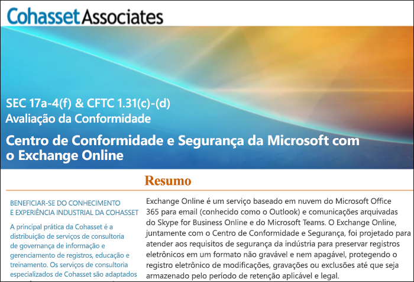

# Usar o Exchange Online e o Centro de Conformidade e Segurança para atender à norma 17a-4 da SEC

>*[Diretrizes de licenciamento do Microsoft 365 para segurança e conformidade](https://aka.ms/ComplianceSD).*

Se sua organização precisa obedecer aos padrões regulamentares de retenção de dados, o Centro de conformidade e segurança fornecerá recursos para gerenciar o ciclo de vida dos seus dados no Exchange Online. Isso inclui a capacidade de reter, auditar, pesquisar e exportar seus dados. Esses recursos são suficientes para atender às necessidades da maioria das organizações.

No entanto, algumas organizações em setores altamente regulamentados estão sujeitas a requisitos regulamentares mais rigorosos. Por exemplo, instituições financeiras, como bancos ou corretoras, estão sujeitas à norma 17a-4 estabelecida pela SEC (Comissão de Títulos e Câmbio dos Estados Unidos). A norma 17a-4 tem requisitos específicos para armazenamento de dados eletrônicos, inclusive vários aspectos do gerenciamento de registros, como duração, formato, qualidade, disponibilidade e responsabilidade da retenção de registros.

Para ajudar essas organizações a entender melhor como aproveitar o Centro de Conformidade e Segurança para atender às obrigações regulamentares do Exchange Online, especificamente em relação aos requisitos da norma 17a-4, lançamos uma avaliação em parceria com a Cohasset Associates.

A Cohasset Associates comprovou que, quando o Exchange Online e o Centro de Conformidade e Segurança são configurados conforme recomendado, eles atendem aos requisitos de armazenamento relevantes das normas 1.31(c)-(d) da CFTC, 4511 da FINRA e 17a-4 da SEC. Visamos esse conjunto de normas porque elas representam a orientação mais normativa globalmente para retenção de registros por instituições financeiras.

## Baixar a avaliação da Cohasset

[Baixe a avaliação da Cohasset aqui](https://servicetrust.microsoft.com/ViewPage/TrustDocuments?command=Download&downloadType=Document&downloadId=9fa8349d-a0c9-47d9-93ad-472aa0fa44ec&docTab=6d000410-c9e9-11e7-9a91-892aae8839ad_FAQ_and_White_Papers).

## Esta avaliação foi feita especificamente para o Exchange Online

Observe que esta avaliação é específica para o Exchange Online. A avaliação não inclui outros serviços do Microsoft 365, como o SharePoint Online ou o OneDrive for Business, embora planejemos suporte para esses serviços com relação à SEC 17a-4 no futuro.

É importante entender que o Skype for Business e o Teams também armazenam dados no Exchange Online. Assim, a avaliação abrange mensagens do Skype for Business e mensagens de canal e bate-papo do Teams.

## O uso do Bloqueio de Preservação é fundamental para a configuração recomendada

Os setores altamente regulamentados são sempre obrigados a armazenar comunicações eletrônicas para atender ao requisito de WORM (gravar uma vez, ler muitas). Este requisito estabelece uma solução de armazenamento na qual um registro deve ser:

- Retido por um período de retenção obrigatório, que não pode ser reduzido, mas apenas aumentado.
- Imutável, o que significa que não é possível substituir, apagar ou alterar o registro durante o período de retenção obrigatório.

No Exchange Online, quando uma [política de retenção](retention.md) é aplicada à caixa de correio de um usuário, todo o conteúdo do usuário será retido com base nos critérios da política. De fato, se um usuário tentar excluir ou modificar um e-mail, uma cópia do e-mail antes que a alteração seja feita será preservada em um local seguro e oculto na caixa de correio do usuário. As políticas de retenção podem ajudar a garantir que uma organização retenha comunicações eletrônicas, mas essas políticas podem ser modificadas.

Ao aplicar o Bloqueio de Preservação em uma política de retenção, a empresa garante que a política não seja modificada. De fato, após aplicar o Bloqueio de Preservação a uma política de retenção, as seguintes ações serão restritas:

- O período de retenção da política pode apenas ser aumentado, mas não reduzido.
- É possível adicionar usuários à política, mas não é possível removê-los.
- A política de retenção não pode ser excluída por um administrador.

O Bloqueio de Preservação pode ajudar na conformidade com os requisitos regulamentares da norma 17a-4 da SEC.

## Como configurar o Bloqueio de Preservação

Você pode bloquear uma política de retenção usando o PowerShell. Para obter mais informações, consulte [Use o Bloqueio de preservação para cumprir os requisitos regulamentares](retention.md#use-preservation-lock-to-comply-with-regulatory-requirements).

## Limitações conhecidas

No momento, há algumas limitações no Exchange Online:

- As comunicações encadeadas não estão disponíveis para mensagens de canal e chat do Teams.
- As curtidas não são retidas para mensagens de canal e chat do Teams.

> [!NOTE]
> A auditoria no nível do item já está disponível para as caixas de correio de grupo do Microsoft 365. Para saber mais, consulte [Gerenciar a auditoria da caixa de correio](enable-mailbox-auditing.md).
