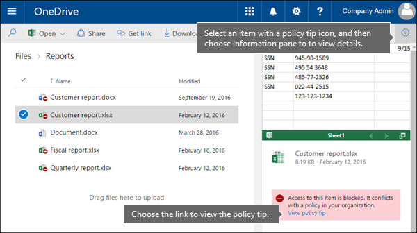

# Enviar notificações por email e mostrar dicas para políticas de DLP

Você pode usar uma política de prevenção contra perda de dados (DLP) para identificar, monitorar e proteger informações confidenciais no Office 365. Você deseja que as pessoas em sua organização que trabalham com essas informações confidenciais permaneçam em conformidade com suas políticas de DLP, mas não as bloqueie desnecessariamente para que o trabalho seja realizado. É aí que as notificações por email e as dicas de política podem ajudar.
  

  
Uma dica de política é uma notificação ou aviso que aparece quando alguém está trabalhando com conteúdo que entra em conflito com uma política de DLP, por exemplo, conteúdo como uma workbook Excel em um site OneDrive for Business que contém informações de identificação pessoal (PII) e é compartilhado com um usuário externo.
  
Você pode usar notificações por email e dicas de política para aumentar a conscientização e ajudar a instruir as pessoas sobre as políticas da sua organização. Você também pode dar às pessoas a opção de substituir a política, para que elas não são bloqueadas se elas têm uma necessidade de negócios válida ou se a política está detectando um falso positivo.
  
No Centro de Conformidade de &amp; Segurança, ao criar uma política de DLP, você pode configurar as notificações do usuário para:
  
- Envie uma notificação por email para as pessoas escolhidas que descrevem o problema.
    
- Exibir uma dica de política para conteúdo que conflita com a política DLP:
    
  - Para email Outlook na Web e Outlook 2013 e posterior, a dica de política aparece na parte superior de uma mensagem acima dos destinatários enquanto a mensagem está sendo composta.
    
  - Para documentos em uma OneDrive for Business ou site SharePoint Online, a dica de política é indicada por um ícone de aviso que aparece no item. Para exibir mais informações, você pode  selecionar um item e, em seguida, escolher o ícone do painel Informações informações no canto superior direito da página para  detalhes. 
    
  - Para Excel, PowerPoint e documentos do Word armazenados em um site do OneDrive for Business ou site do SharePoint Online incluído na política DLP, a dica de política aparece na Barra de Mensagens e no exibição Backstage **(** Informações do menu \> Arquivo).
    
## Adicionar notificações de usuário a uma política de DLP

Ao criar uma política de DLP, você pode habilitar **notificações de usuário**. Quando as notificações do usuário são habilitadas, Microsoft 365 envia notificações por email e dicas de política. Você pode personalizar para quem os emails de notificação são enviados, o texto de email e o texto da dica de política.
  
1. Acesse [https://protection.office.com](https://protection.office.com).
    
2. Entre usando sua conta de trabalho ou da escola. Agora você está no Centro de &amp; Conformidade de Segurança.
    
3. No Centro de Conformidade de Segurança à esquerda navegação Política de prevenção contra perda &amp; \> de \>  \> **dados** \> **+ Criar uma política**.
    
    
  
4. Escolha o modelo de política de DLP que protege os tipos de informações confidenciais que você precisa de \> **Next**.
    
    Para começar com um modelo vazio, escolha **Política** \> **personalizada** \> **Próxima**.
    
5. Nomeia a política \> **Next**.
    
6. Para escolher os locais que você deseja que a política DLP proteja, faça um dos seguintes:
    
   - Escolha **Todos os locais no Office 365** \> **Próximo**.
    
   - Choose **Let me choose specific locations** \> **Next**.
    
   Para incluir ou excluir um local inteiro, como todos os Exchange email ou todas as contas OneDrive, alternar o **Status** desse local para cima ou para fora. 
    
   Para incluir apenas sites SharePoint ou contas OneDrive, alternar o **Status** para e  clique nos links em Incluir para escolher sites ou contas específicos. 
    
7. Escolha **Usar configurações avançadas** \> **Avançar**.
    
8. Escolha **+ Nova regra**.
    
9. No editor de regras, em **Notificações de usuário**, ative o status.
    
    

> [!NOTE]
> As políticas DLP se aplicam a todos os documentos que corresponderem à política, sejam esses documentos novos ou existentes. No entanto, uma notificação de email só é gerada quando o novo conteúdo corresponde a uma política de DLP existente. O conteúdo existente está protegido, mas não gerará uma notificação do usuário por email.
  
## Opções para a configuração de notificações por email

Para cada regra de uma política de DLP, você pode:
  
- Enviar a notificação para as pessoas que você escolher. Essas pessoas podem incluir o proprietário do conteúdo, a pessoa que modificou o conteúdo pela última vez, o proprietário do site em que o conteúdo está armazenado ou um usuário específico.
    
- Personalize o texto incluído na notificação usando HTML ou tokens. Confira a seção abaixo para mais informações.
    
> [!NOTE]
>  As notificações por email só podem ser enviadas a destinatários individuais, não a grupos ou listas de distribuição. Apenas o novo conteúdo disparará uma notificação por email. Editar conteúdo existente disparará dicas de política, mas não uma notificação de email. 
  

  
### Notificação de email padrão

As notificações têm uma linha Assunto que começa com a ação realizada, como "Notificação", "Mensagem Bloqueada" para email ou "Acesso Bloqueado" para documentos. Se a notificação for sobre um documento, o corpo da mensagem de notificação incluirá um link que o leva ao site onde o documento está armazenado e abre a dica de política para o documento, onde você pode resolver quaisquer problemas (consulte a seção abaixo sobre dicas de política). Se a notificação for sobre uma mensagem, a notificação incluirá como anexo a mensagem que corresponde a uma política DLP.
  

  
Por padrão, as notificações exibem um texto semelhante ao seguinte para um item em um site. O texto de notificação é configurado separadamente para cada regra, para que o texto exibido seja diferente dependendo da regra que for correspondida.

|**Se a regra de política de DLP fizer isso...**|**Em seguida, a notificação padrão para SharePoint ou OneDrive for Business documentos diz isso...**|**Em seguida, a notificação padrão para Outlook mensagens diz isso...**|
|:-----|:-----|:-----|
|Envia uma notificação, mas não permite substituição    |Este item está em conflito com uma política de sua organização.    |Sua mensagem de email entra em conflito com uma política em sua organização.    |
|Bloqueia o acesso, envia uma notificação e permite a substituição    |Este item está em conflito com uma política de sua organização. Se você não resolver esse conflito, o acesso a esse arquivo poderá ser bloqueado.    |Sua mensagem de email entra em conflito com uma política em sua organização. A mensagem não foi entregue a todos os destinatários.    |
|Bloqueia o acesso e envia uma notificação    |Este item está em conflito com uma política de sua organização. O acesso a este item está bloqueado para todos, exceto seu proprietário, o último modificador e o administrador de conjunto de site principal.    |Sua mensagem de email entra em conflito com uma política em sua organização. A mensagem não foi entregue a todos os destinatários.    |
   
### Notificação de email personalizada

Você pode criar uma notificação de email personalizada em vez de enviar a notificação de email padrão para os usuários finais ou administradores. A notificação de email personalizada dá suporte a HTML e tem um limite de 5.000 caracteres. Você pode usar HTML para incluir imagens, formatação e outras marcas na notificação.
  
Você também pode usar os tokens a seguir para ajudar a personalizar a notificação de email. Esses tokens são variáveis que são substituídas por informações específicas na notificação enviada.

|**Token**|**Descrição**|
|:-----|:-----|
|%%AppliedActions%%    |As ações aplicadas ao conteúdo.    |
|%%ContentURL%%    |A URL do documento no site SharePoint Online ou OneDrive for Business site.    |
|%%MatchedConditions%%    |As condições que foram corresponderam pelo conteúdo. Use esse token para informar as pessoas sobre possíveis problemas com o conteúdo.    |
   

  
## Opções para configurar dicas de política

Para cada regra de uma política de DLP, você pode configurar as dicas de política para:
  
- Simplesmente notificar a pessoa de que o conteúdo está em conflito com uma política de DLP, para que ela possa executar ações para resolver o conflito. Você pode usar o texto padrão (consulte as tabelas abaixo) ou inserir texto personalizado sobre as políticas específicas da sua organização.
    
- Permita que a pessoa substitua a política de DLP. Opcionalmente, você pode:
    
  - Exigir que a pessoa insira uma justificativa comercial para substituir a política. Essas informações são registradas e você pode exibi-la nos relatórios DLP na seção Relatórios do Centro de Conformidade de  &amp; Segurança. 
    
  - Permitir que a pessoa relate falsos positivos e substitua a política de DLP. Essas informações também são registradas em log para fins de relatório, para que você possa usar falsos positivos para ajustar suas regras.
    

  
Por exemplo, você pode ter uma política de DLP aplicada OneDrive for Business sites que detectam informações de identificação pessoal (PII) e essa política tem três regras:
  
1. Primeira regra: Se menos de cinco instâncias dessas informações confidenciais forem detectadas em um documento e o documento for compartilhado com pessoas de dentro da organização, a ação **Enviar uma notificação** exibe uma dica de política. Para obter dicas de política, nenhuma opção de substituição é necessária porque essa regra está simplesmente notificando as pessoas e não bloqueando o acesso. 
    
2. Segunda regra: Se mais do que cinco instâncias dessas informações confidenciais forem detectadas em um documento e o documento for compartilhado com pessoas dentro da organização, a ação **Revogar acesso ao conteúdo** restringe as permissões para o arquivo e a ação **Enviar uma notificação** permite que as pessoas substituam as ações nesta regra, fornecendo uma justificativa de negócios. Às vezes, os negócios da sua organização exigem que as pessoas internas compartilhem dados PII e você não deseja que sua política de DLP bloqueie esse trabalho. 
    
3. Terceira regra: Se mais do que cinco instâncias dessas informações confidenciais forem detectadas em um documento e o documento for compartilhado com pessoas de fora organização, a ação **Revogar acesso ao conteúdo** restringe as permissões para o arquivo e a ação **Enviar uma notificação** não permite que as pessoas substituam as ações nesta regra, porque as informações são compartilhadas externamente. Sob nenhuma circunstância deve-se permitir que as pessoas em sua organização compartilhem dados de PII fora da organização. 
    
Veja aqui alguns pontos para entender sobre o uso de uma dica de política para substituir uma regra:
  
- A opção de substituição é por regra e substitui todas as ações na regra (exceto o envio de uma notificação, que não pode ser substituído).
    
- É possível que o conteúdo corresponder a várias regras em uma política de DLP, mas apenas a dica de política da regra mais restritiva e de maior prioridade será mostrada. Por exemplo, uma dica de política de uma regra que bloqueia o acesso ao conteúdo será mostrada em detrimento de uma dica de política de uma regra que simplesmente envia uma notificação. Isso impede que as pessoas vejam uma cascata de dicas de política.
    
- Se as dicas de política na regra mais restritiva permitir que as pessoas substituam a regra, substituir essa regra também substitui quaisquer outras regras que o conteúdo correspondeu.
    
## Dicas de política nos sites do OneDrive for Business e do SharePoint Online

OneDrive for Business Quando um documento em um site ou site SharePoint Online corresponde a uma regra em uma política de DLP e essa regra usa dicas de política, as dicas de política exibem ícones especiais no documento:
  
1. Se a regra enviar uma notificação sobre o arquivo, o ícone de aviso é exibido.
    
2. Se a regra bloquear o acesso ao documento, o ícone de bloqueado aparece.
    
   
  
Para tomar medidas em um documento, você pode selecionar um item escolha Ícone do painel Informações informações no canto superior direito da página para abrir o painel de detalhes Exibir dica de política \>   \> .
  
A dica de política lista os problemas com o conteúdo e se as dicas de política forem configuradas com essas opções, você pode escolher **Resolver** e então **Substituir** a dica de política ou **Relatar** um falso positivo. 
  

  

  
As políticas de DLP são sincronizadas para sites e o conteúdo é avaliado em comparação com elas de forma periódica e assíncrona, portanto, pode haver um pequeno atraso entre a hora em que você criar a política de DLP e a hora em que você começar a receber dicas de política. Pode haver um atraso semelhante ao resolver ou substituir uma dica de política em relação a quando o ícone do documento no site desaparece.
  
### Texto padrão para dicas de política em sites

Por padrão, as dicas de política exibem um texto semelhante ao seguinte para um item em um site. O texto de notificação é configurado separadamente para cada regra, para que o texto exibido seja diferente dependendo da regra que for correspondida.

|**Se a regra de política de DLP fizer isso...**|**Em seguida, a dica de política padrão diz isso...**|
|:-----|:-----|
|Envia uma notificação, mas não permite substituição    |Este item está em conflito com uma política de sua organização.    |
|Bloqueia o acesso, envia uma notificação e permite a substituição    |Este item está em conflito com uma política de sua organização. Se você não resolver esse conflito, o acesso a esse arquivo poderá ser bloqueado.    |
|Bloqueia o acesso e envia uma notificação    |Este item está em conflito com uma política de sua organização. O acesso a este item está bloqueado para todos, exceto seu proprietário, o último modificador e o administrador de conjunto de site principal.    |
   
### Texto personalizado para dicas de política em sites

Você pode personalizar o texto para dicas de política separadamente da notificação de email. Ao contrário do texto personalizado para notificações por email (consulte a seção acima), o texto personalizado para dicas de política não aceita HTML ou tokens. Em vez disso, texto personalizado para dicas de política é texto simples apenas com um limite de 256 caracteres.
  
## Dicas de política Outlook na Web e Outlook 2013 e posteriores

Quando você escrever um novo email no Outlook na Web e no Outlook 2013 e posterior, você verá uma dica de política se adicionar conteúdo que corresponde a uma regra em uma política de DLP e essa regra usa dicas de política. A dica de política aparece na parte superior da mensagem, acima dos destinatários, enquanto a mensagem está sendo composta.
  

  
As dicas de política funcionam se as informações confidenciais aparecem no corpo da mensagem, linha de assunto ou até mesmo um anexo de mensagem, conforme mostrado aqui.
  

  
Se as dicas de política estão configuradas para permitir a substituição, você pode escolher **Mostrar** Substituição de Detalhes insira uma justificativa comercial ou reporte uma Substituição \>  \> falso \> positivo.
  

  

  
Observe que, quando você adiciona informações confidenciais a um email, pode haver latência entre quando as informações confidenciais são adicionadas e quando a dica de política é exibida.

### Outlook 2013 e posteriores oferece suporte para mostrar dicas de política apenas para algumas condições

Atualmente, o Outlook 2013 e posterior oferece suporte a mostrar dicas de política apenas para essas condições:

- Conteúdo contém
- O conteúdo é compartilhado

Observe que as exceções são consideradas condições e todas essas condições funcionam em Outlook, onde corresponderão ao conteúdo e imporão ações de proteção ao conteúdo. Mas ainda não há suporte para mostrar dicas de política aos usuários. 
  
### Dicas de política no centro Exchange de administração versus o Centro &amp; de Conformidade de Segurança

As dicas de política podem funcionar com políticas de DLP e regras de fluxo de emails criadas no centro de administração Exchange ou com políticas de DLP criadas no Centro de Conformidade e Segurança, mas não &amp; ambas. Isso porque essas políticas são armazenadas em locais diferentes, mas as dicas de política só podem ser desenhar de um único local.
  
Se você configurou dicas de política no centro de administração do Exchange, todas as dicas de política que você configurar no Centro de Conformidade de Segurança não aparecerão para os usuários no Outlook na Web e no Outlook 2013 e posterior até que você desligue as dicas no centro de administração do &amp; Exchange. Isso garante que as Exchange regras atuais de fluxo de emails (também conhecidas como regras de transporte) continuem a funcionar até que você opte por alternar para o Centro de Conformidade &amp; de Segurança.
  
Observe que, embora as dicas de política possam desenhar apenas a partir de um único local, as notificações de email sempre são enviadas, mesmo se você estiver usando políticas DLP no Centro de Conformidade de Segurança e no centro de administração &amp; Exchange de segurança.
  
### Texto padrão para dicas de política no email

Por padrão, as dicas de política exibem texto semelhante ao seguinte para email.

|**Se a regra de política de DLP fizer isso...**|**Em seguida, a dica de política padrão diz isso...**|
|:-----|:-----|
|Envia uma notificação, mas não permite substituição    |Seu email entra em conflito com uma política em sua organização.    |
|Bloqueia o acesso, envia uma notificação e permite a substituição    |Seu email entra em conflito com uma política em sua organização.    |
|Bloqueia o acesso e envia uma notificação    |Seu email entra em conflito com uma política em sua organização.    |
   
## Dicas de política no Excel, PowerPoint e Word

Quando as pessoas trabalham com conteúdos confidenciais nas versões da área de trabalho do Excel, PowerPoint e Word, as dicas de política podem notificá-las em tempo real de que o conteúdo entra em conflito com uma política de DLP. Isso requer que:
  
- O documento do Office esteja armazenado em um site do OneDrive for Business ou do SharePoint Online.
    
- O site está incluído em uma política de DLP configurada para usar dicas de política.
    
Office da área de trabalho sincronizam automaticamente as políticas de DLP diretamente do Office 365 e, em seguida, digitalizem seus documentos para garantir que eles não conflitam com suas políticas DLP e exibem dicas de política em tempo real.

> [!NOTE]
> Office aplicativos da área de trabalho digitalizar documentos por si só para determinar se as dicas de política de DLP devem ser mostradas; eles não mostram dicas de política que SharePoint sites online ou OneDrive for Business sites já determinados devem ser mostrados em um arquivo. Como resultado, você pode nem sempre ver uma dica de política de DLP nos aplicativos de área de trabalho que você vê nos sites SharePoint Online ou OneDrive for Business sites. Por outro lado, os Office aplicativos na Web mostram apenas dicas de política de DLP que SharePoint sites online ou OneDrive for Business sites já determinados devem ser mostrados.
  
Dependendo de como você configurar as dicas de política na política de DLP, as pessoas podem optar por simplesmente ignorar a dica de política, substituir a diretiva com ou sem uma justificativa de negócios ou relatar um falso positivo.
  
As dicas de política são exibidas na barra de mensagens.
  

  
As dicas de política também aparecem no modo de exibição Backstage (na guia **Arquivo**). 
  

  
Se as dicas de política na política de DLP forem configuradas com essas opções, você pode escolher **Resolver** para **Substituir** uma dica de política ou **Relatar** um falso positivo. 
  

  
Em cada um desses Office de área de trabalho, as pessoas podem optar por desativar as dicas de política. Se estiverem desativadas, as dicas de política que são simples notificações não aparecerão no modo de exibição Backstage ou Barra de mensagens (na guia **Arquivo**). Entretanto, as dicas de política sobre bloqueio e substituição ainda serão exibidas e ainda receberão a notificação de email. Além disso, desativar dicas de política não isenta o documento de quaisquer políticas de DLP que foram aplicadas a ele. 
  
### Texto padrão para dicas de política no Excel 2016, PowerPoint 2016 e Word 2016

Por padrão, as dicas de política exibem texto semelhante ao seguinte no modo de exibição de Backstage e de Barra de mensagem de um documento aberto. O texto de notificação é configurado separadamente para cada regra, para que o texto exibido seja diferente dependendo da regra que for correspondida.

|**Se a regra de política de DLP fizer isso...**|**Em seguida, a dica de política padrão diz isso...**|
|:-----|:-----|
|Envia uma notificação, mas não permite substituição    |Este arquivo está em conflito com uma política de sua organização. Vá para o menu **Arquivo** para obter mais informações.    |
|Bloqueia o acesso, envia uma notificação e permite a substituição    |Este arquivo está em conflito com uma política de sua organização. Se você não resolver esse conflito, o acesso a esse arquivo poderá ser bloqueado. Vá para o menu **Arquivo** para obter mais informações.    |
|Bloqueia o acesso e envia uma notificação    |Este arquivo está em conflito com uma política de sua organização. Se você não resolver esse conflito, o acesso a esse arquivo poderá ser bloqueado. Vá para o menu **Arquivo** para obter mais informações.    |
   
### Texto personalizado para dicas de política no Excel, PowerPoint e Word

Você pode personalizar o texto para dicas de política separadamente da notificação de email. Ao contrário do texto personalizado para notificações por email (consulte a seção acima), o texto personalizado para dicas de política não aceita HTML ou tokens. Em vez disso, texto personalizado para dicas de política é texto simples apenas com um limite de 256 caracteres.
  
## Mais informações

- [Saiba mais sobre a prevenção contra perda de dados do ponto de extremidade](dlp-learn-about-dlp.md)    
- [Criar uma política DLP a partir de um modelo](create-a-dlp-policy-from-a-template.md)
- [Condições de política de DLP, exceções e ações (visualização)](./dlp-microsoft-teams.md) 
- [Criar uma política DLP para proteger documentos com FCI ou outras propriedades](protect-documents-that-have-fci-or-other-properties.md)
- [O que os modelos de política DLP incluem](what-the-dlp-policy-templates-include.md)
- [Definições da entidade do tipo de informações confidenciais](sensitive-information-type-entity-definitions.md)