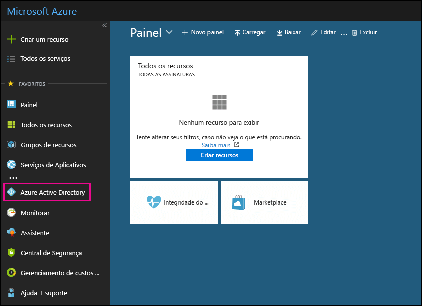

# Usar sua assinatura gratuita do Azure Active Directory no Office 365

Se sua organização tiver uma assinatura paga do Office 365, do Microsoft Dynamics CRM Online, do Enterprise Mobility Suite ou de outros serviços da Microsoft, você terá uma assinatura gratuita do Microsoft Azure Active Directory. Você e outros administradores podem usar o Azure AD para criar e gerenciar contas de usuário e grupo. Para usar o Azure AD, basta ir ao portal do Azure e entrar usando sua conta do Office 365.

## Antes de começar

Use uma sessão de navegação privada (não uma sessão normal) para acessar o portal do Azure (na etapa 1 abaixo) porque isso impedirá que a credencial com a qual você efetuou logon passe para o Azure. Para abrir uma sessão de navegação privada:

- No Microsoft Edge (versão herdada), no Internet Explorer ou no Mozilla FireFox, pressione `CTRL+SHIFT+P`.

- No Microsoft Edge (versão mais recente) ou no Google Chrome, pressione `CTRL+SHIFT+N`.

## Acessar o Azure Active Directory

1. Vá para [portal.azure.com](https://portal.azure.com) e entre com sua conta corporativa ou de estudante do Office 365.

2. No painel de navegação à esquerda no portal do Azure, clique em **Azure Active Directory**.

    

    O Centro de administração do **Azure Active Directory** aparece.

## Mais informações

- Uma assinatura gratuita do Azure Active Directory não inclui o relatório de atividade de entrada. Para registrar a atividade de entrada (que pode ser útil no caso de um vazamento de dados), você precisa de uma assinatura do Azure Active Directory Premium. Para saber mais, consulte [Por quanto tempo o Azure AD armazena os dados?](https://docs.microsoft.com/azure/active-directory/reports-monitoring/reference-reports-data-retention#how-long-does-azure-ad-store-the-data).

- Você também pode acessar o centro de administração do **Azure Active Directory** do centro de administração do Microsoft 365. No painel de navegação à esquerda do centro de administração do Microsoft 365, clique em **Centros de administração do** \> **Azure Active Directory**.

- Confira informações sobre como gerenciar usuários e grupos e realizar outras tarefas de gerenciamento do diretório em [Gerenciar seu diretório do Azure AD](https://docs.microsoft.com/azure/active-directory/active-directory-administer).
