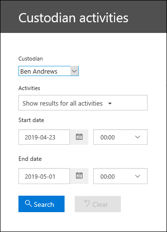

# Exibir atividade de auditoria de responsáveis

Precisa descobrir se um usuário visualizou um documento específico ou apagou um item de sua caixa de correio? A descoberta eletrônica avançada agora está integrada à ferramenta de pesquisa de log de auditoria existente no centro de conformidade do & de segurança. Usando essa experiência incorporada, você pode usar a ferramenta de gerenciamento de descoberta eletrônica avançada para facilitar sua investigação, acessando e pesquisando facilmente a atividade dos responsáveis em seu caso.

## Antes de começar

É preciso atribuir a função Logs de Auditoria Somente para Exibição ou Logs de Auditoria do Exchange Online para pesquisar o log de auditoria do Office 365. Por padrão, essas funções são atribuídas aos grupos de funções Gerenciamento de Conformidade e Gerenciamento de Organização na página Permissões do centro de administração do Exchange. Para permitir que um usuário pesquise o log de auditoria de descoberta eletrônica avançado com o nível mínimo de privilégios, você pode criar um grupo de função personalizado no Exchange Online, adicionar os logs de auditoria somente para exibição ou a função logs de auditoria e, em seguida, adicionar o usuário como membro do novo grupo de funções. Para saber mais, confira Gerenciar Grupos de Funções do Exchange Online.

> [!IMPORTANT]
> Se você atribuir a um usuário a função logs de auditoria somente para exibição ou logs de auditoria na página permissões no centro de conformidade de & de segurança, elas não poderão pesquisar o log de auditoria do Office 365. Você deve atribuir as permissões no Exchange Online. Isso ocorre porque o cmdlet subjacente usado para pesquisar o log de auditoria é um cmdlet Exchange Online.

## Etapa 1: Pesquisar o log de auditoria para atividades realizadas por um responsáveis

1. Vá para **descoberta eletrônica > descoberta eletrônica avançada** e abra o caso.
  
2. Clique na guia **responsáveis** .
  
3. Selecione um dos responsáveis na lista e clique em **Exibir atividade de responsáveis** na página do menu suspenso.

    A página de pesquisa de atividades do responsáveis é exibida. Observação os responsáveis que você selecionou na etapa anterior são exibidos na caixa suspensa **responsáveis** . Você pode selecionar diferentes responsáveis na caixa suspensa, mas só pode pesquisar atividades de um único membro por vez.

    
   
4. Configure os seguintes critérios de pesquisa: 
      
   a. **Atividades** -clique na lista suspensa para exibir as atividades que você pode pesquisar. Depois de executar a pesquisa, somente os registros de auditoria das atividades selecionadas são exibidos. Selecionar **Mostrar resultados de todas as atividades** exibirá os resultados de todas as atividades realizadas pelos responsáveis que correspondam aos outros critérios de pesquisa.

      
      
      b. **Data de início e data de término** -selecione um intervalo de data e hora para exibir os eventos que ocorreram dentro desse período. Os últimos sete dias são selecionados por padrão. A data e a hora são apresentadas no formato UTC (Tempo Universal Coordenado). O intervalo de datas máximo que você pode especificar é um ano.
      
      c. **Responsáveis** – clique nesta caixa e selecione um ou mais responsáveis para exibir os resultados da pesquisa. Os registros de auditoria da atividade selecionada executada pelos usuários selecionados nesta caixa são exibidos na lista de resultados.
      
   5. Click     para executar a pesquisa usando seus critérios de pesquisa. Os resultados da pesquisa são carregados e após alguns momentos em que são exibidos em resultados na página de pesquisa de atividades do responsáveis. 

## Etapa 2: exibir os resultados da pesquisa de log de auditoria

Os resultados de uma pesquisa de log de auditoria são exibidos em resultados na página log de auditoria do responsáveis. Um máximo de 5.000 (mais recentes) eventos são exibidos em incrementos de 150 eventos. Para exibir mais eventos, use a barra de rolagem no painel Resultados ou pressione Shift+End para exibir os próximos 150 eventos.

Os resultados contêm as seguintes informações sobre cada evento retornado pela pesquisa.
- **Data:**: A data e a hora (no formato UTC) de ocorrência do evento.

- **Endereço IP**: O endereço IP do dispositivo que foi usado quando a atividade foi registrada. O endereço IP é exibido em um formato de endereço IPv4 ou IPv6.

- **Usuário**: O usuário (ou a conta de serviço) que realizou a ação que disparou o evento.

- **Atividade**: A atividade realizada pelo usuário. Esse valor corresponde às atividades que você selecionou na lista suspensa Atividades. Para um evento do log de auditoria de administradores do Exchange, o valor nessa coluna é um cmdlet do Exchange.

- **Item**: O objeto que foi criado ou modificado como resultado da atividade correspondente. Por exemplo, o arquivo que foi exibido ou modificado ou a conta do usuário que foi atualizada. Nem todas as atividades têm um valor nesta coluna.

- **Detalhe**: detalhes adicionais sobre uma atividade. Novamente, nem todas as atividades terão um valor.

## Etapa 3: Filtrar os resultados da pesquisa

Além de classificar, você também pode filtrar os resultados de uma pesquisa de log de auditoria. Isso pode ajudá-lo a filtrar rapidamente os resultados de um usuário ou atividade específico. 

Para filtrar os resultados:

 1. Criar e executar uma pesquisa de log de auditoria.
  
2. Quando os resultados forem exibidos, clique em **Filtrar resultados**.
 
3. Caixas de palavras-chave são exibidas em cada cabeçalho de coluna.
  
4. Clique em uma das caixas sob um cabeçalho de coluna e digite uma palavra ou frase, dependendo da coluna na qual você está filtrando. Os resultados serão reajustados dinamicamente para exibir os eventos que correspondem ao seu filtro.
  
5. Para limpar um filtro, clique no **X** na caixa filtro ou clique em **ocultar filtragem**.

## Exportar os resultados da pesquisa para um arquivo

Você pode exportar os resultados de uma pesquisa de log de auditoria para um arquivo CSV (valor separado por vírgula) no computador local. Você pode abrir esse arquivo no Microsoft Excel e usar recursos como pesquisa, classificação, filtragem e divisão de uma única coluna (que contém células de vários valores) em várias colunas.

1. Execute uma pesquisa de logs de auditoria e, em seguida, reveja os critérios de pesquisa até ter os resultados desejados.
  
2. Clique em Exportar resultados e selecione uma das seguintes opções:

    - **Salvar resultados carregados:** Escolha essa opção para exportar somente as entradas que são exibidas em **resultados** na página **pesquisa de log de auditoria do responsáveis** . O arquivo CSV baixado contém as mesmas colunas (e dados) exibidos na página (Data, Usuário, Atividade, Item e Detalhes). Uma coluna adicional (intitulada **mais**) é incluída no arquivo CSV que contém mais informações da entrada do log de auditoria. Como você está exportando os mesmos resultados que estão carregados (e visíveis) na página Pesquisa de log de auditoria, no máximo 5.000 entradas são exportadas.
        
    - **Baixar todos os resultados:** Escolha essa opção para exportar todas as entradas do log de auditoria do Office 365 que atendam aos critérios de pesquisa. Para obter um grande conjunto de resultados de pesquisa, escolha essa opção para baixar todas as entradas do log de auditoria, além dos resultados 5.000 que podem ser exibidos na página pesquisa de **log de auditoria do responsáveis** . Essa opção baixará os dados brutos do log de auditoria para um arquivo CSV e conterá informações adicionais da entrada do log de auditoria em uma coluna chamada AuditData. O download do arquivo poderá ser mais demorado se você escolher essa opção de exportação, pois o arquivo pode ser muito maior do que o baixado com a outra opção.
    
      > [!IMPORTANT]
      > É possível baixar no máximo 50 mil entradas para um arquivo CSV de uma única pesquisa de logs de auditoria. Se 50 mil entradas forem baixadas para o arquivo CSV, você poderá supor que existem provavelmente mais de 50 mil eventos que corresponderam aos critérios de pesquisa. Para exportar mais do que esse limite, tente usar um intervalo de datas para reduzir o número de entradas do log de auditoria. Talvez seja necessário executar várias pesquisas com intervalos de datas menores para exportar mais de 50 mil entradas.
        

3. Após selecionar uma opção de exportação, uma mensagem é exibida na parte inferior da janela que solicita que você abra o arquivo CSV, salve-o na pasta downloads ou salve-o em uma pasta específica

Para obter mais informações sobre como exibir, filtrar ou exportar resultados de pesquisa de log de auditoria, confira [Pesquisar o log de auditoria no centro de conformidade de & de segurança](search-the-audit-log-in-security-and-compliance.md).
