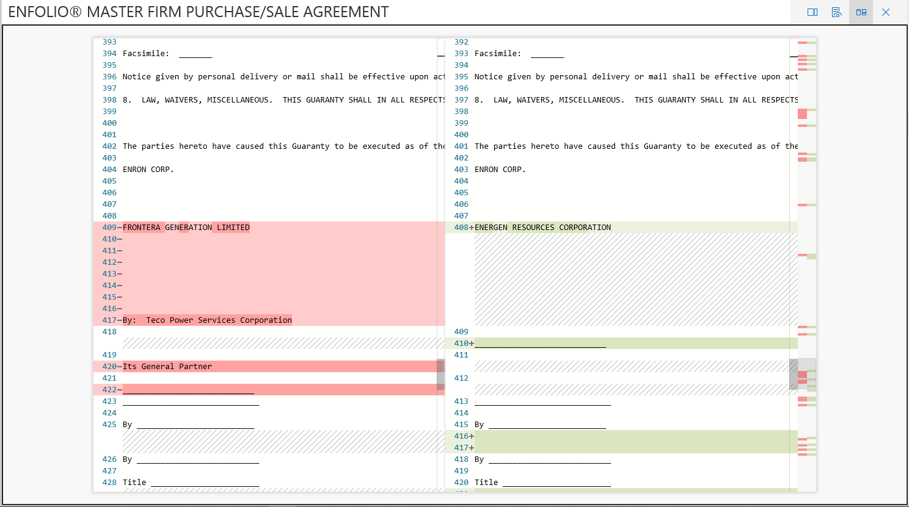

# Exibir documentos em um conjunto de revisão em Advanced eDiscoveryView documents in a review set in Advanced eDiscovery

A Descoberta E avançada exibe o conteúdo por meio de vários visualizadores cada um com finalidades diferentes.Advanced eDiscovery displays content via several viewers each with different purposes. Os vários visualizadores podem ser usados clicando em qualquer documento dentro de um conjunto de revisão.The various viewers can be used by clicking on any document within a review set. Os visualizadores atualmente fornecidos são:The viewers currently provided are:

- Metadados de arquivosFile metadata
- Exibição nativaNative view
- Exibição de textoText view
- Exibição de anotaçõesAnnotate view

## Metadados de arquivosFile metadata

Esse painel pode ser alternado para exibir vários metadados associados ao documento.This panel can be toggled on/off to display various metadata associated with the document. Embora a grade de resultados da pesquisa possa ser personalizada para exibir metadados específicos, há instâncias em que rolar horizontalmente pode ser difícil ao revisar dados.Although the search results grid can be customized to display specific metadata, there are instances where scrolling horizontally can be difficult while reviewing data. O painel De metadados de arquivo permite que um usuário alterne em um exibição dentro do visualizador.The File metadata panel allows a user to toggle on a view within the viewer.

## Exibição nativaNative view

O visualizador nativo exibe a exibição mais rica de um documento.The Native viewer displays the richest view of a document. Ele dá suporte a centenas de tipos de arquivos e tem como objetivo exibir a experiência mais verdadeira para a nativa possível.It supports hundreds of file types and is meant to display the truest to native experience possible. Para arquivos do Microsoft Office, o visualizador usa a versão Web dos aplicativos do Office para exibir conteúdo como comentários do documento, fórmulas do Excel, linhas/colunas ocultas e anotações do PowerPoint.For Microsoft Office files, the viewer uses the web version of Office apps to display content such as document comments, Excel formulas, hidden rows/columns, and PowerPoint notes.

## Exibição de textoText view

O visualizador de Texto fornece uma exibição do texto extraído de um arquivo.The Text viewer provides a view of the extracted text of a file. Ele ignora quaisquer imagens inseridas e formatação, mas é muito eficaz se você está tentando entender o conteúdo rapidamente.It ignores any embedded images and formatting but is very effective if you are trying to understand the content quickly. O visualização de texto também inclui estes recursos:Text view also includes these features:

- O conta-linhas facilita a referência de partes específicas de um documentoLine counter makes it easier to reference specific portions of a document
- Realçamento de acerto de pesquisa que realça os termos dentro do documento, bem como a barra de rolagemSearch hit highlighting that will highlight terms within the document as well as the scrollbar
- O exibição Diff fornece uma exibição de comparação que realça as diferenças textuais ao exibir documentos Quase DuplicadosDiff view provides a comparison view that highlights textual differences when viewing Near Duplicate documents

## Exibição de anotaçõesAnnotate view

O exibição Anotação fornece recursos que permitem que os usuários apliquem marcação em um documento, incluindo:The Annotate view provides features that allow users to apply markup on a document including:

- Redação de área – os usuários podem desenhar uma caixa no documento para ocultar conteúdos confidenciaisArea redactions – users can draw a box on the document in order to hide sensitive content
- Lápis – os usuários podem desenhar manualmente em um documento para chamar a atenção para determinadas partes de um documentoPencil – users can free-hand draw on a document in order to bring attention to certain portions of a document
- Selecionar anotações - os usuários podem selecionar anotações em um documento para excluirSelect annotations - users can select annotations on a document in order to delete
- Transparência de anotação de alternância – torna as anotações semi-transparentes para exibir o conteúdo por trás da anotaçãoToggle annotation transparency – makes annotations semi-transparent in order to view the content behind the annotation
- Página anterior – navega até a página anteriorPrevious page – navigates to previous page
- Próxima página – navega até a próxima páginaNext page – navigates to the next page
- Vá para a página – o usuário pode inserir um número de página específico para navegar atéGo to page – user can enter a specific page number to navigate to
- Zoom – definir o nível de zoom para exibição de anotaçõesZoom – set zoom level for annotate view
- Girar – o usuário pode girar o documento no sentido horárioRotate – user can rotate document clockwise
- Pesquisa – o usuário pode pesquisar em um documento e navegar até as várias visitas dentro do documentoSearch – user can search within a document and navigate to the various hits within the document

  

## Exibição do PainelDashboard View

A exibição do painel permite visualizar e resumir os dados na grade de resultados da pesquisa.The dashboard view allows you to visualize and summarize the data in your search results grid. Nesse ponto de vista, você pode criar widgets personalizados para tornar a análise e o relatório do conjunto de revisão intuitivo e fácil.In this view, you can create custom widgets to make analyzing and reporting on your review set intuitive and easy. Depois de criar seus widgets, você poderá interagir com eles para obter contagens de itens ou para criar uma pesquisa.Once you have created your widgets, you can interact with them to get item counts or to create a search.
