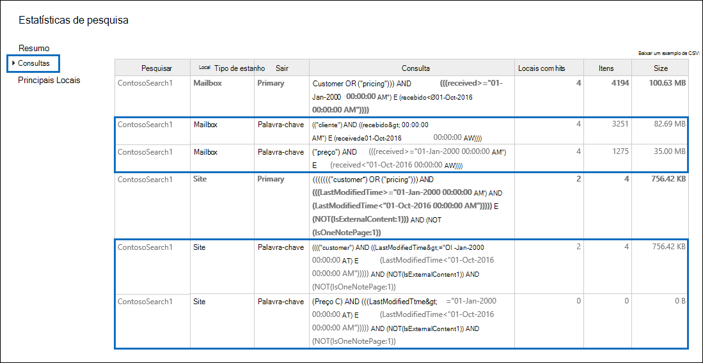

# Exibir as estatísticas de palavras-chave para resultados da Pesquisa de Conteúdo

Depois de criar e executar uma Pesquisa de Conteúdo, você pode exibir estatísticas sobre os resultados estimados da pesquisa. Isso inclui um resumo dos resultados da pesquisa (semelhante ao resumo dos resultados estimados da pesquisa exibidos no painel de detalhes), as estatísticas de consulta, como o número de locais de conteúdo com itens que coincidem com a consulta de pesquisa e o nome dos locais de conteúdo que têm mais itens correspondentes. Você poderá exibir as estatísticas de uma ou mais pesquisas de conteúdo. Isso permite comparar rapidamente os resultados de várias pesquisas e tomar decisões sobre a eficácia de suas consultas de pesquisa.
  
Além disso, você pode configurar pesquisas novas e existentes para retornar estatísticas para cada palavra-chave em uma consulta de pesquisa. Isso permite comparar o número de resultados de cada palavra-chave em uma consulta e comparar as estatísticas de palavra-chave de várias pesquisas.
  
Você também poderá baixar as estatísticas da pesquisa e as estatísticas da palavra-chave para um arquivo CSV. Isso permite usar os recursos de filtragem e classificação no Excel para comparar resultados e preparar relatórios para os resultados da pesquisa.
  
## Obter estatísticas de Pesquisas de Conteúdo

Para exibir estatísticas para pesquisas de conteúdo:
  
1. No centro de conformidade do Microsoft 365, vá para **Mostrar toda a pesquisa** de  >  **conteúdo.**

2. Na lista de pesquisas, selecione duas ou mais  pesquisas e clique em Estatísticas de pesquisa na página do flyout **ações** em massa.
    
    
  
3. Na página **Estatísticas de pesquisa,** clique em um dos links a seguir para exibir estatísticas sobre as pesquisas selecionadas. 
    
    **Resumo**
    
    Esta página exibe estatísticas semelhantes às exibidas no painel de detalhes na **página Pesquisa de** conteúdo. Estatísticas para todas as pesquisas selecionadas são exibidas. Observe que você também pode executar as pesquisas selecionadas desta página para atualizar as estatísticas. 
    
    
  
    a.  O nome da Pesquisa de Conteúdo. Conforme mencionado anteriormente, você pode exibir e comparar estatísticas para várias pesquisas.
    
    b. O tipo de local de conteúdo pesquisado. Cada linha exibe estatísticas para caixas de correio, sites e pastas públicas da pesquisa especificada.
    
    c. O número de locais de conteúdo que contêm itens que corresponderem à consulta de pesquisa. Para caixas de correio, essa estatística também inclui o número de caixas de correio de arquivo morto que contêm itens que corresponderem à consulta de pesquisa.
    
    d. O número total de itens de todos os locais de conteúdo especificados que corresponderem à consulta de pesquisa. Exemplos de tipos de item incluem mensagens de email, itens de calendário e documentos. Se um item contiver várias instâncias de uma palavra-chave que está sendo pesquisada, ele será contado apenas uma vez no número total de itens. Por exemplo, se você estiver procurando palavras "ações" ou "fraude" e uma mensagem de email contiver três instâncias da palavra "ações", ela só será contada uma vez na coluna **Itens.** 
    
    e. O tamanho total de todos os itens encontrados no local de conteúdo especificado que corresponderem à consulta de pesquisa. 
    
    **Queries**
    
    Esta página exibe estatísticas sobre a consulta de pesquisa.
    
    
  
    a. O nome da Pesquisa de Conteúdo para a que a linha contém estatísticas de consulta.
    
    b. O tipo de local de conteúdo ao qual as estatísticas de consulta são aplicáveis.
    
    c. Esta coluna indica a qual parte da consulta de pesquisa as estatísticas são aplicáveis. **O** primário indica toda a consulta de pesquisa. Se você usar uma lista de palavras-chave ao criar ou editar uma consulta de pesquisa, as estatísticas de cada componente da consulta serão incluídas nesta tabela. Consulte a [seção Obter estatísticas de palavra-chave para](#get-keyword-statistics-for-content-searches) Pesquisas de Conteúdo neste artigo para obter mais informações. 
    
    d. Essa coluna contém a consulta de pesquisa real que é executado pela ferramenta Pesquisa de Conteúdo. Observe que a ferramenta adiciona automaticamente alguns componentes adicionais à consulta que você cria. 

    - Quando você procura todo o conteúdo em caixas de correio (sem especificar palavras-chave), a consulta real de palavras-chave é para que todos os  `size>=0` itens sejam retornados. 
    
     - Quando você pesquisa sites do SharePoint Online e do OneDrive for Business, os dois componentes a seguir são adicionados:
    
          **NOT IsExternalContent:1** - Exclui qualquer conteúdo de uma organização local do SharePoint. 
    
          **NOT IsOneNotePage:1** - Exclui todos os arquivos do OneNote porque eles seriam duplicatas de qualquer documento que corresponde à consulta de pesquisa. 

    
    e. O número de locais de conteúdo (especificado pela coluna ** Tipo de local ** ) que contêm itens que corresponderem à consulta de pesquisa listada na **coluna** Consulta. 
    
    f. O número de itens (do local de conteúdo especificado) que corresponderem à consulta de pesquisa listada na **coluna** Consulta. Conforme explicado anteriormente, se um item contiver várias instâncias de uma palavra-chave que está sendo pesquisada, ele será contado apenas uma vez nesta coluna. 
    
    g. O tamanho total de todos os itens encontrados (no local de conteúdo especificado) que corresponderem à consulta de pesquisa na **coluna** Consulta. 
    
    **Principais locais**
    
    Esta página exibe estatísticas sobre o número de itens que corresponderem à consulta de pesquisa em cada local de conteúdo pesquisado. Os primeiros 1.000 locais são exibidos. Se você exibir estatísticas para várias pesquisas, os primeiros 1.000 locais de cada pesquisa serão exibidos. Observe que um local de conteúdo não será incluído nessa página se ele não tiver itens que corresponderem à consulta de pesquisa.
    
    
  
    a. O nome do local do conteúdo.
    
    b. O tipo de local de conteúdo ao qual as estatísticas de localização são aplicáveis.
    
    c. Há colunas para cada pesquisa que você está exibindo estatísticas. Esta coluna mostra o número (e o tamanho total) de itens que corresponderem à consulta de pesquisa em cada local de conteúdo. Observe que, quando você exibe estatísticas para várias pesquisas, o "NA" nessa coluna indica que o local do conteúdo não foi incluído nessa pesquisa. 

## Obter estatísticas de palavra-chave para Pesquisas de Conteúdo

Conforme explicado anteriormente, **a página Consultas** mostra a consulta de pesquisa e o número (e tamanho) de itens que corresponderem à consulta. Se você usar uma lista de palavras-chave ao criar ou editar uma consulta de pesquisa, poderá obter estatísticas avançadas que mostram quantos itens corresponderão a cada palavra-chave ou frase de palavra-chave. Isso pode ajudá-lo a identificar rapidamente quais partes da consulta são mais (e menos) eficazes. Por exemplo, se uma palavra-chave retornar um grande número de itens, você pode optar por refinar a consulta de palavra-chave para restringir os resultados da pesquisa. Você pode configurar uma lista de palavras-chave ao criar ou editar uma Pesquisa de Conteúdo. 

Para criar uma lista de palavras-chave e exibir estatísticas de palavra-chave para uma Pesquisa de Conteúdo:
  
1. No centro de conformidade do Microsoft 365, vá para **Mostrar toda a pesquisa** de  >  **conteúdo.**
    
2. Na lista de pesquisas de conteúdo, clique em uma pesquisa e clique em **Editar**  ícone.
    
3. Clique **em Consulta** e faça o seguinte: 
    
    
  
    a. Clique na caixa **de seleção Mostrar lista de palavras-chave.** 
    
    b. Digite uma fase de palavra-chave ou palavra-chave em uma linha na tabela de palavras-chave. Por exemplo, digite **orçamento** na primeira linha e digite **segurança** na segunda linha. 
    
4. Depois de adicionar as palavras-chave que você deseja pesquisar e obter estatísticas, clique em **Pesquisar** para executar a pesquisa revisada. 
    
5. Quando a pesquisa for concluída, selecione-a na lista  de pesquisas e clique no botão Estatísticas de Pesquisa  Pesquisa. Você também pode exibir e comparar estatísticas de palavra-chave para várias pesquisas.
    
6. Na página **Estatísticas de pesquisa,** clique **em Consulta** para exibir as estatísticas de palavra-chave para as pesquisas selecionadas. 
    
    
  
    Conforme mostrado na captura de tela anterior, as estatísticas de cada palavra-chave são exibidas; isso inclui: 
    
    - As estatísticas de palavra-chave para cada tipo de local de conteúdo incluído na pesquisa.
    
    - A consulta de pesquisa real para cada palavra-chave, que inclui quaisquer condições da consulta de pesquisa. 
    
    - A consulta de pesquisa completa (identificada **como Primária** na coluna **Parte)** e as estatísticas para a consulta completa. Observe que estas são as mesmas estatísticas exibidas na página **Resumo.** 

> [!NOTE]
> Para ajudar a reduzir problemas causados por listas de palavras-chave grandes, agora você está limitado a um máximo de 20 linhas na lista de palavras-chave de uma consulta de pesquisa.
