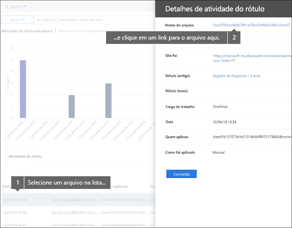
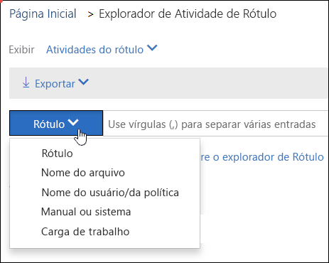

# Exibir a atividade de rótulos de documentos

After you create your labels, you'll want to verify that they're being applied to content as you intended. With the Label Activity Explorer in the Security &amp; Compliance Center, you can quickly search and view label activity for all content across SharePoint and OneDrive for Business over the past 30 days. This is real-time data that gives you a clear view into what's happening in your tenant.
  
Por exemplo, com o Explorador de Atividade do Rótulo, você pode:
  
- Exibir o número de vezes que cada rótulo foi aplicado em cada dia (até 30 dias).
    
- Ver quem rotulou exatamente o arquivo em qual data, juntamente com um link para o site onde reside esse arquivo.
    
- Exiba quais arquivos tiveram os rótulos alterados ou removidos, quais são os rótulos antigos e os novos e quem fez a alteração.
    
- Filter the data to see all the label activity for a specific label, file, or user. You can also filter label activity by location (SharePoint or OneDrive for Business) and whether the label was applied manually or auto-applied.
    
- View label activity for folders as well as individual documents. Coming soon is the ability to show how many files inside that folder got labeled as a result of the folder getting labeled.
    
Você pode encontrar o Explorador de Atividade de Rótulo no Centro de Conformidade &amp;e Segurança > **Governança de informações** > **Explorador de atividade de rótulo**.
  
Observe que no Gerenciador de Atividade de Rótulo exige uma assinatura do Office 365 Enterprise E5.
  

  
## Exibir atividades de rótulo para arquivos ou pastas

At the top of the Label Activity Explorer, you can choose whether to view activities for files or folders. Note that folder activity includes only the folder itself, not the files inside the folder.
  
You might want to see label activity for folders because if you label a folder, all files inside that folder also get that label (except for files that have had a label applied explicitly to them). Therefore, labeling folders might affect a significant number of files. For more information, see [Applying a default retention label to all content in a SharePoint library, folder, or document set](labels.md#applying-a-default-retention-label-to-all-content-in-a-sharepoint-library-folder-or-document-set).
  

  
### Atividades do rótulo

 **Label activities** includes all label actions: **adding**, **removing**, or **changing** a label. You can use this view to get a comprehensive look at how many files each label's been applied to per day. 
  
### Alterações do rótulo

 **Label changes** includes the potentially risky actions of **removing** or **changing** a label. You can use this view to quickly see such risky actions and the user who performed them. In the activity list below the chart, you can select a file, and then click a link to that file in the details pane on the right. 
  

  
## Filtrar atividade do rótulo

You can quickly filter the data to see all the label activity for a specific label, file, or user. You can also filter label activity by location (SharePoint or OneDrive for Business) and whether the label was applied manually or auto-applied.
  

  

