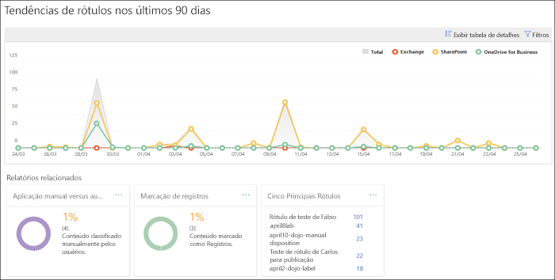

# Exibir os relatórios de governança de dados

After you create your labels, you'll want to verify that they're being applied to content as you intended. With the data governance reports in the Security &amp; Compliance Center, you can quickly view:
  
- **Top 5 labels** This report shows the count of the top 5 labels that have been applied to content. Click this report to view a list of all labels that have been recently applied to content. You can see each label's count, location, how it was applied, its retention actions, whether it's a record, and its disposition type. 
    
- **Aplicação manual versus automática** Este relatório mostra a contagem de todo o conteúdo rotulado manualmente ou automaticamente e a porcentagem de conteúdo que foi rotulada manualmente versus a que foi rotulada automaticamente. 
    
- **Marcação de registros** Este relatório mostra a contagem de todo o conteúdo marcado como registro ou não registro e a porcentagem de conteúdo marcado como registro versus o que foi marcado como não registro. 
    
- **Tendências de rótulo nos últimos 90 dias** Este relatório mostra a contagem e a localização de todos os rótulos aplicados nos últimos 90 dias. 
    
Todos esses relatórios mostram conteúdo rotulado do Exchange, SharePoint e OneDrive for Business.
  
Você pode encontrar esses relatórios no Centro de Conformidade &amp; Segurança \> **Governança de Informações** \> **Painel**.
  

  
You can filter the data governance reports by date (up to 90 days) and location (Exchange, SharePoint, and OneDrive for Business). The most recent data can take up to 24 hours to appear in the reports.
  

  

