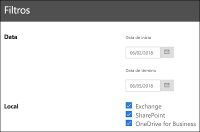

# Exibir os relatórios de governança de dadosView the data governance reports

Depois de criar rótulos, convém verificar se eles estão sendo aplicados ao conteúdo como pretendido. Com os relatórios de governança de dados no Centro de Conformidade &amp; Segurança, você pode exibir rapidamente:After you create your labels, you'll want to verify that they're being applied to content as you intended. With the data governance reports in the Security &amp; Compliance Center, you can quickly view:
  
- **Cinco principais rótulos** Este relatório mostra a contagem dos cinco principais rótulos aplicados ao conteúdo. Clique neste relatório para exibir uma lista de todos os rótulos aplicados recentemente ao conteúdo. Você pode ver a contagem, o local, como foi aplicado, as ações de retenção, se é um registro e o tipo de disposição do rótulo.**Top 5 labels** This report shows the count of the top 5 labels that have been applied to content. Click this report to view a list of all labels that have been recently applied to content. You can see each label's count, location, how it was applied, its retention actions, whether it's a record, and its disposition type. 
    
- **Aplicação manual versus automática** Este relatório mostra a contagem de todo o conteúdo rotulado manualmente ou automaticamente e a porcentagem de conteúdo que foi rotulada manualmente versus a que foi rotulada automaticamente.**Manual vs Auto apply** This report shows the count of all content that's been labeled manually or automatically, and the percentage of content that's been labeled manually vs automatically. 
    
- **Marcação de registros** Este relatório mostra a contagem de todo o conteúdo marcado como registro ou não registro e a porcentagem de conteúdo marcado como registro versus o que foi marcado como não registro.**Records tagging** This report shows the count of all content that's been tagged as a record or non-record, and the percentage of content that's been tagged as a record vs. non-record. 
    
- **Tendências de rótulo nos últimos 90 dias** Este relatório mostra a contagem e a localização de todos os rótulos aplicados nos últimos 90 dias.**Labels trend over the past 90 days** This report shows the count and location of all labels that have been applied in the last 90 days. 
    
Todos esses relatórios mostram conteúdo rotulado do Exchange, SharePoint e OneDrive for Business.All these reports show labeled content from Exchange, SharePoint, and OneDrive for Business.
  
Você pode encontrar esses relatórios na Segurança do &amp; Centro de Conformidade \> **Controle de informações** \> [**Painel de controle**](https://protection.office.com/datamanagement/dashboard).You can find these reports in the Security &amp; Compliance Center \> **Information governance** \> [**Dashboard**](https://protection.office.com/datamanagement/dashboard).
  

  
Você pode filtrar os relatórios de governança de dados por data (até 90 dias) e o local (Exchange, SharePoint e OneDrive for Business). Os dados mais recentes podem levar até 24 horas para aparecer nos relatórios.You can filter the data governance reports by date (up to 90 days) and location (Exchange, SharePoint, and OneDrive for Business). The most recent data can take up to 24 hours to appear in the reports.
  

  

