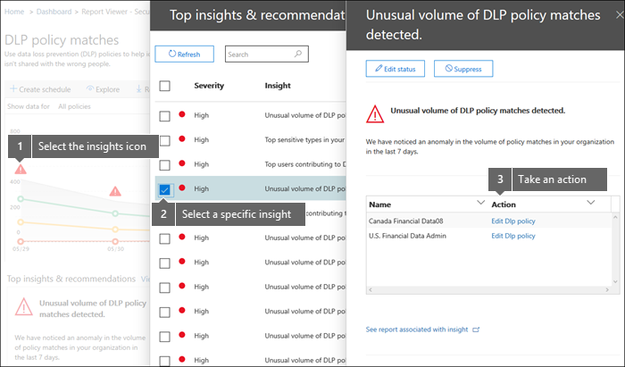

# Exibir os relatórios de prevenção contra perda de dadosView the reports for data loss prevention

Após criar as políticas de prevenção de perda de dados (DLP), convém verificar se estão funcionando conforme o esperado e ajudando você a se manter em conformidade.After you create your data loss prevention (DLP) policies, you'll want to verify that they're working as you intended and helping you to stay compliant. Com os relatórios de DLP no centro de conformidade de segurança &amp; , você pode exibir rapidamente:With the DLP reports in the Security &amp; Compliance Center, you can quickly view:
  
- **Correspondências de política DLP** Este relatório mostra a contagem de correspondências de política de DLP ao longo do tempo.**DLP policy matches** This report shows the count of DLP policy matches over time. Você pode filtrar o relatório por data, local, política ou ação.You can filter the report by date, location, policy, or action. Você pode usar este relatório para:You can use this report to: 
    
  - Ajuste ou Refine suas políticas de DLP enquanto as executa no modo de teste.Tune or refine your DLP policies as you run them in test mode. Você pode exibir a regra específica que correspondeu ao conteúdo.You can view the specific rule that matched the content.
    
  - Se concentrar em períodos de tempo específicos e entender os motivos para picos e tendências.Focus on specific time periods and understand the reasons for spikes and trends.
    
  - Descobrir processos empresariais que violam as políticas DLP da organização.Discover business processes that violate your organization's DLP policies.
    
  - Entenda qualquer impacto nos negócios das políticas de DLP observando quais ações estão sendo aplicadas ao conteúdo.Understand any business impact of the DLP policies by seeing what actions are being applied to content.
    
  - Verificar a conformidade com uma determinada política DLP mostrando as correspondências dessa política.Verify compliance with a specific DLP policy by showing any matches for that policy.
    
  - Exibir uma lista dos principais usuários e repetir usuários que estão contribuindo com incidentes em sua organização.View a list of top users and repeat users who are contributing to incidents in your organization.
    
  - Exibir uma lista dos principais tipos de informações confidenciais em sua organização.View a list of the top types of sensitive information in your organization.
    
- **Incidentes de DLP** Este relatório também mostra correspondências de política com o tempo, como o relatório de correspondências de política.**DLP incidents** This report also shows policy matches over time, like the policy matches report. No entanto, o relatório de correspondências de política mostra correspondências em um nível de regra; por exemplo, se um email coincidir com três regras diferentes, o relatório de correspondência de política mostrará três itens de linha diferentes.However, the policy matches report shows matches at a rule level; for example, if an email matched three different rules, the policy matches report shows three different line items. Por outro lado, o relatório de incidentes mostra correspondências em um nível de item; por exemplo, se um email coincidir com três regras diferentes, o relatório de incidentes mostrará um único item de linha para essa parte do conteúdo.By contrast, the incidents report shows matches at an item level; for example, if an email matched three different rules, the incidents report shows a single line item for that piece of content. 
    
  Como as contagens de relatórios são agregadas de forma diferente, o relatório de correspondências de política é melhor para identificar correspondências com regras específicas e ajustar as políticas de DLP.Because the report counts are aggregated differently, the policy matches report is better for identifying matches with specific rules and fine tuning DLP policies. O relatório de incidentes é melhor para identificar partes específicas do conteúdo que são problemáticas para suas políticas de DLP.The incidents report is better for identifying specific pieces of content that are problematic for your DLP policies.
    
- **Falsos positivos e substituições de DLP** Se sua política de DLP permitir que os usuários substituam ou relatem um falso positivo, esse relatório mostrará uma contagem de tais instâncias ao longo do tempo.**DLP false positives and overrides** If your DLP policy allows users to override it or report a false positive, this report shows a count of such instances over time. Você pode filtrar o relatório por data, local ou política.You can filter the report by date, location, or policy. Você pode usar este relatório para:You can use this report to: 
    
  - Ajuste ou Refine suas políticas de DLP, conferindo quais políticas provocam um grande número de falsos positivos.Tune or refine your DLP policies by seeing which policies incur a high number of false positives.
    
  - Exibir as justificativas enviadas pelos usuários quando eles resolverem uma dica de política substituindo a política.View the justifications submitted by users when they resolve a policy tip by overriding the policy.
    
  - Descubra onde as políticas de DLP entram em conflito com processos de negócios válidos incorrendo um grande número de substituições de usuário.Discover where DLP policies conflict with valid business processes by incurring a high number of user overrides.
    
Todos os relatórios DLP podem mostrar dados do período de tempo de quatro meses mais recente.All DLP reports can show data from the most recent four-month time period. Os dados mais recentes podem levar até 24 horas para serem exibidos nos relatórios.The most recent data can take up to 24 hours to appear in the reports.
  
Você pode encontrar esses relatórios no &amp; \> **painel relatórios** do centro de conformidade de segurança \> **Dashboard**.You can find these reports in the Security &amp; Compliance Center \> **Reports** \> **Dashboard**.
  

  
## Exibir a justificativa enviada por um usuário para uma substituiçãoView the justification submitted by a user for an override

Se sua política de DLP permitir que os usuários o substituam, você poderá usar o falso positivo e substituir relatório para exibir o texto enviado por usuários na dica de política.If your DLP policy allows users to override it, you can use the false positive and override report to view the text submitted by users in the policy tip.
  

  
## Executar ações em ideias e recomendaçõesTake action on insights and recommendations

Os relatórios podem mostrar ideias e recomendações onde você pode clicar no ícone de aviso vermelho para ver detalhes sobre possíveis problemas e realizar ações corretivas possíveis.Reports can show insights and recommendations where you can click the red warning icon to see details about potential issues and take possible remedial action.
  

  
## Permissões para relatórios de DLPPermissions for DLP reports

Para exibir relatórios de DLP no centro de conformidade & segurança, você precisa ter a atribuição de:To view DLP reports in the Security & Compliance Center, you have to be assigned the:

- Função de **leitor de segurança** no centro de administração do Exchange.**Security Reader** role in the Exchange admin center. Por padrão, essa função é atribuída aos grupos de função de gerenciamento de organização e leitor de segurança no centro de administração do Exchange.By default, this role is assigned to the Organization Management and Security Reader role groups in the Exchange admin center.

- **Somente exibição** a função de gerenciamento de conformidade DLP no centro de conformidade de & de segurança.**View-Only DLP Compliance Management** role in the Security & Compliance Center. Por padrão, essa função é atribuída aos grupos de função Administrador de conformidade, gerenciamento de organização, administrador de segurança e leitor de segurança no centro de conformidade de & de segurança.By default, this role is assigned to the Compliance Administrator, Organization Management, Security Administrator, and Security Reader role groups in the Security & Compliance Center.

- Função de **destinatários somente para exibição** no centro de administração do Exchange.**View-Only Recipients** role in the Exchange admin center. Por padrão, essa função é atribuída ao gerenciamento de conformidade, ao gerenciamento da organização e aos grupos de função de gerenciamento da organização somente para exibição no centro de administração do Exchange.By default, this role is assigned to the Compliance Management, Organization Management, and View-Only Organization Management role groups in the Exchange admin center.

## Localizar os cmdlets dos relatórios de DLPFind the cmdlets for the DLP reports

Para usar a maioria dos cmdlets do Centro de Conformidade &amp; Segurança, você precisa:To use most of the cmdlets for the Security &amp; Compliance Center, you need to:
  
1. [Conectar-se ao &amp; centro de conformidade de segurança usando o PowerShell remotoConnect to the Security &amp; Compliance Center using remote PowerShell](https://go.microsoft.com/fwlink/?LinkID=799771&amp;clcid=0x409)
    
2. Use qualquer um desses [ &amp; cmdlets do centro de conformidade de segurança](https://go.microsoft.com/fwlink/?LinkID=799772&amp;clcid=0x409)Use any of these [Security &amp; Compliance Center cmdlets](https://go.microsoft.com/fwlink/?LinkID=799772&amp;clcid=0x409)
    
No entanto, os relatórios DLP precisam extrair dados do Office 365, incluindo o Exchange Online.However, DLP reports need pull data from across Office 365, including Exchange Online. Por esse motivo, os cmdlets dos relatórios DLP estão disponíveis no PowerShell do Exchange Online, e não no &amp; PowerShell do centro de conformidade de segurança.For this reason, the cmdlets for the DLP reports are available in Exchange Online Powershell—not in Security &amp; Compliance Center Powershell. Portanto, para usar os cmdlets para os relatórios DLP, você precisa:Therefore, to use the cmdlets for the DLP reports, you need to:
  
1. [Conectar-se ao Exchange Online usando o PowerShell RemotoConnect to Exchange Online using remote PowerShell](https://go.microsoft.com/fwlink/?LinkID=799773&amp;clcid=0x409)
    
2. Usar qualquer um destes cmdlets para os relatórios DLP:Use any of these cmdlets for the DLP reports:
    
      - [Get-DlpDetectionsReportGet-DlpDetectionsReport](https://go.microsoft.com/fwlink/?LinkID=799774&amp;clcid=0x409)
    
      - [Get-DlpDetailReportGet-DlpDetailReport](https://go.microsoft.com/fwlink/?LinkID=799775&amp;clcid=0x409)
    

