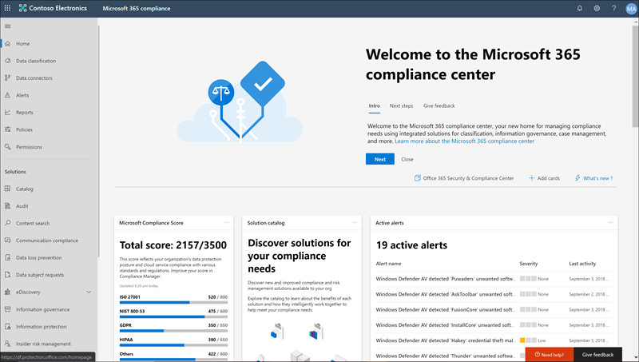

# Novidades na Conformidade do Microsoft 365

Se está adicionando novas soluções ao centro de [conformidade da Microsoft 365](microsoft-365-compliance-center.md), atualizando recursos existentes com base em seus comentários ou distribuindo a documentação atualizada e atualizada, a Microsoft 365 ajuda você a se manter atualizado sobre o panorama de conformidade em constante mudança. Veja o que há de novo no Microsoft 365 Compliance hoje. 

> [!NOTE]
> Alguns recursos de conformidade são implementados em diferentes velocidades para nossos clientes. Se ainda não estiver vendo um recurso, tente adicioná-lo ao [lançamento direcionado](https://docs.microsoft.com/office365/admin/manage/release-options-in-office-365).

> [!TIP]
> Interessado no que está acontecendo em outros centros de administração? Confira estes artigos: [O que há de novo no centro de administração do Microsoft 365](https://docs.microsoft.com/office365/admin/whats-new-in-preview?view=o365-worldwide) [O que há de novo no centro de administração do SharePoint](https://docs.microsoft.com/sharepoint/what-s-new-in-admin-center) [Novidades no Microsoft 365 Defender](https://docs.microsoft.com/microsoft-365/security/mtp/whats-new)  
E visite o [mapa do microsoft 365](https://www.microsoft.com/en-us/microsoft-365/roadmap) para saber mais sobre os recursos do Microsoft 365 que foram lançados, estão em desenvolvimento, foram cancelados ou lançados anteriormente.

## Agosto de 2020

### Spotlight: atualizações de conformidade de risco e comunicação do insider

Vários recursos novos e aprimorados atingiram a visualização pública neste mês:

**Gerenciamento de risco interno**

- Confira nossos seis novos [modelos de política](insider-risk-management-policies.md#policy-templates):
    - Vazamentos de dados por usuários de prioridade
    - Vazamentos de dados por usuários descontentes
    - Violações de política de segurança geral
    - Violações de política de segurança por parte dos usuários
    - Violações de política de segurança por usuários de prioridade
    - Violações de política de segurança por usuários descontentes

- A integração com [o Microsoft defender for Endpoint](https://docs.microsoft.com/windows/security/threat-protection/microsoft-defender-atp/microsoft-defender-advanced-threat-protection) permite importar e filtrar os alertas de ponto de extremidade do Microsoft defender para atividades detectadas por políticas criadas a partir dos novos modelos de política de violação de segurança. Há também uma configuração de [risco do insider](insider-risk-management-settings.md#microsoft-defender-for-endpoint-preview) relacionada, onde você pode escolher importar alertas de segurança para o gerenciamento de risco do insider com base no status de triagem de alerta do Microsoft defender para ponto de extremidade.

    > [!NOTE]
    > Para aproveitar a integração do Microsoft defender for Endpoint (incluindo os novos modelos de violação de política de segurança), você precisará ter o Microsoft defender para ponto de extremidade configurado em sua organização. Você também precisará habilitar o Microsoft defender para o ponto de extremidade da integração de gerenciamento de risco do insider [configurando recursos avançados no Microsoft defender para ponto de extremidade](https://docs.microsoft.com/windows/security/threat-protection/microsoft-defender-atp/advanced-features#share-endpoint-alerts-with-microsoft-compliance-center).
 
- Personalizar limites do indicador ao [criar uma política](insider-risk-management-policies.md#create-a-new-policy).
- Configurar [grupos de usuários de prioridade](insider-risk-management-settings.md#priority-user-groups-preview) para definir usuários em sua organização cuja atividade requer uma inspeção mais detalhada com base em fatores como sua posição, nível de acesso a informações confidenciais ou histórico de riscos.
- Usar as APIs de atividade de gerenciamento do Office 365 para [Exportar detalhes de alerta de risco do insider](insider-risk-management-settings.md#export-alerts-preview) para outros aplicativos que sua organização pode usar para gerenciar ou agregar dados de risco Insider
- [As novas configurações de domínio](insider-risk-management-settings.md#domains-preview) ajudam a definir e controlar os níveis de risco para atividades em domínios específicos.

**Conformidade em comunicações**

- Ao [examinar mensagens em um alerta](communication-compliance-investigate-remediate.md#step-3-decide-on-a-remediation-action), agora você pode remover mensagens inadequadas nos canais do Microsoft Teams, 1:1 e chats de grupo. As mensagens e o conteúdo removidos são substituídos por uma dica de política que explica que foi removido devido a conteúdo confidencial.
- Novas [funções de comunicação](communication-compliance-configure.md#step-1-required-enable-permissions-for-communication-compliance) (elas também serão incluídas nos novos grupos de função de conformidade de comunicação em setembro).
- Nova experiência de configuração de conformidade de comunicação que inclui configurações para [privacidade](communication-compliance-feature-reference.md#privacy-preview) e [modelos de aviso](communication-compliance-feature-reference.md#notice-templates).
- Novos [classificadores](communication-compliance-feature-reference.md#classifiers) para ajudar a detectar imagens adultas, Racy e Gory.
- Nova notificação ' padrão detectado ' que aparece ao [revisar as mensagens em um alerta](communication-compliance-investigate-remediate.md#step-2-examine-the-message-details) permite que você saiba mais sobre as instâncias de ocorrência do mesmo comportamento por um usuário.

### Rótulos de confidencialidade

- Para locatários do governo dos Estados Unidos (GCC, GCC-H e DoD) rótulos de confidencialidade possuem suporte somente quando o cliente de rotulagem unificada e digitalização da Proteção de Informações do Microsoft Azure está instalado. Para obter mais informações, confira [Descrição do Serviço Governamental Premium de Proteção de Informações do Microsoft Azure](https://docs.microsoft.com/enterprise-mobility-security/solutions/ems-aip-premium-govt-service-description).
- Agora, você pode [usar o PowerShell de segurança & o centro de conformidade](create-sensitivity-labels.md#use-powershell-for-sensitivity-labels-and-their-policies) para criar e definir todas as configurações que você vê no seu centro de administração de etiquetas. Isso significa que, além de usar o PowerShell para configurações que não estão disponíveis nos centros de administração de rótulo, agora você pode criar um script completo de criação e manutenção de rótulos de sensibilidade e políticas de rótulo de confidencialidade.

### Gerenciamento de registros: revisão de conteúdo

Novos documentos que abrangem etapas de implantação, marcando o conteúdo como registros e registrando o controle de versão:

- [Introdução ao gerenciamento de registros](get-started-with-records-management.md)
- [Declarar registros usando rótulos de retenção](declare-records.md)
- [Usar a versão de registro para atualizar registros armazenados no SharePoint ou no OneDrive](record-versioning.md)

### Políticas de & de rótulos de retenção

A atividade de administração relacionada à retenção agora está gravada e disponível para revisão no log de auditoria. Para a lista completa, confira [Política de retenção e atividades do rótulo de retenção](search-the-audit-log-in-security-and-compliance.md#retention-policy-and-retention-label-activities).

### Descoberta Eletrônica Avançada

- Ao [Adicionar uma coleção a um conjunto de revisão](add-data-to-review-set.md#define-options-to-scope-your-collection-for-review), agora você pode incluir anexos modernos (também chamados de "anexos na nuvem") e versões de documentos do SharePoint.
- Nova [experiência de exportação de download direto](export-documents-from-review-set.md), eliminando a necessidade de usar o Azure Storage Explorer para baixar o conteúdo do caso.

## Julho de 2020

### Destaque em documentos da ajuda

Para ajudá-lo a entender quais soluções de conformidade são usadas para proteger e controlar os dados confidenciais da sua organização, criamos duas novas páginas de aterrissagem com visões gerais de como as soluções funcionam juntas para atingir essas metas, incluindo links para documentos relacionados, para que você possa se aprofundar.

[Proteção de informações da Microsoft no Microsoft 365](information-protection.md) 
[Governança de informações da Microsoft no Microsoft 365](manage-Information-governance.md)

### Descoberta eletrônica avançada: adicionar fontes de dados não custodial a seus casos

Adicionar dados a uma ocorrência sem ter que associá-los a um funcionário (conhecido como [fontes de dados não-custodial](non-custodial-data-sources.md)). E, se você precisar colocar esses dados não custodial em espera, poderá fazer isso usando nosso novo recurso de indexação avançada.

### Conectores de dados: aprimoramentos do conector de RH

(Na visualização) Uma nova versão do [conector de RH](import-hr-data.md) permite que você importe dados relacionados a alterações no nível do trabalho, revisões de desempenho e planos de melhoria de desempenho. Esses dados podem ser usados em várias [políticas de risco de insider](insider-risk-management-policies.md) para detectar a atividade relacionada.

### Rótulos de retenção: novo suporte para email

Agora você pode criar um [rótulo de retenção](retention.md#retention-labels) para iniciar a retenção de email com base em quando as mensagens foram rotuladas. Isso não se aplica a itens de calendário, que serão mantidos com base em quando o item é enviado.

### Rótulos de confidencialidade: novo recurso e melhoria

- (Na visualização) Ao definir as configurações de criptografia para um rótulo, procure a nova opção para usar a [criptografia de tecla dupla](encryption-sensitivity-labels.md#double-key-encryption) para proteger mais arquivos e emails rotulados.
- Ao criar ou excluir rótulos de sensibilidade ou criar, editar ou excluir suas políticas de rótulo, as alterações agora sincronizam dentro de 1 hora para todos os usuários, aplicativos e serviços.

## Junho de 2020

### Spotlight: novos data Connectors Preview hit

Com base em nossa promessa para ajudá-lo a importar dados de outras fontes de terceiros para o Microsoft 365, temos o prazer de anunciar a versão prévia de dois outros conectores de dados:

- [Mensagem do Bloomberg](archive-bloomberg-message-data.md). Importe e arquive dados de email de serviços financeiros da ferramenta de colaboração de mensagens do Bloomberg. Após os dados serem armazenados nas caixas de correio, você pode acessar e usar os dados em recursos de conformidade, como retenção de litígio, pesquisa de conteúdo, arquivamento in-loco, auditoria, conformidade de comunicação e políticas de retenção.
- [Chat de gelo](archive-icechat-data.md). Importe e arquive dados de chat de serviços financeiros da ferramenta de colaboração de chat ICE. Após os dados serem armazenados nas caixas de correio, você pode acessar e usar os dados em recursos de conformidade, como retenção de litígio, eDiscovery, arquivamento, auditoria, conformidade de comunicação e políticas de retenção.

### Pontuação de conformidade & gerente de conformidade: os acertos continuam chegando

As atualizações de junho incluem um novo modo de detalhamento de avaliação na [Pontuação de conformidade](compliance-score.md). Monitorar o progresso do controle, adicionar, excluir avaliações diretamente da Pontuação de conformidade e muito mais.

Deseja manter-se atualizado sobre as atualizações de Pontuação de conformidade e gerente de conformidade? Marque as [notas de versão da nota de conformidade](compliance-score-release-notes.md) e verifique com frequência.

## Maio de 2020

### Spotlight: a classificação de dados é oficialmente lançada

A classificação de dados, aka '[conhecem seus dados](data-classification-overview.md)', recursos (análise, Gerenciador de conteúdo e Gerenciador de atividade) graduaram da fase de visualização e estão disponíveis para todas as organizações. As ideias e as ferramentas poderosas podem ajudá-lo a descobrir e avaliar como as informações e os rótulos confidenciais são usados em conteúdo em toda a organização. Examine o conteúdo que contém informações confidenciais ou tenha rótulos aplicados, explore a atividade de etiquetas nos locais do Microsoft 365, crie tipos de informações confidenciais personalizados e muito mais.

Faça um tour de vídeo...

> [!VIDEO https://www.microsoft.com/videoplayer/embed/RE4vx8x]

### Classificadores estagiários: uma correção e um recurso

O pode trazer mais aprimoramentos para os classificadores estagiários:

- Uma correção com base em seus comentários: quando você propaga e treina um classificador personalizado, não é mais necessário inserir manualmente URLs de site do SharePoint e caminhos de pasta. Agora você pode escolher em uma lista de preenchimento de sites e pastas.
- Novo recurso: ao criar um rótulo de confidencialidade e configurar as definições de rotulação automática para os aplicativos do Office, você pode aplicar automaticamente (ou recomendar que os usuários se apliquem) o rótulo ao conteúdo que corresponde aos classificadores estagiários. [Saiba Mais](apply-sensitivity-label-automatically.md#configuring-trainable-classifiers-for-a-label)

### Conformidade de comunicação: o suporte do Yammer está aqui

Mensagens privadas e conversas da Comunidade pública no Yammer são suportadas em políticas de conformidade de comunicação. O Yammer é um canal opcional e deve estar no [modo nativo](https://docs.microsoft.com/yammer/configure-your-yammer-network/overview-native-mode) para suportar a verificação de mensagens e anexos.

### Prevenção contra perda de dados: nova restrição de compartilhamento

Ao configurar uma política de DLP para proteger o conteúdo no SharePoint ou no OneDrive, agora você pode configurar a ação "restringir o acesso a conteúdo" para bloquear pessoas que receberam acesso ao conteúdo através da opção "[qualquer pessoa com o link](https://support.microsoft.com/office/share-files-outside-your-organization-with-anyone-links-53e91027-fb8e-4a6e-a3e4-5df4be32e38a)".

### Gerenciamento de risco do insider: ajuste seu volume de alerta

As atividades do usuário detectadas pelas políticas de risco do insider recebem uma pontuação de risco específica, que, por sua vez, determina a severidade do alerta (baixa, média, alta). Por padrão, o Microsoft 365 gera uma determinada quantidade de alertas de severidade Baixa, média e alta, mas com a nova [configuração de volume de alerta](insider-risk-management-settings.md#alert-volume), você pode aumentar ou diminuir o volume para atender às suas necessidades.

### Importação de PST: nova região suportada

O carregamento de rede agora está disponível nos Emirados Árabes Unidos.

### Rótulos de confidencialidade: nova opção de privacidade

Ao configurar [definições de site e de grupo](sensitivity-labels-teams-groups-sites.md#how-to-configure-groups-and-site-settings) para um rótulo, agora você pode definir a opção de privacidade como **nenhum-permitir que o usuário escolha quem pode acessar o site**. Isso é útil quando você deseja proteger o conteúdo do contêiner usando um rótulo de confidencialidade, mas ainda permitir que os usuários configurem a configuração de privacidade.

## Abril de 2020

### Gerenciamento de registros: revisão... e uma nova adição

Amanda inclui algumas atualizações importantes para nossa solução de gerenciamento de registros:

- A seção "gerenciamento de registros" agora está totalmente disponível no centro de conformidade. Aproveite as interfaces de usuário atualizadas e a funcionalidade para o plano de arquivos, os rótulos de retenção e as políticas de rótulo, eventos e disposição.
- Em termos de descarte, também distribuimos [provas de eliminação](disposition.md#disposition-of-records) de registros no SharePoint e no onedrive. Agora você pode ver uma lista de itens nos locais que foram descartados automaticamente ou após uma revisão de disposição.

### Rótulos de sensibilidade: Visualizar as políticas de rotulação automática

Com as políticas de rotulamento automático, agora você pode aplicar automaticamente rótulos de confidencialidade aos documentos do SharePoint e do OneDrive já salvos (conhecidos como dados em repouso) e emails que já foram enviados ou recebidos (conhecidos como "emails em trânsito"). Como esse rótulo é aplicado por serviços, e não por aplicativos, você não precisa se preocupar com os aplicativos que os usuários têm e qual versão.

Esse recurso estende o rótulo do lado do cliente existente que já está incluído nas configurações de rotulamento automático para aplicativos do Office quando você cria um rótulo de confidencialidade. Para se familiarizar com as diferenças e os benefícios de ambas as opções de rótulo automático, confira o [artigo atualizado](apply-sensitivity-label-automatically.md).

## Março de 2020

### Introdução à auditoria avançada

A [auditoria avançada no Microsoft 365](advanced-audit.md) introduz novos recursos de auditoria que podem ajudar sua organização com investigações forenses e de conformidade. Os destaques incluem retenção de longo prazo de logs de auditoria, políticas de retenção de logs de auditoria personalizadas, nova ação de auditoria de caixa de correio do *MailItemsAccessed* e a introdução de um novo limite de limitação no nível do locatário, que fornece à sua organização sua própria cota de largura de banda totalmente alocada para acessar seus dados de auditoria.

### Pontuação de conformidade & gerente de conformidade: Visualizar os aprimoramentos mais recentes

As principais atualizações para esta versão prévia incluem:

- Processo simplificado para a criação e modificação de modelos
- Controle e aviso de controle de versão para modelos e ações
- Sincronizando ações comuns entre grupos
- Suporte a idiomas agora estendido para chinês (simplificado), chinês (tradicional), francês, alemão, italiano, japonês, coreano, Português (Brasil), russo e espanhol

Saiba mais sobre a [Pontuação de conformidade](compliance-score.md) e o gerente de [conformidade](compliance-manager-overview.md)

### Rótulos de sensibilidade: suporte para rotular arquivos do Office no SharePoint e no OneDrive (visualização)

Habilitar a visualização permite que os usuários apliquem rótulos de confidencialidade no Office na Web. Eles poderão ver o botão **sensibilidade** na faixa de opções e o nome do rótulo aplicado na barra de status. Além disso, se eles usarem aplicativos da área de trabalho para rotular e salvar seus arquivos no SharePoint ou no OneDrive, o Microsoft 365 agora será capaz de processar o conteúdo desses arquivos se o rótulo tiver configurações de criptografia aplicadas. A coautoria, descoberta eletrônica, prevenção de perda de dados, pesquisa e outros recursos colaborativos também terão suporte nessas circunstâncias.

[Saiba como habilitar a visualização](sensitivity-labels-sharepoint-onedrive-files.md)

## Fevereiro de 2020

### O gerenciamento de riscos do Insider é oficialmente lançado

Rolo de tambor, por... O gerenciamento de riscos do insider agora está disponível para organizações com as seguintes assinaturas:

- [Microsoft 365 E5](https://go.microsoft.com/fwlink/?linkid=2120431) (pago ou avaliação)
- Assinatura do Microsoft 365 Enterprise E3 com o [complemento de conformidade da Microsoft E5](https://go.microsoft.com/fwlink/?linkid=2120432)

A volta que fizemos algumas melhorias desde o lançamento da versão prévia, incluindo [novos grupos de função](insider-risk-management-configure.md#step-1-enable-permissions-for-insider-risk-management) e [configurações de toda a solução](insider-risk-management-configure.md#step-4-configure-insider-risk-settings).

Como sempre, deixe o feedback ao usar a solução para que possamos continuar a fazer melhorias.

### Gerenciamento de registros

Essa nova solução traz todos os recursos de gerenciamento de registros em um único guarda. Os destaques incluem a introdução de controle de versão de registros para o SharePoint e o OneDrive e a prova de alienação de registros.

[Saiba mais sobre o gerenciamento de registros](records-management.md)

### Destaque da solução: conectores de dados para Facebook e Twitter

Os conectores de dados foram [lançados no mês passado](#just-launched) e estamos procurando sua ajuda no teste dos seguintes conectores.

- [Páginas de negócios do Facebook](archive-facebook-data-with-sample-connector.md). Importa e arquiva dados de páginas de negócios do Facebook para o Microsoft 365. Benéfico para soluções de conformidade, como gerenciamento de registros e eDiscovery.
- [Twitter](archive-twitter-data-with-sample-connector.md). Importa e arquiva dados do Twitter para o Microsoft 365. Benéfico para soluções de conformidade, como gerenciamento de registros e eDiscovery.

À medida que você configura e valida esses conectores, deixe-nos comentários sobre o que deu certo, o que não foi e o que podemos fazer para melhorar a experiência.

## Janeiro de 2020

A espera terminará. Temos o prazer de anunciar que o centro de conformidade da Microsoft 365 está disponível para todos os clientes com os planos Microsoft 365, Office 365, Enterprise Mobility + Security (EMS) e Windows 10 Enterprise. Todos os dados ou políticas que você estava gerenciando no centro de conformidade do & de segurança estão disponíveis no centro de conformidade, portanto, não é necessário saltar para frente e para trás.

> [!TIP]
> Leia novamente a atualização do mês passado para obter uma atualização em algumas das [novas soluções](#new-compliance-solutions) visualizadas recentemente, bem como um [mapa](#updated-compliance-solutions) mostrando onde os recursos de conformidade do centro de conformidade do & de segurança agora residem no Microsoft 365.

Marque o indicador e vá para [https://compliance.microsoft.com](https://compliance.microsoft.com) o momento de fazer um passeio para o gerenciamento de conformidade em sua organização... ou [Leia este artigo](microsoft-365-compliance-center.md) para se aprofundar em um pouco mais.

Também lançamos soluções novas e atualizadas neste mês. Veja aqui uma rápida visão geral dos destaques.

### Agora na visualização

**Gerenciamento de risco do Insider (versão prévia)**

Estamos felizes em anunciar que nossa solução de gerenciamento de riscos do insider está agora em visualização pública. Em resumo, o gerenciamento de riscos do insider ajuda sua organização a identificar e tomar as medidas de forma inteligente contra os riscos do Insider, fornecendo:

- Controles de anonimato para ajudar a garantir a privacidade do usuário.
- Modelos de política inteligente com indicadores nativos e de terceiros que identificam ameaças insides, como vazamentos de dados.
- Fluxos de trabalho de investigação de ponta a ponta integrados entre ti, RH e equipes jurídicas.

Adoraríamos ouvir o que você imagina. À medida que você usa a solução, deixe-nos feedback para que possamos garantir que estamos atendendo às suas necessidades em direção à disponibilidade geral.

[Saiba mais sobre o gerenciamento de riscos do insider](insider-risk-management.md)

### Acabou de iniciar

**Conformidade em comunicações**

Graduação da fase de visualização até a disponibilidade completa, a conformidade de comunicação é um componente essencial do nosso novo conjunto de soluções de riscos Insider. Essa solução robusta ajuda a minimizar os riscos de comunicação usando fluxos de trabalho para detectar, investigar e realizar ações de correção para mensagens que não atendem aos padrões da sua organização.

Os comentários dos clientes durante a visualização foram fantásticos. Ele resultou em vários aprimoramentos, incluindo uma experiência de primeira execução para ajudá-lo a começar, aprimoramentos de ações de investigação e correção e muito mais.

[Saiba mais sobre conformidade de comunicação](communication-compliance.md)

**Conectores de dados**

Antes de compartilhar o espaço com outros recursos de "importação" no centro de conformidade & segurança do Office 365, os conectores de dados agora têm sua própria casa no centro de conformidade da Microsoft 365. Use a nova página de ' conectores de dados ' para importar e arquivar dados dos arquivos de recursos humanos da sua organização (RH) e várias plataformas de terceiros (como Facebook, LinkedIn, Twitter e o Bloomberg) para caixas de correio em sua organização do Microsoft 365. Após a importação, esses dados podem ser gerenciados em várias soluções de conformidade, incluindo eDiscovery, gerenciamento de risco do Insider, conformidade de comunicação, auditoria, políticas de retenção e muito mais.

[Saiba mais sobre conectores de dados](archiving-third-party-data.md)

### Atualizações de notável

**Novos modelos de avaliação para Pontuação de conformidade (visualização)**

Sempre trabalhando difícil para ajudá-lo a se familiarizar com o panorama de conformidade em constante evolução, nossa equipe de Pontuação de conformidade lançou um novo conjunto de modelos para ajudá-lo a avaliar a postura de conformidade da sua organização contra regulamentações recentes e obter orientação sobre como implementar controles mais eficazes. Você verá novos modelos para:

- ISO/IEC 27701:2019
- CCPA (Lei de Privacidade do Consumidor da Califórnia)
- Lei geral de proteção de dados do Brasil (lei geral de proteção de dados-LGPD)
- SOC 1 tipo 2 e SOC 2 tipo 2

[Saiba mais sobre modelos de Pontuação de conformidade](compliance-score.md#templates)

## Novembro de & de dezembro de 2019

Nos feriados, começamos a distribuir todas as excelentes soluções de conformidade que foram demonstradas em Ignite. A maioria está em um estado de visualização, portanto, teste-os e lembre-se de nos informar o que você pensa ao abrir o cartão de comentários no canto inferior direito do centro de conformidade.

### Conheça a nova vizinhança

O novo centro de conformidade da Microsoft 365 inclui soluções novas, bem como os recursos de conformidade que você conhece e amamos do centro de conformidade & segurança do Office 365. Vamos nos aprofundar mais...

#### Novas soluções de conformidade

Você pode estar se perguntando o que é uma *solução* . Assim que a nuvem revolucionou a forma como a empresa é concluída, ela também abriu a porta para novos métodos de roubo de dados e fraude e exige novas regulamentações. Nossas soluções de conformidade são conjuntos de recursos integrados que podem ajudá-lo a gerenciar esses requisitos de conformidade em evolução. Os recursos de uma solução podem incluir uma combinação de políticas, alertas, relatórios e muito mais.

Aqui está um resumo das novas soluções que você encontrará. Fique atento para outras pessoas em breve.

> [!NOTE]
> Essas soluções estão localizadas somente no centro de conformidade da Microsoft 365. Eles não podem ser gerenciados no centro de conformidade & segurança do Office 365.
 

|**Nova solução**|**Descrição**|**Saiba Mais**|
|:-----|:-----|:-----|
|Pontuação de conformidade da Microsoft (visualização)  |Criado a partir do [Gerenciador de conformidade](compliance-manager-overview.md), a pontuação de conformidade é um recurso autônomo com um design mais simples e mais fácil, que ajuda você a compreender e aprimorar a postura de conformidade da sua organização. Ele calcula uma pontuação baseada em risco medindo seu progresso em ações de conclusão que ajudam a reduzir os riscos relacionados à proteção de dados e aos padrões normativos.  |[Visão geral da Pontuação de conformidade da Microsoft (versão prévia)](compliance-score.md)|
|Catálogo de soluções (versão prévia)  |O catálogo de soluções é seu ponto de partida para descoberta, aprendizado e rápida introdução às soluções de gerenciamento de conformidade e risco. O catálogo é organizado em três categorias de conformidade, cada uma contendo detalhes sobre as soluções que compõem essa categoria. As categorias incluem proteção de informações & governança, gerenciamento de risco do insider e resposta de & de descoberta  |[Visão geral do catálogo de soluções (versão prévia)](microsoft-365-solution-catalog.md)|
|Conformidade de comunicação (visualização)  |A conformidade com comunicações faz parte da nova categoria de gerenciamento de riscos do insider que ajuda a minimizar os riscos de comunicação ajudando você a detectar, capturar e realizar ações de correção para mensagens inadequadas em sua organização. A solução estende os recursos de políticas de supervisão no Office 365, apresentando vários aprimoramentos novos, como modelos inteligentes, fluxos de trabalho de correção flexíveis e ideias acionáveis.  |[Conformidade de comunicação no Microsoft 365 (versão prévia)](communication-compliance.md)|
|Classificação de dados (prévia)  |Nossa nova página de classificação de dados contém ideias poderosas e ferramentas para ajudá-lo a descobrir e avaliar como as informações e os rótulos confidenciais são usados em conteúdo em toda a organização. Examine o conteúdo que contém informações confidenciais ou tenha rótulos aplicados, explore a atividade de etiquetas nos locais do Microsoft 365, crie tipos de informações confidenciais personalizados e muito mais. |[Visão geral da classificação de dados (visualização)](data-classification-overview.md)|
|Classificadores estagiários (visualização)  |Essa nova ferramenta poderosa usa o nosso mecanismo de aprendizado de máquina para ajudar a identificar categorias de conteúdo em sua organização, como documentos regulatórios ou contratos de funcionários. Depois de criado, os classificadores podem ser usados em várias soluções de conformidade para detectar conteúdo relacionado e classificá-lo, protegê-lo, mantê-lo e muito mais. |[Saiba mais sobre classificadores treináveis (visualização)](classifier-learn-about.md)|

#### Soluções de conformidade atualizadas

Se você estiver usando o centro de conformidade de & de segurança do Office 365 para suas necessidades de conformidade, talvez queira saber onde alguns recursos estão agora no novo centro de conformidade da Microsoft 365. Veja aqui um Quick Roadmap para ajudar a localizar suas novas residências.

> [!NOTE]
> Alguns recursos ainda estão disponíveis somente no centro de conformidade & segurança do Office 365 – eles estão indicados abaixo. Mas estamos trabalhando para visualizar isso no centro de conformidade da Microsoft 365, portanto, fique atento às atualizações. 
 

|**Recurso**|**Centro de Segurança e Conformidade do Office 365**|**Centro de conformidade do Microsoft 365**|**Saiba Mais**|
|:-----|:-----|:-----|:-----|
|Descoberta Eletrônica Avançada|descoberta eletrônica avançada > de descoberta eletrônica   https://protection.office.com/advancedediscoverycases |> de descoberta eletrônica avançada   https://compliance.microsoft.com/advancedediscovery | [Visão geral da solução de descoberta eletrônica avançada no Microsoft 365](overview-ediscovery-20.md) |
|Políticas de alerta|Alertas > políticas de alerta   https://protection.office.com/alertpolicies |No momento, as políticas de alerta são gerenciadas apenas no centro de conformidade & segurança do Office 365. |[Políticas de alerta no centro de conformidade e segurança](alert-policies.md) |
|Alertas|Alertas > exibir alertas   https://protection.office.com/viewalerts |Alertas   https://compliance.microsoft.com/compliancealerts |[Exibir alertas](alert-policies.md#viewing-alerts)|
|Arquivar|Arquivamento de > de governança de informações   https://protection.office.com/archiving |Guia arquivar > de governança de informações   https://compliance.microsoft.com/informationgovernance?viewid=archive |[Habilitar caixas de correio de arquivo morto](enable-archive-mailboxes.md)|
|Pesquisa de log de auditoria|Pesquisa > pesquisa de log de auditoria   https://protection.office.com/unifiedauditlog |Auditoria   https://compliance.microsoft.com/auditlogsearch | [Pesquisar o log de auditoria no centro de conformidade & segurança](search-the-audit-log-in-security-and-compliance.md)|
|Pesquisa de conteúdo|Pesquisar > pesquisa de conteúdo   https://protection.office.com/contentsearchbeta?ContentOnly=1 | Pesquisa de conteúdo   https://compliance.microsoft.com/contentsearch |[Pesquisar conteúdo no Office 365](search-for-content.md) |
|Conectores de dados|> de governança de informações arquivar dados de terceiros   https://protection.office.com/nativeconnector | Conectores de dados   https://compliance.microsoft.com/connectorlanding |[Arquivar dados de terceiros](archiving-third-party-data.md)|
|Prevenção contra perda de dados|Prevenção contra perda de dados   https://protection.office.com/datalossprevention |Prevenção contra perda de dados   https://compliance.microsoft.com/datalossprevention |[Visão geral da prevenção contra perda de dados](data-loss-prevention-policies.md)|
|Solicitações de titular dos dados |Data Privacy > solicitações de entidades de dados   https://protection.office.com/dsrcases |Solicitações de titular dos dados   https://compliance.microsoft.com/datasubjectrequest |[Gerenciar solicitações de entidades de dados do RGPD com a ferramenta de ocorrência de DSR](manage-gdpr-data-subject-requests-with-the-dsr-case-tool.md)|
|Descoberta eletrônica|descoberta eletrônica > eDiscovery   https://protection.office.com/ediscoveryv1 |Centro de > de descoberta eletrônica   https://compliance.microsoft.com/classicediscovery |[Gerenciar casos de Descoberta Eletrônica](ediscovery-cases.md) |
|Eventos|Eventos de gerenciamento de > de registros   https://protection.office.com/events |Guia de eventos de gerenciamento de registros >   https://compliance.microsoft.com/recordsmanagement?viewid=events |[Iniciar a retenção quando um evento ocorrer](event-driven-retention.md)|
|Plano de arquivos|Gerenciamento de registros > plano de arquivo   https://protection.office.com/fileplan |Gerenciamento de registros > guia plano de arquivo   https://compliance.microsoft.com/recordsmanagement?viewid=fileplan |[Usar o plano de arquivos para gerenciar os rótulos de retenção](file-plan-manager.md)|
|Importar arquivos PST|Governança de informações > importar arquivos PST   https://protection.office.com/importV2 |Guia importar > de governança de informações   https://compliance.microsoft.com/informationgovernance?viewid=import |[Visão geral da importação dos arquivos PST da sua organização](importing-pst-files-to-office-365.md)|
|Explorador de atividade de rótulo|Gerenciador de atividade de > de governança de informações   https://protection.office.com/labelexplorer |Classificação de dados > guia Explorador de atividade   https://compliance.microsoft.com/dataclassification?viewid=activitiesexplorer |[Exibir atividade do seu conteúdo rotulado (visualização)](data-classification-activity-explorer.md)|
|Rótulos de retenção e políticas de rótulo |Guias de > de classificação > rótulos e políticas de rótulo   https://protection.office.com/retentionlabels |Guias de controle de > rótulos e políticas de rótulo   https://compliance.microsoft.com/informationgovernance?viewid=labels   https://compliance.microsoft.com/informationgovernance?viewid=labelpolicies | [Visão geral de rótulos de retenção](retention.md)|
|Políticas de retenção|Retenção de > de governança de informações   https://protection.office.com/retention |Guia de retenção de > de governança de informações   https://compliance.microsoft.com/informationgovernance?viewid=retention |[Saiba mais sobre as políticas de retenção e rótulos de retenção](retention.md)|
|Tipos de informações confidenciais|Classificação > tipos de informações confidenciais   https://protection.office.com/sensitivetypes |Guia tipos de informações confidenciais > classificação de dados   https://compliance.microsoft.com/dataclassification?viewid=sensitiveinfotypes |[Definições da entidade do tipo de informações confidenciais](sensitive-information-type-entity-definitions.md)|
|Rótulos de confidencialidade e políticas de rótulo|Rótulos de classificação > de sensibilidade > rótulos e políticas de rótulo   https://protection.office.com/sensitivity |Guias de proteção de informações > rótulos e políticas de rótulo   https://compliance.microsoft.com/informationprotection?viewid=sensitivitylabels   https://compliance.microsoft.com/informationprotection?viewid=sensitivitylabelpolicies |[Saiba mais sobre rótulos de confidencialidade](sensitivity-labels.md) |
|Garantia do serviço|Garantia do serviço   https://protection.office.com/serviceassurance/dashboard |No momento, os recursos de garantia de serviço só podem ser acessados no centro de conformidade & segurança do Office 365. |[Garantia de serviço no Centro de Conformidade e Segurança](service-assurance.md)|
|Supervisão|Supervisão   https://protection.office.com/supervisoryreviewv2 |Conformidade em comunicações   https://compliance.microsoft.com/supervisoryreview |[Conformidade de comunicação no Microsoft 365 (versão prévia)](communication-compliance.md) |

## Setembro de 2019

Está imaginando por que ele está silencioso no lançamento frontal este mês? Temos uma cabeça para a criação de soluções de conformidade novas e inovadoras que serão anunciadas no [Microsoft Ignite](https://www.microsoft.com/ignite) em novembro. Fique atento!

### Novas opções de criptografia para rótulos de confidencialidade 

Ao configurar a criptografia para um rótulo de confidencialidade, agora você tem duas opções que permitem aos usuários atribuir permissões ao aplicarem manualmente o rótulo a emails e documentos: 
- Ao aplicar o rótulo ao **email do Outlook** , os usuários podem impor restrições equivalentes à opção não encaminhar. Os destinatários poderão ler a mensagem, mas não encaminhar, imprimir ou copiar o conteúdo.
- Ao aplicar o rótulo a **arquivos do Word, PowerPoint e Excel** , os usuários serão solicitados a atribuir permissões de acesso a usuários e grupos específicos.

Vá para [restringir o acesso ao conteúdo usando rótulos de confidencialidade para aplicar criptografia](encryption-sensitivity-labels.md#let-users-assign-permissions) para saber mais.
