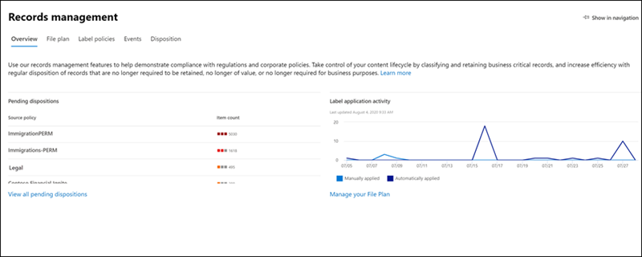

# Novidades na Conformidade do Microsoft 365What's new in Microsoft 365 compliance

Se está adicionando novas soluções ao centro de [conformidade da Microsoft 365](microsoft-365-compliance-center.md), atualizando recursos existentes com base em seus comentários ou distribuindo a documentação atualizada e atualizada, a Microsoft 365 ajuda você a se manter atualizado sobre o panorama de conformidade em constante mudança.Whether it be adding new solutions to the [Microsoft 365 compliance center](microsoft-365-compliance-center.md), updating existing features based on your feedback, or rolling out fresh and updated documentation, Microsoft 365 helps you stay on top of the ever-changing compliance landscape. Veja o que há de novo no Microsoft 365 Compliance hoje.Take a look below to see what’s new in Microsoft 365 compliance today. 

> [!NOTE]
> Alguns recursos de conformidade são implementados em diferentes velocidades para nossos clientes.Some compliance features get rolled out at different speeds to our customers. Se ainda não estiver vendo um recurso, tente adicioná-lo ao [lançamento direcionado](https://docs.microsoft.com/office365/admin/manage/release-options-in-office-365).If you aren't seeing a feature yet, try adding yourself to [targeted release](https://docs.microsoft.com/office365/admin/manage/release-options-in-office-365).

> [!TIP]
> Interessado no que está acontecendo em outros centros de administração?Interested in what's going on in other admin centers? Confira estes artigos:Check out these articles: [O que há de novo no centro de administração do Microsoft 365What's new in the Microsoft 365 admin center](https://docs.microsoft.com/office365/admin/whats-new-in-preview?view=o365-worldwide) [O que há de novo no centro de administração do SharePointWhat's new in the SharePoint admin center](https://docs.microsoft.com/sharepoint/what-s-new-in-admin-center) [Novidades da Proteção contra Ameaças da MicrosoftWhat's new in Microsoft Threat Protection](https://docs.microsoft.com/microsoft-365/security/mtp/whats-new)  
E visite o [mapa do microsoft 365](https://www.microsoft.com/en-us/microsoft-365/roadmap) para saber mais sobre os recursos do Microsoft 365 que foram lançados, estão em desenvolvimento, foram cancelados ou lançados anteriormente.And visit the [Microsoft 365 Roadmap](https://www.microsoft.com/en-us/microsoft-365/roadmap) to learn about Microsoft 365 features that were launched, are rolling out, are in development, have been cancelled, or previously released.

## Agosto de 2020August 2020

### Spotlight: atualizações de conformidade de risco e comunicação do insiderSpotlight: Insider risk and communication compliance updates

Vários recursos novos e aprimorados atingiram a visualização pública neste mês:Several new and improved features hit public preview this month:

**Gerenciamento de risco interno****Insider risk management**

- Confira nossos seis novos [modelos de política](insider-risk-management-policies.md#policy-templates):Check out our six new [policy templates](insider-risk-management-policies.md#policy-templates):
    - Vazamentos de dados por usuários de prioridadeData leaks by priority users
    - Vazamentos de dados por usuários descontentesData leaks by disgruntled users
    - Violações de política de segurança geralGeneral security policy violations
    - Violações de política de segurança por parte dos usuáriosSecurity policy violations by departing users
    - Violações de política de segurança por usuários de prioridadeSecurity policy violations by priority users
    - Violações de política de segurança por usuários descontentesSecurity policy violations by disgruntled users

- A integração com [o Microsoft defender ATP](https://docs.microsoft.com/windows/security/threat-protection/microsoft-defender-atp/microsoft-defender-advanced-threat-protection) permite que você importe e filtre os alertas do Microsoft defender ATP para atividades detectadas por políticas criadas a partir dos novos modelos de política de violação de segurança.Integration with [Microsoft Defender ATP](https://docs.microsoft.com/windows/security/threat-protection/microsoft-defender-atp/microsoft-defender-advanced-threat-protection) allows you to import and filter Microsoft Defender ATP alerts for activities detected by policies created from the new security violation policy templates. Há também uma configuração de [risco do insider](insider-risk-management-settings.md#microsoft-defender-advanced-threat-protection-preview) relacionada, onde você pode escolher importar alertas de segurança para o gerenciamento de risco do insider com base no status de triagem de alerta do Microsoft defender ATP.There’s also a related [insider risk setting](insider-risk-management-settings.md#microsoft-defender-advanced-threat-protection-preview) where you can choose to import security alerts to insider risk management based on the Microsoft Defender ATP alert triage status.

    > [!NOTE]
    > Para aproveitar a integração do Microsoft defender ATP (incluindo os novos modelos de violação de política de segurança), você precisará ter o Microsoft defender ATP configurado em sua organização.To take advantage of Microsoft Defender ATP integration (including the new security policy violation templates), you'll need to have Microsoft Defender ATP configured in your organization. Você também precisará habilitar o Microsoft defender ATP para a integração do gerenciamento de risco do insider [configurando recursos avançados no Microsoft defender ATP](https://docs.microsoft.com/windows/security/threat-protection/microsoft-defender-atp/advanced-features#share-endpoint-alerts-with-microsoft-compliance-center).You’ll also need to enable Microsoft Defender ATP for insider risk management integration by [configuring advanced features in Microsoft Defender ATP](https://docs.microsoft.com/windows/security/threat-protection/microsoft-defender-atp/advanced-features#share-endpoint-alerts-with-microsoft-compliance-center).
 
- Personalizar limites do indicador ao [criar uma política](insider-risk-management-policies.md#create-a-new-policy).Customize indicator thresholds when [creating a policy](insider-risk-management-policies.md#create-a-new-policy).
- Configurar [grupos de usuários de prioridade](insider-risk-management-settings.md#priority-user-groups-preview) para definir usuários em sua organização cuja atividade requer uma inspeção mais detalhada com base em fatores como sua posição, nível de acesso a informações confidenciais ou histórico de riscos.Set up [priority user groups](insider-risk-management-settings.md#priority-user-groups-preview) to define users in your organization whose activity requires closer inspection based on factors such as their position, level of access to sensitive information, or risk history.
- Usar as APIs de atividade de gerenciamento do Office 365 para [Exportar detalhes de alerta de risco do insider](insider-risk-management-settings.md#export-alerts-preview) para outros aplicativos que sua organização pode usar para gerenciar ou agregar dados de risco InsiderUse Office 365 Management Activity APIs to [export insider risk alert details](insider-risk-management-settings.md#export-alerts-preview) to other applications your organization might use to manage or aggregate insider risk data.
- [As novas configurações de domínio](insider-risk-management-settings.md#domains-preview) ajudam a definir e controlar os níveis de risco para atividades em domínios específicos.New [domain settings](insider-risk-management-settings.md#domains-preview) help you define and control risk levels for activity in specific domains.

**Conformidade em comunicações****Communication compliance**

- Ao [examinar mensagens em um alerta](communication-compliance-investigate-remediate.md#step-3-decide-on-a-remediation-action), agora você pode remover mensagens inadequadas nos canais do Microsoft Teams, 1:1 e chats de grupo.When [reviewing messages in an alert](communication-compliance-investigate-remediate.md#step-3-decide-on-a-remediation-action), you can now remove inappropriate messages in Microsoft Teams channels, 1:1, and group chats. As mensagens e o conteúdo removidos são substituídos por uma dica de política que explica que foi removido devido a conteúdo confidencial.Removed messages and content are replaced with a policy tip that explains that it was removed due to sensitive content.
- Novas [funções de comunicação](communication-compliance-configure.md#step-1-required-enable-permissions-for-communication-compliance) (elas também serão incluídas nos novos grupos de função de conformidade de comunicação em setembro).New [communication roles](communication-compliance-configure.md#step-1-required-enable-permissions-for-communication-compliance) (these will also be included in new communication compliance role groups releasing in September).
- Nova experiência de configuração de conformidade de comunicação que inclui configurações para [privacidade](communication-compliance-feature-reference.md#privacy-preview) e [modelos de aviso](communication-compliance-feature-reference.md#notice-templates).New communication compliance settings experience that includes settings for [privacy](communication-compliance-feature-reference.md#privacy-preview) and [notice templates](communication-compliance-feature-reference.md#notice-templates).
- Novos [classificadores](communication-compliance-feature-reference.md#classifiers) para ajudar a detectar imagens adultas, Racy e Gory.New [classifiers](communication-compliance-feature-reference.md#classifiers) to help detect adult, racy, and gory images.
- Nova notificação ' padrão detectado ' que aparece ao [revisar as mensagens em um alerta](communication-compliance-investigate-remediate.md#step-2-examine-the-message-details) permite que você saiba mais sobre as instâncias de ocorrência do mesmo comportamento por um usuário.New ‘Pattern detected’ notification that appears when [reviewing messages in an alert](communication-compliance-investigate-remediate.md#step-2-examine-the-message-details) lets you know about reoccurring instances of the same behavior by a user.

### Rótulos de confidencialidadeSensitivity labels

- Para locatários do governo dos Estados Unidos (GCC, GCC-H e DoD) rótulos de confidencialidade possuem suporte somente quando o cliente de rotulagem unificada e digitalização da Proteção de Informações do Microsoft Azure está instalado.For US Government tenants (GCC, GCC-H, and DoD), sensitivity labels are currently supported only for the Azure Information Protection unified labeling client and scanner. Para obter mais informações, confira [Descrição do Serviço Governamental Premium de Proteção de Informações do Microsoft Azure](https://docs.microsoft.com/enterprise-mobility-security/solutions/ems-aip-premium-govt-service-description).For more information, see [Azure Information Protection Premium Government Service Description](https://docs.microsoft.com/enterprise-mobility-security/solutions/ems-aip-premium-govt-service-description).
- Agora, você pode [usar o PowerShell de segurança & o centro de conformidade](create-sensitivity-labels.md#use-powershell-for-sensitivity-labels-and-their-policies) para criar e definir todas as configurações que você vê no seu centro de administração de etiquetas.You can now [use Security & Compliance Center PowerShell](create-sensitivity-labels.md#use-powershell-for-sensitivity-labels-and-their-policies) to create and configure all settings you see in your labeling admin center. Isso significa que, além de usar o PowerShell para configurações que não estão disponíveis nos centros de administração de rótulo, agora você pode criar um script completo de criação e manutenção de rótulos de sensibilidade e políticas de rótulo de confidencialidade.This means that, in addition to using PowerShell for settings that aren't available in the labeling admin centers, you can now fully script the creation and maintenance of sensitivity labels and sensitivity label policies.

### Gerenciamento de registros: revisão de conteúdoRecords management: Content overhaul

Novos documentos que abrangem etapas de implantação, marcando o conteúdo como registros e registrando o controle de versão:New docs covering deployment steps, marking content as records, and record versioning:

- [Introdução ao gerenciamento de registrosGet started with records management](get-started-with-records-management.md)
- [Declarar registros usando rótulos de retençãoDeclare records by using retention labels](declare-records.md)
- [Usar a versão de registro para atualizar registros armazenados no SharePoint ou no OneDriveUse record versioning to update records stored in SharePoint or OneDrive](record-versioning.md)

### Políticas de & de rótulos de retençãoRetention labels & policies

A atividade de administração relacionada à retenção agora está gravada e disponível para revisão no log de auditoria.Retention-related admin activity is now recorded and available to review in the audit log. Para a lista completa, confira [Política de retenção e atividades do rótulo de retenção](search-the-audit-log-in-security-and-compliance.md#retention-policy-and-retention-label-activities).For the full list, see [Retention policy and retention label activities](search-the-audit-log-in-security-and-compliance.md#retention-policy-and-retention-label-activities).

### Descoberta Eletrônica AvançadaAdvanced eDiscovery

- Ao [Adicionar uma coleção a um conjunto de revisão](add-data-to-review-set.md#define-options-to-scope-your-collection-for-review), agora você pode incluir anexos modernos (também chamados de "anexos na nuvem") e versões de documentos do SharePoint.When [adding a collection to a review set](add-data-to-review-set.md#define-options-to-scope-your-collection-for-review), you can now include modern attachments (also called “cloud attachments”) and SharePoint document versions.
- Nova [experiência de exportação de download direto](export-documents-from-review-set.md), eliminando a necessidade de usar o Azure Storage Explorer para baixar o conteúdo do caso.New [direct download export experience](export-documents-from-review-set.md), eliminating the need to use Azure Storage Explorer to download case content.

## Julho de 2020July 2020

### Destaque em documentos da ajudaSpotlight on help docs

Para ajudá-lo a entender quais soluções de conformidade são usadas para proteger e controlar os dados confidenciais da sua organização, criamos duas novas páginas de aterrissagem com visões gerais de como as soluções funcionam juntas para atingir essas metas, incluindo links para documentos relacionados, para que você possa se aprofundar.To help you understand which compliance solutions are used to protect and govern your organization’s sensitive data, we created two new landing pages with overviews of how the solutions work together to achieve those goals, including links to related docs so you can dive in further.

[Proteção de informações da Microsoft no Microsoft 365Microsoft Information Protection in Microsoft 365](protect-information.md) 
[Governança de informações da Microsoft no Microsoft 365Microsoft Information Governance in Microsoft 365](manage-Information-governance.md)

### Descoberta eletrônica avançada: adicionar fontes de dados não custodial a seus casosAdvanced eDiscovery: Add non-custodial data sources to your cases

Adicionar dados a uma ocorrência sem ter que associá-los a um funcionário (conhecido como [fontes de dados não-custodial](non-custodial-data-sources.md)).Add data to a case without having to associate it with a custodian (known as [non-custodial data sources](non-custodial-data-sources.md)). E, se você precisar colocar esses dados não custodial em espera, poderá fazer isso usando nosso novo recurso de indexação avançada.And if you need to place this non-custodial data on hold, you’ll be able to do so using our new Advanced Indexing feature.

### Conectores de dados: aprimoramentos do conector de RHData connectors: HR connector enhancements

(Na visualização) Uma nova versão do [conector de RH](import-hr-data.md) permite que você importe dados relacionados a alterações no nível do trabalho, revisões de desempenho e planos de melhoria de desempenho.(In preview) A new version of the [HR connector](import-hr-data.md) lets you import data related to job level changes, performance reviews, and performance improvement plans. Esses dados podem ser usados em várias [políticas de risco de insider](insider-risk-management-policies.md) para detectar a atividade relacionada.This data can then be used in several [insider risk policies](insider-risk-management-policies.md) to detect related activity.

### Rótulos de retenção: novo suporte para emailRetention labels: New support for email

Agora você pode criar um [rótulo de retenção](retention.md#retention-labels) para iniciar a retenção de email com base em quando as mensagens foram rotuladas.You can now create a [retention label](retention.md#retention-labels) to start retaining email based on when messages were labeled. Isso não se aplica a itens de calendário, que serão mantidos com base em quando o item é enviado.This doesn’t apply to calendar items, which will be retained based on when the item is sent.

### Rótulos de confidencialidade: novo recurso e melhoriaSensitivity labels: New feature and an improvement

- (Na visualização) Ao definir as configurações de criptografia para um rótulo, procure a nova opção para usar a [criptografia de tecla dupla](encryption-sensitivity-labels.md#double-key-encryption) para proteger mais arquivos e emails rotulados.(In preview) When configuring encryption settings for a label, look for the new option to use [Double Key Encryption](encryption-sensitivity-labels.md#double-key-encryption) to further protect labeled files and emails.
- Ao criar ou excluir rótulos de sensibilidade ou criar, editar ou excluir suas políticas de rótulo, as alterações agora sincronizam dentro de 1 hora para todos os usuários, aplicativos e serviços.When creating or deleting sensitivity labels or creating, editing, or deleting their label policies, changes now synchronize within 1 hour to all users, apps, and services.

## Junho de 2020June 2020

### Spotlight: novos data Connectors Preview hitSpotlight: New data connectors hit preview

Com base em nossa promessa para ajudá-lo a importar dados de outras fontes de terceiros para o Microsoft 365, temos o prazer de anunciar a versão prévia de dois outros conectores de dados:Building on our promise to help you import data from more third-party sources into Microsoft 365, we’re pleased to announce the preview release of two more data connectors:

- [Mensagem do Bloomberg](archive-bloomberg-message-data.md).[Bloomberg message](archive-bloomberg-message-data.md). Importe e arquive dados de email de serviços financeiros da ferramenta de colaboração de mensagens do Bloomberg.Import and archive financial services email data from the Bloomberg Message collaboration tool. Após os dados serem armazenados nas caixas de correio, você pode acessar e usar os dados em recursos de conformidade, como retenção de litígio, pesquisa de conteúdo, arquivamento in-loco, auditoria, conformidade de comunicação e políticas de retenção.After the data’s stored in mailboxes, you can access and use the data in compliance features such as litigation hold, content search, In-place archiving, auditing, communication compliance, and retention policies.
- [Chat de gelo](archive-icechat-data.md).[ICE Chat](archive-icechat-data.md). Importe e arquive dados de chat de serviços financeiros da ferramenta de colaboração de chat ICE.Import and archive financial services chat data from the ICE Chat collaboration tool. Após os dados serem armazenados nas caixas de correio, você pode acessar e usar os dados em recursos de conformidade, como retenção de litígio, eDiscovery, arquivamento, auditoria, conformidade de comunicação e políticas de retenção.After the data’s stored in mailboxes, you can access and use the data in compliance features such as litigation hold, eDiscovery, archiving, auditing, communication compliance, and retention policies.

### Pontuação de conformidade & gerente de conformidade: os acertos continuam chegandoCompliance Score & Compliance Manager: The hits keep coming

As atualizações de junho incluem um novo modo de detalhamento de avaliação na [Pontuação de conformidade](compliance-score.md).June updates include a new assessment drill-down view in [Compliance Score](compliance-score.md). Monitorar o progresso do controle, adicionar, excluir avaliações diretamente da Pontuação de conformidade e muito mais.Monitor control progress, add, delete assessments directly from Compliance Score, and more.

Deseja manter-se atualizado sobre as atualizações de Pontuação de conformidade e gerente de conformidade?Want to stay on top of updates to Compliance Score and Compliance Manager? Marque as [notas de versão da nota de conformidade](compliance-score-release-notes.md) e verifique com frequência.Bookmark the [Compliance Score release notes](compliance-score-release-notes.md) and check back often.

## Maio de 2020May 2020

### Spotlight: a classificação de dados é oficialmente lançadaSpotlight: Data classification is officially released

A classificação de dados, aka '[conhecem seus dados](data-classification-overview.md)', recursos (análise, Gerenciador de conteúdo e Gerenciador de atividade) graduaram da fase de visualização e estão disponíveis para todas as organizações.Data classification, aka ‘[Know your data](data-classification-overview.md)’, features (analytics, content explorer, and activity explorer) have graduated from the preview phase and are available to all organizations. As ideias e as ferramentas poderosas podem ajudá-lo a descobrir e avaliar como as informações e os rótulos confidenciais são usados em conteúdo em toda a organização.Powerful insights and tools can help you discover and evaluate how sensitive info and labels (retention and sensitivity) are being used in content across your organization. Examine o conteúdo que contém informações confidenciais ou tenha rótulos aplicados, explore a atividade de etiquetas nos locais do Microsoft 365, crie tipos de informações confidenciais personalizados e muito mais.Review content that contains sensitive info or has labels applied, explore label activity across Microsoft 365 locations, create custom sensitive info types, and more.

Faça um tour de vídeo...Take a video tour...

> [!VIDEO https://www.microsoft.com/videoplayer/embed/RE4vx8x]

### Classificadores estagiários: uma correção e um recursoTrainable classifiers: A fix and a feature

O pode trazer mais aprimoramentos para os classificadores estagiários:May brings more enhancements to trainable classifiers:

- Uma correção com base em seus comentários: quando você propaga e treina um classificador personalizado, não é mais necessário inserir manualmente URLs de site do SharePoint e caminhos de pasta.A fix based on your feedback: When you seed and train a custom classifier, you no longer need to manually enter SharePoint site URLs and folder paths. Agora você pode escolher em uma lista de preenchimento de sites e pastas.You can now choose from a pre-populate list of sites and folders.
- Novo recurso: ao criar um rótulo de confidencialidade e configurar as definições de rotulação automática para os aplicativos do Office, você pode aplicar automaticamente (ou recomendar que os usuários se apliquem) o rótulo ao conteúdo que corresponde aos classificadores estagiários.New feature: When creating a sensitivity label and configuring auto-labeling settings for Office apps, you can now automatically apply (or recommend that users apply) the label to content that matches trainable classifiers. [Saiba MaisLearn more](apply-sensitivity-label-automatically.md#configuring-trainable-classifiers-for-a-label)

### Conformidade de comunicação: o suporte do Yammer está aquiCommunication compliance: Yammer support is here

Mensagens privadas e conversas da Comunidade pública no Yammer são suportadas em políticas de conformidade de comunicação.Private messages and public community conversations in Yammer are supported in communication compliance policies. O Yammer é um canal opcional e deve estar no [modo nativo](https://docs.microsoft.com/yammer/configure-your-yammer-network/overview-native-mode) para suportar a verificação de mensagens e anexos.Yammer is an optional channel and must be in [native mode](https://docs.microsoft.com/yammer/configure-your-yammer-network/overview-native-mode) to support scanning of messages and attachments.

### Prevenção contra perda de dados: nova restrição de compartilhamentoData loss prevention: New sharing restriction

Ao configurar uma política de DLP para proteger o conteúdo no SharePoint ou no OneDrive, agora você pode configurar a ação "restringir o acesso a conteúdo" para bloquear pessoas que receberam acesso ao conteúdo através da opção "[qualquer pessoa com o link](https://support.microsoft.com/office/share-files-outside-your-organization-with-anyone-links-53e91027-fb8e-4a6e-a3e4-5df4be32e38a)".When setting up a DLP policy to protect content in SharePoint or OneDrive, you can now configure the “Restrict access to content” action to block people who were given access to the content through the ‘[Anyone with the link](https://support.microsoft.com/office/share-files-outside-your-organization-with-anyone-links-53e91027-fb8e-4a6e-a3e4-5df4be32e38a)’ option.

### Gerenciamento de risco do insider: ajuste seu volume de alertaInsider risk management: Tailor your alert volume

As atividades do usuário detectadas pelas políticas de risco do insider recebem uma pontuação de risco específica, que, por sua vez, determina a severidade do alerta (baixa, média, alta).User activities detected by insider risk policies are assigned a specific risk score, which in turn determines the alert severity (low, medium, high). Por padrão, o Microsoft 365 gera uma determinada quantidade de alertas de severidade Baixa, média e alta, mas com a nova [configuração de volume de alerta](insider-risk-management-settings.md#alert-volume), você pode aumentar ou diminuir o volume para atender às suas necessidades.By default, Microsoft 365 generates a certain amount of low, medium, and high severity alerts, but with the new [alert volume setting](insider-risk-management-settings.md#alert-volume), you can increase or decrease the volume to suit your needs.

### Importação de PST: nova região suportadaPST import: New region supported

O carregamento de rede agora está disponível nos Emirados Árabes Unidos.Network upload is now available in United Arab Emirates.

### Rótulos de confidencialidade: nova opção de privacidadeSensitivity labels: New privacy option

Ao configurar [definições de site e de grupo](sensitivity-labels-teams-groups-sites.md#how-to-configure-groups-and-site-settings) para um rótulo, agora você pode definir a opção de privacidade como **nenhum-permitir que o usuário escolha quem pode acessar o site**.When configuring [site and group settings](sensitivity-labels-teams-groups-sites.md#how-to-configure-groups-and-site-settings) for a label, you can now set the privacy option to **None - let user choose who can access the site**. Isso é útil quando você deseja proteger o conteúdo do contêiner usando um rótulo de confidencialidade, mas ainda permitir que os usuários configurem a configuração de privacidade.This is useful when you want to protect content in the container by using a sensitivity label, but still let users configure the privacy setting themselves.

## Abril de 2020April 2020

### Gerenciamento de registros: revisão... e uma nova adiçãoRecords management: Overhaul…and a new addition

Amanda inclui algumas atualizações importantes para nossa solução de gerenciamento de registros:April includes a couple key updates to our records management solution:

- A seção "gerenciamento de registros" agora está totalmente disponível no centro de conformidade.The ‘Records management’ section is now fully available in the compliance center. Aproveite as interfaces de usuário atualizadas e a funcionalidade para o plano de arquivos, os rótulos de retenção e as políticas de rótulo, eventos e disposição.Take advantage of updated user interfaces and functionality for file plan, retention labels and label policies, events, and disposition.
- Em termos de descarte, também distribuimos [provas de eliminação](disposition.md#disposition-of-records) de registros no SharePoint e no onedrive.Speaking of disposition, we also rolled out [proof of disposition](disposition.md#disposition-of-records) for records in SharePoint and OneDrive. Agora você pode ver uma lista de itens nos locais que foram descartados automaticamente ou após uma revisão de disposição.You can now see a list of items in those locations that have been disposed of automatically or after a disposition review.

### Rótulos de sensibilidade: Visualizar as políticas de rotulação automáticaSensitivity labels: Preview auto-labeling policies

Com as políticas de rotulamento automático, agora você pode aplicar automaticamente rótulos de confidencialidade aos documentos do SharePoint e do OneDrive já salvos (conhecidos como dados em repouso) e emails que já foram enviados ou recebidos (conhecidos como "emails em trânsito").With auto-labeling policies, you can now automatically apply sensitivity labels to SharePoint and OneDrive docs that are already saved (aka ‘data at rest) and emails that are already sent or received (aka ‘email in transit’). Como esse rótulo é aplicado por serviços, e não por aplicativos, você não precisa se preocupar com os aplicativos que os usuários têm e qual versão.Because this labeling is applied by services rather than by apps, you don't need to worry about what apps users have and what version.

Esse recurso estende o rótulo do lado do cliente existente que já está incluído nas configurações de rotulamento automático para aplicativos do Office quando você cria um rótulo de confidencialidade.This capability extends the existing client-side labeling that’s already included in the ‘Auto-labeling for Office apps’ settings when you create a sensitivity label. Para se familiarizar com as diferenças e os benefícios de ambas as opções de rótulo automático, confira o [artigo atualizado](apply-sensitivity-label-automatically.md).To get up to speed on the differences and benefits of both auto-labeling options, check out the [updated article](apply-sensitivity-label-automatically.md).

## Março de 2020March 2020

### Introdução à auditoria avançadaIntroducing Advanced Audit

A [auditoria avançada no Microsoft 365](advanced-audit.md) introduz novos recursos de auditoria que podem ajudar sua organização com investigações forenses e de conformidade.[Advanced Audit in Microsoft 365](advanced-audit.md) introduces new auditing capabilities that can help your organization with forensic and compliance investigations. Os destaques incluem retenção de longo prazo de logs de auditoria, políticas de retenção de logs de auditoria personalizadas, nova ação de auditoria de caixa de correio do *MailItemsAccessed* e a introdução de um novo limite de limitação no nível do locatário, que fornece à sua organização sua própria cota de largura de banda totalmente alocada para acessar seus dados de auditoria.Highlights include long term retention of audit logs, custom audit log retention policies, new *MailItemsAccessed* mailbox auditing action, and the introduction of a new tenant-level throttling limit, which provides your organization with its own fully allocated bandwidth quota to access your auditing data.

### Pontuação de conformidade & gerente de conformidade: Visualizar os aprimoramentos mais recentesCompliance Score & Compliance Manager: Preview the latest enhancements

As principais atualizações para esta versão prévia incluem:Key updates for this preview release include:

- Processo simplificado para a criação e modificação de modelosSimplified process for creating and modifying templates
- Controle e aviso de controle de versão para modelos e açõesVersioning notice and control for templates and actions
- Sincronizando ações comuns entre gruposSynchronizing common actions across groups
- Suporte a idiomas agora estendido para chinês (simplificado), chinês (tradicional), francês, alemão, italiano, japonês, coreano, Português (Brasil), russo e espanholLanguage support now extended to Chinese (Simplified), Chinese (Traditional), French, German, Italian, Japanese, Korean, Portuguese (Brazil), Russian, and Spanish

Saiba mais sobre a [Pontuação de conformidade](compliance-score.md) e o gerente de [conformidade](compliance-manager-overview.md)Learn more about [Compliance Score](compliance-score.md) and [Compliance Manager](compliance-manager-overview.md)

### Rótulos de sensibilidade: suporte para rotular arquivos do Office no SharePoint e no OneDrive (visualização)Sensitivity labels: Support for labeling Office files in SharePoint and OneDrive (preview)

Habilitar a visualização permite que os usuários apliquem rótulos de confidencialidade no Office na Web.Enabling the preview allows users to apply sensitivity labels in Office on the web. Eles poderão ver o botão **sensibilidade** na faixa de opções e o nome do rótulo aplicado na barra de status.They’ll be able to see the **Sensitivity** button on the ribbon and the applied label name on the status bar. Além disso, se eles usarem aplicativos da área de trabalho para rotular e salvar seus arquivos no SharePoint ou no OneDrive, o Microsoft 365 agora será capaz de processar o conteúdo desses arquivos se o rótulo tiver configurações de criptografia aplicadas.In addition, if they use desktop apps to label and then save their files on SharePoint or OneDrive, Microsoft 365 will now be able to process the content of these files if the label has encryption settings applied. A coautoria, descoberta eletrônica, prevenção de perda de dados, pesquisa e outros recursos colaborativos também terão suporte nessas circunstâncias.Coauthoring, eDiscovery, data loss prevention, search, and other collaborative features will also be supported in these circumstances.

[Saiba como habilitar a visualizaçãoLearn how to enable the preview](sensitivity-labels-sharepoint-onedrive-files.md)

## Fevereiro de 2020February 2020

### O gerenciamento de riscos do Insider é oficialmente lançadoInsider risk management is officially released

Rolo de tambor, por...Drum roll, please... O gerenciamento de riscos do insider agora está disponível para organizações com as seguintes assinaturas:Insider risk management is now available to organizations with the following subscriptions:

- [Microsoft 365 E5](https://go.microsoft.com/fwlink/?linkid=2120431) (pago ou avaliação)[Microsoft 365 E5](https://go.microsoft.com/fwlink/?linkid=2120431) (paid or trial)
- Assinatura do Microsoft 365 Enterprise E3 com o [complemento de conformidade da Microsoft E5](https://go.microsoft.com/fwlink/?linkid=2120432)Microsoft 365 Enterprise E3 subscription with the [Microsoft E5 Compliance add-on](https://go.microsoft.com/fwlink/?linkid=2120432)

A volta que fizemos algumas melhorias desde o lançamento da versão prévia, incluindo [novos grupos de função](insider-risk-management-configure.md#step-1-enable-permissions-for-insider-risk-management) e [configurações de toda a solução](insider-risk-management-configure.md#step-4-configure-insider-risk-settings).Heads up that we made some improvements since the preview release, including [new role groups](insider-risk-management-configure.md#step-1-enable-permissions-for-insider-risk-management) and [solution-wide settings](insider-risk-management-configure.md#step-4-configure-insider-risk-settings).

Como sempre, deixe o feedback ao usar a solução para que possamos continuar a fazer melhorias.As always, please leave feedback as you use the solution so we can continue to make improvements.

### Gerenciamento de registrosRecords management

Essa nova solução traz todos os recursos de gerenciamento de registros em um único guarda.This new solution brings all the records management capabilities under a single umbrella. Os destaques incluem a introdução de controle de versão de registros para o SharePoint e o OneDrive e a prova de alienação de registros.Highlights include the introduction of records versioning for SharePoint and OneDrive and proof of disposal for records.

[Saiba mais sobre o gerenciamento de registrosLearn more about records management](records-management.md)

### Destaque da solução: conectores de dados para Facebook e TwitterSolution spotlight: Data connectors for Facebook and Twitter

Os conectores de dados foram [lançados no mês passado](#just-launched) e estamos procurando sua ajuda no teste dos seguintes conectores.Data connectors [released last month](#just-launched) and we're looking for your help in testing out the following connectors.

- [Páginas de negócios do Facebook](archive-facebook-data-with-sample-connector.md).[Facebook business pages](archive-facebook-data-with-sample-connector.md). Importa e arquiva dados de páginas de negócios do Facebook para o Microsoft 365.Imports and archives data from Facebook business pages to Microsoft 365. Benéfico para soluções de conformidade, como gerenciamento de registros e eDiscovery.Beneficial for compliance solutions such as records management and eDiscovery.
- [Twitter](archive-twitter-data-with-sample-connector.md).[Twitter](archive-twitter-data-with-sample-connector.md). Importa e arquiva dados do Twitter para o Microsoft 365.Imports and archives data from Twitter to Microsoft 365. Benéfico para soluções de conformidade, como gerenciamento de registros e eDiscovery.Beneficial for compliance solutions such as records management and eDiscovery.

À medida que você configura e valida esses conectores, deixe-nos comentários sobre o que deu certo, o que não foi e o que podemos fazer para melhorar a experiência.As you set up and validate these connectors, please leave us feedback about what went well, what didn't, and what we can do to improve the experience.

## Janeiro de 2020January 2020

A espera terminará.The wait is over. Temos o prazer de anunciar que o centro de conformidade da Microsoft 365 está disponível para todos os clientes com os planos Microsoft 365, Office 365, Enterprise Mobility + Security (EMS) e Windows 10 Enterprise.We're pleased to announce that the Microsoft 365 compliance center is available to all customers with Microsoft 365, Office 365, Enterprise Mobility + Security (EMS), and Windows 10 Enterprise plans. Todos os dados ou políticas que você estava gerenciando no centro de conformidade do & de segurança estão disponíveis no centro de conformidade, portanto, não é necessário saltar para frente e para trás.Any data or policies you were managing in the Security & Compliance Center are available in the compliance center, so no need to jump back and forth.

> [!TIP]
> Leia novamente a atualização do mês passado para obter uma atualização em algumas das [novas soluções](#new-compliance-solutions) visualizadas recentemente, bem como um [mapa](#updated-compliance-solutions) mostrando onde os recursos de conformidade do centro de conformidade do & de segurança agora residem no Microsoft 365.Read through last month's update again for a refresher on some of the [new solutions](#new-compliance-solutions) we previewed recently, as well as a [roadmap](#updated-compliance-solutions) showing where compliance features from the Security & Compliance Center now live in Microsoft 365.

Marque o indicador e vá para [https://compliance.microsoft.com](https://compliance.microsoft.com) o momento de fazer um passeio para o gerenciamento de conformidade em sua organização... ou [Leia este artigo](microsoft-365-compliance-center.md) para se aprofundar em um pouco mais.Bookmark and head over now to [https://compliance.microsoft.com](https://compliance.microsoft.com) to tour your one-stop-shop for managing compliance across your org...or [read this article](microsoft-365-compliance-center.md) to dig in a bit more.

Também lançamos soluções novas e atualizadas neste mês.We also released new and updated solutions this month. Veja aqui uma rápida visão geral dos destaques.Here's a quick glance at the highlights.

### Agora na visualizaçãoNow in preview

**Gerenciamento de risco do Insider (versão prévia)****Insider risk management (preview)**

Estamos felizes em anunciar que nossa solução de gerenciamento de riscos do insider está agora em visualização pública.We're happy to announce that our insider risk management solution is now in public preview. Em resumo, o gerenciamento de riscos do insider ajuda sua organização a identificar e tomar as medidas de forma inteligente contra os riscos do Insider, fornecendo:In a nutshell, insider risk management helps your organization intelligently identify and take action on insider risks by providing:

- Controles de anonimato para ajudar a garantir a privacidade do usuário.Anonymity controls to help ensure user privacy.
- Modelos de política inteligente com indicadores nativos e de terceiros que identificam ameaças insides, como vazamentos de dados.Intelligent policy templates with native and third-party indicators that identify insider threats, such as data leaks.
- Fluxos de trabalho de investigação de ponta a ponta integrados entre ti, RH e equipes jurídicas.Integrated end-to-end investigation workflows that span across IT, HR and legal teams.

Adoraríamos ouvir o que você imagina.We'd love to hear what you think. À medida que você usa a solução, deixe-nos feedback para que possamos garantir que estamos atendendo às suas necessidades em direção à disponibilidade geral.As you use the solution, leave us feedback so we can make sure we're meeting your needs as we head toward general availability.

[Saiba mais sobre o gerenciamento de riscos do insiderLearn more about insider risk management](insider-risk-management.md)

### Acabou de iniciarJust launched

**Conformidade em comunicações****Communication compliance**

Graduação da fase de visualização até a disponibilidade completa, a conformidade de comunicação é um componente essencial do nosso novo conjunto de soluções de riscos Insider.Graduating from the preview phase to full availability, communication compliance is a key component of our new insider risk solution set. Essa solução robusta ajuda a minimizar os riscos de comunicação usando fluxos de trabalho para detectar, investigar e realizar ações de correção para mensagens que não atendem aos padrões da sua organização.This robust solution helps minimize communication risks using workflows for detecting, investigating, and taking remediation actions for messages that don't meet your organization's standards.

Os comentários dos clientes durante a visualização foram fantásticos.Customer feedback during the preview was fantastic. Ele resultou em vários aprimoramentos, incluindo uma experiência de primeira execução para ajudá-lo a começar, aprimoramentos de ações de investigação e correção e muito mais.It resulted in several enhancements, including a first-run experience to get you started, improvements to investigation and remediation actions, and more.

[Saiba mais sobre conformidade de comunicaçãoLearn more about communication compliance](communication-compliance.md)

**Conectores de dados****Data connectors**

Antes de compartilhar o espaço com outros recursos de "importação" no centro de conformidade & segurança do Office 365, os conectores de dados agora têm sua própria casa no centro de conformidade da Microsoft 365.Formerly sharing space with other 'Import' features in the Office 365 Security & Compliance Center, data connectors now have their very own home in the Microsoft 365 compliance center. Use a nova página de ' conectores de dados ' para importar e arquivar dados dos arquivos de recursos humanos da sua organização (RH) e várias plataformas de terceiros (como Facebook, LinkedIn, Twitter e o Bloomberg) para caixas de correio em sua organização do Microsoft 365.Use the new 'Data connectors' page to import and archive data from your organization's human resources (HR) files and various third-party platforms (like Facebook, LinkedIn, Twitter, and Instant Bloomberg) to mailboxes in your Microsoft 365 organization. Após a importação, esses dados podem ser gerenciados em várias soluções de conformidade, incluindo eDiscovery, gerenciamento de risco do Insider, conformidade de comunicação, auditoria, políticas de retenção e muito mais.Once imported, this data can be managed in several compliance solutions, including eDiscovery, insider risk management, communication compliance, audit, retention policies, and more.

[Saiba mais sobre conectores de dadosLearn more about data connectors](archiving-third-party-data.md)

### Atualizações de notávelNoteworthy updates

**Novos modelos de avaliação para Pontuação de conformidade (visualização)****New assessment templates for Compliance Score (preview)**

Sempre trabalhando difícil para ajudá-lo a se familiarizar com o panorama de conformidade em constante evolução, nossa equipe de Pontuação de conformidade lançou um novo conjunto de modelos para ajudá-lo a avaliar a postura de conformidade da sua organização contra regulamentações recentes e obter orientação sobre como implementar controles mais eficazes.Always working hard to help you get ahead of the ever-evolving compliance landscape, our Compliance Score team shipped a new set of templates to help you assess your organization's compliance posture against recent regulations and get guidance on how to implement more effective controls. Você verá novos modelos para:You'll see new templates for:

- ISO/IEC 27701:2019ISO/IEC 27701:2019
- CCPA (Lei de Privacidade do Consumidor da Califórnia)California Consumer Privacy Act (CCPA)
- Lei geral de proteção de dados do Brasil (lei geral de proteção de dados-LGPD)Brazil General Data Protection Law (Lei Geral de Proteção de Dados - LGPD)
- SOC 1 tipo 2 e SOC 2 tipo 2SOC 1 Type 2 and SOC 2 Type 2

[Saiba mais sobre modelos de Pontuação de conformidadeLearn more about Compliance Score templates](compliance-score.md#templates)

## Novembro de & de dezembro de 2019November & December 2019

Nos feriados, começamos a distribuir todas as excelentes soluções de conformidade que foram demonstradas em Ignite.Over the holidays, we started rolling out all the great compliance solutions that were demo'd at Ignite. A maioria está em um estado de visualização, portanto, teste-os e lembre-se de nos informar o que você pensa ao abrir o cartão de comentários no canto inferior direito do centro de conformidade.Most are in a preview state, so test them out and be sure to let us know what you think by opening the Feedback card at the bottom right of the compliance center.

### Conheça a nova vizinhançaGet to know the new neighborhood

O novo centro de conformidade da Microsoft 365 inclui soluções novas, bem como os recursos de conformidade que você conhece e amamos do centro de conformidade & segurança do Office 365.The new Microsoft 365 compliance center includes brand new solutions as well as the compliance features you know and love from the Office 365 Security & Compliance Center. Vamos nos aprofundar mais...Let's dig in a bit more…

#### Novas soluções de conformidadeNew compliance solutions

Você pode estar se perguntando o que é uma *solução* .You might be wondering what a *solution* is. Assim que a nuvem revolucionou a forma como a empresa é concluída, ela também abriu a porta para novos métodos de roubo de dados e fraude e exige novas regulamentações.As much as the cloud has revolutionized the way business is done, it's also opened the door for new methods of data theft and fraud and necessitated new regulations. Nossas soluções de conformidade são conjuntos de recursos integrados que podem ajudá-lo a gerenciar esses requisitos de conformidade em evolução.Our compliance solutions are collections of integrated capabilities that can help you help you manage these evolving compliance requirements. Os recursos de uma solução podem incluir uma combinação de políticas, alertas, relatórios e muito mais.A solution's capabilities might include a combination of policies, alerts, reports, and more.

Aqui está um resumo das novas soluções que você encontrará.Here's a summary of the new solutions you'll find. Fique atento para outras pessoas em breve.Keep an eye out for others coming soon.

> [!NOTE]
> Essas soluções estão localizadas somente no centro de conformidade da Microsoft 365.These solutions are located only in the Microsoft 365 compliance center. Eles não podem ser gerenciados no centro de conformidade & segurança do Office 365.They can't be managed in the Office 365 Security & Compliance Center.
 

|**Nova solução****New solution**|**Descrição****Description**|**Saiba Mais****Learn more**|
|:-----|:-----|:-----|
|Pontuação de conformidade da Microsoft (visualização)Microsoft Compliance Score (preview)  |Criado a partir do [Gerenciador de conformidade](compliance-manager-overview.md), a pontuação de conformidade é um recurso autônomo com um design mais simples e mais fácil, que ajuda você a compreender e aprimorar a postura de conformidade da sua organização.Built from [Compliance Manager](compliance-manager-overview.md), Compliance Score is a standalone feature with a simpler, more user-friendly design that helps you understand and improve your organization's compliance posture. Ele calcula uma pontuação baseada em risco medindo seu progresso em ações de conclusão que ajudam a reduzir os riscos relacionados à proteção de dados e aos padrões normativos.It calculates a risk-based score measuring your progress in completing actions that help reduce risks around data protection and regulatory standards.  |[Visão geral da Pontuação de conformidade da Microsoft (versão prévia)Overview of Microsoft Compliance Score (preview)](compliance-score.md)|
|Catálogo de soluções (versão prévia)Solution catalog (preview)  |O catálogo de soluções é seu ponto de partida para descoberta, aprendizado e rápida introdução às soluções de gerenciamento de conformidade e risco.The solution catalog is your one-stop-shop for discovering, learning about, and quickly getting started with our compliance and risk management solutions. O catálogo é organizado em três categorias de conformidade, cada uma contendo detalhes sobre as soluções que compõem essa categoria.The catalog is organized into three compliance categories, each containing details about the solutions that make up that category. As categorias incluem proteção de informações & governança, gerenciamento de risco do insider e resposta de & de descobertaCategories include Information protection & governance, Insider risk management, and Discovery & response  |[Visão geral do catálogo de soluções (versão prévia)Overview of the solution catalog (preview)](microsoft-365-solution-catalog.md)|
|Conformidade de comunicação (visualização)Communication compliance (preview)  |A conformidade com comunicações faz parte da nova categoria de gerenciamento de riscos do insider que ajuda a minimizar os riscos de comunicação ajudando você a detectar, capturar e realizar ações de correção para mensagens inadequadas em sua organização.Communication compliance is part of the new insider risk management category that helps minimize communication risks by helping you detect, capture, and take remediation actions for inappropriate messages in your organization. A solução estende os recursos de políticas de supervisão no Office 365, apresentando vários aprimoramentos novos, como modelos inteligentes, fluxos de trabalho de correção flexíveis e ideias acionáveis.The solution extends the capabilities of supervision policies in Office 365 by introducing several new enhancements such as intelligent templates, flexible remediation workflows, and actionable insights.  |[Conformidade de comunicação no Microsoft 365 (versão prévia)Communication compliance in Microsoft 365 (preview)](communication-compliance.md)|
|Classificação de dados (prévia)Data classification (preview)  |Nossa nova página de classificação de dados contém ideias poderosas e ferramentas para ajudá-lo a descobrir e avaliar como as informações e os rótulos confidenciais são usados em conteúdo em toda a organização.Our new Data classification page contains powerful insights and tools to help you discover and evaluate how sensitive info and labels (retention and sensitivity) are being used in content across your organization. Examine o conteúdo que contém informações confidenciais ou tenha rótulos aplicados, explore a atividade de etiquetas nos locais do Microsoft 365, crie tipos de informações confidenciais personalizados e muito mais.Review content that contains sensitive info or has labels applied, explore label activity across Microsoft 365 locations, create custom sensitive info types, and much more. |[Visão geral da classificação de dados (visualização)Data classification overview (preview)](data-classification-overview.md)|
|Classificadores estagiários (visualização)Trainable classifiers (preview)  |Essa nova ferramenta poderosa usa o nosso mecanismo de aprendizado de máquina para ajudar a identificar categorias de conteúdo em sua organização, como documentos regulatórios ou contratos de funcionários.This powerful new tool uses our machine learning engine to help identify categories of content in your org, like regulatory docs or employee agreements. Depois de criado, os classificadores podem ser usados em várias soluções de conformidade para detectar conteúdo relacionado e classificá-lo, protegê-lo, mantê-lo e muito mais.Once created, classifiers can be used in several compliance solutions to detect related content and classify it, protect it, retain it, and more. |[Saiba mais sobre classificadores treináveis (visualização)Learn about trainable classifiers (preview)](classifier-learn-about.md)|

#### Soluções de conformidade atualizadasUpdated compliance solutions

Se você estiver usando o centro de conformidade de & de segurança do Office 365 para suas necessidades de conformidade, talvez queira saber onde alguns recursos estão agora no novo centro de conformidade da Microsoft 365.If you've been using the Office 365 Security & Compliance Center for your compliance needs, you might wonder where some features now live in the new Microsoft 365 compliance center. Veja aqui um Quick Roadmap para ajudar a localizar suas novas residências.Here's a quick roadmap to help find their new homes.

> [!NOTE]
> Alguns recursos ainda estão disponíveis somente no centro de conformidade & segurança do Office 365 – eles estão indicados abaixo.Some features are still available only in the Office 365 Security & Compliance Center – these are noted below. Mas estamos trabalhando para visualizar isso no centro de conformidade da Microsoft 365, portanto, fique atento às atualizações.But we're working hard to preview these in the Microsoft 365 compliance center, so stay tuned for updates. 
 

|**Recurso****Feature**|**Centro de Segurança e Conformidade do Office 365****Office 365 Security & Compliance Center**|**Centro de conformidade do Microsoft 365****Microsoft 365 compliance center**|**Saiba Mais****Learn more**|
|:-----|:-----|:-----|:-----|
|Descoberta Eletrônica AvançadaAdvanced eDiscovery|descoberta eletrônica avançada > de descoberta eletrônicaeDiscovery > Advanced eDiscovery   https://protection.office.com/advancedediscoverycases |> de descoberta eletrônica avançadaeDiscovery > Advanced   https://compliance.microsoft.com/advancedediscovery | [Visão geral da solução de descoberta eletrônica avançada no Microsoft 365Overview of the Advanced eDiscovery solution in Microsoft 365](overview-ediscovery-20.md) |
|Políticas de alertaAlert policies|Alertas > políticas de alertaAlerts > Alert policies   https://protection.office.com/alertpolicies |No momento, as políticas de alerta são gerenciadas apenas no centro de conformidade & segurança do Office 365.At this time, alert policies are managed only in the Office 365 Security & Compliance Center. |[Políticas de alerta no centro de conformidade e segurançaAlert policies in the security and compliance center](alert-policies.md) |
|AlertasAlerts|Alertas > exibir alertasAlerts > View alerts   https://protection.office.com/viewalerts |AlertasAlerts   https://compliance.microsoft.com/compliancealerts |[Exibir alertasViewing alerts](alert-policies.md#viewing-alerts)|
|ArquivarArchive|Arquivamento de > de governança de informaçõesInformation governance > Archive   https://protection.office.com/archiving |Guia arquivar > de governança de informaçõesInformation governance > Archive tab   https://compliance.microsoft.com/informationgovernance?viewid=archive |[Habilitar caixas de correio de arquivo mortoEnable archive mailboxes](enable-archive-mailboxes.md)|
|Pesquisa de log de auditoriaAudit log search|Pesquisa > pesquisa de log de auditoriaSearch > Audit log search   https://protection.office.com/unifiedauditlog |AuditoriaAudit   https://compliance.microsoft.com/auditlogsearch | [Pesquisar o log de auditoria no centro de conformidade & segurançaSearch the audit log in the Security & Compliance Center](search-the-audit-log-in-security-and-compliance.md)|
|Pesquisa de conteúdoContent search|Pesquisar > pesquisa de conteúdoSearch > Content search   https://protection.office.com/contentsearchbeta?ContentOnly=1 | Pesquisa de conteúdoContent search   https://compliance.microsoft.com/contentsearch |[Pesquisar conteúdo no Office 365Search for content in Office 365](search-for-content.md) |
|Conectores de dadosData connectors|> de governança de informações arquivar dados de terceirosInformation governance > Archive third-party data   https://protection.office.com/nativeconnector | Conectores de dadosData connectors   https://compliance.microsoft.com/connectorlanding |[Arquivar dados de terceirosArchive third-party data](archiving-third-party-data.md)|
|Prevenção contra perda de dadosData loss prevention|Prevenção contra perda de dadosData loss prevention   https://protection.office.com/datalossprevention |Prevenção contra perda de dadosData loss prevention   https://compliance.microsoft.com/datalossprevention |[Visão geral da prevenção contra perda de dadosOverview of data loss prevention](data-loss-prevention-policies.md)|
|Solicitações de titular dos dadosData subject requests |Data Privacy > solicitações de entidades de dadosData privacy > Data subject requests   https://protection.office.com/dsrcases |Solicitações de titular dos dadosData subject requests   https://compliance.microsoft.com/datasubjectrequest |[Gerenciar solicitações de entidades de dados do RGPD com a ferramenta de ocorrência de DSRManage GDPR data subject requests with the DSR case tool](manage-gdpr-data-subject-requests-with-the-dsr-case-tool.md)|
|Descoberta eletrônicaeDiscovery|descoberta eletrônica > eDiscoveryeDiscovery > eDiscovery   https://protection.office.com/ediscoveryv1 |Centro de > de descoberta eletrônicaeDiscovery > Core   https://compliance.microsoft.com/classicediscovery |[Gerenciar casos de Descoberta EletrônicaManage eDiscovery cases](ediscovery-cases.md) |
|EventosEvents|Eventos de gerenciamento de > de registrosRecords management > Events   https://protection.office.com/events |Guia de eventos de gerenciamento de registros >Records management > Events tab   https://compliance.microsoft.com/recordsmanagement?viewid=events |[Iniciar a retenção quando um evento ocorrerStart retention when an event occurs](event-driven-retention.md)|
|Plano de arquivosFile plan|Gerenciamento de registros > plano de arquivoRecords management > File plan   https://protection.office.com/fileplan |Gerenciamento de registros > guia plano de arquivoRecords management > File plan tab   https://compliance.microsoft.com/recordsmanagement?viewid=fileplan |[Usar o plano de arquivos para gerenciar os rótulos de retençãoUse file plan to manage retention labels](file-plan-manager.md)|
|Importar arquivos PSTImport PST files|Governança de informações > importar arquivos PSTInformation governance > Import PST files   https://protection.office.com/importV2 |Guia importar > de governança de informaçõesInformation governance > Import tab   https://compliance.microsoft.com/informationgovernance?viewid=import |[Visão geral da importação dos arquivos PST da sua organizaçãoOverview of importing your organization's PST files](importing-pst-files-to-office-365.md)|
|Explorador de atividade de rótuloLabel activity explorer|Gerenciador de atividade de > de governança de informaçõesInformation governance > Label activity explorer   https://protection.office.com/labelexplorer |Classificação de dados > guia Explorador de atividadeData classification > Activity explorer tab   https://compliance.microsoft.com/dataclassification?viewid=activitiesexplorer |[Exibir atividade do seu conteúdo rotulado (visualização)View activity on your labeled content (preview)](data-classification-activity-explorer.md)|
|Rótulos de retenção e políticas de rótuloRetention labels and label policies |Guias de > de classificação > rótulos e políticas de rótuloClassification > Retention labels > Labels and Label policies tabs   https://protection.office.com/retentionlabels |Guias de controle de > rótulos e políticas de rótuloInformation governance > Labels and Label policies tabs   https://compliance.microsoft.com/informationgovernance?viewid=labels   https://compliance.microsoft.com/informationgovernance?viewid=labelpolicies | [Visão geral de rótulos de retençãoOverview of retention labels](retention.md)|
|Políticas de retençãoRetention policies|Retenção de > de governança de informaçõesInformation governance > Retention   https://protection.office.com/retention |Guia de retenção de > de governança de informaçõesInformation governance > Retention tab   https://compliance.microsoft.com/informationgovernance?viewid=retention |[Saiba mais sobre as políticas de retenção e rótulos de retençãoLearn about retention policies and retention labels](retention.md)|
|Tipos de informações confidenciaisSensitive info types|Classificação > tipos de informações confidenciaisClassification > Sensitive info types   https://protection.office.com/sensitivetypes |Guia tipos de informações confidenciais > classificação de dadosData classification > Sensitive info types tab   https://compliance.microsoft.com/dataclassification?viewid=sensitiveinfotypes |[Definições da entidade do tipo de informações confidenciaisSensitive information type entity definitions](sensitive-information-type-entity-definitions.md)|
|Rótulos de confidencialidade e políticas de rótuloSensitivity labels and label policies|Rótulos de classificação > de sensibilidade > rótulos e políticas de rótuloClassification > Sensitivity labels > Labels and Label policies tabs   https://protection.office.com/sensitivity |Guias de proteção de informações > rótulos e políticas de rótuloInformation protection > Labels and Label policies tabs   https://compliance.microsoft.com/informationprotection?viewid=sensitivitylabels   https://compliance.microsoft.com/informationprotection?viewid=sensitivitylabelpolicies |[Saiba mais sobre rótulos de confidencialidadeLearn about sensitivity labels](sensitivity-labels.md) |
|Garantia do serviçoService assurance|Garantia do serviçoService assurance   https://protection.office.com/serviceassurance/dashboard |No momento, os recursos de garantia de serviço só podem ser acessados no centro de conformidade & segurança do Office 365.At this time, service assurance resources can only be accessed in the Office 365 Security & Compliance Center. |[Garantia de serviço no Centro de Conformidade e SegurançaService assurance in the Security & Compliance Center](service-assurance.md)|
|SupervisãoSupervision|SupervisãoSupervision   https://protection.office.com/supervisoryreviewv2 |Conformidade em comunicaçõesCommunication compliance   https://compliance.microsoft.com/supervisoryreview |[Conformidade de comunicação no Microsoft 365 (versão prévia)Communication compliance in Microsoft 365 (preview)](communication-compliance.md) |

## Setembro de 2019September 2019

Está imaginando por que ele está silencioso no lançamento frontal este mês?Wondering why it's quiet on the release front this month? Temos uma cabeça para a criação de soluções de conformidade novas e inovadoras que serão anunciadas no [Microsoft Ignite](https://www.microsoft.com/ignite) em novembro.We're heads down building new, innovative compliance solutions that'll be unveiled at [Microsoft Ignite](https://www.microsoft.com/ignite) in November. Fique atento!Stay tuned!

### Novas opções de criptografia para rótulos de confidencialidadeNew encryption options for sensitivity labels 

Ao configurar a criptografia para um rótulo de confidencialidade, agora você tem duas opções que permitem aos usuários atribuir permissões ao aplicarem manualmente o rótulo a emails e documentos:When configuring encryption for a sensitivity label, you now have two options that lets users assign permissions when they manually apply the label to email and docs: 
- Ao aplicar o rótulo ao **email do Outlook**, os usuários podem impor restrições equivalentes à opção não encaminhar.When applying the label to **Outlook email**, users can enforce restrictions equivalent to the Do Not Forward option. Os destinatários poderão ler a mensagem, mas não encaminhar, imprimir ou copiar o conteúdo.Recipients will be able to read the message but not forward, print, or copy the content.
- Ao aplicar o rótulo a **arquivos do Word, PowerPoint e Excel**, os usuários serão solicitados a atribuir permissões de acesso a usuários e grupos específicos.When applying the label to **Word, PowerPoint, and Excel files**, users will be prompted to assign access permissions to specific users and groups.

Vá para [restringir o acesso ao conteúdo usando rótulos de confidencialidade para aplicar criptografia](encryption-sensitivity-labels.md#let-users-assign-permissions) para saber mais.Go to [Restrict access to content by using sensitivity labels to apply encryption](encryption-sensitivity-labels.md#let-users-assign-permissions) to learn more.
