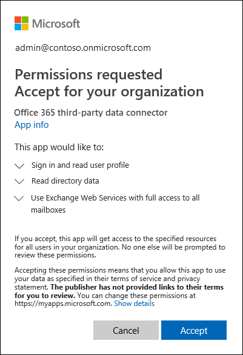

# <a name="work-with-a-partner-to-archive-third-party-data"></a><span data-ttu-id="c038e-103">Trabalhar com um parceiro para arquivar dados de terceiros</span><span class="sxs-lookup"><span data-stu-id="c038e-103">Work with a partner to archive third-party data</span></span>

<span data-ttu-id="c038e-104">Você pode trabalhar com um Microsoft Partner para importar e arquivar dados de uma fonte de dados de terceiros para o Microsoft 365.</span><span class="sxs-lookup"><span data-stu-id="c038e-104">You can work with a Microsoft Partner to import and archive data from a third-party data source to Microsoft 365.</span></span> <span data-ttu-id="c038e-105">Um parceiro pode fornecer um conector personalizado configurado para extrair itens da fonte de dados de terceiros (regularmente) e importar esses itens.</span><span class="sxs-lookup"><span data-stu-id="c038e-105">A partner can provide you with a custom connector that is configured to extract items from the third-party data source (on a regular basis) and then import those items.</span></span> <span data-ttu-id="c038e-106">O conector de parceiro converte o conteúdo de um item da fonte de dados para um formato de mensagem de email e armazena os itens em caixas de correio.</span><span class="sxs-lookup"><span data-stu-id="c038e-106">The partner connector converts the content of an item from the data source to an email message format and then stores the items in mailboxes.</span></span> <span data-ttu-id="c038e-107">Depois que os dados de terceiros são importados, você pode aplicar recursos de conformidade do Microsoft 365, como Retenção de Litígio, Descoberta e Descoberta In-Place arquivamento, auditoria e políticas de retenção do Microsoft 365 a esses dados.</span><span class="sxs-lookup"><span data-stu-id="c038e-107">After third-party data is imported, you can apply Microsoft 365 compliance features such as Litigation Hold, eDiscovery, In-Place Archiving, Auditing, and Microsoft 365 retention policies to this data.</span></span>

>[!IMPORTANT]
><span data-ttu-id="c038e-108">A [solução de conformidade](communication-compliance.md) de comunicação no Microsoft 365 não pode ser aplicada aos dados de terceiros importados por conectores de parceiros mencionados neste artigo.</span><span class="sxs-lookup"><span data-stu-id="c038e-108">The [Communication compliance](communication-compliance.md) solution in Microsoft 365 can't be applied to the third-party data imported by partner connectors mentioned in this article.</span></span> 

<span data-ttu-id="c038e-109">Aqui está uma visão geral do processo e as etapas necessárias para trabalhar com um Microsoft Partner para importar dados de terceiros.</span><span class="sxs-lookup"><span data-stu-id="c038e-109">Here's an overview of the process and the steps necessary to work with a Microsoft Partner to import third-party data.</span></span>

[<span data-ttu-id="c038e-110">Step 1: Find a third-party data partner</span><span class="sxs-lookup"><span data-stu-id="c038e-110">Step 1: Find a third-party data partner</span></span>](#step-1-find-a-third-party-data-partner)

[<span data-ttu-id="c038e-111">Etapa 2: Criar e configurar uma caixa de correio de dados de terceiros</span><span class="sxs-lookup"><span data-stu-id="c038e-111">Step 2: Create and configure a third-party data mailbox</span></span>](#step-2-create-and-configure-a-third-party-data-mailbox-in-microsoft-365)

[<span data-ttu-id="c038e-112">Step 3: Configure user mailboxes for third-party data</span><span class="sxs-lookup"><span data-stu-id="c038e-112">Step 3: Configure user mailboxes for third-party data</span></span>](#step-3-configure-user-mailboxes-for-third-party-data)

[<span data-ttu-id="c038e-113">Etapa 4: fornecer informações ao seu parceiro</span><span class="sxs-lookup"><span data-stu-id="c038e-113">Step 4: Provide your partner with information</span></span>](#step-4-provide-your-partner-with-information)

[<span data-ttu-id="c038e-114">Etapa 5: Registrar o conector de dados de terceiros no Azure Active Directory</span><span class="sxs-lookup"><span data-stu-id="c038e-114">Step 5: Register the third-party data connector in Azure Active Directory</span></span>](#step-5-register-the-third-party-data-connector-in-azure-active-directory)

## <a name="how-the-third-party-data-import-process-works"></a><span data-ttu-id="c038e-115">Como funciona o processo de importação de dados de terceiros</span><span class="sxs-lookup"><span data-stu-id="c038e-115">How the third-party data import process works</span></span>

<span data-ttu-id="c038e-116">A ilustração e a descrição a seguir explicam como o processo de importação de dados de terceiros funciona ao trabalhar com um parceiro.</span><span class="sxs-lookup"><span data-stu-id="c038e-116">The following illustration and description explain how the third-party data import process works when working with a partner.</span></span>
  

  
1. <span data-ttu-id="c038e-118">O cliente trabalha com seu parceiro de escolha para configurar um conector que extrairá itens da fonte de dados de terceiros e importará esses itens para o Microsoft 365.</span><span class="sxs-lookup"><span data-stu-id="c038e-118">Customer works with their partner of choice to configure a connector that will extract items from the third-party data source and then import those items to Microsoft 365.</span></span>
    
2. <span data-ttu-id="c038e-119">O conector do parceiro se conecta a fontes de dados de terceiros por meio de uma API de terceiros (em uma base agendada ou configurada) e extrai itens da fonte de dados.</span><span class="sxs-lookup"><span data-stu-id="c038e-119">The partner connector connects to third-party data sources via a third-party API (on a scheduled or as-configured basis) and extracts items from the data source.</span></span> <span data-ttu-id="c038e-120">O conector do parceiro converte o conteúdo de um item em um formato de mensagem de email.</span><span class="sxs-lookup"><span data-stu-id="c038e-120">The partner connector converts the content of an item to an email message format.</span></span> <span data-ttu-id="c038e-121">Consulte a [seção Mais informações](#more-information) para obter uma descrição do esquema de formato de mensagem.</span><span class="sxs-lookup"><span data-stu-id="c038e-121">See the [More information](#more-information) section for a description of the message-format schema.</span></span> 
    
3. <span data-ttu-id="c038e-122">O conector de parceiro se conecta ao serviço do Azure no Microsoft 365 usando o Exchange Web Service (EWS) por meio de um ponto de extremidade conhecido.</span><span class="sxs-lookup"><span data-stu-id="c038e-122">Partner connector connects to the Azure service in Microsoft 365 by using Exchange Web Service (EWS) via a well-known end point.</span></span>
    
4. <span data-ttu-id="c038e-p103">Os itens são importados para a caixa de correio de um usuário específico ou para uma caixa de correio de dados de terceiros "pega-tudo". Os critérios a seguir definem se um item será importado para a caixa de correio de um usuário específico ou para a caixa de correio de dados de terceiros:</span><span class="sxs-lookup"><span data-stu-id="c038e-p103">Items are imported into the mailbox of a specific user or into a "catch-all" third-party data mailbox. Whether an item is imported into a specific user mailbox or to the third-party data mailbox is based on the following criteria:</span></span>
    
   1. <span data-ttu-id="c038e-125">**Itens que têm uma ID de usuário que corresponde a uma conta de usuário:** Se o conector do parceiro puder mapear a ID do usuário do item na fonte de dados de terceiros para uma ID de usuário específica no Microsoft 365, o item será copiado para a pasta **Limpezas** na pasta Itens Recuperáveis do usuário.</span><span class="sxs-lookup"><span data-stu-id="c038e-125">**Items that have a user ID that corresponds to a user account:** If the partner connector can map the user ID of the item in the third-party data source to a specific user ID in Microsoft 365, the item is copied to the **Purges** folder in the user's Recoverable Items folder.</span></span> <span data-ttu-id="c038e-126">Os usuários não podem acessar os itens na pasta Remoções.</span><span class="sxs-lookup"><span data-stu-id="c038e-126">Users can't access items in the Purges folder.</span></span> <span data-ttu-id="c038e-127">No entanto, você pode usar as ferramentas de Descoberta Online para pesquisar itens na pasta Limpezas.</span><span class="sxs-lookup"><span data-stu-id="c038e-127">However, you can use eDiscovery tools to search for items in the Purges folder.</span></span>
    
   1. <span data-ttu-id="c038e-128">**Itens que não têm uma ID de usuário que corresponda a uma conta de usuário:** Se o conector do parceiro não puder mapear a ID do usuário de um  item para uma ID de usuário específica, o item será copiado para a pasta Caixa de Entrada da caixa de correio de dados de terceiros.</span><span class="sxs-lookup"><span data-stu-id="c038e-128">**Items that don't have a user ID that corresponds to a user account:** If the partner connector can't map the user ID of an item to a specific user ID, the item is copied to the **Inbox** folder of the third-party data mailbox.</span></span> <span data-ttu-id="c038e-129">Importar itens para a caixa de entrada permite que você ou alguém em sua organização entre na caixa de correio de terceiros para exibir e gerenciar esses itens e ver se os ajustes precisam ser feitos na configuração do conector do parceiro.</span><span class="sxs-lookup"><span data-stu-id="c038e-129">Importing items to the inbox allows you or someone in your organization to sign in to the third-party mailbox to view and manage these items, and see if any adjustments need to be made in the partner connector configuration.</span></span>
 
## <a name="step-1-find-a-third-party-data-partner"></a><span data-ttu-id="c038e-130">Etapa 1: encontrar um parceiro de dados de terceiros</span><span class="sxs-lookup"><span data-stu-id="c038e-130">Step 1: Find a third-party data partner</span></span>

<span data-ttu-id="c038e-131">Um componente importante para o arquivamento de dados de terceiros no Microsoft 365 é localizar e trabalhar com um parceiro da Microsoft especializado em capturar dados de uma fonte de dados de terceiros e importá-los para o Microsoft 365.</span><span class="sxs-lookup"><span data-stu-id="c038e-131">A key component for archiving third-party data in Microsoft 365 is finding and working with a Microsoft partner that specializes in capturing data from a third-party data source and importing it to Microsoft 365.</span></span> <span data-ttu-id="c038e-132">Depois que os dados são importados, eles podem ser arquivados e preservados juntamente com outros dados da Microsoft da sua organização, como emails do Exchange e documentos do SharePoint e do OneDrive for Business.</span><span class="sxs-lookup"><span data-stu-id="c038e-132">After the data is imported, it can be archived and preserved along with your organization's other Microsoft data, such as email from Exchange and documents from SharePoint and OneDrive for Business.</span></span> <span data-ttu-id="c038e-133">Um parceiro cria um conector que extrai dados de fontes de dados de terceiros da sua organização (como BlackBerry, Facebook, Google+, Thomson Reuters, Twitter e YouTube) e passa esses dados para uma API do Microsoft 365 que importa itens para caixas de correio do Exchange como mensagens de email.</span><span class="sxs-lookup"><span data-stu-id="c038e-133">A partner creates a connector that extracts data from your organization's third-party data sources (such as BlackBerry, Facebook, Google+, Thomson Reuters, Twitter, and YouTube) and passes that data to a Microsoft 365 API that imports items to Exchange mailboxes as email messages.</span></span>
  
<span data-ttu-id="c038e-134">As seções a seguir listam os parceiros da Microsoft (e as fontes de dados de terceiros que eles suportam) que estão participando do programa de arquivamento de dados de terceiros no Microsoft 365.</span><span class="sxs-lookup"><span data-stu-id="c038e-134">The following sections list the Microsoft partners (and the third-party data sources they support) that are participating in the program for archiving third-party data in Microsoft 365.</span></span>

[<span data-ttu-id="c038e-135">17a-4 LLC</span><span class="sxs-lookup"><span data-stu-id="c038e-135">17a-4 LLC</span></span>](#17a-4-llc)
  
[<span data-ttu-id="c038e-136">ArchiveSocial</span><span class="sxs-lookup"><span data-stu-id="c038e-136">ArchiveSocial</span></span>](#archivesocial)
  
[<span data-ttu-id="c038e-137">Globalnet</span><span class="sxs-lookup"><span data-stu-id="c038e-137">Globanet</span></span>](#globanet)
  
[<span data-ttu-id="c038e-138">OpenText</span><span class="sxs-lookup"><span data-stu-id="c038e-138">OpenText</span></span>](#opentext)
  
[<span data-ttu-id="c038e-139">Smarsh</span><span class="sxs-lookup"><span data-stu-id="c038e-139">Smarsh</span></span>](#smarsh)

[<span data-ttu-id="c038e-140">Verba</span><span class="sxs-lookup"><span data-stu-id="c038e-140">Verba</span></span>](#verba)
  
### <a name="17a-4-llc"></a><span data-ttu-id="c038e-141">17a-4 LLC</span><span class="sxs-lookup"><span data-stu-id="c038e-141">17a-4 LLC</span></span>

<span data-ttu-id="c038e-142">[17a-4 LLC](https://www.17a-4.com) dá suporte às seguintes fontes de dados de terceiros:</span><span class="sxs-lookup"><span data-stu-id="c038e-142">[17a-4 LLC](https://www.17a-4.com) supports the following third-party data sources:</span></span>
  
- <span data-ttu-id="c038e-143">BlackBerry</span><span class="sxs-lookup"><span data-stu-id="c038e-143">BlackBerry</span></span>
    
- <span data-ttu-id="c038e-144">Fluxos de dados do Bloomberg</span><span class="sxs-lookup"><span data-stu-id="c038e-144">Bloomberg Data Streams</span></span>
    
- <span data-ttu-id="c038e-145">Cisco Jabber</span><span class="sxs-lookup"><span data-stu-id="c038e-145">Cisco Jabber</span></span>
    
- <span data-ttu-id="c038e-146">FactSet</span><span class="sxs-lookup"><span data-stu-id="c038e-146">FactSet</span></span>
    
- <span data-ttu-id="c038e-147">HipChat</span><span class="sxs-lookup"><span data-stu-id="c038e-147">HipChat</span></span>
    
- <span data-ttu-id="c038e-148">InvestEdge</span><span class="sxs-lookup"><span data-stu-id="c038e-148">InvestEdge</span></span>
    
- <span data-ttu-id="c038e-149">LivePerson</span><span class="sxs-lookup"><span data-stu-id="c038e-149">LivePerson</span></span>
    
- <span data-ttu-id="c038e-150">MessageLabs Data Streams</span><span class="sxs-lookup"><span data-stu-id="c038e-150">MessageLabs Data Streams</span></span>
    
- <span data-ttu-id="c038e-151">OpenText</span><span class="sxs-lookup"><span data-stu-id="c038e-151">OpenText</span></span>
    
- <span data-ttu-id="c038e-152">Oracle/ATG 'click-to-call' Live Help</span><span class="sxs-lookup"><span data-stu-id="c038e-152">Oracle/ATG 'click-to-call' Live Help</span></span>
    
- <span data-ttu-id="c038e-153">Pivot IMTRADER</span><span class="sxs-lookup"><span data-stu-id="c038e-153">Pivot IMTRADER</span></span>
    
- <span data-ttu-id="c038e-154">Microsoft SharePoint</span><span class="sxs-lookup"><span data-stu-id="c038e-154">Microsoft SharePoint</span></span>
    
- <span data-ttu-id="c038e-155">MindAlign</span><span class="sxs-lookup"><span data-stu-id="c038e-155">MindAlign</span></span>
    
- <span data-ttu-id="c038e-156">Sitrion One (Newsgator)</span><span class="sxs-lookup"><span data-stu-id="c038e-156">Sitrion One (Newsgator)</span></span>
    
- <span data-ttu-id="c038e-157">Skype for Business (Lync/OCS)</span><span class="sxs-lookup"><span data-stu-id="c038e-157">Skype for Business (Lync/OCS)</span></span>
    
- <span data-ttu-id="c038e-158">Skype for Business Online (Lync Online)</span><span class="sxs-lookup"><span data-stu-id="c038e-158">Skype for Business Online (Lync Online)</span></span>
    
- <span data-ttu-id="c038e-159">Bancos de dados SQL</span><span class="sxs-lookup"><span data-stu-id="c038e-159">SQL Databases</span></span>
    
- <span data-ttu-id="c038e-160">Adúlker</span><span class="sxs-lookup"><span data-stu-id="c038e-160">Squawker</span></span>
    
- <span data-ttu-id="c038e-161">Thomson Reuters Eikon Messenger</span><span class="sxs-lookup"><span data-stu-id="c038e-161">Thomson Reuters Eikon Messenger</span></span>
  

  
### <a name="archivesocial"></a><span data-ttu-id="c038e-162">ArchiveSocial</span><span class="sxs-lookup"><span data-stu-id="c038e-162">ArchiveSocial</span></span>

<span data-ttu-id="c038e-163">[ArchiveSocial ](https://www.archivesocial.com) dá suporte às seguintes fontes de dados de terceiros:</span><span class="sxs-lookup"><span data-stu-id="c038e-163">[ArchiveSocial ](https://www.archivesocial.com) supports the following third-party data sources:</span></span> 
  
- <span data-ttu-id="c038e-164">Facebook</span><span class="sxs-lookup"><span data-stu-id="c038e-164">Facebook</span></span>
    
- <span data-ttu-id="c038e-165">Flickr</span><span class="sxs-lookup"><span data-stu-id="c038e-165">Flickr</span></span>
    
- <span data-ttu-id="c038e-166">Instagram</span><span class="sxs-lookup"><span data-stu-id="c038e-166">Instagram</span></span>
    
- <span data-ttu-id="c038e-167">LinkedIn</span><span class="sxs-lookup"><span data-stu-id="c038e-167">LinkedIn</span></span>
    
- <span data-ttu-id="c038e-168">Pinterest</span><span class="sxs-lookup"><span data-stu-id="c038e-168">Pinterest</span></span>
    
- <span data-ttu-id="c038e-169">Twitter</span><span class="sxs-lookup"><span data-stu-id="c038e-169">Twitter</span></span>
    
- <span data-ttu-id="c038e-170">YouTube</span><span class="sxs-lookup"><span data-stu-id="c038e-170">YouTube</span></span>
    
- <span data-ttu-id="c038e-171">Vimeo</span><span class="sxs-lookup"><span data-stu-id="c038e-171">Vimeo</span></span>
  
### <a name="globanet"></a><span data-ttu-id="c038e-172">Globalnet</span><span class="sxs-lookup"><span data-stu-id="c038e-172">Globanet</span></span>

<span data-ttu-id="c038e-173">[A Globalnet](https://www.globanet.com) dá suporte às seguintes fontes de dados de terceiros:</span><span class="sxs-lookup"><span data-stu-id="c038e-173">[Globanet](https://www.globanet.com) supports the following third-party data sources:</span></span> 
  
- <span data-ttu-id="c038e-174">AOL with Pivot Client</span><span class="sxs-lookup"><span data-stu-id="c038e-174">AOL with Pivot Client</span></span> 
    
- <span data-ttu-id="c038e-175">BlackBerry Call Logs (v5, v10, v12)</span><span class="sxs-lookup"><span data-stu-id="c038e-175">BlackBerry Call Logs (v5, v10, v12)</span></span>
    
- <span data-ttu-id="c038e-176">BlackBerry Messenger (v5, v10, v12)</span><span class="sxs-lookup"><span data-stu-id="c038e-176">BlackBerry Messenger (v5, v10, v12)</span></span>
    
- <span data-ttu-id="c038e-177">BlackBerry PIN (v5, v10, v12)</span><span class="sxs-lookup"><span data-stu-id="c038e-177">BlackBerry PIN (v5, v10, v12)</span></span>
    
- <span data-ttu-id="c038e-178">BlackBerry SMS (v5, v10, v12)</span><span class="sxs-lookup"><span data-stu-id="c038e-178">BlackBerry SMS (v5, v10, v12)</span></span>
    
- <span data-ttu-id="c038e-179">Bloomberg Chat</span><span class="sxs-lookup"><span data-stu-id="c038e-179">Bloomberg Chat</span></span>
    
- <span data-ttu-id="c038e-180">Bloomberg Mail</span><span class="sxs-lookup"><span data-stu-id="c038e-180">Bloomberg Mail</span></span>
    
- <span data-ttu-id="c038e-181">Caixa</span><span class="sxs-lookup"><span data-stu-id="c038e-181">Box</span></span>
    
- <span data-ttu-id="c038e-182">CipherCloud for Salesforce Chatter</span><span class="sxs-lookup"><span data-stu-id="c038e-182">CipherCloud for Salesforce Chatter</span></span>
    
- <span data-ttu-id="c038e-183">Cisco IM &amp; Presence Server (v10, v10.5.1 SU1, v11.0, v11.5 SU2)</span><span class="sxs-lookup"><span data-stu-id="c038e-183">Cisco IM &amp; Presence Server (v10, v10.5.1 SU1, v11.0, v11.5 SU2)</span></span>

- <span data-ttu-id="c038e-184">Cisco Webex Teams</span><span class="sxs-lookup"><span data-stu-id="c038e-184">Cisco Webex Teams</span></span>

- <span data-ttu-id="c038e-185">ShareFile do Citrix Workspace &amp;</span><span class="sxs-lookup"><span data-stu-id="c038e-185">Citrix Workspace &amp; ShareFile</span></span>

- <span data-ttu-id="c038e-186">CrowdCompass</span><span class="sxs-lookup"><span data-stu-id="c038e-186">CrowdCompass</span></span>

- <span data-ttu-id="c038e-187">Arquivos de texto delimitados personalizados</span><span class="sxs-lookup"><span data-stu-id="c038e-187">Custom-delimited text files</span></span>
    
- <span data-ttu-id="c038e-188">Arquivos XML personalizados</span><span class="sxs-lookup"><span data-stu-id="c038e-188">Custom XML files</span></span>
    
- <span data-ttu-id="c038e-189">Facebook (Páginas)</span><span class="sxs-lookup"><span data-stu-id="c038e-189">Facebook (Pages)</span></span>
    
- <span data-ttu-id="c038e-190">Factset</span><span class="sxs-lookup"><span data-stu-id="c038e-190">Factset</span></span>
    
- <span data-ttu-id="c038e-191">FXConnect</span><span class="sxs-lookup"><span data-stu-id="c038e-191">FXConnect</span></span>
    
- <span data-ttu-id="c038e-192">ICE Chat/YellowJacket</span><span class="sxs-lookup"><span data-stu-id="c038e-192">ICE Chat/YellowJacket</span></span>
    
- <span data-ttu-id="c038e-193">Jive</span><span class="sxs-lookup"><span data-stu-id="c038e-193">Jive</span></span>
    
- <span data-ttu-id="c038e-194">Macgregor XIP</span><span class="sxs-lookup"><span data-stu-id="c038e-194">Macgregor XIP</span></span>

- <span data-ttu-id="c038e-195">Microsoft Exchange Server</span><span class="sxs-lookup"><span data-stu-id="c038e-195">Microsoft Exchange Server</span></span>
    
- <span data-ttu-id="c038e-196">Microsoft OneDrive for Business</span><span class="sxs-lookup"><span data-stu-id="c038e-196">Microsoft OneDrive for Business</span></span>

- <span data-ttu-id="c038e-197">Microsoft Teams</span><span class="sxs-lookup"><span data-stu-id="c038e-197">Microsoft Teams</span></span>
       
- <span data-ttu-id="c038e-198">Microsoft Yammer</span><span class="sxs-lookup"><span data-stu-id="c038e-198">Microsoft Yammer</span></span>
    
- <span data-ttu-id="c038e-199">Mobile Guard</span><span class="sxs-lookup"><span data-stu-id="c038e-199">Mobile Guard</span></span>
    
- <span data-ttu-id="c038e-200">Pivot</span><span class="sxs-lookup"><span data-stu-id="c038e-200">Pivot</span></span>
    
- <span data-ttu-id="c038e-201">Salesforce Chatter</span><span class="sxs-lookup"><span data-stu-id="c038e-201">Salesforce Chatter</span></span>

- <span data-ttu-id="c038e-202">Skype for Business Online</span><span class="sxs-lookup"><span data-stu-id="c038e-202">Skype for Business Online</span></span>
    
- <span data-ttu-id="c038e-203">Skype for Business, versões 2007 R2 - 2016 (local)</span><span class="sxs-lookup"><span data-stu-id="c038e-203">Skype for Business, versions 2007 R2 - 2016 (on-premises)</span></span>
    
- <span data-ttu-id="c038e-204">Slack Enterprise Grid</span><span class="sxs-lookup"><span data-stu-id="c038e-204">Slack Enterprise Grid</span></span>
    
- <span data-ttu-id="c038e-205">Symphony</span><span class="sxs-lookup"><span data-stu-id="c038e-205">Symphony</span></span>
    
- <span data-ttu-id="c038e-206">Thomson Reuters Eikon</span><span class="sxs-lookup"><span data-stu-id="c038e-206">Thomson Reuters Eikon</span></span>
    
- <span data-ttu-id="c038e-207">Thomson Reuters Messenger</span><span class="sxs-lookup"><span data-stu-id="c038e-207">Thomson Reuters Messenger</span></span>
    
- <span data-ttu-id="c038e-208">Thomson Reuters Dealings 3000 / FX Trading</span><span class="sxs-lookup"><span data-stu-id="c038e-208">Thomson Reuters Dealings 3000 / FX Trading</span></span>
    
- <span data-ttu-id="c038e-209">Twitter</span><span class="sxs-lookup"><span data-stu-id="c038e-209">Twitter</span></span>
    
- <span data-ttu-id="c038e-210">UBS Chat</span><span class="sxs-lookup"><span data-stu-id="c038e-210">UBS Chat</span></span>
    
- <span data-ttu-id="c038e-211">YouTube</span><span class="sxs-lookup"><span data-stu-id="c038e-211">YouTube</span></span>
  
### <a name="opentext"></a><span data-ttu-id="c038e-212">OpenText</span><span class="sxs-lookup"><span data-stu-id="c038e-212">OpenText</span></span>

<span data-ttu-id="c038e-213">[OpenText](https://www.opentext.com/what-we-do/products/opentext-product-offerings-catalog/rebranded-products/daegis) dá suporte às seguintes fontes de dados de terceiros:</span><span class="sxs-lookup"><span data-stu-id="c038e-213">[OpenText](https://www.opentext.com/what-we-do/products/opentext-product-offerings-catalog/rebranded-products/daegis) supports the following third-party data sources:</span></span> 
  
- <span data-ttu-id="c038e-214">Axs Encrypted</span><span class="sxs-lookup"><span data-stu-id="c038e-214">Axs Encrypted</span></span>
    
- <span data-ttu-id="c038e-215">Axs Exchange</span><span class="sxs-lookup"><span data-stu-id="c038e-215">Axs Exchange</span></span>
    
- <span data-ttu-id="c038e-216">Axs Local Archive</span><span class="sxs-lookup"><span data-stu-id="c038e-216">Axs Local Archive</span></span>
    
- <span data-ttu-id="c038e-217">Axs PlaceHolder</span><span class="sxs-lookup"><span data-stu-id="c038e-217">Axs PlaceHolder</span></span>
    
- <span data-ttu-id="c038e-218">Axs Signed</span><span class="sxs-lookup"><span data-stu-id="c038e-218">Axs Signed</span></span>
    
- <span data-ttu-id="c038e-219">Bloomberg</span><span class="sxs-lookup"><span data-stu-id="c038e-219">Bloomberg</span></span>
    
- <span data-ttu-id="c038e-220">Thomson Reuters</span><span class="sxs-lookup"><span data-stu-id="c038e-220">Thomson Reuters</span></span>
  
### <a name="smarsh"></a><span data-ttu-id="c038e-221">Smarsh</span><span class="sxs-lookup"><span data-stu-id="c038e-221">Smarsh</span></span>

<span data-ttu-id="c038e-222">[O Smarsh](https://www.smarsh.com) dá suporte às seguintes fontes de dados de terceiros:</span><span class="sxs-lookup"><span data-stu-id="c038e-222">[Smarsh](https://www.smarsh.com) supports the following third-party data sources:</span></span> 
  
- <span data-ttu-id="c038e-223">AIM</span><span class="sxs-lookup"><span data-stu-id="c038e-223">AIM</span></span>
    
- <span data-ttu-id="c038e-224">American Idol</span><span class="sxs-lookup"><span data-stu-id="c038e-224">American Idol</span></span>
    
- <span data-ttu-id="c038e-225">Apple Juice</span><span class="sxs-lookup"><span data-stu-id="c038e-225">Apple Juice</span></span>
    
- <span data-ttu-id="c038e-226">AOL with Pivot Client</span><span class="sxs-lookup"><span data-stu-id="c038e-226">AOL with Pivot client</span></span>
    
- <span data-ttu-id="c038e-227">Ares</span><span class="sxs-lookup"><span data-stu-id="c038e-227">Ares</span></span>
    
- <span data-ttu-id="c038e-228">Bazaar Voice</span><span class="sxs-lookup"><span data-stu-id="c038e-228">Bazaar Voice</span></span>
    
- <span data-ttu-id="c038e-229">Bear Share</span><span class="sxs-lookup"><span data-stu-id="c038e-229">Bear Share</span></span>
    
- <span data-ttu-id="c038e-230">Bit Torrent</span><span class="sxs-lookup"><span data-stu-id="c038e-230">Bit Torrent</span></span>
    
- <span data-ttu-id="c038e-231">BlackBerry Call Logs (v5, v10, v12)</span><span class="sxs-lookup"><span data-stu-id="c038e-231">BlackBerry Call Logs (v5, v10, v12)</span></span>
    
- <span data-ttu-id="c038e-232">BlackBerry Messenger (v5, v10, v12)</span><span class="sxs-lookup"><span data-stu-id="c038e-232">BlackBerry Messenger (v5, v10, v12)</span></span>
    
- <span data-ttu-id="c038e-233">BlackBerry PIN (v5, v10, v12)</span><span class="sxs-lookup"><span data-stu-id="c038e-233">BlackBerry PIN (v5, v10, v12)</span></span>
    
- <span data-ttu-id="c038e-234">BlackBerry SMS (v5, v10, v12)</span><span class="sxs-lookup"><span data-stu-id="c038e-234">BlackBerry SMS (v5, v10, v12)</span></span>
    
- <span data-ttu-id="c038e-235">Bloomberg Mail</span><span class="sxs-lookup"><span data-stu-id="c038e-235">Bloomberg Mail</span></span>
    
- <span data-ttu-id="c038e-236">CellTrust</span><span class="sxs-lookup"><span data-stu-id="c038e-236">CellTrust</span></span>
    
- <span data-ttu-id="c038e-237">Importação de bate-papo</span><span class="sxs-lookup"><span data-stu-id="c038e-237">Chat Import</span></span>
    
- <span data-ttu-id="c038e-238">Política e registros de bate-papo em tempo real</span><span class="sxs-lookup"><span data-stu-id="c038e-238">Chat Real Time Logging and Policy</span></span>
    
- <span data-ttu-id="c038e-239">Chatter</span><span class="sxs-lookup"><span data-stu-id="c038e-239">Chatter</span></span>
    
- <span data-ttu-id="c038e-240">Cisco IM &amp; Presence Server (v9.0.1, v9.1, v9.1.1 SU1, v10, v10.5.1 SU1)</span><span class="sxs-lookup"><span data-stu-id="c038e-240">Cisco IM &amp; Presence Server (v9.0.1, v9.1, v9.1.1 SU1, v10, v10.5.1 SU1)</span></span>
    
- <span data-ttu-id="c038e-241">Cisco Unified Presence Server (v8.6.3, v8.6.4, v8.6.5)</span><span class="sxs-lookup"><span data-stu-id="c038e-241">Cisco Unified Presence Server (v8.6.3, v8.6.4, v8.6.5)</span></span>
    
- <span data-ttu-id="c038e-242">Importação de colaboração</span><span class="sxs-lookup"><span data-stu-id="c038e-242">Collaboration Import</span></span>
    
- <span data-ttu-id="c038e-243">Registro de colaboração em tempo real</span><span class="sxs-lookup"><span data-stu-id="c038e-243">Collaboration Real Time Logging</span></span>
    
- <span data-ttu-id="c038e-244">Conexão Direta</span><span class="sxs-lookup"><span data-stu-id="c038e-244">Direct Connect</span></span>
    
- <span data-ttu-id="c038e-245">Facebook</span><span class="sxs-lookup"><span data-stu-id="c038e-245">Facebook</span></span>
    
- <span data-ttu-id="c038e-246">FactSet</span><span class="sxs-lookup"><span data-stu-id="c038e-246">FactSet</span></span>
    
- <span data-ttu-id="c038e-247">FastTrack</span><span class="sxs-lookup"><span data-stu-id="c038e-247">FastTrack</span></span>
    
- <span data-ttu-id="c038e-248">Gnutella</span><span class="sxs-lookup"><span data-stu-id="c038e-248">Gnutella</span></span>
    
- <span data-ttu-id="c038e-249">Google+</span><span class="sxs-lookup"><span data-stu-id="c038e-249">Google+</span></span>
    
- <span data-ttu-id="c038e-250">GoToMyPC</span><span class="sxs-lookup"><span data-stu-id="c038e-250">GoToMyPC</span></span>
    
- <span data-ttu-id="c038e-251">Hopster</span><span class="sxs-lookup"><span data-stu-id="c038e-251">Hopster</span></span>
    
- <span data-ttu-id="c038e-252">HubConnex</span><span class="sxs-lookup"><span data-stu-id="c038e-252">HubConnex</span></span>
    
- <span data-ttu-id="c038e-253">IBM Connections (v3.0.1, v4.0, v4.5, v4.5 CR3, v5)</span><span class="sxs-lookup"><span data-stu-id="c038e-253">IBM Connections (v3.0.1, v4.0, v4.5, v4.5 CR3, v5)</span></span>
    
- <span data-ttu-id="c038e-254">IBM Connections Chat Cloud</span><span class="sxs-lookup"><span data-stu-id="c038e-254">IBM Connections Chat Cloud</span></span>
    
- <span data-ttu-id="c038e-255">IBM Connections Social Cloud</span><span class="sxs-lookup"><span data-stu-id="c038e-255">IBM Connections Social Cloud</span></span>
    
- <span data-ttu-id="c038e-256">IBM SameTime Advanced 8.5.2 IFR1</span><span class="sxs-lookup"><span data-stu-id="c038e-256">IBM SameTime Advanced 8.5.2 IFR1</span></span>
    
- <span data-ttu-id="c038e-257">IBM SameTime Communicate 9.0</span><span class="sxs-lookup"><span data-stu-id="c038e-257">IBM SameTime Communicate 9.0</span></span>
    
- <span data-ttu-id="c038e-258">IBM SameTime Community (v8.0.2, v8.5.1 IFR2, v8.5.2 IFR1, v9.1)</span><span class="sxs-lookup"><span data-stu-id="c038e-258">IBM SameTime Community (v8.0.2, v8.5.1 IFR2, v8.5.2 IFR1, v9.1)</span></span>
    
- <span data-ttu-id="c038e-259">IBM SameTime Complete 9.0</span><span class="sxs-lookup"><span data-stu-id="c038e-259">IBM SameTime Complete 9.0</span></span>
    
- <span data-ttu-id="c038e-260">IBM SameTime Conference 9.0</span><span class="sxs-lookup"><span data-stu-id="c038e-260">IBM SameTime Conference 9.0</span></span>
    
- <span data-ttu-id="c038e-261">IBM SameTime Meeting 8.5.2 IFR1</span><span class="sxs-lookup"><span data-stu-id="c038e-261">IBM SameTime Meeting 8.5.2 IFR1</span></span>
    
- <span data-ttu-id="c038e-262">ICE/YellowJacket</span><span class="sxs-lookup"><span data-stu-id="c038e-262">ICE/YellowJacket</span></span>
    
- <span data-ttu-id="c038e-263">Importação de mensagem Instantânea</span><span class="sxs-lookup"><span data-stu-id="c038e-263">IM Import</span></span>
    
- <span data-ttu-id="c038e-264">Política e registro de mensagem instantânea em tempo real</span><span class="sxs-lookup"><span data-stu-id="c038e-264">IM Real Time Logging and Policy</span></span>
    
- <span data-ttu-id="c038e-265">Indii Messenger</span><span class="sxs-lookup"><span data-stu-id="c038e-265">Indii Messenger</span></span>
    
- <span data-ttu-id="c038e-266">Instant Bloomberg</span><span class="sxs-lookup"><span data-stu-id="c038e-266">Instant Bloomberg</span></span>
    
- <span data-ttu-id="c038e-267">IRC</span><span class="sxs-lookup"><span data-stu-id="c038e-267">IRC</span></span>
    
- <span data-ttu-id="c038e-268">Jive</span><span class="sxs-lookup"><span data-stu-id="c038e-268">Jive</span></span>
    
- <span data-ttu-id="c038e-269">Jive 6 Real Time Logging (v6, v7)</span><span class="sxs-lookup"><span data-stu-id="c038e-269">Jive 6 Real Time Logging (v6, v7)</span></span>
    
- <span data-ttu-id="c038e-270">Jive Import</span><span class="sxs-lookup"><span data-stu-id="c038e-270">Jive Import</span></span>
    
- <span data-ttu-id="c038e-271">JXTA</span><span class="sxs-lookup"><span data-stu-id="c038e-271">JXTA</span></span>
    
- <span data-ttu-id="c038e-272">LinkedIn</span><span class="sxs-lookup"><span data-stu-id="c038e-272">LinkedIn</span></span>
    
- <span data-ttu-id="c038e-273">Microsoft Lync (2010, 2013)</span><span class="sxs-lookup"><span data-stu-id="c038e-273">Microsoft Lync (2010, 2013)</span></span>
    
- <span data-ttu-id="c038e-274">MFTP</span><span class="sxs-lookup"><span data-stu-id="c038e-274">MFTP</span></span>
    
- <span data-ttu-id="c038e-275">Microsoft Lync 2013 Voice</span><span class="sxs-lookup"><span data-stu-id="c038e-275">Microsoft Lync 2013 Voice</span></span>
    
- <span data-ttu-id="c038e-276">Microsoft SharePoint (2010, 2013)</span><span class="sxs-lookup"><span data-stu-id="c038e-276">Microsoft SharePoint (2010, 2013)</span></span>
    
- <span data-ttu-id="c038e-277">Microsoft SharePoint Online</span><span class="sxs-lookup"><span data-stu-id="c038e-277">Microsoft SharePoint Online</span></span>
    
- <span data-ttu-id="c038e-278">Microsoft UC (Unified Communications)</span><span class="sxs-lookup"><span data-stu-id="c038e-278">Microsoft UC (Unified Communications)</span></span>
    
- <span data-ttu-id="c038e-279">MindAlign</span><span class="sxs-lookup"><span data-stu-id="c038e-279">MindAlign</span></span>
    
- <span data-ttu-id="c038e-280">Mobile Guard</span><span class="sxs-lookup"><span data-stu-id="c038e-280">Mobile Guard</span></span>
    
- <span data-ttu-id="c038e-281">MSN</span><span class="sxs-lookup"><span data-stu-id="c038e-281">MSN</span></span>
    
- <span data-ttu-id="c038e-282">My Space</span><span class="sxs-lookup"><span data-stu-id="c038e-282">My Space</span></span>
    
- <span data-ttu-id="c038e-283">NEONetwork</span><span class="sxs-lookup"><span data-stu-id="c038e-283">NEONetwork</span></span>
    
- <span data-ttu-id="c038e-284">Microsoft 365 Lync Dedicado</span><span class="sxs-lookup"><span data-stu-id="c038e-284">Microsoft 365 Lync Dedicated</span></span>
    
- <span data-ttu-id="c038e-285">IM compartilhada do Microsoft 365</span><span class="sxs-lookup"><span data-stu-id="c038e-285">Microsoft 365 Shared IM</span></span>
    
- <span data-ttu-id="c038e-286">Pinterest</span><span class="sxs-lookup"><span data-stu-id="c038e-286">Pinterest</span></span>
    
- <span data-ttu-id="c038e-287">Pivot</span><span class="sxs-lookup"><span data-stu-id="c038e-287">Pivot</span></span>
    
- <span data-ttu-id="c038e-288">QQ</span><span class="sxs-lookup"><span data-stu-id="c038e-288">QQ</span></span>
    
- <span data-ttu-id="c038e-289">Skype for Business 2015</span><span class="sxs-lookup"><span data-stu-id="c038e-289">Skype for Business 2015</span></span>
    
- <span data-ttu-id="c038e-290">SoftEther</span><span class="sxs-lookup"><span data-stu-id="c038e-290">SoftEther</span></span>
    
- <span data-ttu-id="c038e-291">Symphony</span><span class="sxs-lookup"><span data-stu-id="c038e-291">Symphony</span></span>
    
- <span data-ttu-id="c038e-292">Thomson Reuters Eikon</span><span class="sxs-lookup"><span data-stu-id="c038e-292">Thomson Reuters Eikon</span></span>
    
- <span data-ttu-id="c038e-293">Thomson Reuters Messenger</span><span class="sxs-lookup"><span data-stu-id="c038e-293">Thomson Reuters Messenger</span></span>
    
- <span data-ttu-id="c038e-294">Tor</span><span class="sxs-lookup"><span data-stu-id="c038e-294">Tor</span></span>
    
- <span data-ttu-id="c038e-295">TTT</span><span class="sxs-lookup"><span data-stu-id="c038e-295">TTT</span></span>
    
- <span data-ttu-id="c038e-296">Twitter</span><span class="sxs-lookup"><span data-stu-id="c038e-296">Twitter</span></span>
    
- <span data-ttu-id="c038e-297">WinMX</span><span class="sxs-lookup"><span data-stu-id="c038e-297">WinMX</span></span>
    
- <span data-ttu-id="c038e-298">Winny</span><span class="sxs-lookup"><span data-stu-id="c038e-298">Winny</span></span>
    
- <span data-ttu-id="c038e-299">Yahoo</span><span class="sxs-lookup"><span data-stu-id="c038e-299">Yahoo</span></span>
    
- <span data-ttu-id="c038e-300">Yammer</span><span class="sxs-lookup"><span data-stu-id="c038e-300">Yammer</span></span>
    
- <span data-ttu-id="c038e-301">YouTube</span><span class="sxs-lookup"><span data-stu-id="c038e-301">YouTube</span></span>
    

### <a name="verba"></a><span data-ttu-id="c038e-302">Verba</span><span class="sxs-lookup"><span data-stu-id="c038e-302">Verba</span></span>

<span data-ttu-id="c038e-303">[A Verba](https://www.verba.com) dá suporte às seguintes fontes de dados de terceiros:</span><span class="sxs-lookup"><span data-stu-id="c038e-303">[Verba](https://www.verba.com) supports the following third-party data sources:</span></span> 
  
- <span data-ttu-id="c038e-304">Avaya Aura Video</span><span class="sxs-lookup"><span data-stu-id="c038e-304">Avaya Aura Video</span></span>
    
- <span data-ttu-id="c038e-305">Avaya Aura Voice</span><span class="sxs-lookup"><span data-stu-id="c038e-305">Avaya Aura Voice</span></span>
    
- <span data-ttu-id="c038e-306">Avtec Radio</span><span class="sxs-lookup"><span data-stu-id="c038e-306">Avtec Radio</span></span>
    
- <span data-ttu-id="c038e-307">Bosch/Telex Radio</span><span class="sxs-lookup"><span data-stu-id="c038e-307">Bosch/Telex Radio</span></span>
    
- <span data-ttu-id="c038e-308">BroadSoft Vídeo</span><span class="sxs-lookup"><span data-stu-id="c038e-308">BroadSoft Video</span></span>
    
- <span data-ttu-id="c038e-309">BroadSoft Voice</span><span class="sxs-lookup"><span data-stu-id="c038e-309">BroadSoft Voice</span></span>
    
- <span data-ttu-id="c038e-310">Centile Voice</span><span class="sxs-lookup"><span data-stu-id="c038e-310">Centile Voice</span></span>
    
- <span data-ttu-id="c038e-311">Cisco Jabber IM</span><span class="sxs-lookup"><span data-stu-id="c038e-311">Cisco Jabber IM</span></span>
    
- <span data-ttu-id="c038e-312">Cisco UC Video</span><span class="sxs-lookup"><span data-stu-id="c038e-312">Cisco UC Video</span></span>
    
- <span data-ttu-id="c038e-313">Cisco UC Voice</span><span class="sxs-lookup"><span data-stu-id="c038e-313">Cisco UC Voice</span></span>
    
- <span data-ttu-id="c038e-314">Vídeo do Cisco UCCX/UCCE</span><span class="sxs-lookup"><span data-stu-id="c038e-314">Cisco UCCX/UCCE Video</span></span>
    
- <span data-ttu-id="c038e-315">Cisco UCCX/UCCE Voice</span><span class="sxs-lookup"><span data-stu-id="c038e-315">Cisco UCCX/UCCE Voice</span></span>
    
- <span data-ttu-id="c038e-316">ESChat Radio</span><span class="sxs-lookup"><span data-stu-id="c038e-316">ESChat Radio</span></span>
    
- <span data-ttu-id="c038e-317">Geoman Contact Expert</span><span class="sxs-lookup"><span data-stu-id="c038e-317">Geoman Contact Expert</span></span>
    
- <span data-ttu-id="c038e-318">IP Trade Voice</span><span class="sxs-lookup"><span data-stu-id="c038e-318">IP Trade Voice</span></span>
    
- <span data-ttu-id="c038e-319">Luware LUCS Contact Center</span><span class="sxs-lookup"><span data-stu-id="c038e-319">Luware LUCS Contact Center</span></span>
    
- <span data-ttu-id="c038e-320">Microsoft UC (Unified Communications)</span><span class="sxs-lookup"><span data-stu-id="c038e-320">Microsoft UC (Unified Communications)</span></span>
    
- <span data-ttu-id="c038e-321">Mitel MiContact Center for Lync (prairieFyre)</span><span class="sxs-lookup"><span data-stu-id="c038e-321">Mitel MiContact Center for Lync (prairieFyre)</span></span>
    
- <span data-ttu-id="c038e-322">Oracle / Acme Packet Session Border Controller Video</span><span class="sxs-lookup"><span data-stu-id="c038e-322">Oracle / Acme Packet Session Border Controller Video</span></span>
    
- <span data-ttu-id="c038e-323">Oracle / Acme Packet Session Border Controller Voice</span><span class="sxs-lookup"><span data-stu-id="c038e-323">Oracle / Acme Packet Session Border Controller Voice</span></span>
    
- <span data-ttu-id="c038e-324">Singtel Mobile Voice</span><span class="sxs-lookup"><span data-stu-id="c038e-324">Singtel Mobile Voice</span></span>
    
- <span data-ttu-id="c038e-325">SIPREC Video</span><span class="sxs-lookup"><span data-stu-id="c038e-325">SIPREC Video</span></span>
    
-  <span data-ttu-id="c038e-326">SIPREC Voice</span><span class="sxs-lookup"><span data-stu-id="c038e-326">SIPREC Voice</span></span> 
    
- <span data-ttu-id="c038e-327">Skype for Business / Lync IM</span><span class="sxs-lookup"><span data-stu-id="c038e-327">Skype for Business / Lync IM</span></span>
    
- <span data-ttu-id="c038e-328">Skype for Business / Lync Video</span><span class="sxs-lookup"><span data-stu-id="c038e-328">Skype for Business / Lync Video</span></span>
    
- <span data-ttu-id="c038e-329">Skype for Business / Lync Voice</span><span class="sxs-lookup"><span data-stu-id="c038e-329">Skype for Business / Lync Voice</span></span>
    
- <span data-ttu-id="c038e-330">Speakerbus Voice</span><span class="sxs-lookup"><span data-stu-id="c038e-330">Speakerbus Voice</span></span>
    
- <span data-ttu-id="c038e-331">Standard SIP/H.323 Video</span><span class="sxs-lookup"><span data-stu-id="c038e-331">Standard SIP/H.323 Video</span></span>
    
- <span data-ttu-id="c038e-332">Standard SIP/H.323 Voice</span><span class="sxs-lookup"><span data-stu-id="c038e-332">Standard SIP/H.323 Voice</span></span>
    
- <span data-ttu-id="c038e-333">Truphone Voice</span><span class="sxs-lookup"><span data-stu-id="c038e-333">Truphone Voice</span></span>
    
- <span data-ttu-id="c038e-334">TwistedPair Radio</span><span class="sxs-lookup"><span data-stu-id="c038e-334">TwistedPair Radio</span></span>
    
- <span data-ttu-id="c038e-335">Windows Desktop Computer Screen</span><span class="sxs-lookup"><span data-stu-id="c038e-335">Windows Desktop Computer Screen</span></span>
  
## <a name="step-2-create-and-configure-a-third-party-data-mailbox-in-microsoft-365"></a><span data-ttu-id="c038e-336">Etapa 2: criar e configurar uma caixa de correio de dados de terceiros no Microsoft 365</span><span class="sxs-lookup"><span data-stu-id="c038e-336">Step 2: Create and configure a third-party data mailbox in Microsoft 365</span></span>

<span data-ttu-id="c038e-337">Aqui estão as etapas para criar e configurar uma caixa de correio de dados de terceiros para importar dados para o Microsoft 365.</span><span class="sxs-lookup"><span data-stu-id="c038e-337">Here are the steps for creating and configuring a third-party data mailbox for importing data to Microsoft 365.</span></span> <span data-ttu-id="c038e-338">Como explicado anteriormente, os itens serão importados para essa caixa de correio se o conector do parceiro não puder mapear a ID do usuário do item para uma conta de usuário.</span><span class="sxs-lookup"><span data-stu-id="c038e-338">As previous explained, items are imported to this mailbox if the partner connector can't map the user ID of the item to a user account.</span></span>
  
 <span data-ttu-id="c038e-339">**Conclua essas tarefas no centro de administração do Microsoft 365**</span><span class="sxs-lookup"><span data-stu-id="c038e-339">**Complete these tasks in the Microsoft 365 admin center**</span></span>
  
1. <span data-ttu-id="c038e-340">Criar uma conta de usuário e atribuí-la uma licença do Plano 2 do Exchange Online; consulte [Adicionar usuários ao Microsoft 365](../admin/add-users/add-users.md).</span><span class="sxs-lookup"><span data-stu-id="c038e-340">Create a user account and assign it an Exchange Online Plan 2 license; see [Add users to Microsoft 365](../admin/add-users/add-users.md).</span></span> <span data-ttu-id="c038e-341">Uma licença do Plano 2 é necessária para colocar a caixa de correio em Contencioso ou habilitar uma caixa de correio de arquivo morto com uma cota de armazenamento ilimitada.</span><span class="sxs-lookup"><span data-stu-id="c038e-341">A Plan 2 license is required to place the mailbox on Litigation Hold or enable an archive mailbox that has an unlimited storage quota.</span></span>
    
2. <span data-ttu-id="c038e-342">Adicione a conta de usuário da caixa de correio de dados de terceiros à função de administrador do **Exchange** no Microsoft 365; consulte [Atribuir funções de administrador no Microsoft 365](../admin/add-users/assign-admin-roles.md).</span><span class="sxs-lookup"><span data-stu-id="c038e-342">Add the user account for the third-party data mailbox to the **Exchange administrator** admin role in Microsoft 365; see [Assign admin roles in Microsoft 365](../admin/add-users/assign-admin-roles.md).</span></span>
    
    > [!TIP]
    > <span data-ttu-id="c038e-343">Anote as credenciais da conta do usuário.</span><span class="sxs-lookup"><span data-stu-id="c038e-343">Write down the credentials for this user account.</span></span> <span data-ttu-id="c038e-344">Você precisa enviá-las para o seu parceiro, conforme descrito na Etapa 4.</span><span class="sxs-lookup"><span data-stu-id="c038e-344">You need to provide them to your partner, as described in Step 4.</span></span> 
  
 <span data-ttu-id="c038e-345">**Conclua essas tarefas no centro de administração do Exchange**</span><span class="sxs-lookup"><span data-stu-id="c038e-345">**Complete these tasks in the Exchange admin center**</span></span>
  
1. <span data-ttu-id="c038e-346">Ocultar a caixa de correio de dados de terceiros do livro de endereços e outras listas de endereços em sua organização; consulte [Gerenciar caixas de correio de usuário](/exchange/recipients-in-exchange-online/manage-user-mailboxes/manage-user-mailboxes).</span><span class="sxs-lookup"><span data-stu-id="c038e-346">Hide the third-party data mailbox from the address book and other address lists in your organization; see [Manage user mailboxes](/exchange/recipients-in-exchange-online/manage-user-mailboxes/manage-user-mailboxes).</span></span> <span data-ttu-id="c038e-347">Como alternativa, você pode executar o seguinte comando do PowerShell:</span><span class="sxs-lookup"><span data-stu-id="c038e-347">Alternatively, you can run the following PowerShell command:</span></span>
    
    ```powershell
    Set-Mailbox -Identity <identity of third-party data mailbox> -HiddenFromAddressListsEnabled $true
    ```

2. <span data-ttu-id="c038e-348">Atribua a **permissão FullAccess** à caixa de correio de dados de terceiros para que administradores ou responsáveis pela conformidade possam abrir a caixa de correio de dados de terceiros no cliente da área de trabalho do Outlook; consulte [Gerenciar permissões para destinatários](https://go.microsoft.com/fwlink/p/?LinkId=692104).</span><span class="sxs-lookup"><span data-stu-id="c038e-348">Assign the **FullAccess** permission to the third-party data mailbox so that administrators or compliance officers can open the third-party data mailbox in the Outlook desktop client; see [Manage permissions for recipients](https://go.microsoft.com/fwlink/p/?LinkId=692104).</span></span>
    
3. <span data-ttu-id="c038e-349">Habilita os seguintes recursos relacionados à conformidade para a caixa de correio de dados de terceiros:</span><span class="sxs-lookup"><span data-stu-id="c038e-349">Enable the following compliance-related features for the third-party data mailbox:</span></span>
    
    - <span data-ttu-id="c038e-350">Habilitar a caixa de correio de arquivo morto; consulte [Habilitar caixas de correio de arquivo](enable-archive-mailboxes.md) morto e [Habilitar arquivamento ilimitado.](enable-unlimited-archiving.md)</span><span class="sxs-lookup"><span data-stu-id="c038e-350">Enable the archive mailbox; see [Enable archive mailboxes](enable-archive-mailboxes.md) and [Enable unlimited archiving](enable-unlimited-archiving.md).</span></span> <span data-ttu-id="c038e-351">Isso permite liberar espaço de armazenamento na caixa de correio principal configurando uma política de arquivo morto que move itens de dados de terceiros para a caixa de correio de arquivo morto.</span><span class="sxs-lookup"><span data-stu-id="c038e-351">This lets you free-up storage space in the primary mailbox by setting up an archive policy that moves third-party data items to the archive mailbox.</span></span> <span data-ttu-id="c038e-352">Isso fornece armazenamento ilimitado para dados de terceiros.</span><span class="sxs-lookup"><span data-stu-id="c038e-352">This provides you with unlimited storage for third-party data.</span></span>
    
    - <span data-ttu-id="c038e-353">Colocar a caixa de correio de dados de terceiros em Retenção de Litígio.</span><span class="sxs-lookup"><span data-stu-id="c038e-353">Place the third-party data mailbox on Litigation Hold.</span></span> <span data-ttu-id="c038e-354">Você também pode aplicar uma política de retenção do Microsoft 365 no centro de segurança e conformidade.</span><span class="sxs-lookup"><span data-stu-id="c038e-354">You can also apply a Microsoft 365 retention policy in the security and compliance center.</span></span> <span data-ttu-id="c038e-355">Colocar essa caixa de correio em espera retém itens de dados de terceiros (indefinidamente ou por uma duração especificada) e impede que eles sejam limpos da caixa de correio.</span><span class="sxs-lookup"><span data-stu-id="c038e-355">Placing this mailbox on hold retains third-party data items (indefinitely or for a specified duration) and prevent them from being purged from the mailbox.</span></span> <span data-ttu-id="c038e-356">Consulte um dos seguintes tópicos:</span><span class="sxs-lookup"><span data-stu-id="c038e-356">See one of the following topics:</span></span>
    
      - [<span data-ttu-id="c038e-357">Colocar uma caixa de correio em Retenção de Litígio</span><span class="sxs-lookup"><span data-stu-id="c038e-357">Place a mailbox on Litigation Hold</span></span>](./create-a-litigation-hold.md)
    
      - [<span data-ttu-id="c038e-358">Saiba mais sobre as políticas de retenção e rótulos de retenção</span><span class="sxs-lookup"><span data-stu-id="c038e-358">Learn about retention policies and retention labels</span></span>](retention.md)
    
    - <span data-ttu-id="c038e-359">Habilitar o log de auditoria de caixa de correio para acesso de proprietário, representante e administrador à caixa de correio de dados de terceiros; consulte [Habilitar auditoria de caixa de correio](enable-mailbox-auditing.md).</span><span class="sxs-lookup"><span data-stu-id="c038e-359">Enable mailbox audit logging for owner, delegate, and admin access to the third-party data mailbox; see [Enable mailbox auditing](enable-mailbox-auditing.md).</span></span> <span data-ttu-id="c038e-360">Isso permite que você audite todas as atividades realizadas por qualquer usuário que tenha acesso à caixa de correio de dados de terceiros.</span><span class="sxs-lookup"><span data-stu-id="c038e-360">This allows you to audit all activity performed by any user who has access to the third-party data mailbox.</span></span>

## <a name="step-3-configure-user-mailboxes-for-third-party-data"></a><span data-ttu-id="c038e-361">Etapa 3: configurar caixas de correio de usuário para dados de terceiros</span><span class="sxs-lookup"><span data-stu-id="c038e-361">Step 3: Configure user mailboxes for third-party data</span></span>

<span data-ttu-id="c038e-362">A próxima etapa é configurar as caixas de correio do usuário para oferecer suporte a dados de terceiros.</span><span class="sxs-lookup"><span data-stu-id="c038e-362">The next step is to configure user mailboxes to support third-party data.</span></span> <span data-ttu-id="c038e-363">Conclua essas tarefas usando o centro de administração do Exchange ou usando os cmdlets Windows PowerShell correspondentes.</span><span class="sxs-lookup"><span data-stu-id="c038e-363">Complete these tasks by using the Exchange admin center or by using the corresponding Windows PowerShell cmdlets.</span></span>
  
1. <span data-ttu-id="c038e-364">Habilitar a caixa de correio de arquivo morto para cada usuário; consulte [Habilitar caixas de correio de arquivo](enable-archive-mailboxes.md) morto e [Habilitar arquivamento ilimitado.](enable-unlimited-archiving.md)</span><span class="sxs-lookup"><span data-stu-id="c038e-364">Enable the archive mailbox for each user; see [Enable archive mailboxes](enable-archive-mailboxes.md) and [Enable unlimited archiving](enable-unlimited-archiving.md).</span></span>
    
2. <span data-ttu-id="c038e-365">Colocar caixas de correio de usuário em Retenção de Litígio ou aplicar uma política de retenção do Microsoft 365; consulte um dos seguintes tópicos:</span><span class="sxs-lookup"><span data-stu-id="c038e-365">Place user mailboxes on Litigation Hold or apply a Microsoft 365 retention policy; see one of the following topics:</span></span> 
    
    - [<span data-ttu-id="c038e-366">Colocar uma caixa de correio em Retenção de Litígio</span><span class="sxs-lookup"><span data-stu-id="c038e-366">Place a mailbox on Litigation Hold</span></span>](./create-a-litigation-hold.md)
    
    - [<span data-ttu-id="c038e-367">Saiba mais sobre as políticas de retenção e rótulos de retenção</span><span class="sxs-lookup"><span data-stu-id="c038e-367">Learn about retention policies and retention labels</span></span>](retention.md)
    
    <span data-ttu-id="c038e-368">Conforme mencionado anteriormente, quando você coloca as caixas de correio em retenção, é possível definir uma duração para a retenção dos itens da fonte de dados de terceiros, ou você pode optar por reter itens indefinidamente.</span><span class="sxs-lookup"><span data-stu-id="c038e-368">As previously stated, when you place mailboxes on hold, you can set a duration for how long to hold items from the third-party data source or you can choose to hold items indefinitely.</span></span>

## <a name="step-4-provide-your-partner-with-information"></a><span data-ttu-id="c038e-369">Etapa 4: fornecer informações ao seu parceiro</span><span class="sxs-lookup"><span data-stu-id="c038e-369">Step 4: Provide your partner with information</span></span>

<span data-ttu-id="c038e-370">A etapa final é fornecer ao seu parceiro as seguintes informações para que eles possam configurar o conector para se conectar à sua organização para importar dados para caixas de correio de usuário e para a caixa de correio de dados de terceiros.</span><span class="sxs-lookup"><span data-stu-id="c038e-370">The final step is to provide your partner with the following information so they can configure the connector to connect to your organization to import data to user mailboxes and to the third-party data mailbox.</span></span> 
  
- <span data-ttu-id="c038e-371">O ponto de extremidade usado para se conectar ao serviço do Azure no Microsoft 365:</span><span class="sxs-lookup"><span data-stu-id="c038e-371">The endpoint used to connect to the Azure service in Microsoft 365:</span></span>

    ```http
    https://office365ingestionsvc.gble1.protection.outlook.com/service/ThirdPartyIngestionService.svc
    ```

- <span data-ttu-id="c038e-372">As credenciais de entrada (ID de usuário e senha do Microsoft 365) da caixa de correio de dados de terceiros que você criou na Etapa 2.</span><span class="sxs-lookup"><span data-stu-id="c038e-372">The sign-in credentials (Microsoft 365 user ID and password) of the third-party data mailbox that you created in Step 2.</span></span> <span data-ttu-id="c038e-373">Essas credenciais são necessárias para que o conector do parceiro possa acessar e importar itens para a caixa de correio do usuário e a caixa de correio de dados de terceiros.</span><span class="sxs-lookup"><span data-stu-id="c038e-373">These credentials are required so that the partner connector can access and import items to user mailboxes and to the third-party data mailbox.</span></span>
 
## <a name="step-5-register-the-third-party-data-connector-in-azure-active-directory"></a><span data-ttu-id="c038e-374">Etapa 5: Registrar o conector de dados de terceiros no Azure Active Directory</span><span class="sxs-lookup"><span data-stu-id="c038e-374">Step 5: Register the third-party data connector in Azure Active Directory</span></span>

<span data-ttu-id="c038e-375">A partir de 30 de setembro de 2018, o serviço do Azure no Microsoft 365 começará a usar a autenticação moderna no Exchange Online para autenticar conectores de dados de terceiros que tentam se conectar à sua organização para importar dados.</span><span class="sxs-lookup"><span data-stu-id="c038e-375">Starting September 30, 2018, the Azure service in Microsoft 365 will begin using modern authentication in Exchange Online to authenticate third-party data connectors that attempt to connect to your organization to import data.</span></span> <span data-ttu-id="c038e-376">O motivo dessa alteração é que a autenticação moderna fornece mais segurança do que o método atual, que se baseou em uma lista de autorizações para conectores de terceiros que usam o ponto de extremidade descrito anteriormente para se conectar ao serviço do Azure.</span><span class="sxs-lookup"><span data-stu-id="c038e-376">The reason for this change is that modern authentication provides more security than the current method, which was based on an allow list for third-party connectors that use the previously described endpoint to connect to the Azure service.</span></span>

<span data-ttu-id="c038e-377">Para permitir que um conector de dados de terceiros se conecte ao Microsoft 365 usando o novo método de autenticação moderno, um administrador em sua organização deve consentir em registrar o conector como um aplicativo de serviço confiável no Azure Active Directory.</span><span class="sxs-lookup"><span data-stu-id="c038e-377">To enable a third-party data connector to connect to Microsoft 365 using the new modern authentication method, an administrator in your organization must consent to register the connector as a trusted service application in Azure Active Directory.</span></span> <span data-ttu-id="c038e-378">Isso é feito aceitando uma solicitação de permissão para permitir que o conector acesse os dados da sua organização no Azure Active Directory.</span><span class="sxs-lookup"><span data-stu-id="c038e-378">This is done by accepting a permission request to allow the connector to access your organization's data in Azure Active Directory.</span></span> <span data-ttu-id="c038e-379">Depois de aceitar essa solicitação, o conector de dados de terceiros é adicionado como um aplicativo empresarial ao Azure Active Directory e representado como uma entidade de serviço.</span><span class="sxs-lookup"><span data-stu-id="c038e-379">After you accept this request, the third-party data connector is added as an enterprise application to Azure Active Directory and represented as a service principal.</span></span> <span data-ttu-id="c038e-380">Para obter mais informações sobre o processo de consentimento, consulte  [Tenant Admin Consent](/skype-sdk/trusted-application-api/docs/tenantadminconsent).</span><span class="sxs-lookup"><span data-stu-id="c038e-380">For more information the consent process, see  [Tenant Admin Consent](/skype-sdk/trusted-application-api/docs/tenantadminconsent).</span></span>

<span data-ttu-id="c038e-381">Aqui estão as etapas para acessar e aceitar a solicitação para registrar o conector:</span><span class="sxs-lookup"><span data-stu-id="c038e-381">Here are the steps to access and accept the request to register the connector:</span></span>

1. <span data-ttu-id="c038e-382">Acesse esta [página e](https://login.microsoftonline.com/common/oauth2/authorize?client_id=8dfbc50b-2111-4d03-9b4d-dd0d00aae7a2&response_type=code&redirect_uri=https://portal.azure.com/&nonce=1234&prompt=admin_consent) entre usando as credenciais de um administrador global.</span><span class="sxs-lookup"><span data-stu-id="c038e-382">Go to [this page](https://login.microsoftonline.com/common/oauth2/authorize?client_id=8dfbc50b-2111-4d03-9b4d-dd0d00aae7a2&response_type=code&redirect_uri=https://portal.azure.com/&nonce=1234&prompt=admin_consent) and sign in using the credentials of a global administrator.</span></span>

   <span data-ttu-id="c038e-383">A caixa de diálogo a seguir é exibida.</span><span class="sxs-lookup"><span data-stu-id="c038e-383">The following dialog box is displayed.</span></span> <span data-ttu-id="c038e-384">Você pode expandir os cuidados para revisar as permissões que serão atribuídas ao conector.</span><span class="sxs-lookup"><span data-stu-id="c038e-384">You can expand the carets to review the permissions that will be assigned to the connector.</span></span>

   

2. <span data-ttu-id="c038e-386">Clique em **Aceitar**.</span><span class="sxs-lookup"><span data-stu-id="c038e-386">Click **Accept**.</span></span>

<span data-ttu-id="c038e-387">Depois de aceitar a solicitação, o [portal do Azure](https://portal.azure.com) será exibido.</span><span class="sxs-lookup"><span data-stu-id="c038e-387">After you accept the request, the [Azure portal](https://portal.azure.com) is displayed.</span></span> <span data-ttu-id="c038e-388">Para exibir a lista de aplicativos para sua organização, clique em **Aplicativos do Azure Active Directory**  >  **Enterprise**.</span><span class="sxs-lookup"><span data-stu-id="c038e-388">To view the list of applications for your organization, click **Azure Active Directory** > **Enterprise applications**.</span></span> <span data-ttu-id="c038e-389">O conector de dados de terceiros do Microsoft 365 está listado na folha **aplicativos Enterprise.**</span><span class="sxs-lookup"><span data-stu-id="c038e-389">The Microsoft 365 third-party data connector is listed on the **Enterprise applications** blade.</span></span>

> [!IMPORTANT]
> <span data-ttu-id="c038e-390">Após 30 de setembro de 2018, os dados de terceiros não serão mais importados para caixas de correio em sua organização se você não registrar um conector de dados de terceiros no Azure Active Directory.</span><span class="sxs-lookup"><span data-stu-id="c038e-390">After September 30, 2018, third-party data will no longer be imported into mailboxes in your organization if you don't register a third-party data connector in Azure Active Directory.</span></span> <span data-ttu-id="c038e-391">Observe que os conectores de dados de terceiros existentes (aqueles criados antes de 30 de setembro de 2018) também devem ser registrados no Azure Active Directory seguindo o procedimento na Etapa 5.</span><span class="sxs-lookup"><span data-stu-id="c038e-391">Note existing third-party data connectors (those created before September 30, 2018) must also be registered in Azure Active Directory by following the procedure in Step 5.</span></span>

### <a name="revoking-consent-for-a-third-party-data-connector"></a><span data-ttu-id="c038e-392">Revogar consentimento para um conector de dados de terceiros</span><span class="sxs-lookup"><span data-stu-id="c038e-392">Revoking consent for a third-party data connector</span></span>

<span data-ttu-id="c038e-393">Depois que sua organização consentir com a solicitação de permissões para registrar um conector de dados de terceiros no Azure Active Directory, sua organização poderá revogar esse consentimento a qualquer momento.</span><span class="sxs-lookup"><span data-stu-id="c038e-393">After your organization consents to the permissions request to register a third-party data connector in Azure Active Directory, your organization can revoke that consent at any time.</span></span> <span data-ttu-id="c038e-394">No entanto, revogar o consentimento de um conector significa que os dados da fonte de dados de terceiros não serão mais importados para o Microsoft 365.</span><span class="sxs-lookup"><span data-stu-id="c038e-394">However, revoking the consent for a connector means that data from the third-party data source will no longer be imported into Microsoft 365.</span></span>

<span data-ttu-id="c038e-395">Para revogar o consentimento para um conector de dados de terceiros, você pode excluir o aplicativo (excluindo a entidade de serviço correspondente) do Azure Active Directory usando a folha aplicativos **Enterprise** no portal do Azure ou usando o [Remove-MsolServicePrincipal](/powershell/module/msonline/remove-msolserviceprincipal) no Microsoft 365 PowerShell.</span><span class="sxs-lookup"><span data-stu-id="c038e-395">To revoke consent for a third-party data connector, you can delete the application (by deleting the corresponding service principal) from Azure Active Directory using the **Enterprise applications** blade in the Azure portal, or by using the [Remove-MsolServicePrincipal](/powershell/module/msonline/remove-msolserviceprincipal) in Microsoft 365 PowerShell.</span></span> <span data-ttu-id="c038e-396">Você também pode usar o cmdlet [Remove-AzureADServicePrincipal](/powershell/module/azuread/remove-azureadserviceprincipal) no Azure Active Directory PowerShell.</span><span class="sxs-lookup"><span data-stu-id="c038e-396">You can also use the [Remove-AzureADServicePrincipal](/powershell/module/azuread/remove-azureadserviceprincipal) cmdlet in Azure Active Directory PowerShell.</span></span>
  
## <a name="more-information"></a><span data-ttu-id="c038e-397">Mais informações</span><span class="sxs-lookup"><span data-stu-id="c038e-397">More information</span></span>

- <span data-ttu-id="c038e-398">Conforme explicado anteriormente, os itens de fontes de dados de terceiros são importados para caixas de correio do Exchange como mensagens de email.</span><span class="sxs-lookup"><span data-stu-id="c038e-398">As previous explained, items from third-party data sources are imported to Exchange mailboxes as email messages.</span></span> <span data-ttu-id="c038e-399">O conector do parceiro importa o item usando um esquema exigido pela API do Microsoft 365.</span><span class="sxs-lookup"><span data-stu-id="c038e-399">The partner connector imports the item using a schema required by the Microsoft 365 API.</span></span> <span data-ttu-id="c038e-400">A tabela a seguir descreve as propriedades de mensagem de um item de uma fonte de dados de terceiros após importá-lo para uma caixa de correio do Exchange como uma mensagem de email.</span><span class="sxs-lookup"><span data-stu-id="c038e-400">The following table describes the message properties of an item from a third-party data source after it's imported to an Exchange mailbox as an email message.</span></span> <span data-ttu-id="c038e-401">A tabela também indica se a propriedade da mensagem é obrigatória.</span><span class="sxs-lookup"><span data-stu-id="c038e-401">The table also indicates if the message property is mandatory.</span></span> <span data-ttu-id="c038e-402">As propriedades obrigatórias devem ser preenchidas.</span><span class="sxs-lookup"><span data-stu-id="c038e-402">Mandatory properties must be populated.</span></span> <span data-ttu-id="c038e-403">Se um item estiver faltando uma propriedade obrigatória, ele não será importado para o Microsoft 365.</span><span class="sxs-lookup"><span data-stu-id="c038e-403">If an item is missing a mandatory property, it won't be imported to Microsoft 365.</span></span> <span data-ttu-id="c038e-404">O processo de importação retorna uma mensagem de erro explicando por que um item não foi importado e qual propriedade está ausente.</span><span class="sxs-lookup"><span data-stu-id="c038e-404">The import process returns an error message explaining why an item wasn't imported and which property is missing.</span></span><br/><br/>
    
    |<span data-ttu-id="c038e-405">**Propriedade da mensagem**</span><span class="sxs-lookup"><span data-stu-id="c038e-405">**Message property**</span></span>|<span data-ttu-id="c038e-406">**Obrigatório?**</span><span class="sxs-lookup"><span data-stu-id="c038e-406">**Mandatory?**</span></span>|<span data-ttu-id="c038e-407">**Descrição**</span><span class="sxs-lookup"><span data-stu-id="c038e-407">**Description**</span></span>|<span data-ttu-id="c038e-408">**Valor de Exemplo**</span><span class="sxs-lookup"><span data-stu-id="c038e-408">**Example value**</span></span>|
    |:-----|:-----|:-----|:-----|
    |<span data-ttu-id="c038e-409">**FROM**</span><span class="sxs-lookup"><span data-stu-id="c038e-409">**FROM**</span></span> <br/> |<span data-ttu-id="c038e-410">Sim</span><span class="sxs-lookup"><span data-stu-id="c038e-410">Yes</span></span>  <br/> |<span data-ttu-id="c038e-411">O usuário que criou ou enviou originalmente o item na fonte de dados de terceiros.</span><span class="sxs-lookup"><span data-stu-id="c038e-411">The user who originally created or sent the item in the third-party data source.</span></span> <span data-ttu-id="c038e-412">O conector do parceiro tenta mapear a ID do usuário do item de origem (por exemplo, uma alça do Twitter) para uma conta de usuário para todos os participantes (usuários nos campos FROM e TO).</span><span class="sxs-lookup"><span data-stu-id="c038e-412">The partner connector attempts to map the user ID from the source item (for example a Twitter handle) to a user account for all participants (users in the FROM and TO fields).</span></span> <span data-ttu-id="c038e-413">Uma cópia da mensagem será importada para a caixa de correio de cada participante.</span><span class="sxs-lookup"><span data-stu-id="c038e-413">A copy of the message will be imported to the mailbox of every participant.</span></span> <span data-ttu-id="c038e-414">Se nenhum dos participantes do item puder ser mapeado para uma conta de usuário, o item será importado para a caixa de correio de arquivamento de terceiros no Microsoft 365.</span><span class="sxs-lookup"><span data-stu-id="c038e-414">If none of the participants from the item can be mapped to a user account, the item will be imported to the third-party archiving mailbox in Microsoft 365.</span></span>  <br/> <br/> <span data-ttu-id="c038e-415">O participante identificado como o remetente do item deve ter uma caixa de correio ativa na organização para a onde o item está sendo importado.</span><span class="sxs-lookup"><span data-stu-id="c038e-415">The participant who's identified as the sender of the item must have an active mailbox in the organization that the item is being imported to.</span></span> <span data-ttu-id="c038e-416">Se o remetente não tem uma caixa de correio ativa, o seguinte erro é retornado:</span><span class="sxs-lookup"><span data-stu-id="c038e-416">If the sender doesn't have an active mailbox, the following error is returned:</span></span><br/><br/>  `One or more messages in the Request failed to be delivered to either From or Sender email address. You will need to resend your entire Request. Error: The request failed. The remote server returned an error: (401) Unauthorized.`  | `bob@contoso.com` <br/> |
    |<span data-ttu-id="c038e-417">**TO**</span><span class="sxs-lookup"><span data-stu-id="c038e-417">**TO**</span></span> <br/> |<span data-ttu-id="c038e-418">Sim</span><span class="sxs-lookup"><span data-stu-id="c038e-418">Yes</span></span>  <br/> |<span data-ttu-id="c038e-419">O usuário que recebeu um item, caso seja aplicável a um item na fonte de dados.</span><span class="sxs-lookup"><span data-stu-id="c038e-419">The user who received an item, if applicable for an item in the data source.</span></span>  <br/> | `bob@contoso.com` <br/> |
    |<span data-ttu-id="c038e-420">**Assunto**</span><span class="sxs-lookup"><span data-stu-id="c038e-420">**SUBJECT**</span></span> <br/> |<span data-ttu-id="c038e-421">Não</span><span class="sxs-lookup"><span data-stu-id="c038e-421">No</span></span>  <br/> |<span data-ttu-id="c038e-422">O assunto do item de origem.</span><span class="sxs-lookup"><span data-stu-id="c038e-422">The subject from the source item.</span></span>  <br/> | `"Mega deals with Contoso coming your way! #ContosoHolidayDeals"` <br/> |
    |<span data-ttu-id="c038e-423">**DATE**</span><span class="sxs-lookup"><span data-stu-id="c038e-423">**DATE**</span></span> <br/> |<span data-ttu-id="c038e-424">Sim</span><span class="sxs-lookup"><span data-stu-id="c038e-424">Yes</span></span>  <br/> |<span data-ttu-id="c038e-425">A data em que o item foi originalmente criado ou postado na fonte de dados do cliente.</span><span class="sxs-lookup"><span data-stu-id="c038e-425">The date the item was originally created or posted in the customer data source.</span></span> <span data-ttu-id="c038e-426">Por exemplo, essa data em que uma mensagem do Twitter foi tuitada.</span><span class="sxs-lookup"><span data-stu-id="c038e-426">For example, that date when a Twitter message was tweeted.</span></span>  <br/> | `01 NOV 2015` <br/> |
    |<span data-ttu-id="c038e-427">**BODY**</span><span class="sxs-lookup"><span data-stu-id="c038e-427">**BODY**</span></span> <br/> |<span data-ttu-id="c038e-428">Não</span><span class="sxs-lookup"><span data-stu-id="c038e-428">No</span></span>  <br/> |<span data-ttu-id="c038e-429">O conteúdo da mensagem ou publicação.</span><span class="sxs-lookup"><span data-stu-id="c038e-429">The contents of the message or post.</span></span> <span data-ttu-id="c038e-430">Para algumas fontes de dados, o conteúdo dessa propriedade pode ser o mesmo que o conteúdo da propriedade **ASSUNTO**.</span><span class="sxs-lookup"><span data-stu-id="c038e-430">For some data sources, the contents of this property could be the same as the content for the **SUBJECT** property.</span></span> <span data-ttu-id="c038e-431">Durante o processo de importação, o conector do parceiro tenta manter a fidelidade total da fonte de conteúdo o máximo possível.</span><span class="sxs-lookup"><span data-stu-id="c038e-431">During the import process, the partner connector attempts to maintain full fidelity from the content source as possible.</span></span> <span data-ttu-id="c038e-432">Se for possível, arquivos, gráficos ou outros tipos de conteúdo do corpo do item de origem estarão incluídos nesta propriedade.</span><span class="sxs-lookup"><span data-stu-id="c038e-432">If possible files, graphics, or other content from the body of the source item is included in this property.</span></span> <span data-ttu-id="c038e-433">Caso contrário, o conteúdo do item de origem estará incluído na propriedade **ANEXO**.</span><span class="sxs-lookup"><span data-stu-id="c038e-433">Otherwise, content from the source item is included in the **ATTACHMENT** property.</span></span> <span data-ttu-id="c038e-434">O conteúdo dessa propriedade depende do conector do parceiro e da funcionalidade da plataforma de origem.</span><span class="sxs-lookup"><span data-stu-id="c038e-434">The contents of this property depends on the partner connector and on the capability of the source platform.</span></span>  <br/> | `Author: bob@contoso.com` <br/>  `Date: 10 DEC 2014` <br/>  `Tweet: "Mega deals with Contoso coming your way! #ContosoHolidayDeals"` <br/>  `Date: 01 NOV 2015` <br/> |
    |<span data-ttu-id="c038e-435">**ATTACHMENT**</span><span class="sxs-lookup"><span data-stu-id="c038e-435">**ATTACHMENT**</span></span> <br/> |<span data-ttu-id="c038e-436">Não</span><span class="sxs-lookup"><span data-stu-id="c038e-436">No</span></span>  <br/> |<span data-ttu-id="c038e-437">Se um item na fonte de dados (como um tweet no Twitter ou uma conversa de mensagens instantâneas) tiver um arquivo anexado ou incluir imagens, a conexão do parceiro tentará primeiro incluir anexos na propriedade **BODY.**</span><span class="sxs-lookup"><span data-stu-id="c038e-437">If an item in the data source (such as a tweet in Twitter or an instant messaging conversation) has an attached file or include images, the partner connect will first attempt to include attachments in the **BODY** property.</span></span> <span data-ttu-id="c038e-438">Se isso não for possível, ele será adicionado à propriedade \*\* ATTACHMENT \*\*.</span><span class="sxs-lookup"><span data-stu-id="c038e-438">If that isn't possible, then it's added to the \*\* ATTACHMENT \*\* property.</span></span> <span data-ttu-id="c038e-439">Outros exemplos de anexos incluem Curtidas no Facebook, metadados da fonte de conteúdo e respostas a uma mensagem ou publicação.</span><span class="sxs-lookup"><span data-stu-id="c038e-439">Other examples of attachments include Likes in Facebook, metadata from the content source, and responses to a message or post.</span></span>  <br/> | `image.gif` <br/> |
    |<span data-ttu-id="c038e-440">**MESSAGECLASS**</span><span class="sxs-lookup"><span data-stu-id="c038e-440">**MESSAGECLASS**</span></span> <br/> |<span data-ttu-id="c038e-441">Sim</span><span class="sxs-lookup"><span data-stu-id="c038e-441">Yes</span></span>  <br/> | <span data-ttu-id="c038e-442">Esta é uma propriedade com múltiplos valores, que é criada e preenchida pelo conector parceiro.</span><span class="sxs-lookup"><span data-stu-id="c038e-442">This is a multi-value property, which is created and populated by partner connector.</span></span> <span data-ttu-id="c038e-443">O formato dessa propriedade é  `IPM.NOTE.Source.Event` .</span><span class="sxs-lookup"><span data-stu-id="c038e-443">The format of this property is  `IPM.NOTE.Source.Event`.</span></span> <span data-ttu-id="c038e-444">(Essa propriedade deve começar com  `IPM.NOTE` .</span><span class="sxs-lookup"><span data-stu-id="c038e-444">(This property must begin with  `IPM.NOTE`.</span></span> <span data-ttu-id="c038e-445">Esse formato é semelhante ao da classe  `IPM.NOTE.X` message.) Esta propriedade inclui as seguintes informações:</span><span class="sxs-lookup"><span data-stu-id="c038e-445">This format is similar to the one for the  `IPM.NOTE.X` message class.) This property includes the following information:</span></span>  <br/><br/><span data-ttu-id="c038e-446">`Source`: Indica a fonte de dados de terceiros; por exemplo, Twitter, Facebook ou BlackBerry.</span><span class="sxs-lookup"><span data-stu-id="c038e-446">`Source`: Indicates the third-party data source; for example, Twitter, Facebook, or BlackBerry.</span></span>  <br/> <br/>  <span data-ttu-id="c038e-447">`Event`: Indica o tipo de atividade que foi realizada na fonte de dados de terceiros que produziu os itens; por exemplo, um tweet no Twitter ou uma postagem no Facebook.</span><span class="sxs-lookup"><span data-stu-id="c038e-447">`Event`: Indicates the type of activity that was performed in the third-party data source that produced the items; for example, a tweet in Twitter or a post in Facebook.</span></span> <span data-ttu-id="c038e-448">Eventos são específicos à fonte de dados.</span><span class="sxs-lookup"><span data-stu-id="c038e-448">Events are specific to the data source.</span></span>  <br/> <br/>  <span data-ttu-id="c038e-449">Uma finalidade dessa propriedade é filtrar itens específicos com base na fonte de dados na qual um item teve origem ou com base no tipo de evento.</span><span class="sxs-lookup"><span data-stu-id="c038e-449">One purpose of this property is to filter specific items based on the data source where an item originated or based on the type of event.</span></span> <span data-ttu-id="c038e-450">Por exemplo, em uma pesquisa de Descoberta Eletrônica você poderia criar uma consulta de pesquisa para encontrar todos os tweets publicados por um usuário específico.</span><span class="sxs-lookup"><span data-stu-id="c038e-450">For example, in an eDiscovery search you could create a search query to find all the tweets that were posted by a specific user.</span></span>  <br/> | `IPM.NOTE.Twitter.Tweet` <br/> |
   
- <span data-ttu-id="c038e-451">Quando os itens são importados com êxito para caixas de correio no Microsoft 365, um identificador exclusivo é retornado ao chamador como parte da resposta HTTP.</span><span class="sxs-lookup"><span data-stu-id="c038e-451">When items are successfully imported to mailboxes in Microsoft 365, a unique identifier is returned back to the caller as part of the HTTP response.</span></span> <span data-ttu-id="c038e-452">Esse identificador, chamado , pode ser usado para fins de solução de problemas subsequentes pelos parceiros para acompanhamento de itens de ponta a  `x-IngestionCorrelationID` ponta.</span><span class="sxs-lookup"><span data-stu-id="c038e-452">This identifier, called  `x-IngestionCorrelationID`, can be used for subsequent troubleshooting purposes by partners for end-to-end tracking of items.</span></span> <span data-ttu-id="c038e-453">É recomendável que os parceiros capturem essas informações e as registrem de acordo no lado deles.</span><span class="sxs-lookup"><span data-stu-id="c038e-453">It's recommended that partners capture this information and log it accordingly at their end.</span></span> <span data-ttu-id="c038e-454">Veja aqui um exemplo de uma resposta HTTP que mostra esse identificador:</span><span class="sxs-lookup"><span data-stu-id="c038e-454">Here's an example of an HTTP response showing this identifier:</span></span>

    ```http
    HTTP/1.1 200 OK
    Content-Type: text/xml; charset=utf-8
    Server: Microsoft-IIS/8.5
    x-IngestionCorrelationID: 1ec7667d-f097-47fe-a9a2-bc7ab0a7552b
    X-AspNet-Version: 4.0.30319
    X-Powered-By: ASP.NET
    Date: Tue, 02 Feb 2016 22:55:33 GMT 
    ```

- <span data-ttu-id="c038e-455">Você pode usar a ferramenta Pesquisa de Conteúdo no centro de segurança e conformidade para pesquisar itens que foram importados para caixas de correio de uma fonte de dados de terceiros.</span><span class="sxs-lookup"><span data-stu-id="c038e-455">You can use the Content Search tool in the security and compliance center to search for items that were imported to mailboxes from a third-party data source.</span></span> <span data-ttu-id="c038e-456">Para pesquisar especificamente esses itens importados, você pode usar os seguintes pares de valor de propriedade de mensagem na caixa de palavra-chave para uma Pesquisa de Conteúdo.</span><span class="sxs-lookup"><span data-stu-id="c038e-456">To search specifically for these imported items, you can use the following message property-value pairs in the keyword box for a Content Search.</span></span>
    
  - <span data-ttu-id="c038e-457">**`kind:externaldata`**: Use esse par de valores de propriedade para pesquisar todos os tipos de dados de terceiros.</span><span class="sxs-lookup"><span data-stu-id="c038e-457">**`kind:externaldata`**: Use this property-value pair to search all third-party data types.</span></span> <span data-ttu-id="c038e-458">Por exemplo, para pesquisar itens que foram importados de uma fonte de dados de terceiros e continha a palavra "contoso" na propriedade Subject do item importado, você usaria a consulta de palavra-chave  `kind:externaldata AND subject:contoso` .</span><span class="sxs-lookup"><span data-stu-id="c038e-458">For example, to search for items that were imported from a third-party data source and contained the word "contoso" in the Subject property of the imported item, you would use the keyword query  `kind:externaldata AND subject:contoso`.</span></span>
    
  - <span data-ttu-id="c038e-459">**`itemclass:ipm.externaldata.<third-party data type>`**: Use esse par de valores de propriedade para pesquisar apenas um tipo de especificação de dados de terceiros.</span><span class="sxs-lookup"><span data-stu-id="c038e-459">**`itemclass:ipm.externaldata.<third-party data type>`**: Use this property-value pair to only search a specify type of third-party data.</span></span> <span data-ttu-id="c038e-460">Por exemplo, para pesquisar apenas dados do Facebook que contenham a palavra "contoso" na propriedade Subject, você usaria a consulta de palavra-chave  `itemclass:ipm.externaldata.Facebook* AND subject:contoso` .</span><span class="sxs-lookup"><span data-stu-id="c038e-460">For example, to only search Facebook data that contains the word "contoso" in the Subject property, you would use the keyword query  `itemclass:ipm.externaldata.Facebook* AND subject:contoso`.</span></span> 

  <span data-ttu-id="c038e-461">Para uma lista completa de valores a ser usado para tipos de dados de terceiros para a propriedade, consulte Use Content Search to search third-party data that was imported  `itemclass` [to Microsoft 365](use-content-search-to-search-third-party-data-that-was-imported.md).</span><span class="sxs-lookup"><span data-stu-id="c038e-461">For a complete list of values to use for third-party data types for the  `itemclass` property, see [Use Content Search to search third-party data that was imported to Microsoft 365](use-content-search-to-search-third-party-data-that-was-imported.md).</span></span>
    
   <span data-ttu-id="c038e-462">Veja mais informações sobre como usar a Pesquisa de Conteúdo e criar consultas de pesquisa de palavra-chave em:</span><span class="sxs-lookup"><span data-stu-id="c038e-462">For more information about using Content Search and creating keyword search queries, see:</span></span>
    
  - [<span data-ttu-id="c038e-463">Pesquisa de Conteúdo</span><span class="sxs-lookup"><span data-stu-id="c038e-463">Content Search</span></span>](content-search.md)
    
  - [<span data-ttu-id="c038e-464">Consultas de palavra-chave e condições de pesquisa para Pesquisa de Conteúdo</span><span class="sxs-lookup"><span data-stu-id="c038e-464">Keyword queries and search conditions for Content Search</span></span>](keyword-queries-and-search-conditions.md)