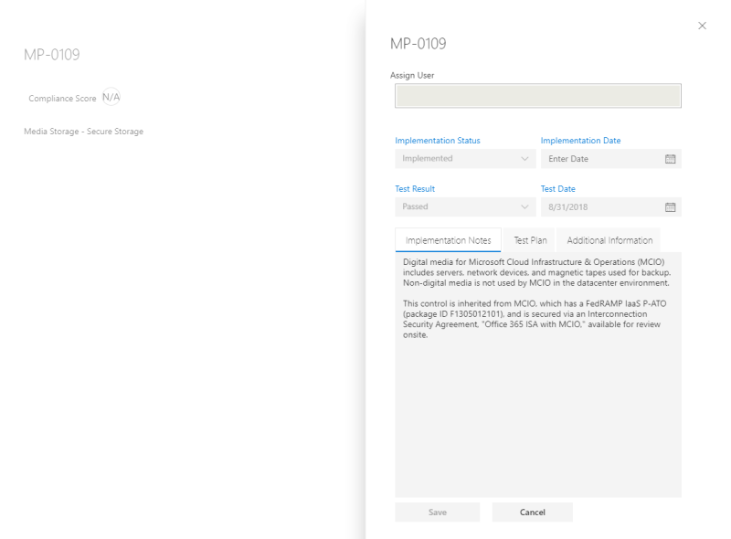

# Trabalhando com o Microsoft Compliance Manager (versão prévia)

> [!IMPORTANT]
> O gerente de conformidade da Microsoft é um painel e uma ferramenta de gerenciamento que fornece um resumo de seus Stature de proteção e conformidade de dados e recomendações para melhorar a proteção e conformidade dos dados. As ações do cliente fornecidas no gerente de conformidade são recomendações. A sua organização pode avaliar a eficácia dessas recomendações em seu respectivo ambiente normativo antes da implementação. As recomendações encontradas no Gerenciador de conformidade não devem ser interpretadas como garantia de conformidade.

## Gerenciador de conformidade do Access

O Gerenciador de conformidade pode ser acessado pelo portal de confiança do serviço Microsoft. Qualquer pessoa com uma conta da Microsoft ou uma conta organizacional do Azure Active Directory pode acessar o Gerenciador de conformidade.

1. Acesse [https://servicetrust.microsoft.com/ComplianceManager/V3](https://servicetrust.microsoft.com/ComplianceManager/V3).

2. Entre com sua conta de serviço Microsoft, que é a conta de usuário do Office 365, Microsoft 365 ou Azure Active Directory (Azure AD).

> [!NOTE]
> No portal de confiança do serviço, selecione **Gerenciador de conformidade**, que é a versão de visualização com os recursos mais atuais. Não selecione **Gerenciador de conformidade (clássico)**, que contém recursos herdados não cobertos por esta documentação.

## Administração

Há funções administrativas específicas que só estão disponíveis para o administrador global e só são visíveis quando você está conectado com uma conta de administrador global. O administrador global pode atribuir permissões de usuário e ativar atualizações automáticas de Pontuação de segurança.
  
### Atribuir funções do Gerenciador de Conformidade aos usuários

Depois que o administrador atribuir funções do Gerenciador de conformidade a outros usuários, esses usuários poderão exibir dados no Gerenciador de conformidade e realizar ações determinadas por sua função. O administrador também pode conceder acesso somente leitura ao Gerenciador de conformidade, atribuindo ao usuário a [função de leitor global no Azure Active Directory (Azure AD)](https://docs.microsoft.com/azure/active-directory/users-groups-roles/directory-assign-admin-roles#global-reader).

Cada função do gerente de conformidade tem permissões levemente diferentes. Você pode exibir as permissões atribuídas a cada função, ver quais usuários estão em quais funções e adicionar ou remover usuários dessa função através do portal de confiança do serviço. Selecione o item de menu **administrador** e escolha **configurações** para exibir.
  

  
Para adicionar ou remover usuários das funções do Gerenciador de Conformidade.
  
1. Acesse [https://servicetrust.microsoft.com](https://servicetrust.microsoft.com).

2. Entre com sua conta de administrador global do Azure Active Directory.

3. Na barra de menus superior do portal de confiança do serviço, selecione **administrador** e, em seguida, escolha **configurações**.

4. Na lista suspensa **selecionar função** , selecione a função que você deseja gerenciar.

5. Os usuários adicionados a cada função estão listados na página **Selecionar função**.

6. Para adicionar usuários a essa função, selecione **Adicionar**. Na caixa de diálogo **Adicionar usuários** , selecione o campo usuário. Você pode rolar pela lista de usuários disponíveis ou começar a digitar o nome do usuário para filtrar a lista com base no seu termo de pesquisa. Selecione o usuário para adicionar essa conta à lista de **Adicionar usuários** fornecida com essa função. Se quiser adicionar vários usuários simultaneamente, comece a digitar um nome de usuário para filtrar a lista e, em seguida, selecione o usuário a ser adicionado à lista. Selecione **salvar** para provisionar a função selecionada para esses usuários. 

    
  
7. Para remover usuários dessa função, selecione os usuários e selecione **excluir**.

    

### Controlar atualizações automáticas de Pontuação segura

As atualizações de Pontuação segura podem ser ativadas automaticamente para todas as ações, desativadas para todas as ações ou definidas por ação individual seguindo estas etapas.

1. Entre no portal de [confiança do serviço](https://servicetrust.microsoft.com) com sua conta de administrador global.

2. Na barra de menus superior do portal de confiança do serviço, em **mais**, selecione **administrador** e, em seguida, escolha **configurações**.

3. Na guia **Pontuação segura** , selecione o botão correspondente para **ativar todas as ações**, **desative todas as ações**ou **defina por ação.**

Se você escolher **definir por ação,** siga estas etapas adicionais para ativar as atualizações de Pontuação segura para ações individuais:

4. Selecione **Gerenciador de conformidade** no menu superior (Observação: não selecione "Gerenciador de conformidade (clássico)").

5. Selecione **Gerenciamento de locatário** no canto superior direito da tela.

6. No painel **ações do cliente** , encontre a ação pretendida com reticências (**...**) na coluna **ações afetadas** . Clique nas reticências e selecione **Editar.**

7. Alterne a opção de alternância de **atualização contínua de Pontuação segura** para **ativado.**

8. Selecione **salvar.** A monitoração contínua de Pontuação segura agora está ativada para essa ação.

**Observação:** Somente o administrador global pode ativar ou desativar as atualizações automáticas para todas as ações. O administrador do Gerenciador de conformidade pode ativar atualizações automáticas para ações individuais, mas não para todas as ações globalmente.

## Grupos

Os grupos são contêineres que permitem organizar as avaliações e compartilhar informações comuns e tarefas de fluxo de trabalho entre avaliações que têm o mesmo ou controles relacionados gerenciados pelo cliente.

Você pode agrupar avaliações de uma forma que seja lógica para você, como por ano, padrão, serviço ou baseado em equipes, divisões ou regiões da sua organização. Veja a seguir exemplos de dois grupos e suas avaliações subjacentes:
  
- **O FFIEC é avaliações de 2020**
  - Office 365 + FFIEC é
  - Intune + FFIEC é
- **As avaliações de privacidade e segurança de dados**
  - Office 365 + ISO 27001:2013
  - Office 365 + ISO 27018:2014

> [!NOTE]
> Recomendamos determinar uma estratégia de agrupamento para sua organização *antes* de adicionar novas avaliações.

Para começar, um grupo **padrão** é configurado para você que contém a linha de base de proteção de dados. Essa linha de base é um conjunto de controles que inclui normas e padrões comuns do setor ([saiba mais](compliance-score-methodology.md#initial-score-based-on-microsoft-365-data-protection-baseline)).

### Como criar um grupo

Os grupos não podem ser criados como entidades autônomas. Um grupo sempre deve conter pelo menos uma avaliação, portanto, para criar um grupo, você deve primeiro criar uma avaliação para colocar no grupo.

Siga as etapas abaixo para criar um grupo:

1. Crie uma nova avaliação selecionando **+ Add Assessment** próximo à parte superior do seu painel.
2. No painel de submenu de **avaliação** , insira um título para a avaliação e selecione um modelo no menu suspenso.
3. Em **Selecione um grupo ou adicione um novo grupo**, selecione **Adicionar um novo grupo** e insira o nome do grupo no campo abaixo.
4. Para copiar informações de um grupo existente, alterne o deseja **copiar os dados de um grupo existente?** alterne para **ativado.** Selecione o grupo que você deseja copiar do menu suspenso abaixo e marque as caixas de seleção dos campos que deseja transferir para a nova avaliação em seu novo grupo.
5. Selecione **Salvar**. Quando for concluído, o painel do submenu será fechado e você verá o novo grupo no painel.

O que saber ao trabalhar com grupos:
  
- Os nomes de grupo (também chamados de *IDs de grupo*) devem ser exclusivos em sua organização.
- Os grupos não têm propriedades de segurança. Todas as permissões são associadas a avaliações.
- Após adicionar uma avaliação a um grupo, o agrupamento não pode ser alterado. Você pode renomear o grupo de avaliação, que altera o nome do agrupamento de avaliação para todas as avaliações associadas a esse grupo.
- Controles de avaliação relacionados em avaliações diferentes no mesmo grupo são atualizados automaticamente quando concluído.
- Se você adicionar uma nova avaliação a um grupo existente, as informações comuns de avaliações nesse grupo serão copiadas para a nova avaliação.
- Os grupos podem conter Avaliações para a mesma certificação ou regulamentação, mas cada grupo só pode conter uma avaliação para um par específico de certificação de produto. Por exemplo, um grupo não pode conter duas avaliações para o Office 365 e o NIST CSF. Um grupo pode conter várias avaliações para o mesmo produto apenas se a certificação ou regulamentação correspondente de cada um for diferente.
- Ocultar uma apuração interrompe a relação entre essa avaliação e o grupo. Qualquer atualização adicional para outras avaliações relacionadas não é mais refletida na avaliação oculta. ([Saiba como ocultar avaliações.](#hide-a-template-or-an-assessment))
- Os grupos não podem ser excluídos.
- Quando uma alteração é feita em um item de ação que aparece em vários grupos, essa alteração é refletida em todas as instâncias desse item de ação.

## Gerenciamento de locatários de dimensões, proprietários & ações do cliente

A interface de **Gerenciamento de inquilino** permite que você gerencie essas configurações em toda a organização:

- **Dimensões:** Exibir metadados para modelos, avaliações e itens de ação que permitem que você crie pivôs personalizados para filtros.
- **Proprietários:** Preencher uma lista de partes responsáveis que podem ser associadas a ações.
- **Ações do cliente:** Gerencie a lista completa de itens de ações incluídas no Gerenciador de conformidade (visualização) e habilite/desabilite o monitoramento de Pontuação segura para ações integradas à pontuação segura.

Selecione **Gerenciamento de locatário** no canto superior direito da tela para abrir a interface de gerenciamento e use as etapas abaixo para gerenciar **dimensões**, **proprietários**e **ações do cliente**.

### Dimensões

As dimensões são conjuntos de metadados que fornecem informações sobre um modelo, uma avaliação ou um item de ação. As dimensões usam o conceito de chaves e valores, onde a chave de dimensão representa uma propriedade e o valor de dimensão representa valores válidos para a propriedade. Por exemplo, no Gerenciador de conformidade há três tipos de ações. Eles são definidos por uma chave de dimensão dos valores de finalidade e de dimensão de **ação** de **prevenção**, **detecção**e **correção**.

### Proprietários

Os proprietários são usados para identificar a pessoa responsável por cada controle. Todos os controles internos são de propriedade da Microsoft, de clientes ou de ambos. Você pode criar valores personalizados para proprietários que podem ser usados para especificar responsabilidades mais granulares em sua organização. Por exemplo, você pode criar proprietários que representam grupos específicos, equipes ou unidades de negócios dentro de sua organização.

#### Adicionar um proprietário

1. Abra o **Gerenciamento de locatários** e selecione **proprietários**.
2. Selecione **+ Adicionar proprietário**.
3. Forneça um nome e uma descrição para o proprietário e selecione **salvar**. A descrição é exibida na coluna proprietário.

#### Editar um proprietário

Não é possível editar o nome de um proprietário, mas você pode modificar a descrição que é exibida na coluna proprietário.

1. Abra o **Gerenciamento de locatários** e selecione **proprietários**.
2. Localize o proprietário que você deseja editar, selecione as reticências (...) ao lado dela e selecione **Editar**.
3. Modifique a descrição conforme necessário e selecione **salvar**.

#### Excluir um proprietário

1. Abra o **Gerenciamento de locatários** e selecione **proprietários**.
2. Localize o proprietário que você deseja excluir, selecione as reticências (...) ao lado dela e selecione **excluir**.
3. Quando a mensagem de confirmação for exibida, selecione **excluir**.

### Ações do cliente

A área ações do cliente mostra todas as ações do cliente para todos os modelos e avaliações no Gerenciador de conformidade (visualização).

Rapidamente, você pode ver o título de uma ação, proprietário, categoria, imposição e pontuação, e determinar se ele está integrado à pontuação segura. Você pode expandir uma ação e selecionar **ler mais** para ler a descrição da ação e acessar todos os links na descrição. Você também pode usar essa interface para habilitar e desabilitar a integração de Pontuação segura em uma base por ação e para adicionar ações personalizadas. As ações com recursos de integração de Pontuação segura têm reticências (...) ao lado delas (Observe que as ações personalizadas também têm reticências ao lado delas).

#### Habilitar ou desabilitar a integração de Pontuação segura

1. Selecione as reticências (...) da ação que você deseja modificar e selecione **Editar**.
2. Alterne a opção de atualização contínua de Pontuação segura para ativado ou desativado para habilitar ou desabilitar o monitoramento contínuo por meio de Pontuação segura.
3. Selecione **Salvar**.

Quando as organizações implantam pela primeira vez o Microsoft 365 ou o Office 365, leva aproximadamente sete dias para uma pontuação segura para coletar dados completamente e o fator de sua pontuação. Durante esse tempo, definir a opção de atualização contínua de Pontuação segura como **desativado** e definir manualmente uma ação a ser **implementada** contará essa ação em direção à sua pontuação. Após os sete dias iniciais, a ativação da atualização contínua de Pontuação segura habilitará o monitoramento contínuo desse ponto em diante.

Qualquer ação que não é suportada pela integração de Pontuação segura pode ser implementada manualmente. Uma implementação manual será fatorar a pontuação para o grupo dessa ação.

## Avaliações

Esta seção explica como exibir e trabalhar com suas avaliações, incluindo como adicionar novos, exportá-los, copiar informações de avaliações existentes e mantê-los atualizados por meio de controle de versão.

### Exibir uma avaliação e detalhes de ação
  
No painel de **avaliações** , selecione o nome da avaliação para abri-lo e exibir as informações sobre itens de ação e controles.

Veja um exemplo da avaliação do Office 365 e ISO 27001. O primeiro modo de exibição ilustra o novo modo de exibição itens de ação no Gerenciador de conformidade (visualização).

As ações são listadas em ordem alfabética e cada ação é atribuída a uma pontuação e um proprietário. Selecione o link **ler mais** para ler os detalhes de cada ação.

Selecione o link **revisar** para gerenciar, atribuir, implementar e testar a ação. Veja a seguir um exemplo de ação.

Use os campos a seguir para gerenciar o fluxo de trabalho de ação:

- **Atribuir usuário:** Selecione este campo para escolher ou inserir o usuário ao qual esta ação deve ser atribuída. Você pode rolar pela lista ou digitar um nome para localizá-lo e, em seguida, selecioná-lo.
- **Gerenciar documentos:** Você pode carregar evidências de implementação na forma de documentos do Office, arquivos de imagem e capturas de tela, saída do PowerShell em CSV ou TXT e PDFs.
- **Status da implementação:** Usado para indicar o status de implementação atual da ação. Os valores possíveis não são implementados, implementados, implementação alternativa, planejado e não no escopo.
- **Data de implementação:** A data na qual a ação foi realizada.
- **Resultado do teste:** Usado para indicar os resultados da validação da implementação. Os valores possíveis não são avaliados, aprovados, risco de falha-baixo, risco de falha médio, falha-alto risco e não em escopo.
- **Data do teste:** A data na qual a validação ocorreu.
- **Notas de implementação:** Insira os detalhes de implementação da sua organização, juntamente com as anotações que você deseja incluir.
- **Plano de teste:** Insira os detalhes do plano de teste para esta ação, juntamente com as anotações que você deseja incluir.
- **Informações adicionais:** Insira qualquer informação adicional sobre esta ação ou como ela foi implementada em sua organização, juntamente com as anotações que você deseja incluir.

No painel de **informações de controles** , você pode exibir informações de controles na avaliação e no nível do modelo. Veja a seguir um exemplo do painel de informações de controles para avaliações.

Para avaliações, o painel de informações de controles exibe as seguintes informações:

- Um menu suspenso de **grupo** para selecionar qual grupo exibir (ao usar vários grupos).
- Uma lista suspensa de **avaliação** para selecionar a avaliação a ser visualizada.
- Metadados sobre a avaliação selecionada, incluindo:
    - Um indicador de progresso para **controles avaliados** mostrando o número de controles avaliados sobre o número total de controles.
    - A **Pontuação de conformidade** atual da avaliação, mostrada como uma porcentagem.
    - Detalhes sobre a **certificação** e o **produto** usados na avaliação.
    - O **status** atual e a data da última **modificação** da avaliação.
- Uma lista dos **serviços de escopo** para avaliação.
- Detalhes dos controles, agrupados por família de controle, com links para ações do cliente e detalhes da implementação da Microsoft:
    - **Suas ações** exibe as ações do cliente que você pode executar para satisfazer alguns ou todos os requisitos do controle. Muitos controles têm várias ações associadas a eles, e todas as ações associadas a um controle são exibidas aqui. As ações aqui têm a mesma interface do usuário listadas no painel Ações.
    - **Microsoft Actions** exibe a lista de controles da estrutura interna da Microsoft que se aplicam ao controle de certificação selecionado. Para cada controle interno, selecione **implementado** para ver os detalhes de implementação e teste da Microsoft, juntamente com o resultado do teste e a data de teste, conforme mostrado abaixo.

### Adicionar uma avaliação
  
1. No painel de avaliações, selecione **+ Adicionar avaliação**.

2. Quando a lâmina for aberta, insira as seguintes informações:

    - **Título (obrigatório):** Insira um título para a avaliação
    - **Selecione um modelo (obrigatório):** Selecionar um modelo padrão ou personalizado
    - **Selecione um grupo ou adicione um novo grupo (obrigatório):** Selecione um grupo existente ou escolha Adicionar um novo grupo e forneça um nome de grupo exclusivo
    - **Você gostaria de copiar os dados de um grupo existente? (opcional):** alternar o controle para habilitar a cópia de grupo e, em seguida:
        - **Selecione um grupo (opcional):** Se a cópia do grupo estiver habilitada, selecione o grupo do qual copiar
            - **Detalhes da implementação (opcional):** Selecione para copiar os detalhes de implementação para o novo grupo
            - **Plano de teste & informações adicionais (opcional):** Selecione para copiar o plano de teste e detalhes de informações adicionais para o novo grupo
            - **Documentos (opcional):** Selecionar para copiar documentos para o novo grupo

3. Selecione **salvar** para criar a avaliação.

 A nova avaliação aparece no painel de avaliação e exibe as seguintes informações:

- O título da avaliação.
- As dimensões da avaliação, incluindo a certificação, o ambiente e o produto aplicados à avaliação.
- A data em que foi criada e a data em que foi modificada pela última vez.
- A pontuação de avaliação mostrada como uma porcentagem. Essa Pontuação inclui automaticamente as pontuações dos controles gerenciados pela Microsoft e da Pontuação segura.
- Indicadores de progresso que mostram o número de controles avaliados pela Microsoft e gerenciados pelo cliente.

### Copiar informações de avaliações existentes

Ao criar uma avaliação, você tem a opção de copiar informações de um grupo existente. A cópia permite que você aplique as informações inseridas na avaliação copiada para os mesmos controles na nova avaliação. Por exemplo, se você tiver um grupo para todas as avaliações relacionadas a FFIEC em sua organização, você pode copiar as seguintes informações de avaliações existentes:

- Detalhes da implementação
- Plano de teste & informações adicionais
- Documentos

#### Copiar informações de uma avaliação existente para uma nova avaliação
  
1. No painel de avaliação, selecione **+ Adicionar avaliação**.
    
2. Na janela **Adicionar uma avaliação** , preencha as seguintes informações

    - **Título (obrigatório):** Insira um título para a avaliação.
    - **Selecione um modelo (obrigatório):** Selecione um modelo padrão ou personalizado.
    - **Selecione um grupo ou adicione um novo grupo (obrigatório):** Escolha **Adicionar um novo grupo** e forneça um nome de grupo exclusivo.
    - **Você gostaria de copiar os dados de um grupo existente? (opcional):** ativar/desativar o controle para habilitar a cópia de grupo e:- **Selecione um grupo (opcional):** se a cópia do grupo estiver habilitada, selecione o grupo a partir do qual copiar.
            - **Detalhes da implementação (opcional):** Selecione para copiar os detalhes de implementação para o novo grupo.
            - **Plano de teste & informações adicionais (opcional):** Selecione para copiar o plano de teste e detalhes de informações adicionais para o novo grupo.
            - **Documentos (opcional):** Selecione para copiar documentos para o novo grupo.

3. Selecione **salvar** para criar a avaliação.

### Alertas de controle de versão para atualizações de avaliação

Quando uma atualização estiver disponível para uma avaliação, um ícone de alerta o notificará de que uma atualização está pronta. Quando você clica nesse ícone, uma janela pop-up explica a atualização e solicita que você aceite. Veja a seguir um exemplo do alerta de controle de versão para uma avaliação:

Selecionar o ícone de alerta revela um painel de submenu que explica a atualização e solicita que você aceite:

É altamente recomendável aceitar todas as atualizações quando você recebe notificações de atualização.

### Exportar uma avaliação

Você pode exportar uma avaliação para um arquivo do Excel para stakeholders de conformidade em sua organização ou para auditores externos e reguladores. O relatório é um instantâneo da avaliação a partir da data e hora em que o relatório foi criado. O relatório contém os detalhes de todos os controles da Microsoft e gerenciados pelo cliente para avaliação, o status da implementação do controle, a data de teste de controle, os resultados do teste e fornece links para documentos de evidência carregados.
  
### Exportar um relatório de avaliação
  
1. No painel do Gerenciador de conformidade, selecione a guia **informações sobre controles** .
2. Selecione o **grupo** e a **avaliação** nos menus suspensos da avaliação que você deseja exportar.
3. Selecione o botão **Exportar** .

O relatório de avaliação é baixado como um arquivo do Excel na sessão do navegador. O nome dos arquivos para o arquivo do Excel padrão é o título da avaliação.

### Ocultar um modelo ou uma avaliação

Quando você termina com um modelo ou avaliação e não precisa mais dele para fins de conformidade, é possível ocultá-lo em seu modo de exibição. Quando um modelo ou avaliação estiver oculto, ele será removido do modo de exibição padrão e você deverá selecionar a caixa de seleção **incluir oculto** para exibi-la.

> [!IMPORTANT]
> As avaliações ocultas não retêm seus links para documentos de evidência carregados. É altamente recomendável que você exporte uma avaliação antes de ocultá-la para manter links para documentos de evidência no relatório.
  
#### Ocultar um modelo

1. Abra o painel de **modelos** .
2. Localize o modelo que você deseja ocultar e nas reticências em sua linha, selecione **ocultar**.
3. Ao ver a mensagem de confirmação, selecione **ocultar**.

#### Ocultar uma avaliação

1. Abra o painel de **avaliações** .
2. Selecione o **grupo** na lista suspensa que contém a avaliação que você deseja ocultar.
3. Localize a avaliação que você deseja ocultar e, nas reticências, selecione **ocultar**.
4. Ao ver a mensagem de confirmação, selecione **ocultar**.

#### Exibir avaliações ocultas
  
1. Abra a guia painel de **avaliações** e marque a caixa de seleção **incluir ocultos** .
2. As avaliações ocultas aparecem na seção **avaliações ocultas** .

#### Reexibir uma avaliação

1. Na guia **avaliações** , marque a caixa de seleção **incluir ocultos** .
2. As avaliações ocultas aparecem na seção **avaliações ocultas** .
3. Localize a avaliação que você deseja Reexibir e, nas reticências, selecione **Reexibir**.
4. Ao ver a mensagem de confirmação, selecione **Reexibir**.

## Controles e ações

Controles e ações são os dados dinâmicos principais usados no Gerenciador de conformidade (visualização). O controle pivot, que existiu em versões anteriores do gerente de conformidade, foi aprimorado para mostrar os controles da Microsoft e de cliente nas mesmas famílias de controle. Esse modo de exibição consolidado facilita a visualização do modelo de responsabilidade compartilhada completo em uma base por controle. A ação Pivot é nova no Gerenciador de conformidade (prévia) e foi projetada para fornecer uma visão simplificada de todas as ações recomendadas pela Microsoft.

### Controles

Os controles podem ser exibidos no painel de informações de controles. Os controles representam os requisitos de um padrão, certificação, regulamentação ou estrutura. Para mapear esses requisitos entre vários padrões, regulamentações, etc., e para associá-los a ações, tudo é tratado como se fosse uma estrutura de controle. Por exemplo, como uma estrutura de controle, as regulamentações, como HIPAA, foram divididas por seção e os controles HIPAA no gerente de conformidade usam o mesmo esquema de numeração que essas seções, conforme mostrado abaixo:

Há três tipos de controles:

1. **Controles gerenciados pela Microsoft:** são controles para os quais somente a Microsoft tem responsabilidade. Eles aparecem nos modelos da caixa de entrada e são adicionados ao gerente de conformidade da Microsoft.
2. **Controles gerenciados pelo cliente:** são controles para os quais somente os clientes têm responsabilidade. Eles aparecem nos modelos da caixa de entrada e são adicionados ao gerente de conformidade por clientes.
3. **Controles de gerenciamento compartilhado:** são controles onde a responsabilidade é compartilhada entre a Microsoft e o cliente. Eles aparecem nos modelos da caixa de entrada e são adicionados ao Gerenciador de conformidade da Microsoft. O cliente também pode editar ou desabilitar os controles gerenciados pela Microsoft.

### Itens de ações

Itens de ações são as tarefas recomendadas para a implementação dos requisitos de um padrão ou regulamento, ou para testar, verificar e documentar os requisitos de implementação da sua organização. As ações são associadas a um ou mais controles. Cada controle tem uma ou mais ações associadas a ele, e cada ação pode ser associada a um ou mais controles. As ações fazem parte do fluxo de trabalho principal no Gerenciador de conformidade (visualização), já que são os objetos atribuídos, controlados e validados pela organização.

#### Atribuir itens de ação
  
1. No painel **itens de ação** , selecione o **grupo** que contém a (s) avaliação (ões) cuja ação você deseja atribuir.
2. Na lista suspensa de **avaliação** , selecione a avaliação cuja ação você deseja atribuir ou selecione **todas** na lista suspensa para ver todas as ações disponíveis.
3. Localize a ação que você deseja atribuir e, na coluna **proprietário** , selecione o link para **revisão**, * * implementado ou **testar**.
4. Selecione o campo **atribuir usuário** e uma lista de usuários em sua organização aparecerá. Role a lista e selecione usuário ou filtro a lista para selecionar um usuário digitando o nome do usuário.
5. No campo notas de implementação, insira as anotações que você deseja transmitir para o usuário atribuído.
6. Selecione **salvar** para atribuir a ação.

#### Reatribuir itens de ação

Essa função permite que uma organização remova as dependências ativas ou pendentes da conta de usuário Reatribuindo uma ação a um novo usuário.

1. No painel **itens de ação** , selecione o **grupo** que contém a (s) avaliação (ões) cuja ação você deseja reatribuir.
2. Na lista suspensa de **avaliação** , selecione a avaliação cuja ação você deseja reatribuir ou selecione **todas** na lista suspensa para ver todas as ações disponíveis.
3. Localize a ação que você deseja reatribuir e, na coluna **proprietário** , selecione o link para **revisão**, **implementação**ou **teste**.
4. Exclua o usuário existente do campo **atribuir usuário** e escolha um usuário diferente na lista de usuários ou filtre a lista para selecionar um usuário digitando o nome do usuário.
5. No campo notas de implementação, insira as anotações que você deseja transmitir para o usuário.
6. Selecione **salvar** para reatribuir a ação.

#### Status de sincronização de itens de ação comuns entre grupos

Se sua organização tiver vários grupos de avaliações, haverá um comportamento de ações técnicas (isto é, ações que afetam toda a organização). Todas as ações duplicadas entre grupos agora são combinadas em uma única ação. Essa ação única contém todas as anotações e evidências carregadas de versões previamente duplicadas. Qualquer alteração feita na ação em um grupo ou avaliação será refletida em todas as instâncias dessa ação. Os campos **status da implementação**, data de **implementação**, status do **teste**e data de **teste** refletem as atualizações mais recentes.

## Modelos

Um modelo é o objeto base no Gerenciador de conformidade (visualização) associado a um produto e uma certificação (por exemplo, padrão, regulamento, estrutura de controle, etc.). Os modelos podem ser exibidos e adicionados a partir do painel **modelos** .

 
O painel exibe cada modelo, juntamente com a certificação e o produto associados ao modelo, as datas em que o modelo foi criado e modificado pela última vez, o número de controles gerenciados pelo cliente e a Microsoft, a pontuação de conformidade máxima do modelo e o status do modelo (por exemplo, aprovado, aprovação pendente, importado).

### Criar um modelo

Há três maneiras de trabalhar com modelos para criar avaliações:

1. Use um dos modelos pré-configurados fornecidos pela Microsoft.
2. Personalizar um modelo pré-configurado com suas próprias ações e controles por meio do processo de extensão.
3. Crie seu próprio modelo e importe-o para o Gerenciador de conformidade.

#### Usar um modelo pré-configurado da Microsoft

Os modelos pré-configurados estão disponíveis no painel de **modelos** . Exibir a [lista atual de modelos](compliance-manager-overview.md#templates), que é atualizada sempre que um novo modelo está disponível.

#### Personalizar um modelo por meio do processo de extensão

1. Abra o painel de **modelos** e selecione **+ Adicionar modelo**.
2. No painel do menu suspenso modelo, marque a caixa de seleção **criar extensão a partir do modelo global** .
3. Selecione o modelo que você deseja estender no menu suspenso.
4. Se você ainda não tiver formatado seus dados de modelo no Excel, selecione o link no painel de submenus para baixar um arquivo do Excel. Preencha a planilha de acordo com as instruções de [importação de dados do modelo com o Excel](#import-template-data-with-excel) e salve-o em sua unidade local.
5. Importe os dados do modelo personalizado selecionando **procurar** para carregar o arquivo do Excel.
6. Selecione **Adicionar ao painel**. Em seguida, você verá o novo modelo adicionado ao painel **modelos** .

#### Criar seu próprio modelo e importá-lo para o Gerenciador de conformidade

1. Abra o painel de **modelos** e selecione **+ Adicionar modelo**.
2. No painel do menu suspenso modelo, selecione **criar um novo modelo**.
3. Importe os dados do modelo selecionando **procurar** para carregar o arquivo do Excel que contém os dados (consulte [importar dados de modelo com o Excel](#import-template-data-with-excel) abaixo).
4. Selecione **Adicionar ao painel**. Em seguida, você verá o novo modelo adicionado ao painel **modelos** .

#### Importar dados de modelo com o Excel

Para modificar um modelo ou criar seu próprio modelo, você usará uma [planilha do Excel](https://go.microsoft.com/fwlink/?linkid=2124865) para capturar os dados necessários e carregá-los no Gerenciador de conformidade. Este modelo de planilha tem um formato e esquema específicos que deve ser usado ou não será importado para o Gerenciador de conformidade.

> [!IMPORTANT]
> Se você já criou ou personalizou modelos no Gerenciador de conformidade, **esse processo foi atualizado** como parte da versão de abril de 2020 do gerente de conformidade (visualização). **Revise esta seção com cuidado.**

A planilha contém quatro guias, três das quais são necessárias:

1. Modelo (obrigatório)
2. ControlFamily (obrigatório)
3. Ações (obrigatório)
4. Dimensões (opcional)

Sua planilha **deve incluir as guias nesta ordem**, caso contrário, seus dados não serão importados com êxito para um modelo.

##### Guia modelo

A guia **modelo** é necessária. As informações nesta guia fornecem metadados sobre o modelo. Há quatro colunas obrigatórias. As colunas devem reter a ordem na planilha do Excel, conforme listado abaixo. Você pode adicionar sua própria coluna **depois** das quatro colunas para fornecer suas próprias dimensões. Se você fizer isso, adicione-os à guia **dimensões** usando as [instruções abaixo](#dimensions-tab).

- **título**: Este é o título do seu modelo, que deve ser exclusivo. Não é possível compartilhar um nome com outro modelo que você tem no gerente de conformidade, seja ele um modelo que você já tenha criado ou um modelo pré-configurado fornecido pela Microsoft.

- **produto**: esta é uma dimensão obrigatória. Listar o produto associado ao modelo.

- **certificação**: esta é a regulamentação que você está usando para o modelo.

- **Inscopeservices**: estes são os serviços do produto que esta avaliação resolve (por exemplo, se você listou o Office 365 como produto, o Microsoft Teams pode ser um serviço no escopo). Você pode listar vários serviços separados por dois pontos e vírgulas.

> [!NOTE]
> Sobre o produto e a certificação: os dados inseridos no **produto** e nas células de **certificação** não podem ser editados após a importação da planilha para criar ou personalizar um modelo. Além disso, um grupo não pode conter duas avaliações que tenham a mesma combinação de **produto/certificação** . Você pode ter vários modelos com a mesma combinação de produto/certificação.

##### Guia ControlFamily

A guia **ControlFamily** é necessária.  As colunas obrigatórias nesta guia, que devem seguir a ordem fornecida na planilha de exemplo, são:

- **ControlName**: Este é o nome do controle da certificação, padrão ou regulamentação, que normalmente é um tipo de ID. Os nomes de controle devem ser exclusivos em um modelo. Não é possível ter vários controles com o mesmo nome na planilha.

- **controlFamily**: forneça uma palavra ou frase para o controlFamily, que identifica um amplo agrupamento de controles. Um controlFamily não precisa ser exclusivo; Ele pode ser listado mais de uma vez em uma planilha. O mesmo controlFamily também pode ser listado em vários modelos, embora não tenham nenhuma relação entre si. Cada controlFamily deve ser mapeado para pelo menos um controle.

- **controlTitle**: forneça um título para o controle. Enquanto o ControlName é um código de referência, o título é um formato Rich Text geralmente visto nas regulamentações.

- **controlDescription**: forneça uma descrição do controle.

- **controlActionTitle**: Este é o título de uma ação que você deseja relacionar a este controle. Você pode adicionar várias ações separando por dois pontos e vírgulas sem espaço entre elas. Todos os controles que você lista deve incluir pelo menos uma ação, e a ação deve existir (o que significa que você pode listar uma ação listada na guia **ações** da mesma planilha, uma ação que existe em um modelo diferente ou uma ação criada pela Microsoft). Diferentes controles podem fazer referência à mesma ação.

##### Guia ações

A guia **ações** é necessária.  Ele designa ações da sua organização e não as ações da Microsoft, que já existem no gerente de conformidade. As colunas necessárias para esta guia, que devem seguir a ordem fornecida na planilha de exemplo, são:

- **actionTitle**: Este é o título da ação e é um campo obrigatório. O título fornecido deve ser exclusivo. **Importante**: se você se referir a uma ação que já existe (como em outro modelo) e modificar qualquer um de seus elementos nas colunas subsequentes, essas alterações serão propagadas para a mesma ação em outros modelos.

- **ImplementationType**: neste campo obrigatório, liste um dos três tipos de implementação abaixo:
    - **Operações operacionais** implementadas por pessoas e processos para proteger a confidencialidade, integridade e disponibilidade de sistemas organizacionais, ativos, dados e funcionários (exemplo: reconhecimento de segurança e treinamento)
    - **Técnicas** -ações concluídas por meio do uso de tecnologia e mecanismos contidos nos componentes de hardware, software ou firmware do sistema de informações para proteger a confidencialidade, integridade e disponibilidade de sistemas e dados organizacionais (exemplo: autenticação multifator)
    - **Documentação** -ações implementadas por meio de políticas e procedimentos documentados que estabelecem e definem os controles necessários para proteger a confidencialidade, integridade e disponibilidade de sistemas organizacionais, ativos, dados e funcionários (exemplo: uma política de segurança de informações)

- **actionScore**: neste campo obrigatório, forneça um valor numérico de Pontuação para a ação. Deve ser um número inteiro variando de 1 a 99; Ele não pode ser 0, nulo ou vazio. Quanto maior o número, maior o valor para melhorar a postura de conformidade. Para obter orientação, confira a seguir como a Microsoft classifica seus controles:

- **actionDescriptionTitle**: Este é o título da descrição e é obrigatório. Este título de descrição permite que você tenha a mesma ação em vários modelos e, em seguida, uma descrição diferente em cada modelo.  Este campo ajuda você a esclarecer em qual modelo a descrição faz referência. Na maioria dos casos, é possível colocar o nome do modelo que você está criando nesse campo.

- **actionDescription**: forneça uma descrição da ação. Você pode aplicar formatação, como texto em negrito e hiperlinks. Este é um campo obrigatório.

- **Dimension-propósito de ação**: Este é um campo opcional. Se você incluir, o cabeçalho deve incluir o prefixo "Dimension-". Qualquer dimensão que você incluir aqui será usada como [filtros na pontuação de conformidade](compliance-score-setup.md#filtering-your-dashboard-view) e aparecerá na [página de detalhes de ações de melhoria na pontuação de conformidade](working-with-compliance-score.md#view-your-improvement-actions).

##### Guia dimensões

A guia **dimensões** é opcional. No entanto, se você fizer referência a uma dimensão em outro lugar, precisará especificá-la aqui se ela não existir em um modelo já criado ou em um modelo do Microsoft. As colunas desta guia estão listadas abaixo:

- **dimensionKey**: list como "Product", "certifications", "Action purpose"
- **dimensionvalue**: exemplos: Office 365, HIPPA, preventivo, detecção

Você pode exibir as dimensões existentes indo para o **Gerenciamento de locatários** e selecionando a guia **dimensões** . Além disso, sempre que você exportar um modelo existente, a planilha exportada terá a guia **dimensões** , que lista todas as dimensões usadas no modelo.

### Modificar um modelo existente

Para fazer alterações em um modelo que você criou ou personalizou usando o processo de importação descrito acima, use o mesmo processo para importar essas alterações no modelo.

> [!NOTE]
> Há vários fatores importantes que devem ser cientes à medida que você edita os componentes do modelo, portanto, leia esta seção com cuidado.

#### Processo geral para modificar um modelo

Para fazer alterações em um dos modelos existentes da sua organização, o processo geral é:

1. No painel **modelos** , selecione o modelo que você deseja modificar, que exibe o painel informações de seus **controles** mostrando a guia **modelo** .
2. A partir daqui, selecione **Exportar**. Uma planilha do Excel com todos os seus dados de modelo será baixada.
3. Para editar, adicionar ou remover uma ação, consulte as seções a seguir.
4. Quando você terminar de fazer alterações no arquivo do Excel, importe o arquivo de volta para o modelo selecionando o modelo no painel e selecionando **importar**. Agora, o modelo incluirá as alterações feitas.

#### Para editar atributos de modelo

Na guia **modelos** , é possível editar qualquer coisa na coluna **título** , a coluna **inscopeservices** , e em qualquer outra coluna que você possa ter adicionado. No entanto, não é possível editar nada nas colunas **produto** ou **certificação** .

#### Para adicionar uma ação a um modelo

1. Vá para a guia **ações** e adicione suas informações nos campos obrigatórios da primeira linha vazia abaixo de suas ações existentes.
2. Vá para a guia **ControlFamily** . Localize a linha que contém o controle para o qual sua ação é mapeada. Adicione sua nova ação à coluna **controlActionTitle** nessa linha (Lembre-se de separar várias ações nesse campo com dois pontos e vírgulas, sem espaço entre elas).
3. Salve sua planilha no computador local.

#### Para editar as informações de uma ação

Você pode alterar as informações de qualquer ação *, exceto seu título*. Você pode editar qualquer célula das colunas B em diante e ao importar o arquivo de volta para o modelo, as ações nesse modelo agora conterá os dados atualizados.

Não é possível editar o **actionTitle** (coluna A) porque, se você fizer isso, o Gerenciador de conformidade considera que isso seja uma nova ação. Se você quiser alterar o nome de uma ação, consulte as instruções imediatamente abaixo.

#### Para alterar o nome de uma ação

Se você deseja alterar o nome de uma ação, é preciso designar explicitamente na planilha que você está substituindo um nome existente por um novo nome. Para alterar o nome de uma ação, siga estas etapas:

1. Na guia **ações** da planilha, adicione uma nova coluna à planilha após A coluna a.
2. Nesta nova coluna, que agora é a coluna B, coloque o cabeçalho na linha 1: **oldActionTitle**.
3. Copie o conteúdo da coluna A e cole-o na coluna B. Isso coloca os títulos de ações existentes, que são o que você deseja alterar, na coluna B.
4. Na coluna A, **actionTitle**, exclua o nome antigo e substitua-o pelo novo nome da ação.

#### Para remover uma ação de um modelo

A exclusão de uma ação de uma linha em **uma planilha não** remove a ação do modelo que você está editando. Em vez disso, siga o processo abaixo para remover uma ação:

1. Na guia **ações** , insira uma nova coluna como A coluna a **e colocar na linha de cabeçalho** , que é a linha número um.
2. Na linha da ação que você deseja remover, coloque **delete** na coluna A para essa linha.
3. Certifique-se de que essa ação não é mais referenciada por um controle. Vá para a guia **ControlFamily** e procure o título da ação na coluna F, que é **controlActionTitle**.
4. Quando você encontrar a ação listada na coluna **controlActionTitle** , exclua-a.
5. Salve sua planilha no computador local.

Quando você importar sua planilha de volta para o modelo, sua ação será removida do modelo. Remover uma ação de um modelo não remove completamente a ação. Essa ação ainda pode ser referenciada por outro modelo.

Se você estiver removendo a última ação que um controle faz referência, será necessário remover o controle.

> [!NOTE]
> Para remover um controle: Siga o mesmo processo para remover uma ação, conforme descrito acima. Na guia **ControlFamily** , adicione uma coluna de **operação** e coloque **delete** ao lado do controle que você deseja remover.

### Atualizações para modelos

Cada vez que uma avaliação é atualizada por meio do processo de controle de versão, sua avaliação personalizada herdará essas atualizações e manterá seus controles personalizados. Veja [alertas de controle de versão para atualizações de avaliação](#versioning-alerts-for-assessment-updates).

### Exportar um modelo para JSON

O Gerenciador de conformidade (visualização) oferece suporte à exportação de modelos para o formato JSON (JavaScript Object Notation). Isso permite que você troque os dados do Gerenciador de conformidade com outros sistemas que dão suporte a JSON.

## Relatórios

Você pode exportar uma avaliação para um arquivo do Excel para stakeholders de conformidade em sua organização ou para auditores externos e reguladores. O relatório é um instantâneo da avaliação a partir da data e hora da exportação. O relatório contém os detalhes do Microsoft e dos controles gerenciados pelo cliente para avaliação, o status da implementação do controle, a data de teste de controle, os resultados do teste e os links para documentos de evidência carregados. Como as avaliações ocultas não retêm links para documentos carregados, você deve exportar a avaliação antes de ocultá-la.

### Exportar uma avaliação

1. No painel do Gerenciador de conformidade, selecione a guia **informações sobre controles** .
2. Selecione o grupo e a avaliação nos menus suspensos da avaliação que você deseja exportar.
3. Selecione exportar. A exportação de avaliação é baixada como um arquivo do Excel.

## Permissions

A tabela a seguir descreve cada permissão do Gerenciador de conformidade e o que ele permite fazer. A tabela também indica a função que cada permissão é atribuída.

||**Leitor global do Azure AD**|**Leitor do Gerenciador de Conformidade**|**Colaborador do Gerenciador de Conformidade**|**Consultor do Gerenciador de Conformidade**|**Administrador do Gerenciador de Conformidade**|**Administrador do Portal**|
|:-----|:-----|:-----|:-----|:-----|:-----|:-----|
|**Ler dados:** Os usuários podem ler mas não editar dados (exceto para o modelo de dados e gerenciamento de locatários).    | X | X | X | X | X  | X |
|**Editar dados:** Os usuários podem editar todos os campos, exceto os campos resultado do teste e data de teste (exceto os dados de modelo e o gerenciamento de locatários).    ||| X | X  | X | X |
|**Edite os resultados do teste:** Os usuários podem editar os campos resultado do teste e data de teste.    |||| X | X | X |
|**Gerenciar avaliações:** Os usuários podem criar, arquivar e excluir avaliações.    ||||| X | X |
|**Gerenciar dados mestres:** Os usuários podem exibir, editar e excluir dados de modelo e dados de gerenciamento de locatários.    ||||| X | X |
|**Gerenciar usuários:** Os usuários podem adicionar outros usuários em sua organização às funções leitor, colaborador, consultor e administrador. Somente os usuários com a função de administrador global em sua organização podem adicionar ou remover usuários da função de administrador do Portal.    |||||| X |
