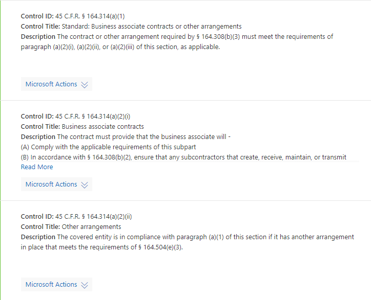

# Trabalhando com o Microsoft Compliance Manager (versão prévia)Working with Microsoft Compliance Manager (preview)

> [!IMPORTANT]
> O gerente de conformidade da Microsoft é um painel e uma ferramenta de gerenciamento que fornece um resumo de seus Stature de proteção e conformidade de dados e recomendações para melhorar a proteção e conformidade dos dados.Microsoft Compliance Manager is a dashboard and management tool that provides a summary of your data protection and compliance stature and recommendations to improve data protection and compliance. As ações do cliente fornecidas no gerente de conformidade são recomendações.The customer actions provided in Compliance Manager are recommendations. A sua organização pode avaliar a eficácia dessas recomendações em seu respectivo ambiente normativo antes da implementação.It is up to your organization to evaluate the effectiveness of these recommendations in their respective regulatory environment prior to implementation. As recomendações encontradas no Gerenciador de conformidade não devem ser interpretadas como uma garantia de conformidade.Recommendations found in Compliance Manager should not be interpreted as a guarantee of compliance.

## Gerenciador de conformidade do AccessAccess Compliance Manager

O Gerenciador de conformidade pode ser acessado pelo portal de confiança do serviço Microsoft.Compliance Manager is accessible from the Microsoft Service Trust Portal. Qualquer pessoa com uma conta da Microsoft ou uma conta organizacional do Azure Active Directory pode acessar o Gerenciador de conformidade.Anyone with a Microsoft account or Azure Active Directory organizational account can access Compliance Manager.

1. Acesse [https://servicetrust.microsoft.com/ComplianceManager/V3](https://servicetrust.microsoft.com/ComplianceManager/V3).Go to [https://servicetrust.microsoft.com/ComplianceManager/V3](https://servicetrust.microsoft.com/ComplianceManager/V3).

2. Entre com sua conta de serviço Microsoft, que é a conta de usuário do Office 365, Microsoft 365 ou Azure Active Directory (Azure AD).Sign in with your Microsoft service account, which is your Office 365, Microsoft 365, or Azure Active Directory (Azure AD) user account.

> [!NOTE]
> No portal de confiança do serviço, selecione **Gerenciador de conformidade**, que é a versão de visualização com os recursos mais atuais.In the Service Trust Portal, select **Compliance Manager**, which is the preview version with the most current features. Não selecione **Gerenciador de conformidade (clássico)**, que contém recursos de lançamento antecipado não cobertos por esta documentação.Do not select **Compliance Manager (Classic)**, which contains early-release features not covered by this documentation.

## AdministraçãoAdministration

Há funções administrativas específicas que só estão disponíveis para o administrador global e só são visíveis quando você está conectado com uma conta de administrador global.There are specific administrative functions that are only available to the global administrator and only visible when logged in with a global administrator account. O administrador global pode atribuir permissões de usuário e ativar atualizações automáticas de Pontuação de segurança.The global administrator can assign user permissions and turn on automatic Secure Score updates.
  
### Atribuir funções do Gerenciador de Conformidade aos usuáriosAssigning Compliance Manager roles to users

Depois que o administrador atribuir funções do Gerenciador de conformidade a outros usuários, esses usuários poderão exibir dados no Gerenciador de conformidade e realizar ações determinadas por sua função.Once the administrator assigns Compliance Manager roles to other users, those users can view data in Compliance Manager and perform actions determined by their role. O administrador também pode conceder acesso somente leitura ao Gerenciador de conformidade, atribuindo ao usuário a [função de leitor global no Azure Active Directory (Azure AD)](https://docs.microsoft.com/azure/active-directory/users-groups-roles/directory-assign-admin-roles#global-reader).The administrator can also give read-only access to Compliance Manager by assigning the user the [Global Reader role in Azure Active Directory (Azure AD)](https://docs.microsoft.com/azure/active-directory/users-groups-roles/directory-assign-admin-roles#global-reader).

Cada função do gerente de conformidade tem permissões levemente diferentes.Each Compliance Manager role has slightly different permissions. Você pode exibir as permissões atribuídas a cada função, ver quais usuários estão em quais funções e adicionar ou remover usuários dessa função através do portal de confiança do serviço.You can view the permissions assigned to each role, see which users are in which roles, and add or remove users from that role through the Service Trust Portal. Selecione o item de menu **administrador** e escolha **configurações** para exibir.Select the **Admin** menu item, and choose **Settings** to view.
  

  
Para adicionar ou remover usuários das funções do Gerenciador de Conformidade.To add or remove users from Compliance Manager roles.
  
1. Acesse [https://servicetrust.microsoft.com](https://servicetrust.microsoft.com).Go to [https://servicetrust.microsoft.com](https://servicetrust.microsoft.com).

2. Entre com sua conta de administrador global do Azure Active Directory.Sign in with your Azure Active Directory global administrator account.

3. Na barra de menus superior do portal de confiança do serviço, selecione **administrador** e, em seguida, escolha **configurações**.On the Service Trust Portal top menu bar, select **Admin** and then choose **Settings**.

4. Na lista suspensa **selecionar função** , selecione a função que você deseja gerenciar.In the **Select Role** drop-down list, select the role that you want to manage.

5. Os usuários adicionados a cada função estão listados na página **Selecionar função**.Users added to each role are listed on the **Select Role** page.

6. Para adicionar usuários a essa função, selecione **Adicionar**.To add users to this role, select **Add**. Na caixa de diálogo **Adicionar usuários** , selecione o campo usuário.In the **Add Users** dialog, select the user field. Você pode rolar pela lista de usuários disponíveis ou começar a digitar o nome do usuário para filtrar a lista com base no seu termo de pesquisa.You can scroll through the list of available users or begin typing the user name to filter the list based on your search term. Selecione o usuário para adicionar essa conta à lista de **Adicionar usuários** fornecida com essa função.Select the user to add that account to the **Add Users** list provisioned with that role. Se quiser adicionar vários usuários simultaneamente, comece a digitar um nome de usuário para filtrar a lista e, em seguida, selecione o usuário a ser adicionado à lista.If you would like to add multiple users concurrently, begin typing a user name to filter the list, and then select the user to add to the list. Selecione **salvar** para provisionar a função selecionada para esses usuários.Select **Save** to provision the selected role to these users. 

    
  
7. Para remover usuários dessa função, selecione os usuários e selecione **excluir**.To remove users from this role, select the users and select **Delete**.

    

### Controlar atualizações automáticas de Pontuação seguraControlling automatic Secure Score updates

As atualizações de Pontuação segura podem ser ativadas automaticamente para todas as ações, desativadas para todas as ações ou definidas por ação individual seguindo estas etapas.Secure Score updates can be turned on automatically for all actions, turned off for all actions, or set by individual action by following these steps.

1. Entre no portal de [confiança do serviço](https://servicetrust.microsoft.com) com sua conta de administrador global.Sign in to the [Service Trust Portal](https://servicetrust.microsoft.com) with your global administrator account.

2. Na barra de menus superior do portal de confiança do serviço, em **mais**, selecione **administrador** e, em seguida, escolha **configurações**.On the Service Trust Portal top menu bar, under **More**, select **Admin** and then choose **Settings**.

3. Na guia **Pontuação segura** , selecione o botão correspondente para **ativar todas as ações**, **desative todas as ações**ou **defina por ação.**In the **Secure Score** tab, select the corresponding button to either **turn on for all actions**, **turn off for all actions**, or **set per action.**

Se você escolher **definir por ação,** siga estas etapas adicionais para ativar as atualizações de Pontuação segura para ações individuais:If you choose **set per action,** take these additional steps to turn on Secure Score updates for individual actions:

4. Selecione **Gerenciador de conformidade** no menu superior (Observação: não selecione "Gerenciador de conformidade (clássico)").Select **Compliance Manager** from the top menu (note: do not select "Compliance Manager (classic)").

5. Selecione **Gerenciamento de locatário** no canto superior direito da tela.Select **Tenant Management** in the upper-right corner of your screen.

6. No painel **ações do cliente** , encontre a ação pretendida com reticências (**...**) na coluna **ações afetadas** .On the **Customer Actions** pane, find your intended action with an ellipsis (**...**) under the **Affected Actions** column. Clique nas reticências e selecione **Editar.**Click on the ellipses and select **Edit.**

7. Alterne a opção de alternância de **atualização contínua de Pontuação segura** para **ativado.**Switch the **Secure Score continuous update** toggle switch to **On.**

8. Selecione **salvar.**Select **Save.** A monitoração contínua de Pontuação segura agora está ativada para essa ação.Secure Score continuous monitoring is now turned on for that action.

**Observação:** Somente o administrador global pode ativar ou desativar as atualizações automáticas para todas as ações.**Note:** Only the global administrator can turn on or off automatic updates for all actions. O administrador do Gerenciador de conformidade pode ativar atualizações automáticas para ações individuais, mas não para todas as ações globalmente.The Compliance Manager administrator can turn on automatic updates for individual actions, but not for all actions globally.

## GruposGroups

Os grupos são contêineres que permitem organizar as avaliações e compartilhar informações comuns e tarefas de fluxo de trabalho entre avaliações que têm o mesmo ou controles relacionados gerenciados pelo cliente.Groups are containers that allow you to organize Assessments and share common information and workflow tasks between Assessments that have the same or related customer-managed controls.

Você pode agrupar avaliações de uma forma que seja lógica para você, como por ano, padrão, serviço ou baseado em equipes, divisões ou regiões da sua organização.You can group Assessments in a way that is logical to you, such as by year, standard, service, or based on your organization's teams, divisions, or geographies. Veja a seguir exemplos de dois grupos e suas avaliações subjacentes:Below are examples of two groups and their underlying Assessments:
  
- **O FFIEC é avaliações de 2020****FFIEC IS Assessments 2020**
  - Office 365 + FFIEC éOffice 365 + FFIEC IS
  - Intune + FFIEC éIntune + FFIEC IS
- **As avaliações de privacidade e segurança de dados****Data Security and Privacy Assessments**
  - Office 365 + ISO 27001:2013Office 365 + ISO 27001:2013
  - Office 365 + ISO 27018:2014Office 365 + ISO 27018:2014

> [!NOTE]
> Recomendamos determinar uma estratégia de agrupamento para sua organização *antes* de adicionar novas avaliações.We recommend determining a grouping strategy for your organization *before* adding new Assessments.

Para começar, um grupo **padrão** é configurado para você que contém a linha de base de proteção de dados.To get you started, a **Default** group is set up for you that contains the Data Protection Baseline. Essa linha de base é um conjunto de controles que inclui normas e padrões comuns do setor ([saiba mais](compliance-score-methodology.md#initial-score-based-on-microsoft-365-data-protection-baseline)).This baseline is a set of controls that includes common industry regulations and standards ([learn more](compliance-score-methodology.md#initial-score-based-on-microsoft-365-data-protection-baseline)).

### Como criar um grupoHow to create a group

Os grupos não podem ser criados como entidades autônomas.Groups cannot be created as standalone entities. Um grupo sempre deve conter pelo menos uma avaliação, portanto, para criar um grupo, você deve primeiro criar uma avaliação para colocar no grupo.A group must always contain at least one Assessment, so in order to create a group, you must first create an Assessment to put in the group.

Siga as etapas abaixo para criar um grupo:Follow the steps below to create a group:

1. Crie uma nova avaliação selecionando **+ Add Assessment** próximo à parte superior do seu painel.Create a new Assessment by selecting **+ Add Assessment** near the top of your dashboard.
2. No painel de submenu de **avaliação** , insira um título para a avaliação e selecione um modelo no menu suspenso.From the **Assessment** flyout pane, enter a title for your Assessment and select a template from the drop-down menu.
3. Em **Selecione um grupo ou adicione um novo grupo**, selecione **Adicionar um novo grupo** e insira o nome do grupo no campo abaixo.At **Please select a group or add a new group**, select **Add a new group** and enter your group name in the field below.
4. Para copiar informações de um grupo existente, alterne o deseja **copiar os dados de um grupo existente?** alterne para **ativado.**To copy information from an existing group, toggle the **Would you like to copy the data from an existing group?** switch to **On.** Selecione o grupo que você deseja copiar do menu suspenso abaixo e marque as caixas de seleção dos campos que deseja transferir para a nova avaliação em seu novo grupo.Select the group you want to copy from the drop-down menu underneath, and select the checkboxes of any fields you want to carry over to the new Assessment in your new group.
5. Selecione **Salvar**.Select **Save**. Quando for concluído, o painel do submenu será fechado e você verá o novo grupo no painel.When completed, the flyout pane closes and you'll see your new group on your dashboard.

O que saber ao trabalhar com grupos:What to know when working with groups:
  
- Os nomes de grupo (também chamados de *IDs de grupo*) devem ser exclusivos em sua organização.Group names (also called *Group IDs*) must be unique within your organization.
- Os grupos não têm propriedades de segurança.Groups do not have any security properties. Todas as permissões são associadas a avaliações.All permissions are associated with Assessments.
- Após adicionar uma avaliação a um grupo, o agrupamento não pode ser alterado.Once you add an Assessment to a group, the grouping cannot be changed. Você pode renomear o grupo de avaliação, que altera o nome do agrupamento de avaliação para todas as avaliações associadas a esse grupo.You can rename the assessment group, which changes the name of the assessment grouping for all the assessments associated with that group.
- Controles de avaliação relacionados em avaliações diferentes no mesmo grupo são atualizados automaticamente quando concluído.Related Assessment controls in different Assessments within the same group automatically update when completed.
- Se você adicionar uma nova avaliação a um grupo existente, as informações comuns de avaliações nesse grupo serão copiadas para a nova avaliação.If you add a new Assessment to an existing group, common information from Assessments in that group are copied to the new Assessment.
- Os grupos podem conter Avaliações para a mesma certificação ou regulamentação, mas cada grupo só pode conter uma avaliação para um par específico de certificação de produto.Groups can contain Assessments for the same certification or regulation, but each group can only contain one Assessment for a specific product-certification pair. Por exemplo, um grupo não pode conter duas avaliações para o Office 365 e o NIST CSF.For example, a group can't contain two Assessments for Office 365 and NIST CSF. Um grupo pode conter várias avaliações para o mesmo produto apenas se a certificação ou regulamentação correspondente de cada um for diferente.A group can contain multiple Assessments for the same product only if the corresponding certification or regulation for each one is different.
- Ocultar uma apuração interrompe a relação entre essa avaliação e o grupo.Hiding an Assessment breaks the relationship between that Assessment and the group. Qualquer atualização adicional para outras avaliações relacionadas não é mais refletida na avaliação oculta.Any further updates to other related Assessments are no longer reflected in the hidden assessment. ([Saiba como ocultar avaliações.](#hide-a-template-or-an-assessment))([Learn how to hide Assessments.](#hide-a-template-or-an-assessment))
- Os grupos não podem ser excluídos.Groups cannot be deleted.
- Quando uma alteração é feita em um item de ação que aparece em vários grupos, essa alteração é refletida em todas as instâncias desse item de ação.When a change is made to an Action Item that appears in multiple Groups, that change is reflected in all instances of that Action Item.

## Gerenciamento de locatários de dimensões, proprietários & ações do clienteTenant management of dimensions, owners, & customer actions

A interface de **Gerenciamento de inquilino** permite que você gerencie essas configurações em toda a organização:The **Tenant Management** interface enables you to manage these organization-wide settings:

- **Dimensões:** Exibir metadados para modelos, avaliações e itens de ação que permitem que você crie pivôs personalizados para filtros.**Dimensions:** View metadata for Templates, Assessments, and Action Items that allow you to create custom pivots for filters.
- **Proprietários:** Preencher uma lista de partes responsáveis que podem ser associadas a ações.**Owners:** Populate a list of responsible parties that can be associated with actions.
- **Ações do cliente:** Gerencie a lista completa de itens de ações incluídas no Gerenciador de conformidade (visualização) e habilite/desabilite o monitoramento de Pontuação segura para ações integradas à pontuação segura.**Customer Actions:** Manage the complete list of Actions Items included in Compliance Manager (Preview) and enable/disable Secure Score monitoring for Actions that are integrated with Secure Score.

Selecione **Gerenciamento de locatário** no canto superior direito da tela para abrir a interface de gerenciamento e use as etapas abaixo para gerenciar **dimensões**, **proprietários**e **ações do cliente**.Select **Tenant Management** from the upper-right corner of your screen to open the management interface, and use the steps below to manage  **Dimensions**, **Owners**, and **Customer Actions**.

### DimensõesDimensions

As dimensões são conjuntos de metadados que fornecem informações sobre um modelo, uma avaliação ou um item de ação.Dimensions are sets of metadata that provide information about a Template, an Assessment, or an Action Item. As dimensões usam o conceito de chaves e valores, onde a chave de dimensão representa uma propriedade e o valor de dimensão representa valores válidos para a propriedade.Dimensions use the concept of Keys and Values, where the Dimension Key represents a property, and Dimension Value represents valid values for the property. Por exemplo, no Gerenciador de conformidade há três tipos de ações.For example, in Compliance Manager there are three types of Actions. Eles são definidos por uma chave de dimensão dos valores de finalidade e de dimensão de **ação** de **prevenção**, **detecção**e **correção**.They are defined by a Dimension Key of **Action Purpose** and Dimension Values of **Preventative**, **Detective**, and **Corrective**.

### OwnersOwners

Os proprietários são usados para identificar a pessoa responsável por cada controle.Owners are used to identify the person responsible for each control. Todos os controles internos são de propriedade da Microsoft, de clientes ou de ambos.All built-in controls are owned by Microsoft, by customers, or by both. Você pode criar valores personalizados para proprietários que podem ser usados para especificar responsabilidades mais granulares em sua organização.You can create custom values for Owners that can be used to specify more granular responsibilities within your organization. Por exemplo, você pode criar proprietários que representam grupos específicos, equipes ou unidades de negócios dentro de sua organização.For example, you could create Owners that represent specific groups, teams, or business units within your organization.

#### Adicionar um proprietárioAdd an Owner

1. Abra o **Gerenciamento de locatários** e selecione **proprietários**.Open **Tenant Management** and select **Owners**.
2. Selecione **+ Adicionar proprietário**.Select **+ Add owner**.
3. Forneça um nome e uma descrição para o proprietário e selecione **salvar**.Provide a Name and Description for the Owner and select **Save**. A descrição é exibida na coluna proprietário.The description is displayed in the Owner column.

#### Editar um proprietárioEdit an Owner

Não é possível editar o nome de um proprietário, mas você pode modificar a descrição que é exibida na coluna proprietário.You can't edit an Owner name, but you can modify the description that is displayed in the Owner column.

1. Abra o **Gerenciamento de locatários** e selecione **proprietários**.Open **Tenant Management** and select **Owners**.
2. Localize o proprietário que você deseja editar, selecione as reticências (...) ao lado dela e selecione **Editar**.Locate the Owner you want to edit, select the ellipses (…) next to it, and select **Edit**.
3. Modifique a descrição conforme necessário e selecione **salvar**.Modify the Description as needed and select **Save**.

#### Excluir um proprietárioDelete an Owner

1. Abra o **Gerenciamento de locatários** e selecione **proprietários**.Open **Tenant Management** and select **Owners**.
2. Localize o proprietário que você deseja excluir, selecione as reticências (...) ao lado dela e selecione **excluir**.Locate the Owner you want to delete, select the ellipses (…) next to it, and select **Delete**.
3. Quando a mensagem de confirmação for exibida, selecione **excluir**.When the confirmation message appears, select **Delete**.

### Ações do clienteCustomer Actions

A área ações do cliente mostra todas as ações do cliente para todos os modelos e avaliações no Gerenciador de conformidade (visualização).The Customer Actions area shows all the customer actions for all Templates and Assessments in Compliance Manager (Preview).

Rapidamente, você pode ver o título de uma ação, proprietário, categoria, imposição e pontuação, e determinar se ele está integrado à pontuação segura.At a glance, you can see an Action's title, owner, category, enforcement, and score, and determine if it is integrated with Secure Score. Você pode expandir uma ação e selecionar **ler mais** para ler a descrição da ação e acessar todos os links na descrição.You can expand an Action and select **Read More** to read the Action's description and access any links in the description. Você também pode usar essa interface para habilitar e desabilitar a integração de Pontuação segura em uma base por ação e para adicionar ações personalizadas.You can also use this interface to enable and disable Secure Score integration on a per-action basis, and to add custom actions. As ações com recursos de integração de Pontuação segura têm reticências (...) ao lado delas (Observe que as ações personalizadas também têm reticências ao lado delas).Actions that have Secure Score integration capabilities have an ellipsis (…) next to them (note that custom actions also have an ellipsis next to them).

#### Habilitar ou desabilitar a integração de Pontuação seguraEnable or disable Secure Score integration

1. Selecione as reticências (...) da ação que você deseja modificar e selecione **Editar**.Select the ellipses (…) for the Action you want to modify and select **Edit**.
2. Alterne a opção de atualização contínua de Pontuação segura para ativado ou desativado para habilitar ou desabilitar o monitoramento contínuo por meio de Pontuação segura.Toggle the switch for Secure Score continuous update to On or Off to enable or disable continuous monitoring through Secure Score.
3. Selecione **Salvar**.Select **Save**.

Quando as organizações implantam pela primeira vez o Microsoft 365 ou o Office 365, leva aproximadamente sete dias para uma pontuação segura para coletar dados completamente e o fator de sua pontuação.When organizations first deploy Microsoft 365 or Office 365, it takes approximately seven days for Secure Score to fully collect data and factor it into your score. Durante esse tempo, definir a opção de atualização contínua de Pontuação segura como **desativado** e definir manualmente uma ação a ser **implementada** contará essa ação em direção à sua pontuação.During that time, setting the Secure Score continuous update switch to **Off** and manually setting an action to **implemented** will count that action toward your score. Após os sete dias iniciais, a ativação da atualização contínua de Pontuação segura habilitará o monitoramento contínuo desse ponto em diante.After the initial seven days, turning Secure Score continuous update back on will enable continuous monitoring from that point forward.

Qualquer ação que não é suportada pela integração de Pontuação segura pode ser implementada manualmente.Any actions that are not supported by Secure Score integration can be manually implemented. Uma implementação manual será fatorar a pontuação para o grupo dessa ação.A manual implementation will factor into the score for that action's group.

## AvaliaçõesAssessments

Esta seção explica como exibir e trabalhar com suas avaliações, incluindo como adicionar novos, exportá-los, copiar informações de avaliações existentes e mantê-los atualizados por meio de controle de versão.This section explains how to view and work with your Assessments, including how to add new ones, export them, copy information from existing Assessments, and keep them updated through versioning.

### Exibir uma avaliação e detalhes de açãoView an Assessment and Action details
  
No painel de **avaliações** , selecione o nome da avaliação para abri-lo e exibir as informações sobre itens de ação e controles.In the **Assessments** dashboard, select the assessment name to open it and view the Action Items and Controls Info.

Veja um exemplo da avaliação do Office 365 e ISO 27001.Here's an example of the Assessment for Office 365 and ISO 27001. O primeiro modo de exibição ilustra o novo modo de exibição itens de ação no Gerenciador de conformidade (visualização).The first view illustrates the new Action Items view in Compliance Manager (Preview).

As ações são listadas em ordem alfabética e cada ação é atribuída a uma pontuação e um proprietário.The Actions are listed in alphabetical order, and each Action is assigned a score and an owner. Selecione o link **ler mais** para ler os detalhes de cada ação.Select  the **Read More** link to read the details of each Action.

Selecione o link **revisar** para gerenciar, atribuir, implementar e testar a ação.Select the **Review** link to manage, assign, implement, and test the action. Veja a seguir um exemplo de ação.Below is an example Action.

Use os campos a seguir para gerenciar o fluxo de trabalho de ação:Use the following fields to manage the Action workflow:

- **Atribuir usuário:** Selecione este campo para escolher ou inserir o usuário ao qual esta ação deve ser atribuída.**Assign User:** Select this field to choose or enter the user to whom this Action should be assigned. Você pode rolar pela lista ou digitar um nome para localizá-lo e, em seguida, selecioná-lo.You can scroll through the list, or type a name to find it, and then select it.
- **Gerenciar documentos:** Você pode carregar evidências de implementação na forma de documentos do Office, arquivos de imagem e capturas de tela, saída do PowerShell em CSV ou TXT e PDFs.**Manage Documents:** You can upload evidence of implementation in the form of Office documents, image files and screenshots, PowerShell output in CSV or TXT, and PDFs.
- **Status da implementação:** Usado para indicar o status de implementação atual da ação.**Implementation Status:** Used to indicate the Action's current implementation status. Os valores possíveis não são implementados, implementados, implementação alternativa, planejado e não no escopo.Possible values are Not Implemented, Implemented, Alternative Implementation, Planned, and Not in Scope.
- **Data de implementação:** A data na qual a ação foi realizada.**Implementation Date:** The date on which the Action was taken.
- **Resultado do teste:** Usado para indicar os resultados da validação da implementação.**Test Result:** Used to indicate the results of implementation validation. Os valores possíveis não são avaliados, aprovados, risco de falha-baixo, risco de falha médio, falha-alto risco e não em escopo.Possible values are Not Assessed, Passed, Failed-Low Risk, Failed-Medium Risk, Failed-High Risk, and Not in Scope.
- **Data do teste:** A data na qual a validação ocorreu.**Test Date:** The date on which validation occurred.
- **Notas de implementação:** Insira os detalhes de implementação da sua organização, juntamente com as anotações que você deseja incluir.**Implementation Notes:** Enter implementation details for your organization, along with any notes that you want to include.
- **Plano de teste:** Insira os detalhes do plano de teste para esta ação, juntamente com as anotações que você deseja incluir.**Test Plan:** Enter the test plan details for this action, along with any notes that you want to include.
- **Informações adicionais:** Insira qualquer informação adicional sobre esta ação ou como ela foi implementada em sua organização, juntamente com as anotações que você deseja incluir.**Additional Information:** Enter any additional information about this Action or how it was implemented in your organization, along with any notes you want to include.

No painel de **informações de controles** , você pode exibir informações de controles na avaliação e no nível do modelo.On the **Controls Info** dashboard, you can view information for controls at the Assessment and Template level. Veja a seguir um exemplo do painel de informações de controles para avaliações.Below is an example of the Controls Info dashboard for Assessments.

Para avaliações, o painel de informações de controles exibe as seguintes informações:For Assessments, the Controls Info dashboard displays the following information:

- Um menu suspenso de **grupo** para selecionar qual grupo exibir (ao usar vários grupos).A **Group** dropdown to select which Group to view (when using multiple groups).
- Uma lista suspensa de **avaliação** para selecionar a avaliação a ser visualizada.An **Assessment** dropdown to select which Assessment to view.
- Metadados sobre a avaliação selecionada, incluindo:Metadata about the selected Assessment, including:
    - Um indicador de progresso para **controles avaliados** mostrando o número de controles avaliados sobre o número total de controles.A progress indicator for **Assessed Controls** showing the number of assessed controls over the total number of controls.
    - A **Pontuação de conformidade** atual da avaliação, mostrada como uma porcentagem.The current **Compliance Score** for the Assessment, shown as a percentage.
    - Detalhes sobre a **certificação** e o **produto** usados na avaliação.Details about the **Certification** and **Product** used in the Assessment.
    - O **status** atual e a data da última **modificação** da avaliação.The current **Status** of and last **Modified** date for the Assessment.
- Uma lista dos **serviços de escopo** para avaliação.A list of **In Scope Services** for the Assessment.
- Detalhes dos controles, agrupados por família de controle, com links para ações do cliente e detalhes da implementação da Microsoft:Details of the controls, grouped by Control Family, with links to customer actions and Microsoft implementation details:
    - **Suas ações** exibe as ações do cliente que você pode executar para satisfazer alguns ou todos os requisitos do controle.**Your Actions** displays the customer actions that you can perform to satisfy some or all the control's requirements. Muitos controles têm várias ações associadas a eles, e todas as ações associadas a um controle são exibidas aqui.Many controls have multiple Actions associated with them, and all Actions associated with a control are displayed here. As ações aqui têm a mesma interface do usuário listadas no painel Ações.The Actions here have the same UI as those listed in the Actions dashboard.
    - **Microsoft Actions** exibe a lista de controles da estrutura interna da Microsoft que se aplicam ao controle de certificação selecionado.**Microsoft Actions** displays the list of controls from Microsoft's internal framework that apply to the selected certification control. Para cada controle interno, selecione **implementado** para ver os detalhes de implementação e teste da Microsoft, juntamente com o resultado do teste e a data de teste, conforme mostrado abaixo.For each internal control, select **Implemented** to see Microsoft's implementation and test details, along with the test result and test date, as shown below.

### Adicionar uma avaliaçãoAdd an Assessment
  
1. No painel de avaliações, selecione **+ Adicionar avaliação**.In the Assessments dashboard, select **+ Add Assessment**.

2. Quando a lâmina for aberta, insira as seguintes informações:When the blade opens, enter the following information:

    - **Título (obrigatório):** Insira um título para a avaliação**Title (required):** Enter a title for your Assessment
    - **Selecione um modelo (obrigatório):** Selecionar um modelo padrão ou personalizado**Please select a template (required):** Select a standard or custom template
    - **Selecione um grupo ou adicione um novo grupo (obrigatório):** Selecione um grupo existente ou escolha Adicionar um novo grupo e forneça um nome de grupo exclusivo**Please select a group or add a new group (required):** Select an existing group or choose to add a new group, and provide a unique group name
    - **Você gostaria de copiar os dados de um grupo existente? (opcional):** alternar o controle para habilitar a cópia de grupo e, em seguida:**Would you like to copy the data from an existing group? (optional):** Toggle the control to enable group copy and then:
        - **Selecione um grupo (opcional):** Se a cópia do grupo estiver habilitada, selecione o grupo do qual copiar**Select a group (optional):** If group copy is enabled, select the group to copy from
            - **Detalhes da implementação (opcional):** Selecione para copiar os detalhes de implementação para o novo grupo**Implementation Details (optional):** Select to copy implementation details to the new group
            - **Plano de teste & informações adicionais (opcional):** Selecione para copiar o plano de teste e detalhes de informações adicionais para o novo grupo**Test plan & additional information (optional):** Select to copy test plan and additional information details to the new group
            - **Documentos (opcional):** Selecionar para copiar documentos para o novo grupo**Documents (optional):** Select to copy documents to the new group

3. Selecione **salvar** para criar a avaliação.Select **Save** to create the Assessment.

 A nova avaliação aparece no painel de avaliação e exibe as seguintes informações:The new Assessment appears on the Assessment dashboard and displays the following information:

- O título da avaliação.The title of the Assessment.
- As dimensões da avaliação, incluindo a certificação, o ambiente e o produto aplicados à avaliação.The dimensions of the Assessment, including certification, environment, and product applied to the Assessment.
- A data em que foi criada e a data em que foi modificada pela última vez.The date it was created and date when it was last modified.
- A pontuação de avaliação mostrada como uma porcentagem.The Assessment Score shown as a percentage. Essa Pontuação inclui automaticamente as pontuações dos controles gerenciados pela Microsoft e da Pontuação segura.This score automatically includes your scores from Microsoft-managed controls and from Secure Score.
- Indicadores de progresso que mostram o número de controles avaliados pela Microsoft e gerenciados pelo cliente.Progress indicators that show the number of assessed Microsoft-managed and customer-managed controls.

### Copiar informações de avaliações existentesCopying information from existing Assessments

Ao criar uma avaliação, você tem a opção de copiar informações de um grupo existente.When you create an Assessment, you have the option to copy information from an existing group. A cópia permite que você aplique as informações inseridas na avaliação copiada para os mesmos controles na nova avaliação.Copying allows you to apply the information entered into the copied assessment to the same controls in the new Assessment. Por exemplo, se você tiver um grupo para todas as avaliações relacionadas a FFIEC em sua organização, você pode copiar as seguintes informações de avaliações existentes:For example, if you have a group for all FFIEC-related Assessments in your organization, you can copy the following information from existing assessments:

- Detalhes da implementaçãoImplementation Details
- Plano de teste & informações adicionaisTest Plan & Additional Information
- DocumentosDocuments

#### Copiar informações de uma avaliação existente para uma nova avaliaçãoCopy information from an existing Assessment to a new Assessment
  
1. No painel de avaliação, selecione **+ Adicionar avaliação**.In the Assessment dashboard, select **+ Add Assessment**.
    
2. Na janela **Adicionar uma avaliação** , preencha as seguintes informaçõesIn the **Add an Assessment** window, complete the following information

    - **Título (obrigatório):** Insira um título para a avaliação.**Title (required):** Enter a title for your Assessment.
    - **Selecione um modelo (obrigatório):** Selecione um modelo padrão ou personalizado.**Please select a template (required):** Select a standard or custom template.
    - **Selecione um grupo ou adicione um novo grupo (obrigatório):** Escolha **Adicionar um novo grupo** e forneça um nome de grupo exclusivo.**Please select a group or add a new group (required):** Choose **Add a new group** and provide a unique group name.
    - **Você gostaria de copiar os dados de um grupo existente? (opcional):** ativar/desativar o controle para habilitar a cópia de grupo e:- **Selecione um grupo (opcional):** se a cópia do grupo estiver habilitada, selecione o grupo a partir do qual copiar.**Would you like to copy the data from an existing group? (optional):** Toggle the control to On to enable group copy and then: - **Select a group (optional):** If group copy is enabled, select the group to copy from.
            - **Detalhes da implementação (opcional):** Selecione para copiar os detalhes de implementação para o novo grupo.- **Implementation Details (optional):** Select to copy implementation details to the new group.
            - **Plano de teste & informações adicionais (opcional):** Selecione para copiar o plano de teste e detalhes de informações adicionais para o novo grupo.- **Test plan & additional information (optional):** Select to copy test plan and additional information details to the new group.
            - **Documentos (opcional):** Selecione para copiar documentos para o novo grupo.- **Documents (optional):** Select to copy documents to the new group.

3. Selecione **salvar** para criar a avaliação.Select **Save** to create the Assessment.

### Alertas de controle de versão para atualizações de avaliaçãoVersioning alerts for Assessment updates

Quando uma atualização estiver disponível para uma avaliação, um ícone de alerta o notificará de que uma atualização está pronta.When an update is available for an Assessment, an alert icon notifies you that an update is ready. Quando você clica nesse ícone, uma janela pop-up explica a atualização e solicita que você aceite.When you click on that icon, a pop-up window explains the update and prompts you to accept. Veja a seguir um exemplo do alerta de controle de versão para uma avaliação:Below is an example of the versioning alert for an Assessment:

Selecionar o ícone de alerta revela um painel de submenu que explica a atualização e solicita que você aceite:Selecting the alert icon reveals a flyout pane explaining the update and prompting you to accept:

É altamente recomendável aceitar todas as atualizações quando você recebe notificações de atualização.We strongly recommend accepting all updates when you receive update notifications.

### Exportar uma avaliaçãoExport an Assessment

Você pode exportar uma avaliação para um arquivo do Excel para stakeholders de conformidade em sua organização ou para auditores externos e reguladores.You can export an Assessment to an Excel file for compliance stakeholders in your organization or for external auditors and regulators. O relatório é um instantâneo da avaliação a partir da data e hora em que o relatório foi criado.The report is a snapshot of the Assessment as of the date and time that the report is created. O relatório contém os detalhes de todos os controles da Microsoft e gerenciados pelo cliente para avaliação, o status da implementação do controle, a data de teste de controle, os resultados do teste e fornece links para documentos de evidência carregados.The report contains the details for all Microsoft and customer-managed controls for the Assessment, control implementation status, control test date, test results, and provides links to uploaded evidence documents.
  
### Exportar um relatório de avaliaçãoExport an Assessment report
  
1. No painel do Gerenciador de conformidade, selecione a guia **informações sobre controles** .On the Compliance Manager dashboard, select **Controls Info** tab.
2. Selecione o **grupo** e a **avaliação** nos menus suspensos da avaliação que você deseja exportar.Select the **Group** and **Assessment** in the drop-down menus for the Assessment you want to export.
3. Selecione o botão **Exportar** .Select the **Export** button.

O relatório de avaliação é baixado como um arquivo do Excel na sessão do navegador.The assessment report is downloaded as an Excel file in your browser session. O nome dos arquivos para o arquivo do Excel padrão é o título da avaliação.The files name for the Excel file defaults to the title of the Assessment.

### Ocultar um modelo ou uma avaliaçãoHide a Template or an Assessment

Quando você termina com um modelo ou avaliação e não precisa mais dele para fins de conformidade, é possível ocultá-lo em seu modo de exibição.When you are finished with a Template or Assessment and no longer need it for compliance purposes, you can hide it from your view. Quando um modelo ou avaliação estiver oculto, ele será removido do modo de exibição padrão e você deverá selecionar a caixa de seleção **incluir oculto** para exibi-la.When a Template or Assessment is hidden, it is removed from the default view, and you must select **Include Hidden** checkbox to display it.

> [!IMPORTANT]
> As avaliações ocultas não retêm seus links para documentos de evidência carregados.Hidden Assessments don't retain their links to uploaded evidence documents. É altamente recomendável que você exporte uma avaliação antes de ocultá-la para manter links para documentos de evidência no relatório.We highly recommended that you export an Assessment before hiding it to retain links to evidence documents in the report.
  
#### Ocultar um modeloHiding a Template

1. Abra o painel de **modelos** .Open the **Templates** dashboard.
2. Localize o modelo que você deseja ocultar e nas reticências em sua linha, selecione **ocultar**.Locate the Template you want to hide and at the ellipses in its row, select **Hide**.
3. Ao ver a mensagem de confirmação, selecione **ocultar**.When you see the confirmation message, select **Hide**.

#### Ocultar uma avaliaçãoHide an Assessment

1. Abra o painel de **avaliações** .Open the **Assessments** dashboard.
2. Selecione o **grupo** na lista suspensa que contém a avaliação que você deseja ocultar.Select the **Group** from the dropdown that contains the Assessment you want to hide.
3. Localize a avaliação que você deseja ocultar e, nas reticências, selecione **ocultar**.Locate the Assessment you want to hide and at the ellipses, select **Hide**.
4. Ao ver a mensagem de confirmação, selecione **ocultar**.When you see the confirmation message, select **Hide**.

#### Exibir avaliações ocultasView hidden Assessments
  
1. Abra a guia painel de **avaliações** e marque a caixa de seleção **incluir ocultos** .Open the **Assessments** dashboard tab and select the **Include Hidden** checkbox.
2. As avaliações ocultas aparecem na seção **avaliações ocultas** .The hidden assessments appear in the **Hidden Assessments** section.

#### Reexibir uma avaliaçãoUnhide an Assessment

1. Na guia **avaliações** , marque a caixa de seleção **incluir ocultos** .On the **Assessments** tab, select the **Include Hidden** checkbox.
2. As avaliações ocultas aparecem na seção **avaliações ocultas** .The hidden assessments appear in the **Hidden Assessments** section.
3. Localize a avaliação que você deseja Reexibir e, nas reticências, selecione **Reexibir**.Locate the Assessment you want to unhide and at the ellipses, select **Unhide**.
4. Ao ver a mensagem de confirmação, selecione **Reexibir**.When you see the confirmation message, select **Unhide**.

## Controles e açõesControls and Actions

Controles e ações são os dados dinâmicos principais usados no Gerenciador de conformidade (visualização).Controls and Actions are the primary data pivots used in Compliance Manager (Preview). O controle pivot, que existiu em versões anteriores do gerente de conformidade, foi aprimorado para mostrar os controles da Microsoft e de cliente nas mesmas famílias de controle.The Control pivot, which existed in previous versions of Compliance Manager, has been enhanced to show the Microsoft and customer controls in the same control families. Esse modo de exibição consolidado facilita a visualização do modelo de responsabilidade compartilhada completo em uma base por controle.This consolidated view makes it easier to see the complete shared responsibility model on a per-control basis. A ação Pivot é nova no Gerenciador de conformidade (prévia) e foi projetada para fornecer uma visão simplificada de todas as ações recomendadas pela Microsoft.The Action pivot is new in Compliance Manager (Preview) and it is designed to provide a streamlined view of all of actions recommended by Microsoft.

### ControlesControls

Os controles podem ser exibidos no painel de informações de controles.Controls can be viewed from the Controls Info dashboard. Os controles representam os requisitos de um padrão, certificação, regulamentação ou estrutura.Controls represent the requirements from a standard, certification, regulation, or framework. Para mapear esses requisitos entre vários padrões, regulamentações, etc., e para associá-los a ações, tudo é tratado como se fosse uma estrutura de controle.To map these requirements across multiple standards, regulations, etc., and to associate them with Actions, everything is treated as if it were a control framework. Por exemplo, como uma estrutura de controle, as regulamentações, como HIPAA, foram divididas por seção e os controles HIPAA no gerente de conformidade usam o mesmo esquema de numeração que essas seções, conforme mostrado abaixo:For example, like a control framework, regulations, such as HIPAA, have been broken down by section, and the HIPAA controls in Compliance Manager use the same numbering scheme as those sections, as shown below:

Há três tipos de controles:There are three types of controls:

1. **Controles gerenciados pela Microsoft:** são controles para os quais somente a Microsoft tem responsabilidade.**Microsoft-managed controls:** these are controls for which only Microsoft has responsibility. Eles aparecem nos modelos da caixa de entrada e são adicionados ao gerente de conformidade da Microsoft.They appear in the in-box Templates and are added to Compliance Manager by Microsoft.
2. **Controles gerenciados pelo cliente:** são controles para os quais somente os clientes têm responsabilidade.**Customer-managed controls:** these are controls for which only customers have responsibility. Eles aparecem nos modelos da caixa de entrada e são adicionados ao gerente de conformidade por clientes.They appear in the in-box Templates and are added to Compliance Manager by customers.
3. **Controles de gerenciamento compartilhado:** são controles onde a responsabilidade é compartilhada entre a Microsoft e o cliente.**Shared management controls:** these are controls where responsibility is shared between Microsoft and the customer. Eles aparecem nos modelos da caixa de entrada e são adicionados ao Gerenciador de conformidade da Microsoft.These appear in the in-box Templates and are added to Compliance Manager by Microsoft. O cliente também pode editar ou desabilitar os controles gerenciados pela Microsoft.The customer can also edit or disable Microsoft-managed controls.

### Itens de açõesActions Items

Itens de ações são as tarefas recomendadas para a implementação dos requisitos de um padrão ou regulamento, ou para testar, verificar e documentar os requisitos de implementação da sua organização.Actions Items are the recommended tasks for implementing the requirements of a standard or regulation, or to test, verify, and document your organization's implementation requirements. As ações são associadas a um ou mais controles.Actions are associated with one or more Controls. Cada controle tem uma ou mais ações associadas a ele, e cada ação pode ser associada a um ou mais controles.Each Control has one or more Action associated with it, and each Action can be associated with one or more Controls. As ações fazem parte do fluxo de trabalho principal no Gerenciador de conformidade (visualização), já que são os objetos atribuídos, controlados e validados pela organização.Actions are part of the core workflow in Compliance Manager (Preview), as they are the objects that are assigned, tracked, and validated by your organization.

#### Atribuir itens de açãoAssign Action Items
  
1. No painel **itens de ação** , selecione o **grupo** que contém a (s) avaliação (ões) cuja ação você deseja atribuir.On the **Action Items** dashboard, select the **Group** containing the Assessment(s) whose Action you want to assign.
2. Na lista suspensa de **avaliação** , selecione a avaliação cuja ação você deseja atribuir ou selecione **todas** na lista suspensa para ver todas as ações disponíveis.In the **Assessment** dropdown, select the Assessment whose Action you want to assign, or select **All** from the dropdown to see all available Actions.
3. Localize a ação que você deseja atribuir e, na coluna **proprietário** , selecione o link para **revisão**, \* \* implementado ou **testar**.Locate the Action you want to assign, and in the **Owner** column, select the link for **Review**, \*\*Implemented, or **Test**.
4. Selecione o campo **atribuir usuário** e uma lista de usuários em sua organização aparecerá.Select the **Assign User** field, and a list of users in your organization appear. Role a lista e selecione usuário ou filtro a lista para selecionar um usuário digitando o nome do usuário.Scroll the list and select user or filter the list to select a user by typing in the user's name.
5. No campo notas de implementação, insira as anotações que você deseja transmitir para o usuário atribuído.In the Implementation Notes field, enter any notes you wish to convey to the assigned user.
6. Selecione **salvar** para atribuir a ação.Select **Save** to assign the Action.

#### Reatribuir itens de açãoReassign Action Items

Essa função permite que uma organização remova as dependências ativas ou pendentes da conta de usuário Reatribuindo uma ação a um novo usuário.This function enables an organization to remove any active or outstanding dependencies on the user account by reassigning an Action to a new user.

1. No painel **itens de ação** , selecione o **grupo** que contém a (s) avaliação (ões) cuja ação você deseja reatribuir.On the **Action Items** dashboard, select the **Group** containing the Assessment(s) whose Action you want to reassign.
2. Na lista suspensa de **avaliação** , selecione a avaliação cuja ação você deseja reatribuir ou selecione **todas** na lista suspensa para ver todas as ações disponíveis.In the **Assessment** dropdown, select the Assessment whose Action you want to reassign, or select **All** from the dropdown to see all available Actions.
3. Localize a ação que você deseja reatribuir e, na coluna **proprietário** , selecione o link para **revisão**, **implementação**ou **teste**.Locate the Action you want to reassign, and in the **Owner** column, select the link for **Review**, **Implemented**, or **Test**.
4. Exclua o usuário existente do campo **atribuir usuário** e escolha um usuário diferente na lista de usuários ou filtre a lista para selecionar um usuário digitando o nome do usuário.Delete the existing user from the **Assign User** field, and either choose a different user from the list of users or filter the list to select a user by typing in the user's name.
5. No campo notas de implementação, insira as anotações que você deseja transmitir para o usuário.In the Implementation Notes field, enter any notes you wish to convey to the user.
6. Selecione **salvar** para reatribuir a ação.Select **Save** to reassign the Action.

#### Status de sincronização de itens de ação comuns entre gruposCommon Action Items synch status across Groups

Se sua organização tiver vários grupos de avaliações, haverá um comportamento de ações técnicas (isto é, ações que afetam toda a organização).If your organization has multiple groups of assessments, there is a behavior of Technical actions (that is, actions affecting your entire organization). Todas as ações duplicadas entre grupos agora são combinadas em uma única ação.Any duplicate actions across groups are now combined into one single action. Essa ação única contém todas as anotações e evidências carregadas de versões previamente duplicadas.That single action contains all uploaded notes and evidence from previously duplicate versions. Qualquer alteração feita na ação em um grupo ou avaliação será refletida em todas as instâncias dessa ação.Any change made to the action in one group or assessment will be reflected in all instances of that action. Os campos **status da implementação**, data de **implementação**, status do **teste**e data de **teste** refletem as atualizações mais recentes.The **Implementation Status**, **Implementation Date**, **Test Status**, and **Test Date** fields reflect the most recent updates.

## ModelosTemplates

Um modelo é o objeto base no Gerenciador de conformidade (visualização) associado a um produto e uma certificação (por exemplo, padrão, regulamento, estrutura de controle, etc.).A Template is the base object in Compliance Manager (Preview) that is associated with a product and a certification (for example, standard, regulation, control framework, etc.). Os modelos podem ser exibidos e adicionados a partir do painel **modelos** .Templates can be viewed and added from the **Templates** dashboard.

 
O painel exibe cada modelo, juntamente com a certificação e o produto associados ao modelo, as datas em que o modelo foi criado e modificado pela última vez, o número de controles gerenciados pelo cliente e a Microsoft, a pontuação de conformidade máxima do modelo e o status do modelo (por exemplo, aprovado, aprovação pendente, importado).The dashboard displays each Template, along with the Certification and Product associated with the Template, the dates on which the Template was created and last modified, the number of customer and Microsoft-managed controls, the maximum Compliance Score for the Template, and the status of the Template (for example, Approved, Pending Approval, Imported).

### Criar um modeloCreate a Template

Há três maneiras de trabalhar com modelos para criar avaliações:There are three ways to work with Templates to create Assessments:

1. Use um dos modelos pré-configurados fornecidos pela Microsoft.Use one of the pre-configured Templates provided by Microsoft.
2. Personalizar um modelo pré-configurado com suas próprias ações e controles por meio do processo de extensão.Customize a pre-configured Template with your own actions and controls through the extension process.
3. Crie seu próprio modelo e importe-o para o Gerenciador de conformidade.Create your own Template and import it into Compliance Manager.

#### Usar um modelo pré-configurado da MicrosoftUse a Microsoft pre-configured Template

Os modelos pré-configurados estão disponíveis no painel de **modelos** .The pre-configured templates are available on your **Templates** dashboard. Exibir a [lista atual de modelos](compliance-manager-overview.md#templates), que é atualizada sempre que um novo modelo está disponível.View the current [list of templates](compliance-manager-overview.md#templates), which is updated each time a new template is available.

#### Personalizar um modelo por meio do processo de extensãoCustomize a Template through the extension process

1. Abra o painel de **modelos** e selecione **+ Adicionar modelo**.Open the **Templates** dashboard and select **+ Add Template**.
2. No painel do menu suspenso modelo, marque a caixa de seleção **criar extensão a partir do modelo global** .On the Template flyout pane, select the **Create extension from global template** checkbox.
3. Selecione o modelo que você deseja estender no menu suspenso.Select the template you want to extend from the drop-down menu.
4. Se você ainda não tiver formatado seus dados de modelo no Excel, selecione o link no painel de submenus para baixar um arquivo do Excel.If you have not already formatted your template data in Excel, select the link in the flyout pane to download an Excel file. Preencha a planilha de acordo com as instruções de [importação de dados do modelo com o Excel](#import-template-data-with-excel) e salve-o em sua unidade local.Fill out the spreadsheet according to the [Import Template data with Excel](#import-template-data-with-excel) instructions below and save it to your local drive.
5. Importe os dados do modelo personalizado selecionando **procurar** para carregar o arquivo do Excel.Import your customized template data by selecting **Browse** to upload your Excel file.
6. Selecione **Adicionar ao painel**.Select **Add to Dashboard**. Em seguida, você verá o novo modelo adicionado ao painel **modelos** .You will then see your new template added to your **Templates** dashboard.

#### Criar seu próprio modelo e importá-lo para o Gerenciador de conformidadeCreate your own Template and import it into Compliance Manager

1. Abra o painel de **modelos** e selecione **+ Adicionar modelo**.Open the **Templates** dashboard and select **+ Add Template**.
2. No painel do menu suspenso modelo, selecione **criar um novo modelo**.On the Template flyout pane, select **Create a new template**.
3. Importe os dados do modelo selecionando **procurar** para carregar o arquivo do Excel que contém os dados (consulte [importar dados de modelo com o Excel](#import-template-data-with-excel) abaixo).Import your template data by selecting **Browse** to upload your Excel file containing the data (see [Import Template data with Excel](#import-template-data-with-excel) below).
4. Selecione **Adicionar ao painel**.Select **Add to Dashboard**. Em seguida, você verá o novo modelo adicionado ao painel **modelos** .You will then see your new template added to your **Templates** dashboard.

#### Importar dados de modelo com o ExcelImport Template data with Excel

Para modificar um modelo ou criar seu próprio modelo, você usará uma [planilha do Excel](https://go.microsoft.com/fwlink/?linkid=2124865) para capturar os dados necessários e carregá-los no Gerenciador de conformidade.To modify a template or create your own template, you'll use an [Excel spreadsheet](https://go.microsoft.com/fwlink/?linkid=2124865) to capture the necessary data and upload it to Compliance Manager. Este modelo de planilha tem um formato e esquema específicos que deve ser usado ou não será importado para o Gerenciador de conformidade.This spreadsheet template has a specific format and schema that must be used or it will not import into Compliance Manager.

> [!IMPORTANT]
> Se você já criou ou personalizou modelos no Gerenciador de conformidade, **esse processo foi atualizado** como parte da versão de abril de 2020 do gerente de conformidade (visualização).If you've created or customized templates in Compliance Manager before, **this process has been updated** as part of the April 2020 release of Compliance Manager (Preview). **Revise esta seção com cuidado.****Please review this section carefully.**

A planilha contém quatro guias, três das quais são necessárias:The spreadsheet contains four tabs, three of which are required:

1. Modelo (obrigatório)Template (required)
2. ControlFamily (obrigatório)ControlFamily (required)
3. Ações (obrigatório)Actions (required)
4. Dimensões (opcional)Dimensions (optional)

Sua planilha **deve incluir as guias nesta ordem**, caso contrário, seus dados não serão importados com êxito para um modelo.Your spreadsheet **must include the tabs in this order**, otherwise your data won't successfully import to a template.

##### Guia modeloTemplate tab

A guia **modelo** é necessária.The **Template** tab is required. As informações nesta guia fornecem metadados sobre o modelo.The information in this tab provides metadata about the template. Há quatro colunas obrigatórias.There are four required columns. As colunas devem reter a ordem na planilha do Excel, conforme listado abaixo.The columns must retain the order on the Excel sheet as listed below. Você pode adicionar sua própria coluna **depois** das quatro colunas para fornecer suas próprias dimensões.You can add your own column **after** the four columns to provide your own dimensions. Se você fizer isso, adicione-os à guia **dimensões** usando as [instruções abaixo](#dimensions-tab).If you do this, be sure to add them to the **Dimensions** tab using the [instructions below](#dimensions-tab).

- **título**: Este é o título do seu modelo, que deve ser exclusivo.**title**: This is the title for your template, which must be unique. Não é possível compartilhar um nome com outro modelo que você tem no gerente de conformidade, seja ele um modelo que você já tenha criado ou um modelo pré-configurado fornecido pela Microsoft.It can't share a name with another template you have in Compliance Manager, whether it's a template you already created, or a pre-configured template provided by Microsoft.

- **produto**: esta é uma dimensão obrigatória.**product**: This is a required dimension. Listar o produto associado ao modelo.List the product associated with the template.

- **certificação**: esta é a regulamentação que você está usando para o modelo.**certification**: This is the regulation you're using for the template.

- **Inscopeservices**: estes são os serviços do produto que esta avaliação resolve (por exemplo, se você listou o Office 365 como produto, o Microsoft Teams pode ser um serviço no escopo).**inScopeServices**: These are the services within the product that this assessment addresses (for example, if you listed Office 365 as the product, Microsoft Teams could be an in-scope service). Você pode listar vários serviços separados por dois pontos e vírgulas.You can list multiple services separated by two semi-colons.

> [!NOTE]
> Sobre o produto e a certificação: os dados inseridos no **produto** e nas células de **certificação** não podem ser editados após a importação da planilha para criar ou personalizar um modelo.Regarding product and certification: The data you insert in the **product** and **certification** cells cannot be edited after you import the spreadsheet to create or customize a template. Além disso, um grupo não pode conter duas avaliações que tenham a mesma combinação de **produto/certificação** .Also, a group cannot contain two assessments that have the same **product/certification** combination. Você pode ter vários modelos com a mesma combinação de produto/certificação.You can have multiple templates that have the same product/certification combination.

##### Guia ControlFamilyControlFamily tab

A guia **ControlFamily** é necessária.The **ControlFamily** tab is required.  As colunas obrigatórias nesta guia, que devem seguir a ordem fornecida na planilha de exemplo, são:The required columns in this tab, which must follow the order provided in the sample spreadsheet, are:

- **ControlName**: Este é o nome do controle da certificação, padrão ou regulamentação, que normalmente é um tipo de ID.**controlName**: This is the control name from the certification, standard, or regulation, which is typically some type of ID. Os nomes de controle devem ser exclusivos em um modelo.Control names must be unique within a template. Não é possível ter vários controles com o mesmo nome na planilha.You can't have multiple controls with the same name in the spreadsheet.

- **controlFamily**: forneça uma palavra ou frase para o controlFamily, que identifica um amplo agrupamento de controles.**controlFamily**: Provide a word or phrase for the controlFamily, which identifies a broad grouping of controls. Um controlFamily não precisa ser exclusivo; Ele pode ser listado mais de uma vez em uma planilha.A controlFamily doesn't have to be unique; it can be listed more than once in a spreadsheet. O mesmo controlFamily também pode ser listado em vários modelos, embora não tenham nenhuma relação entre si.The same controlFamily can also be listed in multiple templates, though they have no relation to each other. Cada controlFamily deve ser mapeado para pelo menos um controle.Every controlFamily must be mapped to at least one control.

- **controlTitle**: forneça um título para o controle.**controlTitle**: Provide a title for the control. Enquanto o ControlName é um código de referência, o título é um formato Rich Text geralmente visto nas regulamentações.Whereas the controlName is a reference code, the title is a rich text format typically seen in the regulations.

- **controlDescription**: forneça uma descrição do controle.**controlDescription**: Provide a description of the control.

- **controlActionTitle**: Este é o título de uma ação que você deseja relacionar a este controle.**controlActionTitle**: This is the title of an action that you want to relate to this control. Você pode adicionar várias ações separando por dois pontos e vírgulas sem espaço entre elas.You can add multiple actions by separating by two semi-colons with no space in between. Todos os controles que você lista deve incluir pelo menos uma ação, e a ação deve existir (o que significa que você pode listar uma ação listada na guia **ações** da mesma planilha, uma ação que existe em um modelo diferente ou uma ação criada pela Microsoft).Every control you list must include at least one action, and the action must exist (which means you can list an action that you list on the **Actions** tab of the same spreadsheet, an action that exists in a different template, or an action created by Microsoft). Diferentes controles podem fazer referência à mesma ação.Different controls can reference the same action.

##### Guia açõesActions tab

A guia **ações** é necessária.The **Actions** tab is required.  Ele designa ações da sua organização e não as ações da Microsoft, que já existem no gerente de conformidade.It designates actions of your organization and not the actions of Microsoft, which already exist in Compliance Manager. As colunas necessárias para esta guia, que devem seguir a ordem fornecida na planilha de exemplo, são:The required columns for this tab, which must follow the order provided in the sample spreadsheet, are:

- **actionTitle**: Este é o título da ação e é um campo obrigatório.**actionTitle**: This is the title for your action and is a required field. O título fornecido deve ser exclusivo.The title you provide must be unique. **Importante**: se você se referir a uma ação que já existe (como em outro modelo) e modificar qualquer um de seus elementos nas colunas subsequentes, essas alterações serão propagadas para a mesma ação em outros modelos.**Important**: if you reference an action you own that already exists (such as in another template) and you modify any of its elements in the subsequent columns, those changes will propagate to the same action in other templates.

- **ImplementationType**: neste campo obrigatório, liste um dos três tipos de implementação abaixo:**implementationType**: In this required field, list one of the three implementation types below:
    - **Operações operacionais** implementadas por pessoas e processos para proteger a confidencialidade, integridade e disponibilidade de sistemas organizacionais, ativos, dados e funcionários (exemplo: reconhecimento de segurança e treinamento)**Operational** - actions implemented by people and processes to protect the confidentiality, integrity, and availability of organizational systems, assets, data, and personnel (example: security awareness and training)
    - **Técnicas** -ações concluídas por meio do uso de tecnologia e mecanismos contidos nos componentes de hardware, software ou firmware do sistema de informações para proteger a confidencialidade, integridade e disponibilidade de sistemas e dados organizacionais (exemplo: autenticação multifator)**Technical** - actions completed through the use of technology and mechanisms contained in the hardware, software, or firmware components of the information system to protect the confidentiality, integrity, and availability of organizational systems and data (example: multi-factor authentication)
    - **Documentação** -ações implementadas por meio de políticas e procedimentos documentados que estabelecem e definem os controles necessários para proteger a confidencialidade, integridade e disponibilidade de sistemas organizacionais, ativos, dados e funcionários (exemplo: uma política de segurança de informações)**Documentation** - actions implemented through documented policies and procedures establishing and defining the controls required to protect the confidentiality, integrity, and availability of organizational systems, assets, data, and personnel (example: an information security policy)

- **actionScore**: neste campo obrigatório, forneça um valor numérico de Pontuação para a ação.**actionScore**: In this required field, provide a numeric score value for your action. Deve ser um número inteiro variando de 1 a 99; Ele não pode ser 0, nulo ou vazio.It must be a whole number ranging from 1 to 99; it cannot be 0, null, or blank. Quanto maior o número, maior o valor para melhorar a postura de conformidade.The higher the number, the greater its value toward improving your compliance posture. Para obter orientação, confira a seguir como a Microsoft classifica seus controles:For guidance, see below how Microsoft scores its controls:

- **actionDescriptionTitle**: Este é o título da descrição e é obrigatório.**actionDescriptionTitle**: This is the title of the description and is required. Este título de descrição permite que você tenha a mesma ação em vários modelos e, em seguida, uma descrição diferente em cada modelo.This description title allows you to have the same action in multiple templates and surface a different description in each template.  Este campo ajuda você a esclarecer em qual modelo a descrição faz referência.This field helps you clarify what template the description is referencing. Na maioria dos casos, é possível colocar o nome do modelo que você está criando nesse campo.In most cases, you can put the name of the template you're creating in this field.

- **actionDescription**: forneça uma descrição da ação.**actionDescription**: Provide a description of the action. Você pode aplicar formatação, como texto em negrito e hiperlinks.You can apply formatting such as bold text and hyperlinks. Este é um campo obrigatório.This is required field.

- **Dimension-propósito de ação**: Este é um campo opcional.**dimension-Action Purpose**: This is an optional field. Se você incluir, o cabeçalho deve incluir o prefixo "Dimension-".If you include it, the header must include the "dimension-" prefix. Qualquer dimensão que você incluir aqui será usada como [filtros na pontuação de conformidade](compliance-score-setup.md#filtering-your-dashboard-view) e aparecerá na [página de detalhes de ações de melhoria na pontuação de conformidade](working-with-compliance-score.md#view-your-improvement-actions).Any dimensions you include here will be used as [filters in Compliance Score](compliance-score-setup.md#filtering-your-dashboard-view) and appear on the [improvement actions details page in Compliance Score](working-with-compliance-score.md#view-your-improvement-actions).

##### Guia dimensõesDimensions tab

A guia **dimensões** é opcional.The **Dimensions** tab is optional. No entanto, se você fizer referência a uma dimensão em outro lugar, precisará especificá-la aqui se ela não existir em um modelo já criado ou em um modelo do Microsoft.However, if you reference a dimension elsewhere, you need to specify it here if it does not exist in a template you've already created or in a Microsoft template. As colunas desta guia estão listadas abaixo:The columns for this tab are listed below:

- **dimensionKey**: list como "Product", "certifications", "Action purpose"**dimensionKey**: list as "product", "certifications," "action purpose"
- **dimensionvalue**: exemplos: Office 365, HIPPA, preventivo, detecção**dimensionValue**: examples: Office 365, HIPPA, Preventative, Detective

Você pode exibir as dimensões existentes indo para o **Gerenciamento de locatários** e selecionando a guia **dimensões** . Além disso, sempre que você exportar um modelo existente, a planilha exportada terá a guia **dimensões** , que lista todas as dimensões usadas no modelo.You can view your existing dimensions by going to **Tenant Management** and selecting the **Dimensions** tab. Also, anytime you export an existing template, the exported spreadsheet will have the **Dimensions** tab, which lists all the dimensions used in the template.

### Modificar um modelo existenteModify an existing Template

Para fazer alterações em um modelo que você criou ou personalizou usando o processo de importação descrito acima, use o mesmo processo para importar essas alterações no modelo.To make changes to a Template you created or customized using the import process outlined above, you use the same process to import those changes into your Template.

> [!NOTE]
> Há vários fatores importantes que devem ser cientes à medida que você edita os componentes do modelo, portanto, leia esta seção com cuidado.There are several important factors to be aware of as you edit template components, so please review this section carefully.

#### Processo geral para modificar um modeloGeneral process for modifying a Template

Para fazer alterações em um dos modelos existentes da sua organização, o processo geral é:To make changes to one of your organization's existing templates, the general process is:

1. No painel **modelos** , selecione o modelo que você deseja modificar, que exibe o painel informações de seus **controles** mostrando a guia **modelo** .From your **Templates** dashboard, select the Template you want to modify, which brings up your **Controls Info** dashboard showing your **Template** tab.
2. A partir daqui, selecione **Exportar**.From here, select **Export**. Uma planilha do Excel com todos os seus dados de modelo será baixada.An Excel sheet with all your template data will download.
3. Para editar, adicionar ou remover uma ação, consulte as seções a seguir.To edit, add, or remove an action, see the sections below.
4. Quando você terminar de fazer alterações no arquivo do Excel, importe o arquivo de volta para o modelo selecionando o modelo no painel e selecionando **importar**.When you're done making changes to your Excel file, import the file back into the template by selecting the template from your dashboard and selecting **Import**. Agora, o modelo incluirá as alterações feitas.Your template will now include the changes you made.

#### Para editar atributos de modeloTo edit Template attributes

Na guia **modelos** , é possível editar qualquer coisa na coluna **título** , a coluna **inscopeservices** , e em qualquer outra coluna que você possa ter adicionado.On the **Templates** tab, you can edit anything in the **title** column, the **inScopeServices** column, and in any other column you may have added. No entanto, não é possível editar nada nas colunas **produto** ou **certificação** .However, you can't edit anything in the **product** or **certification** columns.

#### Para adicionar uma ação a um modeloTo add an action to a Template

1. Vá para a guia **ações** e adicione suas informações nos campos obrigatórios da primeira linha vazia abaixo de suas ações existentes.Go to the **Actions** tab and add your information in the required fields in the first empty row underneath your existing actions.
2. Vá para a guia **ControlFamily** . Localize a linha que contém o controle para o qual sua ação é mapeada.Go to your **ControlFamily** tab. Find the row containing the control your action maps to. Adicione sua nova ação à coluna **controlActionTitle** nessa linha (Lembre-se de separar várias ações nesse campo com dois pontos e vírgulas, sem espaço entre elas).Add your new action to the **controlActionTitle** column in that row (remember to separate multiple actions in this field with two semi-colons, no space in between).
3. Salve sua planilha no computador local.Save your spreadsheet to your local machine.

#### Para editar as informações de uma açãoTo edit an action's information

Você pode alterar as informações de qualquer ação *, exceto seu título*.You can change any action's information *except for its title*. Você pode editar qualquer célula das colunas B em diante e ao importar o arquivo de volta para o modelo, as ações nesse modelo agora conterá os dados atualizados.You can edit any cell from columns B onward, and when you import the file back into the template, the actions in that template will now contain the updated data.

Não é possível editar o **actionTitle** (coluna A) porque, se você fizer isso, o Gerenciador de conformidade considera que isso seja uma nova ação.You cannot edit the **actionTitle** (column A) because if you do, Compliance Manager considers this to be a new action. Se você quiser alterar o nome de uma ação, consulte as instruções imediatamente abaixo.If you want to change an action's name, see the instructions immediately below.

#### Para alterar o nome de uma açãoTo change the name of an action

Se você deseja alterar o nome de uma ação, é preciso designar explicitamente na planilha que você está substituindo um nome existente por um novo nome.If you want to change the name of an action, you have to explicitly designate in the spreadsheet that you are replacing an existing name with a new name. Para alterar o nome de uma ação, siga estas etapas:To change an action's name, follow these steps:

1. Na guia **ações** da planilha, adicione uma nova coluna à planilha após A coluna a.In the **Actions** tab of your spreadsheet, add a new column to the spreadsheet after column A.
2. Nesta nova coluna, que agora é a coluna B, coloque o cabeçalho na linha 1: **oldActionTitle**.In this new column, which is now column B, put as its header in row 1: **oldActionTitle**.
3. Copie o conteúdo da coluna A e cole-o na coluna B. Isso coloca os títulos de ações existentes, que são o que você deseja alterar, na coluna B.Copy the contents of column A and paste them into column B. This puts your existing action titles, which are what you want to change, into column B.
4. Na coluna A, **actionTitle**, exclua o nome antigo e substitua-o pelo novo nome da ação.In column A, **actionTitle**, delete the old name and replace it with the new name for your action.

#### Para remover uma ação de um modeloTo remove an action from a Template

A exclusão de uma ação de uma linha em **uma planilha não** remove a ação do modelo que você está editando.Deleting an action from a row in a spreadsheet **does not** remove the action from the template you're editing. Em vez disso, siga o processo abaixo para remover uma ação:Instead, follow the process below to remove an action:

1. Na guia **ações** , insira uma nova coluna como A coluna a **e colocar na linha de cabeçalho** , que é a linha número um.On the **Actions** tab, insert a new column as column A and put **Operation** in the header row, which is row number one.
2. Na linha da ação que você deseja remover, coloque **delete** na coluna A para essa linha.On the row for the action you want to remove, put **Delete** in column A for that row.
3. Certifique-se de que essa ação não é mais referenciada por um controle.Ensure that this action is no longer referenced by a control. Vá para a guia **ControlFamily** e procure o título da ação na coluna F, que é **controlActionTitle**.Go to the **ControlFamily** tab and look for your action's title in column F, which is **controlActionTitle**.
4. Quando você encontrar a ação listada na coluna **controlActionTitle** , exclua-a.When you find your action listed in the **controlActionTitle** column, delete it.
5. Salve sua planilha no computador local.Save your spreadsheet to your local machine.

Quando você importar sua planilha de volta para o modelo, sua ação será removida do modelo.When you import your spreadsheet back into the template, your action will be removed from the template. Remover uma ação de um modelo não remove completamente a ação.Removing an action from a template does not completely remove the action. Essa ação ainda pode ser referenciada por outro modelo.That action can still be referenced by another template.

Se você estiver removendo a última ação que um controle faz referência, será necessário remover o controle.If you are removing the last action that a control references, then you need to remove the control.

> [!NOTE]
> Para remover um controle: Siga o mesmo processo para remover uma ação, conforme descrito acima.To remove a control: Follow the same process for removing an action as outlined above. Na guia **ControlFamily** , adicione uma coluna de **operação** e coloque **delete** ao lado do controle que você deseja remover.In the **ControlFamily** tab, add an **Operation** column and put **Delete** next to the control you want to remove.

### Atualizações para modelosUpdates to Templates

Cada vez que uma avaliação é atualizada por meio do processo de controle de versão, sua avaliação personalizada herdará essas atualizações e manterá seus controles personalizados.Each time an Assessment is updated through the versioning process, your customized Assessment will inherit those updates and keep your custom controls. Veja [alertas de controle de versão para atualizações de avaliação](#versioning-alerts-for-assessment-updates).See [Versioning alerts for Assessment updates](#versioning-alerts-for-assessment-updates).

### Exportar um modelo para JSONExport a Template to JSON

O Gerenciador de conformidade (visualização) oferece suporte à exportação de modelos para o formato JSON (JavaScript Object Notation).Compliance Manager (Preview) supports exporting Templates to JavaScript Object Notation (JSON) format. Isso permite que você troque os dados do Gerenciador de conformidade com outros sistemas que dão suporte a JSON.This enables you to exchange Compliance Manager data with other systems that support JSON.

## RelatóriosReports

Você pode exportar uma avaliação para um arquivo do Excel para stakeholders de conformidade em sua organização ou para auditores externos e reguladores.You can export an Assessment to an Excel file for compliance stakeholders in your organization or for external auditors and regulators. O relatório é um instantâneo da avaliação a partir da data e hora da exportação.The report is a snapshot of the Assessment as of the date and time of the export. O relatório contém os detalhes do Microsoft e dos controles gerenciados pelo cliente para avaliação, o status da implementação do controle, a data de teste de controle, os resultados do teste e os links para documentos de evidência carregados.The report contains the details for Microsoft and customer-managed controls for the Assessment, control implementation status, control test date, test results, and links to uploaded evidence documents. Como as avaliações ocultas não retêm links para documentos carregados, você deve exportar a avaliação antes de ocultá-la.Because hidden Assessments don't retain links to uploaded documents, you should export the Assessment before you hide it.

### Exportar uma avaliaçãoExport an Assessment

1. No painel do Gerenciador de conformidade, selecione a guia **informações sobre controles** .On the Compliance Manager dashboard, select **Controls Info** tab.
2. Selecione o grupo e a avaliação nos menus suspensos da avaliação que você deseja exportar.Select the Group and Assessment in the dropdown menus for the Assessment you want to export.
3. Selecione exportar.Select Export. A exportação de avaliação é baixada como um arquivo do Excel.The Assessment export is downloaded as an Excel file.

## PermissõesPermissions

A tabela a seguir descreve cada permissão do Gerenciador de conformidade e o que ele permite fazer.The following table describes each Compliance Manager permission and what it allows the user do. A tabela também indica a função que cada permissão é atribuída.The table also indicates the role that each permission is assigned.

||**Leitor global do Azure AD****Azure AD Global Reader**|**Leitor do Gerenciador de Conformidade****Compliance Manager Reader**|**Colaborador do Gerenciador de Conformidade****Compliance Manager Contributor**|**Consultor do Gerenciador de Conformidade****Compliance Manager Assessor**|**Administrador do Gerenciador de Conformidade****Compliance Manager Administrator**|**Administrador do Portal****Portal Admin**|
|:-----|:-----|:-----|:-----|:-----|:-----|:-----|
|**Ler dados:** Os usuários podem ler mas não editar dados (exceto para o modelo de dados e gerenciamento de locatários).**Read data:** Users can read but not edit data (except for Template data and Tenant Management).    | XX | XX | XX | XX | XX  | XX |
|**Editar dados:** Os usuários podem editar todos os campos, exceto os campos resultado do teste e data de teste (exceto os dados de modelo e o gerenciamento de locatários).**Edit data:** Users can edit all fields, except the Test Result and Test Date fields (except for Template data and Tenant Management).    ||| XX | XX  | XX | XX |
|**Edite os resultados do teste:** Os usuários podem editar os campos resultado do teste e data de teste.**Edit test results:** Users can edit the Test Result and Test Date fields.    |||| XX | XX | XX |
|**Gerenciar avaliações:** Os usuários podem criar, arquivar e excluir avaliações.**Manage assessments:** Users can create, archive, and delete Assessments.    ||||| XX | XX |
|**Gerenciar dados mestres:** Os usuários podem exibir, editar e excluir dados de modelo e dados de gerenciamento de locatários.**Manage master data:** Users can view, edit, and delete template data and tenant management data.    ||||| XX | XX |
|**Gerenciar usuários:** Os usuários podem adicionar outros usuários em sua organização às funções leitor, colaborador, consultor e administrador.**Manage users:** Users can add other users in their organization to the Reader, Contributor, Assessor, and Administrator roles. Somente os usuários com a função de administrador global em sua organização podem adicionar ou remover usuários da função de administrador do Portal.Only those users with the Global Administrator role in your organization can add or remove users from the Portal Admin role.    |||||| XX |