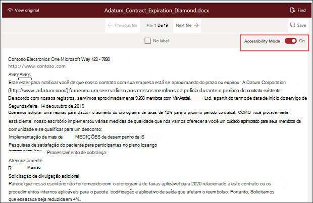
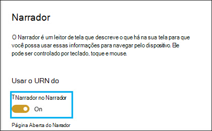

# Modo de acessibilidade do Syntex do SharePoint

No [SharePoint Syntex,](index.md)os usuários podem ativar o modo de acessibilidade em todos os estágios do treinamento de modelo (rótulo, treinamento, teste) ao trabalhar com documentos de exemplo. Usar o modo de acessibilidade pode ajudar os usuários com pouca visão a ter uma acessibilidade de teclado mais fácil à medida que navegam e rotulam itens no visualizador de documentos.

Isso ajuda os usuários a usar seus teclados para navegar pelo texto no visualizador de documentos e ouvir uma narração não apenas dos valores selecionados, mas também de ações (como rotular ou remover a rotulagem do texto selecionado) ou valores de rótulo previstos à medida que você treinar o modelo com documentos de exemplo adicionais. 

## Requisitos

Para ouvir o áudio da narração, certifique-se de ativar o aplicativo [Narrador](https://support.microsoft.com/windows/complete-guide-to-narrator-e4397a0d-ef4f-b386-d8ae-c172f109bdb1) nas configurações do Narrador em seu sistema Windows 10.

## Rotulagem para usuários de teclado

Para usuários de teclado usando o modo de acessibilidade, se você estiver rotulando texto em um documento de exemplo no visualizador, poderá usar as seguintes teclas:

- Guia: Move você para frente e seleciona a próxima palavra.
- Tab + Shift: move você para trás e seleciona a palavra anterior.
- Insira: rotule ou remova um rótulo da palavra selecionada.
- Seta para frente: move você para frente pelos caracteres individuais em uma palavra selecionada.
- Seta para trás: move você para trás pelos caracteres individuais em uma palavra selecionada.

> [!NOTE]
> Se você estiver rotulando várias palavras para um único rótulo, precisará rotular cada palavra.

## Narração

Para os usuários do Narrador que usam o modo de acessibilidade, use a mesma navegação de teclado descrita para que os usuários do teclado acessem o documento de exemplo no visualizador.

Conforme você navega pelos documentos de exemplo e os valores da cadeia de caracteres do rótulo, o Narrador dará aos usuários os seguintes prompts de áudio:

- Quando você usa o teclado para navegar pelo visualizador de documentos, o áudio do Narrador afirma a cadeia de caracteres selecionada.
- Dentro de uma cadeia de caracteres selecionada, o áudio narrador irá dizer cada caractere na cadeia à medida que você selecioná-los usando a seta para frente ou para trás.
- Se você selecionar uma cadeia de caracteres que foi rotulada, o Narrador irá dizer o valor e, em seguida, "rotulado".  Por exemplo, se o valor do rótulo for "Contoso", ele estado "Costoso rotulado". 
- Na guia de treinamento, se você selecionar uma cadeia de caracteres no visualizador de documentos que foi prevista apenas, o áudio do Narrador irá dizer o valor e, em seguida, "previsto". Isso ocorre quando o treinamento prevê um valor no arquivo que não combina com o que foi rotulado pelo usuário.
- Na guia de treinamento, se você selecionar uma cadeia de caracteres no visualizador de documentos que foi rotulada e prevista, o áudio do Narrador irá dizer o valor e, em seguida, "rotulado e previsto". Isso ocorre quando o treinamento é bem-sucedido e há uma combinação entre um valor previsto e o rótulo do usuário.

Depois que uma cadeia de caracteres for rotulada ou um rótulo tiver sido removido no visualizador, o áudio do Narrador o avisará a salvar suas alterações antes de sair.

## Confira também

[Criar um extrator](create-an-extractor.md) 

[Criar um classificador](create-a-classifier.md) 

 

  
  

