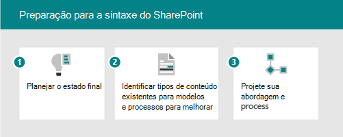

# Adoção SharePoint Syntex da Microsoft: Começar

Pense nos serviços de conteúdo inteligentes disponíveis no SharePoint Syntex como tendo três partes:

- **Noções básicas sobre o conteúdo:** Crie modelos de IA sem código para classificar e extrair informações do conteúdo para aplicar metadados automaticamente para descoberta e reutilização de conhecimento. Saiba mais sobre a [compreensão de conteúdo.](document-understanding-overview.md)
- **Processamento de conteúdo:** Automatize a captura, a ingestão e a categorização de conteúdo e simplifique os processos centrados em conteúdo usando Power Automate. Saiba mais sobre [o processamento de conteúdo.](form-processing-overview.md)
- **Conformidade de conteúdo:** Controle e gerencie o conteúdo para melhorar a segurança e a governança com a integração com a Proteção de Informações da Microsoft.

Com novos serviços e recursos de IA, você pode criar aplicativos de compreensão e classificação de conteúdo diretamente no fluxo de gerenciamento de conteúdo usando SharePoint Syntex. Há duas maneiras diferentes de entender seu conteúdo. O tipo de modelo que você usa baseia-se no formato de arquivo e no caso de uso:

| Processamento de formulário | Compreensão de documentos |
|:-------|:-------|
| Criado a partir da biblioteca de documentos. | Criado no centro de conteúdo, parte SharePoint Syntex. |
| Modelo criado no construtor de IA. | Modelo criado na interface nativa. |
| Usado para formatos de arquivo semiestruturados. | Usado para formatos de arquivo não estruturados. |
| Classificador settable. | Classificador treinável com extratores opcionais. |
| Restrito a uma única biblioteca. | Pode ser aplicado a várias bibliotecas. |
| Treine em PDF, JPG, formato PNG, total de 50 MB/500 pp. | Treine em 5-10 arquivos PDF, Office ou e-mail, incluindo exemplos negativos. |

Para obter uma comparação mais completa dos recursos, consulte [Difference between document understanding and form processing models](difference-between-document-understanding-and-form-processing-model.md).

## Identificar cenários de negócios piloto para otimizar

Para se preparar para usar SharePoint Syntex em sua organização, primeiro você precisa entender os cenários em que ele será útil. O "por que" ajuda a determinar qual modelo será necessário e como estruturar sua organização com base em onde o modelo será aplicado. Aqui estão alguns cenários em que a compreensão de documentos pode ajudar sua organização:

- **Processamento de conteúdo:** Processe contratos, instruções de trabalho e outros documentos parecidos com formulário. A ingestão dos formulários, treine o modelo para entender e mapear os campos e, em seguida, execute seus formulários para coletar automaticamente os dados. Para obter mais informações, consulte [Visão geral do processamento de formulário.](form-processing-overview.md)
- **Análise de fatura:** Retire os detalhes relevantes de suas faturas e certifique-se de que elas estão em conformidade com a política ou que estão sendo processadas adequadamente.

Pense em maneiras que SharePoint Syntex podem ajudar sua organização:

- Automatizar processos de negócios
- Melhorar a precisão da pesquisa
- Gerenciar riscos de conformidade

Ao pensar em quais cenários de negócios considerar, faça a si mesmo as seguintes perguntas:

- Isso resolve um problema real?
- Será amplamente usado ou terá um impacto amplo?
- É possível obter?
- Você pode medir o sucesso?

Priorizar cenários com base no impacto e na facilidade de implementação. Tornar sua área de foco inicial cenários de maior impacto que também podem ser facilmente implementados. Des priorize cenários de menor impacto difíceis de implementar.

Use os [cenários de exemplo e use casos](adoption-scenarios.md) para solicitar ideias sobre como você pode usar SharePoint Syntex em sua organização.

## Identificar funções & responsabilidades

Determinar quem na sua organização criará e gerenciará os modelos? As seguintes funções podem estar envolvidas:

| SharePoint/Administrador de conhecimento | Administrador do Power Platform | Gerente de conhecimento | Proprietário do modelo |
|:-------|:-------|:-------|:-------|
| Função AAD| Função AAD | Função AAD | Campeões |
| Configurar o processamento de formulário | Configurar o ambiente comum de serviço de dados para processamento de formulário | Reunir casos de uso | Reunir casos de uso comercial |
| Gerenciar centros de conteúdo e permissões| Comprar e alocar créditos do AIB | Estabelecer práticas recomendadas e análise de modelo de revisão | Criar e aplicar modelos |

O gerente de conhecimento, o proprietário do processo de negócios e o proprietário do modelo de conteúdo criam modelos de exemplo e defendem a adoção na organização.
Outros que podem estar envolvidos: administrador de conformidade, gerentes de taxonomia.

Onde eles criarão e aplicarão os modelos? Existem processos ou repositórios existentes que podem ser aprimorados?

- Processamento de formulário: decida quais sites receberão a ação de processamento de formulário.
- Noções básicas sobre documentos: você pode criar vários centros de conteúdo para diferentes áreas de negócios.

## Posicionamento estratégico

Trabalhe com as partes interessadas para garantir que estejam alinhadas à estratégia de uso SharePoint Syntex. Pesquise e forneça os seguintes recursos para ajudar com esse posicionamento:

- Resultados de negócios:
  - Resultados fiscais potenciais
  - Resultados de agilidade potenciais
  - Modelo de resultado de negócios
- Stakeholders/Exec sponsor buy-in/alignment
  - Decks de caso de negócios
  - Modelos financeiros
  - Preparação da empresa - cultura

## Identificar participantes

Identifique os participantes do seu projeto.

|Função |Responsibilities |Department |
|:-------|:-------|:--------|
| Patrocinadores executivos   | Comunica a visão e valores de alto nível para a empresa   |  Liderança executiva   |
| Project(s) lead(s) | Supervisiona todo o processo de lançamento e implantação | Gerenciamento de projeto |
| Administradores de conhecimento| Criar e gerenciar os centros de conteúdo | IT ou outro departamento|
| Gerentes de conteúdo e proprietários de modelos| Reunir casos de uso e criar e aplicar modelos | Qualquer departamento|
| Campeões | Ajudam a difundir e gerenciar o tratamento de objeções | Qualquer departamento (equipe) |
| Administrador de locatários | Define as configurações de nível de locatário | Departamento de TI|
| Administrador do Power Platform| Configura o ambiente de serviços de dados comuns | Departamento de TI|

> [!Note]
> Embora seja recomendável que cada uma dessas funções seja cumprida ao longo da sua lançamento, você pode descobrir que não é necessário que todas elas sejam iniciadas com sua solução identificada.

## Lista de verificação de preparação

Para se preparar para implementar SharePoint Syntex, você precisa:

1. Planejar o estado final
    - Modelos de compreensão de documentos são os meios, não o final.
    - Planejar a utilização do valor de metadados extraídos com:
      - Pesquisar
      - Filtragem e formatação de exibição
      - Conformidade
      - Automação
2. Identificar
    - Entenda o uso de recursos de gerenciamento de conteúdo e arquitetura de informações existentes.
    - Os tipos de conteúdo existentes são bons candidatos para modelos?
    - Quais processos existentes seriam aprimorados por metadados?
3. Design
    - Projetar sua abordagem para arquitetura de informações, metadados gerenciados e tipos de conteúdo
    - Projete o processo para definição, criação, gerenciamento.

## Envolver sua organização

1. Identifique os titulares da participação, confirme cenários e desenvolva o plano de projeto.
1. Configurar configurações e aplicar licenças.
1. Começar a conscientização e treinamento – Recrutar Campeões.
1. Rolar em estágios.  
1. Coletar comentários e iterar.
1. À medida que o uso aumenta o plano para quaisquer créditos do Construtor de AI conforme necessário.

## Confira também

[Cenários e casos de uso para SharePoint Syntex](adoption-scenarios.md)