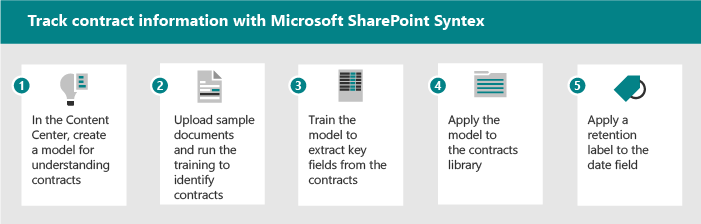

# Adoção do Microsoft SharePoint Syntex: Começar

Pense nos serviços de conteúdo inteligente disponíveis no SharePoint Syntex como tendo três partes:

- **Noções básicas sobre conteúdo:** crie modelos de IA sem código para classificar e extrair informações do conteúdo para aplicar automaticamente metadados à descoberta e reutilização de conhecimento. Saiba mais sobre a [compreensão de conteúdo.](document-understanding-overview.md)
- **Processamento do conteúdo:** Automatize a captura, a ingestão e a categorização de conteúdo e simplifica processos centrados no conteúdo usando o Power Automate. Saiba mais sobre [o processamento do conteúdo.](form-processing-overview.md)
- **Conformidade de conteúdo:** Controle e gerencie conteúdo para melhorar a segurança e a governança com a integração com a Proteção de Informações da Microsoft.

Com novos serviços e recursos de IA, você pode criar aplicativos de classificação e compreensão de conteúdo diretamente no fluxo de gerenciamento de conteúdo usando o SharePoint Syntex. Há duas maneiras diferentes de entender seu conteúdo. O tipo de modelo usado baseia-se no formato de arquivo e no caso de uso:

| Processamento de formulário | Noções básicas sobre documentos |
|:-------|:-------|
| Criado a partir da biblioteca de documentos. | Criado no centro de conteúdo, parte do Syntex do SharePoint. |
| Modelo criado no construtor de IA. | Modelo criado na interface nativa. |
| Usado para formatos de arquivo semi-estruturados. | Usado para formatos de arquivo não estruturados. |
| Classificador settable. | Classificador de treinamento com extratores opcionais. |
| Restrito a uma única biblioteca. | Pode ser aplicado a várias bibliotecas. |
| Treinamento em PDF, JPG, formato PNG, total de 50 MB/500 pp. | Treine em arquivos pdf, Office ou email de 5 a 10, incluindo exemplos negativos. |

A tabela a seguir explica a disponibilidade e o licenciamento do Syntex do SharePoint:

| Processamento de formulário | Noções básicas sobre documentos |
|:-------|:-------|
| O processamento de formulário depende da Plataforma De energia.  Para obter informações sobre a disponibilidade global para o Power Platform e o Construtor de IA, consulte [a disponibilidade da plataforma de energia.](https://dynamics.microsoft.com/geographic-availability/) | Disponível em todas as regiões. |
| Usa créditos do Construtor de IA. Os créditos podem ser comprados em lotes de 1M. Os créditos 1M são incluídos quando mais de 300 licenças de Syntex do SharePoint são adquiridas. Os créditos 1M permitirão o processamento de 2.000 páginas de arquivo. | Os modelos funcionam em todos os idiomas latinos de alfabeto. Além do inglês: alemão, sueco, francês, espanhol, italiano e português. |
| Provisionado no ambiente padrão de serviço de dados comuns. | Não tem restrições de capacidade. |

Para obter mais informações sobre créditos e unidades do Construtor de AI, consulte [licenciamento do Construtor de AI.](https://docs.microsoft.com/ai-builder/administer-licensing)

O Syntex do SharePoint se integra aos recursos de conformidade do Microsoft 365, como:

- Rótulos de retenção que definem a política de registros com base na idade do documento ou em eventos externos.
- Rótulos de sensibilidade que configuram políticas de DLP, criptografia, compartilhamento e acesso condicional.

Os usuários podem aplicar rótulos ou podem ser aplicados automaticamente pelos modelos de IA da Syntex do SharePoint. Os planos de análise e arquivo fornecem gerenciamento em escala de políticas e uso de rótulos.

## Identificar cenários de negócios piloto para otimizar

Para se preparar para usar o Syntex do SharePoint em sua organização, primeiro você precisa entender os cenários em que ele será útil. O motivo pelo qual ajuda a determinar qual modelo será necessário e como estruturar sua organização com base em onde o modelo será aplicado. Aqui estão alguns cenários em que a compreensão de documentos pode ajudar sua organização:

- Processamento do conteúdo: contratos de processo, declarações de trabalho e outros documentos de formulário. Receber os formulários, treinar o modelo para entender e mapear os campos e, em seguida, executar seus formulários para coletar automaticamente os dados. Para obter mais informações, consulte [Visão geral do processamento de formulário.](form-processing-overview.md)
- Análise de fatura: retire os detalhes relevantes de suas faturas e certifique-se de que elas estão em conformidade com a política ou estão sendo processadas adequadamente.

Pense em maneiras pelas quais a Syntex do SharePoint pode ajudar sua organização:

- Automatizar processos empresariais
- Melhorar a precisão da pesquisa
- Gerenciar riscos de conformidade

### Exemplo de cenário de processamento de formulário

Por exemplo, você pode configurar um processo usando os recursos Do SharePoint Syntex e Power Automate para acompanhar e monitorar faturas.

1. Configurar uma biblioteca para armazenar os documentos da fatura.
1. Treine o modelo para reconhecer campos nos documentos.
1. Extraia os campos que você deseja rastrear em uma lista.
1. Configurar um fluxo para notificar você sobre eventos específicos, como:
    - Uma nova fatura é adicionada.
    - Uma fatura já passou da data de vencimento.
    - Uma fatura é por um valor maior do que o valor de aprovação automática.

Ao automatizar esse cenário, você pode:

- Economize tempo e dinheiro extraindo automaticamente os dados das faturas em vez de fazê-los manualmente.
- Reduza possíveis erros e garanta uma melhor conformidade usando fluxos de trabalho para agir nas faturas e notificar você sobre qualquer problema.

### Exemplo de cenário de compreensão de documentos

Como outro exemplo, você pode configurar um processo para identificar contratos que sua empresa tem com outras empresas ou indivíduos. Você pode configurar um modelo para extrair informações importantes desses contratos, como o nome do cliente, taxas, datas ou outras informações importantes, e adicioná-los à biblioteca como campos que você pode exibir rapidamente. E você pode aplicar um rótulo de retenção à biblioteca de documentos para garantir que os contratos não possam ser excluídos antes de um período específico para conformidade apropriada com os regulamentos de negócios.

1. Comece no centro de conteúdo e crie um novo modelo de compreensão de documentos para contratos.
1. Carregue documentos de exemplo para exemplos positivos e negativos e execute o treinamento para identificar documentos de contrato e revisar os resultados.
1. Treine o extrator para identificar campos nos contratos, como o nome do cliente, taxa e data e, em seguida, teste o extrator.
1. Quando o modelo for concluído, aplique o modelo a uma biblioteca onde você pode carregar contratos.
1. Aplique um rótulo de retenção ao campo de data, para que os contratos sejam retidos na biblioteca pelo tempo que sua organização exige para contratos.

Ao automatizar esse cenário, você pode:

- Economize tempo e dinheiro extraindo automaticamente dados dos contratos em vez de fazê-los manualmente.
- Garanta uma melhor conformidade usando rótulos de retenção para garantir que os contratos sejam mantidos adequadamente.

### Dicas para identificar cenários

Ao pensar sobre quais cenários de negócios considerar, faça as seguintes perguntas:

- Ele resolve um problema real?
- Ele será amplamente usado ou terá um impacto amplo?
- É possível obter?
- Você pode medir o sucesso?

Priorizar cenários com base no impacto e na facilidade de implementação. Tornar sua área de foco inicial cenários de maior impacto que também podem ser facilmente implementados. Des priorize cenários de menor impacto que sejam difíceis de implementar.

## Identificar funções & responsabilidades

Determinar quem em sua organização criará e gerenciará os modelos? As seguintes funções podem estar envolvidas:

| Administrador do SharePoint/Conhecimento | Administrador da Plataforma Do Power | Gerente de conhecimento | Proprietário do modelo |
|:-------|:-------|:-------|:-------|
| Função AAD| FUNÇÃO ADD | Função AAD | Campeões |
| Configurar o processamento de formulário | Configurar ambiente de serviço de dados comuns para processamento de formulário | Coletar casos de uso | Coletar casos de uso comercial |
| Gerenciar centros de conteúdo e permissões| Comprar e alocar créditos AIB | Estabeleça as práticas recomendadas e revise a análise do modelo | Criar e aplicar modelos |

Gerente de conhecimento, proprietário do processo de negócios e proprietário do modelo de conteúdo criar modelos de exemplo e adoção de defensores na organização.
Outros que podem estar envolvidos: administrador de conformidade, gerentes de taxonomia.

Onde eles criarão e aplicarão os modelos? Existem processos ou repositórios existentes que podem ser aprimorados?

- Processamento de formulário: decida quais sites receberão a ação de processamento de formulário.
- Noções básicas sobre documentos: você pode criar vários centros de conteúdo para diferentes áreas de negócios.

## Posicionamento estratégico

Trabalhe com os stakeholders para garantir que eles estejam alinhados com a estratégia para usar o Syntex do SharePoint. Pesquise e forneça os seguintes recursos para ajudar nesse posicionamento:

- Resultados comerciais:
  - Resultados fiscais potenciais
  - Possíveis resultados de agilidade
  - Modelo de resultado de negócios
- Compra/alinhamento de patrocinadores stakeholders/Exec
  - A plataformas de caso de negócios
  - Modelos financeiros
  - Preparação da empresa - cultura

## Identificar participantes

Identifique os participantes do seu projeto.

|Função |Responsabilidades |Department |
|:-------|:-------|:--------|
| Patrocinadores executivos   | Comunicar visão de alto nível e valores à empresa   |  Liderança executiva   |
| Líder(s) do projeto | Supervisionar todo o processo de execução e lançamento de lançamento | Gerenciamento de projeto |
| Administradores de conhecimento| Criar e gerenciar os centros de conteúdo | IT ou outro departamento|
| Gerentes de conteúdo e proprietários de modelos| Coletar casos de uso e criar e aplicar modelos | Qualquer departamento|
| Campeões | Ajudar o evangelize e gerenciar tratamento de objeção | Qualquer departamento (funcionário) |
| Administrador de locatários | Definir configurações no nível do locatário | Departamento de IT|
| Administrador da Plataforma Do Power| Configurar o ambiente de serviços de dados comuns | Departamento de IT|

> [!Note]
> Embora seja recomendável que cada uma dessas funções seja atendida durante a sua lançamento, talvez você descubra que não precisa de todas elas para começar a usar sua solução identificada.

## Lista de verificação de preparação

Para se preparar para implementar o Syntex do SharePoint, você precisa:

1. Planejar o estado final
    - Document understanding models are the means, not the end.
    - Planeje aproveitar o valor dos metadados extraídos com:
      - Pesquisar
      - Filtragem e exibição de formatação
      - Conformidade
      - Automação
2. Identificar
    - Entenda o uso de recursos de arquitetura de informações e gerenciamento de conteúdo existentes.
    - Algum tipo de conteúdo existente é um bom candidato para modelos?
    - Quais processos existentes seriam aprimorados pelos metadados?
3. Design
    - Projetar sua abordagem para arquitetura de informações, metadados gerenciados e tipos de conteúdo
    - Projetar o processo para definição, criação, gerenciamento.

## Envolver sua organização

1. Identifique os participantes, confirme cenários e desenvolva um plano de projeto.
1. Definir configurações e aplicar licenças.
1. Começar a conscientização e treinamento – recrutar campeões.
1. Lançamento em estágios.  
1. Reúna comentários e itere.
1. Conforme o uso aumenta o plano para todos os créditos do Construtor de AI conforme necessário.
