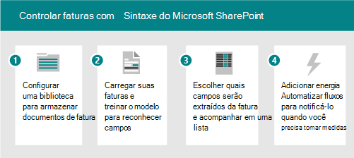
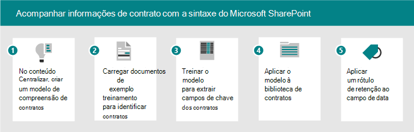

# Cenários e casos de uso para o Microsoft SharePoint Syntex

Use os cenários de exemplo a seguir para solicitar ideias sobre como você pode usar SharePoint Syntex em sua organização.

- [Cenário: Rastrear dados de faturas com processamento de formulário](adoption-scenarios.md#scenario-track-data-from-invoices-with-form-processing)
- [Cenário: rastrear informações de contratos com o entendimento de documentos](adoption-scenarios.md#scenario-track-information-from-contracts-with-document-understanding)
- [Cenário: evite riscos com gerenciamento de registros, governança de documentos e processos de conformidade com base SharePoint Syntex](adoption-scenarios.md#scenario-avoid-risk-with-records-management-document-governance-and-compliance-processes-based-on-sharepoint-syntex)
- [Cenário: Capturar informações de documentos inacessíveis anteriormente](adoption-scenarios.md#scenario-capture-information-from-previously-inaccessible-documents)
- [Cenário: melhorar o processamento de dados para fornecer insights e análises](adoption-scenarios.md#scenario-improve-data-processing-to-provide-insights-and-analytics)
- [Cenário: Automatizar o processamento de ordem](adoption-scenarios.md#scenario-automate-order-processing)
- [Cenário: simplificar o processo de renovação de visto](adoption-scenarios.md#scenario-simplify-visa-renewal-process)

## Cenário: Rastrear dados de faturas com processamento de formulário

Por exemplo, você pode configurar um processo usando SharePoint Syntex e Power Automate para rastrear e monitorar faturas.

1. Configurar uma biblioteca para armazenar os documentos da fatura.
1. Treine o modelo para reconhecer campos nos documentos.
1. Extraia os campos que você deseja rastrear em uma lista.
1. Configurar um fluxo para notificá-lo para eventos específicos, como:
    - Uma nova fatura é adicionada.
    - Uma fatura já passou da data de vencimento.
    - Uma fatura é para um valor maior do que o valor de aprovação automática.

Ao automatizar esse cenário, você pode:

- Economize tempo e dinheiro extraindo automaticamente dados das faturas em vez de fazê-los manualmente.
- Reduza possíveis erros e garanta uma melhor conformidade usando fluxos de trabalho para verificar faturas e notificá-lo de quaisquer problemas.

## Cenário: rastrear informações de contratos com o entendimento de documentos

Como outro exemplo, você pode configurar um processo para identificar contratos que sua empresa tem com outras empresas ou indivíduos. Configurar um modelo para extrair informações importantes desses contratos, como o nome do cliente, taxas, datas ou outras informações importantes e adicionar as informações à biblioteca como campos que você pode exibir rapidamente. Aplique um rótulo de retenção na biblioteca de documentos para garantir que os contratos não possam ser excluídos antes de um período específico de tempo para conformidade apropriada com os regulamentos de negócios.

1. Comece no centro de conteúdo e crie um novo modelo de compreensão de documentos para contratos.
1. Upload exemplo de documentos para exemplos positivos e negativos, execute o treinamento para identificar documentos de contrato e revisar os resultados.
1. Treine o extrator para identificar campos nos contratos, como o nome do cliente, a taxa e a data e, em seguida, teste o extrator.
1. Quando o modelo for concluído, aplique o modelo a uma biblioteca onde você pode carregar contratos.
1. Aplique um rótulo de retenção ao campo de data, para que os contratos sejam mantidos na biblioteca pelo período de tempo necessário.

Ao automatizar esse cenário, você pode:

- Economize tempo e dinheiro extraindo automaticamente dados dos contratos em vez de fazê-los manualmente.
- Garanta uma melhor conformidade usando rótulos de retenção para garantir que os contratos sejam mantidos adequadamente.

## Cenário: evite riscos com gerenciamento de registros, governança de documentos e processos de conformidade com base SharePoint Syntex

Reduzir riscos é uma meta comum para a maioria das empresas. Talvez seja necessário:

- Uma melhor maneira de fornecer/impor a governança de informações em seu locatário.
- Para melhorar o sistema de classificação de documentos, emails e outras formas de comunicação consideradas 'registros' para projetos.
- Para auditar recibos, contratos e assim por diante, para garantir a conformidade com as políticas da empresa.
- Para garantir que os projetos tenham toda a documentação necessária para conformidade.

Configurar alguns processos para conformidade com o SharePoint Syntex para capturar e classificar adequadamente, auditar e sinalizar documentos e formulários que precisam de melhor governança. Você pode confiar no SharePoint Syntex para classificar automaticamente o conteúdo em vez de depender dos usuários finais para marcar manualmente ou da equipe de conformidade para aplicar manualmente regras de governança e arquivamento. E você pode habilitar uma experiência de pesquisa simplificada, gerenciar volumes de dados, aplicar políticas de gerenciamento e retenção de registros, garantir a conformidade e práticas recomendadas de arquivamento e depuração.

Ao automatizar esse cenário, você pode se sentir seguro de que:

- A conformidade é mantida e o risco é reduzido.
- O gerenciamento de taxonomia e registros é aplicado de forma consistente e precisa.
- Os volumes de conteúdo são controlados.
- Os funcionários podem descobrir facilmente as informações certas no contexto correto.

## Cenário: Capturar informações de documentos inacessíveis anteriormente

A maioria das organizações tem grandes repositórios de documentos legais, políticas, contratos, documentos de RH e diretrizes de governança. Extrair esses armazenamentos de dados para extrair informações valiosas como: projetos, setores, temas, pessoas, áreas geográficas e assim por diante.

Por exemplo, um diretor de RH precisa acessar rapidamente todos os documentos de RH , incluindo currículos, políticas de RH e outros formulários. E eles querem identificar rapidamente as informações necessárias de currículos e outros documentos relacionados ao RH sem fazer uma análise manual dos documentos. Eles estão procurando uma solução que permita que eles encontrem rapidamente as informações necessárias sem precisar procurar manualmente milhares de currículos, políticas de RH e outras documentações que podem ser distribuídas em vários sites.

Ao automatizar esse cenário, você pode:

- Desbloqueie o conhecimento do conteúdo digital.
- Classificar políticas de RH, currículos, documentos de vendas, projetos técnicos, planos de conta e extrair informações.
- Encontre rapidamente as informações corretas ou o documento que você está procurando.
- Obter acesso instantâneo às informações mais recentes.
- Reduza os tempos de pesquisa.

## Cenário: melhorar o processamento de dados para fornecer insights e análises

Por exemplo, uma empresa de produtos SharePoint Syntex para extrair informações de documentos do FDA para responder a perguntas que seus líderes têm. Ter as respostas mais facilmente acessíveis pode reduzir o tempo necessário para produzir essas respostas e aumentar a disponibilidade de dados para gerar respostas mais precisas para perguntas de liderança.

Por exemplo, um gerente de projeto precisa fornecer rapidamente respostas para perguntas relacionadas ao produto da minha equipe de liderança. Eles precisam encontrar informações e métricas relacionadas a consultas em um painel consolidado. Eles estão procurando uma solução que extraia as informações de que precisam de rótulos de produtos, folhetos de produtos e outros materiais e gera um relatório consolidado que eles podem usar ao relatar para sua equipe de liderança.

Ao automatizar esse cenário, você pode:

- Reduza o tempo para produzir respostas.
- Aumente a disponibilidade de dados.
- Forneça respostas mais precisas.

## Cenário: Automatizar o processamento de ordem

Com SharePoint Syntex, você pode reduzir o tempo de processamento manual de pedidos de clientes. Por exemplo, você pode carregar pedidos de fax, email ou papel no SharePoint usando o processamento OCR e, em seguida, extrair os metadados desses pedidos para que você possa cumpri-los usando processos automatizados.

Por exemplo, um gerente de cadeia de fornecimento deseja reduzir os erros causados pela entrada manual de dados. Eles querem evitar a revisão manual e a entrada de dados de pedidos de clientes de entrada (papel, fax ou email) para reduzir os erros de entrada em seus sistemas de negócios. Eles querem uma solução que aplique técnicas de AI e aprendizado de máquina para validar as informações de ordem de entrada, extrair dados principais e enviar automaticamente para seu sistema ERP, para atendimento de ordem e reconciliação.

Ao automatizar esse cenário, você pode garantir que:

- A precisão da ordem e da remessa aumenta.
- As taxas ou as sanções associadas a erros de pedido ou de envio são reduzidas.
- Os atrasos na faturamento ou nos pagamentos diminuem.
- Os custos de pessoal são reduzidos.

## Cenário: simplificar o processo de renovação de visto

SharePoint A Syntex pode ajudá-lo a automatizar lembretes e renovações para obter informações importantes do contrato. Por exemplo, um diretor de RH precisa garantir que os vistos dos funcionários sejam atualizados e/ou renovados a tempo. Eles querem dar às pessoas um processo simples e intuitivo para atualizar seus Vistos. Eles precisam de uma solução que extraia as datas de renovação dos contratos e envia automaticamente lembretes aos funcionários quando suas datas de renovação estão se aproximando.

Ao automatizar esse cenário, você pode garantir que:

- Os níveis de não conformidade são reduzidos.
- O número de lembretes manuais é reduzido.
- O número de multas por não conformidade é reduzido.

## Confira também

[Adoção SharePoint Syntex da Microsoft: Começar](adoption-getstarted.md)