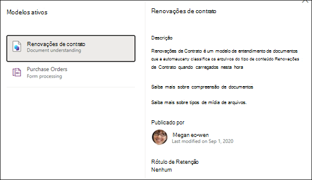

# Aplicar um modelo de compreensão de documento no Microsoft SharePoint SyntexApply a document understanding model in Microsoft SharePoint Syntex

 

> [!VIDEO https://www.microsoft.com/videoplayer/embed/RE4CSoL]

 

Depois de publicar seu modelo de compreensão de documento, você pode aplicá-lo a uma ou mais bibliotecas de documentos do SharePoint no locatário do Microsoft 365.After publishing your document understanding model, you can apply it to one or more SharePoint document library in your Microsoft 365 tenant.

> [!NOTE]
> Você só pode aplicar o modelo às bibliotecas de documentos às quais tem acesso.You are only able to apply the model to document libraries that you have access to.

## Aplique seu modelo a uma biblioteca de documentos.Apply your model to a document library.

Para aplicar o modelo a uma biblioteca de documentos do SharePoint:To apply your model to to a SharePoint document library:

1. Na página inicial do modelo, no bloco **Aplicar modelo a bibliotecas**, marque **Publicar modelo**.On model home page, on the **Apply model to libraries** tile, select **Publish model**. Ou você pode selecionar  **+Adicionar Biblioteca** na seção **Bibliotecas com esse modelo**.Or you can select  **+Add Library** in the **Libraries with this model** section.  

     

2. Em seguida, você pode selecionar o site do SharePoint que contém a biblioteca de documentos à qual você deseja aplicar o modelo.You can then select the SharePoint site that contains the document library that you want to apply the model to. Se o site não for mostrado na lista, use a caixa de pesquisa para localizá-lo.If the site does not show in the list, use the search box to find it. 

     

    > [!NOTE]
    > Você deve ter permissões de *Gerenciar Lista* ou direitos de *Editar* na biblioteca de documentos para a qual você está aplicando o modelo.You must have *Manage List* permissions or *Edit* rights to the document library you are applying the model to. 

3. Depois de selecionar o site, selecione a biblioteca de documentos à qual você deseja aplicar o modelo.After selecting the site, select the document library to which you want to apply the model. No exemplo, selecione a biblioteca de documentos do *Documento* do site de *Acompanhamento de Caso da Contoso*. In the sample, select the *Documents* document library from the *Contoso Case Tracking* site. 

     

4. Já que o modelo está associado a um tipo de conteúdo, quando for aplicado à biblioteca, ele adicionará o tipo de conteúdo e seu modo de exibição com as etiquetas extraídas mostradas como colunas.Since the model is associated to a content type, when you apply it to the library it will add the content type and its view with the labels you extracted showing as columns. Esse modo de exibição é a exibição padrão da biblioteca por padrão, mas você pode optar por não ter essa exibição padrão selecionando **Configurações avançadas** e desmarcando **Definir esse novo modo de exibição como padrão**.This view is the library's default view by default, but you can optionally choose to not have it be the default view by selecting **Advanced settings** and deselecting **Set this new view as default**. 

     

5. Selecione **Adicionar** para aplicar o modelo à biblioteca.Select **Add** to apply the model to the library. 
6. Na página inicial do modelo, na seção **Bibliotecas com esse modelo**, você deverá ver a URL do site do SharePoint listado.On the model home page, in the **Libraries with this model** section, you should see the URL to the SharePoint site listed. 

     

7. Vá para a biblioteca de documentos e verifique se você está no modo de exibição de biblioteca de documentos do modelo.Go to your document library and make sure you are in the model's document library view. Observe que, se você selecionar o botão de informações ao lado do nome da biblioteca de documentos, uma mensagem indicará que o modelo foi aplicado à biblioteca de documentos.Notice that if you select the information button next to the document library name, a message notes that the document library has a model applied to it.

      

    Você pode selecionar a opção **Exibir modelos ativos** para ver detalhes sobre todos os modelos aplicados à biblioteca de documentos.You can the select **View active models** to see details about any models that are applied to the document library.

8. No painel **Modelos ativos**, você pode ver os modelos aplicados à biblioteca de documentos.In the **Active models** pane, you can see the models that are applied to the document library. Selecione um modelo para ver mais detalhes sobre ele, como uma descrição do modelo, quem publicou o modelo e se ele aplica um rótulo de retenção aos arquivos que ele classifica.Select a model to see more details about it, such as a description of the model, who published the model, and if the model applies a retention label to the files it classifies.

      

Depois de aplicar o modelo à biblioteca de documentos, você pode começar a carregar documentos no site e ver os resultados.After applying the model to the document library, you can begin uploading documents to the site and see the results.

O modelo identifica todos os arquivos com o tipo de conteúdo associado do modelo e os lista em seu modo de exibição.The model identifies any files with model’s associated content type and lists them in your view. Se o modelo tiver os extratores, o modo de exibição exibirá colunas para os dados que você está extraindo de cada arquivo.If your model has any extractors, the view displays columns for the data you are extracting from each file.

### Aplicar o modelo aos arquivos que já estão na biblioteca de documentosApply the model to files already in the document library

Enquanto um modelo aplicado processa todos os arquivos carregados na biblioteca de documentos após a aplicação, você também pode fazer o seguinte para executar o modelo em arquivos que já existem na biblioteca de documentos antes do modelo aplicado:While an applied model processes all files uploaded to the document library after it is applied, you can also do the following to run the model on files that already exists in the document library prior to the model being applied:

1. Na biblioteca de documentos, selecione os arquivos que você deseja processar por seu modelo.In your document library, select the files that you want to be processed by your model.
2. Depois de selecionar seus arquivos, **Classificar e extrair** aparecerá na faixa de opções da biblioteca de documentos.After selecting your files, **Classify and extract** will appear in the document library ribbon. Selecione **Classificar e extrair**.Select **Classify and extract**.
3. Os arquivos selecionados serão adicionados à fila a ser processada.The files you selected will be added to the queue to be processed.

        

> [!NOTE]
> Você pode copiar arquivos individuais para uma biblioteca e aplicá-los a um modelo, mas não a pastas.You can copy individual files to a library and apply them to a model, but not folders.

### O campo Data de ClassificaçãoThe Classification Date field

Quando a compreensão de um documento do SharePoint Syntex ou um modelo de processamento de formulário é aplicado a uma biblioteca de documentos, um campo <b>Data de Classificação</b> é incluído no esquema de biblioteca.When a SharePoint Syntex document understanding or form processing model is applied to a document library, a <b> Classification date </b> field is included in the library schema. Por padrão, esse campo fica vazio, mas quando os documentos são processados e classificados por um modelo, esse campo é atualizado com um carimbo de data e hora de conclusão.By default this field is empty, but when documents are processed and classified by a model, this field is updated with a date-time stamp of completion. 

     

O campo Data de classificação é usado pelo [<b>Quando um arquivo é classificado por um modelo de compreensão de conteúdo</b> aciona o ](/connectors/sharepointonline/#when-a-file-is-classified-by-a-content-understanding-model) para executar um fluxo do Power Automate depois que um modelo de compreensão de conteúdo Syntex terminar de processar um arquivo e atualizar o campo "Data de classificação".The Classification date field is used by the [<b>When a file is classified by a content understanding model</b> trigger](/connectors/sharepointonline/#when-a-file-is-classified-by-a-content-understanding-model) to run a Power Automate flow after a Syntex content understanding model has finished processing a file and updated the "Classification date" field.

    

O <b>Quando um arquivo é classificado por um modelo de compreensão de conteúdo</b> acionador pode ser usado para iniciar outro fluxo de trabalho usando qualquer informação extraída do arquivo.The <b>When a file is classified by a content understanding model</b> trigger can then be used to start another workflow using any  extracted information from the file.

## Confira tambémSee Also
[Criar um classificadorCreate a classifier](create-a-classifier.md)

[Criar um extratorCreate an extractor](create-an-extractor.md)

[Visão geral sobre Compreensão de Documentos](document-understanding-overview.md).[Document Understanding overview](document-understanding-overview.md)
