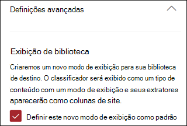

# Aplicar um modelo de compreensão de documento no Microsoft SharePoint Syntex

 

> [!VIDEO https://www.microsoft.com/videoplayer/embed/RE4CSoL]

 

Depois de publicar seu modelo de compreensão de documento, você pode aplicá-lo a uma ou mais bibliotecas de documentos do SharePoint no locatário do Microsoft 365.

> [!NOTE]
> Você só pode aplicar o modelo às bibliotecas de documentos às quais tem acesso.

## Aplique seu modelo a uma biblioteca de documentos.

Para aplicar o modelo a uma biblioteca de documentos do SharePoint:

1. Na página inicial do modelo, no bloco **Aplicar modelo a bibliotecas**, marque **Publicar modelo**. Ou você pode selecionar  **+Adicionar Biblioteca** na seção **Bibliotecas com esse modelo**.  

     

2. Em seguida, você pode selecionar o site do SharePoint que contém a biblioteca de documentos à qual você deseja aplicar o modelo. Se o site não for mostrado na lista, use a caixa de pesquisa para localizá-lo. 

     

    > [!NOTE]
    > Você deve ter permissões de *Gerenciar Lista * ou direitos de*Editar* na biblioteca de documentos para a qual você está aplicando o modelo. 

3. Depois de selecionar o site, selecione a biblioteca de documentos à qual você deseja aplicar o modelo. No exemplo, selecione a biblioteca de documentos do*Documento* do site de*Acompanhamento de Caso da Contoso*.  

     

4. Já que o modelo está associado a um tipo de conteúdo, quando for aplicado à biblioteca, ele adicionará o tipo de conteúdo e seu modo de exibição com as etiquetas extraídas mostradas como colunas. Esse modo de exibição é a exibição padrão da biblioteca por padrão, mas você pode optar por não ter essa exibição padrão selecionando **Configurações avançadas** e desmarcando **Definir esse novo modo de exibição como padrão**. 

     

5. Selecione **Adicionar** para aplicar o modelo à biblioteca. 
6. Na página inicial do modelo, na seção **Bibliotecas com esse modelo**, você deverá ver a URL do site do SharePoint listado. 

     

7. Vá para a biblioteca de documentos e verifique se você está no modo de exibição de biblioteca de documentos do modelo. Observe que, se você selecionar o botão de informações ao lado do nome da biblioteca de documentos, uma mensagem indicará que o modelo foi aplicado à biblioteca de documentos.

      

Depois de aplicar o modelo à biblioteca de documentos, você pode começar a carregar documentos no site e ver os resultados.

O modelo identifica todos os arquivos com o tipo de conteúdo associado do modelo e os lista em seu modo de exibição. Se o modelo tiver os extratores, o modo de exibição exibirá colunas para os dados que você está extraindo de cada arquivo.

### Aplicar o modelo aos arquivos que já estão na biblioteca de documentos

Enquanto um modelo aplicado processa todos os arquivos carregados na biblioteca de documentos após a aplicação, você também pode fazer o seguinte para executar o modelo em arquivos que já existem na biblioteca de documentos antes do modelo aplicado:

1. Na biblioteca de documentos, selecione os arquivos que você deseja processar por seu modelo.
2. Depois de selecionar seus arquivos, **Classificar e extrair**aparecerá na faixa de opções da biblioteca de documentos. Selecione **Classificar e extrair**.
3. Os arquivos selecionados serão adicionados à fila a ser processada.

        

## Confira também
[Criar um classificador](create-a-classifier.md)

[Criar um extrator](create-an-extractor.md)

[Visão geral sobre Compreensão de Documentos](document-understanding-overview.md).

[Criar um modelo de processamento de formulário](create-a-form-processing-model.md)  
