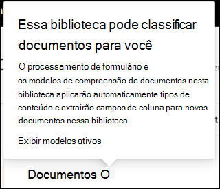

# Aplicar um rótulo de retenção a um modelo no SharePoint Syntex

 

> [!VIDEO https://www.microsoft.com/videoplayer/embed/RE4GydO]  

 

Você pode facilmente aplicar um [rótulo de retenção](../compliance/retention.md) a um modelo no Microsoft SharePoint Syntex. Você pode fazer isso para a compreensão de documentos e modelos de processamento de formulários.

Rótulos de retenção permitem que você aplique configurações de retenção aos documentos que seus modelos identificam.  Por exemplo, você deseja que o seu modelo não só identifique todos os documentos de *Aviso de seguro* que são carregados na biblioteca de documentos, mas também aplique uma marca de retenção de *Negócios* a eles para que esses documentos não possam ser excluídos da biblioteca de documentos no período de tempo especificado (os próximos cinco meses, por exemplo).

Você pode aplicar um rótulo de retenção pré-existente ao seu modelo por meio das configurações do modelo na página inicial do seu modelo. 

> [!Important]
> Para que os rótulos de retenção estejam disponíveis para serem aplicados aos seus modelos de compreensão de documentos, eles precisam ser [criados e publicados no Centro de Conformidade do Microsoft 365](../compliance/create-apply-retention-labels.md#how-to-create-and-publish-retention-labels).

## Para adicionar um rótulo de retenção a um modelo de compreensão de documentos

1. Na página inicial do modelo, selecione **Configurações de modelo**. 
2. Em **Configurações de modelo**, na seção **Segurança e conformidade**, selecione o menu **Rótulo de retenção** para ver uma lista de rótulos de retenção que estão disponíveis para serem aplicados ao modelo. 
   
3. Selecione o rótulo de retenção que você deseja aplicar ao modulo e, em seguida, selecione **Salvar**. 

Depois de aplicar o rótulo de retenção ao seu modelo, você pode aplicá-lo a:
- Nova biblioteca de documentos
- Biblioteca de documentos para a qual o modelo já foi aplicado
 
## Aplicar o rótulo de retenção a uma biblioteca de documentos para a qual o modelo já foi aplicado

Se seu modelo de compreensão de documentos já foi aplicado a uma biblioteca de documentos, você pode fazer o seguinte para sincronizar sua atualização de rótulo de retenção para aplicá-la à biblioteca de documentos: 

1. Na página inicial do seu modelo, na seção **Bibliotecas com esse modelo**, selecione a biblioteca de documentos à qual você deseja aplicar a atualização de rótulo de retenção.   
2. Selecione **Sincronizar**.  
   

Depois de aplicar a atualização e sincronizá-la com o seu modelo, você pode confirmar se ela foi aplicada da seguinte maneira:

1. No centro de conteúdo, na seção **Bibliotecas com esse modelo**, clique na biblioteca à qual o modelo atualizado foi aplicado.  
2. No modo de exibição da biblioteca de documentos, selecione o ícone de informações para verificar as propriedades do modelo.   
3. Na lista **Modelos ativos**, selecione o modelo atualizado. 
4. Na seção **Rótulo de retenção**, você verá o nome do rótulo de retenção aplicado. 

Na página de exibição do seu modelo na biblioteca de documentos, uma nova coluna do **Rótulo de retenção** será exibida.  Conforme seu modelo classifica os arquivos, eles os identifica como pertencentes ao seu tipo de conteúdo e os lista no modo de exibição de biblioteca, a coluna rótulo de retenção também exibirá o nome do rótulo de retenção que foi aplicado a ela por meio do modelo.

Por exemplo, todos os documentos de *Aviso de seguro* identificados pelo seu modelo também têm o rótulo de retenção *Negócios* aplicado a eles, impedindo que eles sejam excluídos da biblioteca de documentos por cinco meses. Se você tentar excluir o arquivo da biblioteca de documentos, o programa exibirá um erro informando que isso não é permitido por causa do rótulo de retenção aplicado.

## Para adicionar um rótulo de retenção a um modelo de processamento de formulário

> [!Important]
> Para que os rótulos de retenção estejam disponíveis para serem aplicados ao seu modelo de processamento de formulário, eles precisam ser [criados e publicados no Centro de Conformidade do Microsoft 365](../compliance/create-apply-retention-labels.md#how-to-create-and-publish-retention-labels).

Você pode aplicar um rótulo de retenção a um modelo de processamento de formulário ao criar um modelo ou aplicá-lo a um modelo existente.

### Para adicionar um rótulo de retenção ao criar um modelo de processamento de formulário

1. Quando você estiver [criando um novo modelo de processamento de formulário](./create-a-form-processing-model.md), selecione <b>Configurações avançadas.</b>
2. Em <b>Configurações avançadas</b>, na seção <b>Rótulo de retenção</b>, selecione o menu e selecione o rótulo de retenção que deseja aplicar ao modelo.</b>

 
      

3.  Depois de concluir as configurações restantes do modelo, selecione <b>Criar</b> para construir o seu modelo.

### Para adicionar um rótulo de retenção a um modelo de processamento de formulário existente

Você pode adicionar um rótulo de retenção a um modelo de processamento de formulário existente de diferentes maneiras:
- Por meio do menu Automatizar na biblioteca de documentos
- Por meio das configurações do modelo Ativo na biblioteca de documentos 

#### Para adicionar um rótulo de retenção a um modelo de processamento de formulário existente através do menu Automatizar

Você pode adicionar um rótulo de retenção a um modelo de processamento de formulário existente de sua propriedade por meio do menu Automatizar na biblioteca de documentos em que o modelo é aplicado.

1. Em sua biblioteca de documentos à qual o modelo de processamento de formulário é aplicado, selecione o menu <b>Automatizar</b>, selecione <b>Construtor AI</b> e selecione <b>Exibir detalhes do modelo de processamento de formulário</b>.

    

2. Nos detalhes do modelo, na seção <b>Rótulo de Retenção</b>, selecione o rótulo de retenção que deseja aplicar.  Em seguida, selecione <b>Salvar</b>.

       

#### Para adicionar um rótulo de retenção a um modelo de processamento de formulário existente nas configurações do modelo ativo

Você pode adicionar um rótulo de retenção a um modelo de processamento de formulário existente de sua propriedade por meio das configurações do modelo Ativo na biblioteca de documentos em que o modelo é aplicado.

1. Na biblioteca de documentos do SharePoint em que o modelo é aplicado, selecione o ícone <b>Exibir modelos ativos</b> e selecione <b>Exibir modelos ativos</b> </b>

     

2. Em <b>Modelos ativos</b>, selecione o modelo de processamento de formulário para o qual deseja aplicar o rótulo de retenção.

       

3. Nos detalhes do modelo, na seção <b>Rótulo de Retenção</b>, selecione o rótulo de retenção que deseja aplicar.  Em seguida, selecione <b>Salvar</b>.

> [!NOTE]
> Você deve ser o proprietário do modelo para que o painel de configurações do modelo seja editável. 

## Confira também
[Criar um classificador](create-a-classifier.md)

[Criar um extrator](create-an-extractor.md)

[Visão geral sobre Compreensão de Documentos](document-understanding-overview.md).