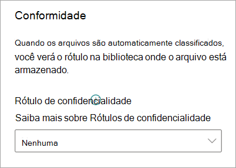

# Aplicar um rótulo de confidencialidade a um modelo no Microsoft SharePoint Syntex

Você pode aplicar facilmente um [rótulo de confidencialidade](../compliance/sensitivity-labels.md) a um modelo de compreensão de documentos no Microsoft SharePoint Syntex. Este recurso ainda não está disponível para modelos de processamento de formulário.

Os rótulos de confidencialidade permitem aplicar políticas de criptografia, compartilhamento e acesso condicional aos documentos que seus modelos identificam. Por exemplo, você deseja que seu modelo não apenas identifique documentos financeiros que contenham números de conta bancária ou números de cartão de crédito carregados em sua biblioteca de documentos, mas também para aplicar um rótulo de confidencialidade de *Criptografia* a eles para restringir quem pode acessar esse conteúdo e como ele pode ser usado. Os modelos SharePoint Syntex honram as [regras da etiqueta](../compliance/apply-sensitivity-label-automatically.md?view=o365-worldwide#how-multiple-conditions-are-evaluated-when-they-apply-to-more-than-one-label) e também não sobrescrevem uma etiqueta existente que foi aplicada manualmente por um usuário ao arquivo. 

Você pode aplicar um rótulo de confidencialidade pré-existente ao seu modelo por meio das configurações do modelo na página inicial do seu modelo. O rótulo já deve estar publicado para estar disponível para seleção a partir das configurações de modelo.

> [!Important]
> Para que os rótulos de confidencialidade estejam disponíveis para serem aplicados aos seus modelos de compreensão de documentos, eles precisam ser [criados e publicados no Centro de Conformidade do Microsoft 365](../business-video/create-sensitivity-labels.md).

## Adicionar um rótulo de confidencialidade a um modelo de compreensão de documentos

1. Na página inicial do modelo, selecione **Configurações de modelo**.

   

2. Em **Configurações de modelo**, na seção **Conformidade**, selecione o menu **Rótulo de confidencialidade** para ver uma lista de rótulos de confidencialidade que estão disponíveis para serem aplicados ao modelo.

    

3. Selecione o rótulo de confidencialidade que você deseja aplicar ao modelo e, em seguida, selecione **Salvar**.

Depois de aplicar o rótulo de confidencialidade ao modelo, você poderá aplicá-lo a:

- Nova biblioteca de documentos
- Biblioteca de documentos para a qual o modelo já foi aplicado
 
### Aplicar o rótulo de confidencialidade a uma biblioteca de documentos para a qual o modelo já foi aplicado

Se seu modelo de compreensão de documentos já foi aplicado a uma biblioteca de documentos, você pode fazer o seguinte para sincronizar sua atualização de rótulo de confidencialidade para aplicá-la à biblioteca de documentos:

1. Na página inicial do seu modelo, na seção **Bibliotecas com esse modelo**, selecione a biblioteca de documentos à qual você deseja aplicar a atualização de rótulo de confidencialidade.

2. Selecione **Sincronizar**.

   

Depois de aplicar a atualização e sincronizá-la com o seu modelo, você pode confirmar se ela foi aplicada da seguinte maneira:

1. No centro de conteúdo, na seção **Bibliotecas com esse modelo**, clique na biblioteca à qual o modelo atualizado foi aplicado. 

2. No modo de exibição da biblioteca de documentos, selecione o ícone de informações para verificar as propriedades do modelo.

3. Na lista **Modelos ativos**, selecione o modelo atualizado.

4. Na seção **Rótulo de confidencialidade**, você verá o nome do rótulo de confidencialidade aplicado.

Na página de exibição do seu modelo na biblioteca de documentos, uma nova coluna do **Rótulo de confidencialidade** será exibida. Conforme seu modelo classifica os arquivos, eles os identifica como pertencentes ao seu tipo de conteúdo e os lista no modo de exibição de biblioteca, a coluna **Rótulo de confidencialidade** também exibirá o nome do rótulo de confidencialidade que foi aplicado a ela por meio do modelo.

Por exemplo, todos os documentos financeiros que seu modelo identificar também terão o rótulo de confidencialidade *Criptografia* aplicado a eles, impedindo que eles sejam acessados por pessoas não autorizadas. Se uma tentativa for realizada para acessar o arquivo na biblioteca de documentos por uma pessoa não autorizada, um erro será exibido informando que ela não tem permissão devido ao rótulo de confidencialidade aplicado.

<!---
## Add a sensitivity label to a form processing model

> [!Important]
> For sensitivity labels to be available to apply to your form processing model, they need to be [created and published in the Microsoft 365 Compliance Center](../business-video/create-sensitivity-labels.md).

You can either apply a sensitivity label to a form processing model when you are creating a model, or apply it to an existing model.

### Add a sensitivity label when you create a form processing model

1. When you [create a new form processing model](create-a-form-processing-model.md), select **Advanced settings**.

2. In **Advanced settings**, in the **Sensitivity label** section, select the menu and then select the sensitivity label you want to apply to the model.

3.  After you've completed your remaining model settings, select **Create** to build your model.

### Add a sensitivity label to an existing form processing model

You can add a sensitivity label to an existing form processing model in different ways:

- Through the **Automate** menu in the document library
- Through the **Active model** settings in the document library 

#### Add a sensitivity label to an existing form processing model through the Automate menu

You can add a sensitivity label to an existing form processing model that you own through the **Automate** menu in the document library in which the model is applied.

1. In your document library to which the form processing model is applied, select the **Automate** menu, select **AI Builder**, and then select **View form processing model details**.

2. On the **Model details** pane, in the **Sensitivity label** section, select the sensitivity label you want to apply. Then select **Save**.

#### Add a sensitivity label to an existing form processing model in the active model settings

You can add a sensitivity label to an existing form processing model that you own through the **Active model** settings in the document library in which the model is applied.

1. In the SharePoint document library in which the model is applied, select the **View active models** icon, and then select **View active models**.

2. In **Active models**, select the form processing model to which you want to apply the sensitivity label.

3. On the **Model details** pane, in the **Sensitivity label** section, select the sensitivity label you want to apply. Then select **Save**.

   > [!NOTE]
   > You must be the model owner for the **Model settings** pane to be editable. 
--->

## Confira também

[Aplicar um rótulo de retenção](apply-a-retention-label-to-a-model.md)

[Criar um classificador](create-a-classifier.md)

[Criar um extrator](create-an-extractor.md)

[Visão geral sobre Compreensão de Documentos](document-understanding-overview.md).
