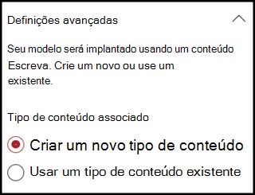
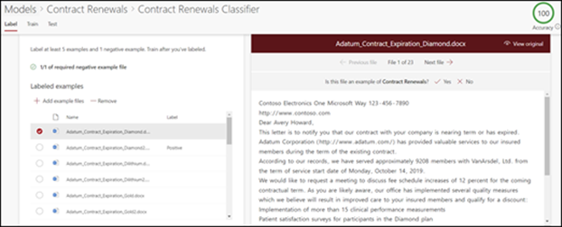
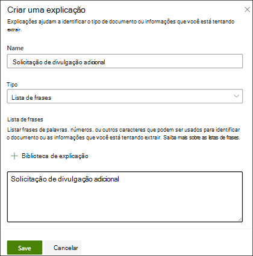

# Criar um classificador (visualização)Create a classifier (Preview)

> [!Note] 
> O conteúdo deste artigo é para a visualização privada do Project Cortex.The content in this article is for Project Cortex Private Preview. [Saiba mais sobre o Project Cortex](https://aka.ms/projectcortex).[Find out more about Project Cortex](https://aka.ms/projectcortex).

 

> [!VIDEO https://www.microsoft.com/videoplayer/embed/RE4CL0R]  

 

Um classificador é um tipo de modelo que automatiza a identificação e a classificação de um tipo de documento.A classifier is a type of model that automates identification and classification of a document type. Por exemplo, talvez você queira identificar todos os documentos de *renovação de contrato* que são adicionados à sua biblioteca de documentos, como o seguinte.For example, you may want to identify all *Contract Renewal* documents that are added to your document library, such as the following.

A criação de um classificador criará um novo [tipo de conteúdo do SharePoint](https://docs.microsoft.com/sharepoint/governance/content-type-and-workflow-planning#content-type-overview) que será associado ao modelo.Creating a classifier will create a new [SharePoint Content Type](https://docs.microsoft.com/sharepoint/governance/content-type-and-workflow-planning#content-type-overview) that will be associated to the model.

Ao criar o classificador, você precisa criar *explicações* que ajudam a definir o modelo, observando dados comuns que você espera localizar de forma consistente para esse tipo de documento.When creating the classifier, you need to create *explanations* that help to define the model by noting common data that you would expect to find consistently for this document type. 

Você usa exemplos do tipo de documento ("arquivos de exemplo") para ajudar a "treinar" seu modelo para identificar arquivos que possuem o mesmo tipo de conteúdo.You use examples of the document type ("example files") to help "train" your model to identify files that have the same content type.

Para criar um classificador, você precisa:To create a classifier, you need to:
1. Nomear seu modeloName your model
2. Adicionar seus arquivos de exemploAdd your example files
3. Rotular seus arquivos de exemploLabel your example files
4. Criar uma explicaçãoCreate an explanation
5. Testar seu modeloTest your model 

> [!Note]
> Embora um classificador seja usado pelo modelo para identificar e classificar tipos de documento, você também pode optar por extrair partes específicas de informações de cada arquivo identificado pelo modelo.While a classifier is used by your model to identify and classify document types, you can also choose to pull specific pieces of information from each file identified by the model. Você faz isso criando um **extrator** para adicionar ao seu modelo, e isso é descrito em [criar um extrator](create-an-extractor.md).You do this by creating an **extractor** to add to your model, and this is described in [Create an extractor](create-an-extractor.md).

## Nomear seu modeloName your model

A primeira etapa é criar seu modelo no seu centro de conteúdo dando a ele um nome:The first step is to create your model in your Content Center by giving it a name:

1. No centro de conteúdo, clique em **novo**e em **criar um modelo**.In your Content Center, click **New**, and then click **Create a model**.
2. No painel **novo documento entendendo o modelo** , no campo **nome** , digite o nome do modelo.In the **New document understanding model** pane, in the **Name** field, type the name of the model. No nosso exemplo, se quisermos identificar documentos de renovação de contrato, podemos nomear essa *renovação de contrato*de modelo.For our example, if we want to identify contract renewal documents, we might name this model *Contract Renewal*.
3. Clique em **Criar**.Click **Create**. Isso criará uma home page para o modelo.This will create a home page for the model. 

    

Ao criar um modelo, você está criando um novo tipo de conteúdo do SharePoint.When you create a model, you are creating a new SharePoint content type. Um tipo de conteúdo do SharePoint representa uma categoria de documentos que têm características comuns e compartilham uma coleção de colunas ou propriedades de metadados para esse conteúdo específico.A SharePoint content type represents a category of documents that have common characteristics and share a collection of columns or metadata properties for that particular content. Os tipos de conteúdo do SharePoint são gerenciados por meio da [Galeria de tipos de conteúdo]().SharePoint Content Types are managed through the [Content types gallery](). No nosso exemplo, quando criamos o modelo, criaremos um novo tipo de conteúdo de *renovação de contrato* .For our example, when we create the model, we will be creating a new *Contract Renewal* content type.

Selecione **Configurações avançadas** se quiser mapear esse modelo para um tipo de conteúdo existente na Galeria de tipos de conteúdo do SharePoint para usar seu esquema.Select **Advanced settings** if you want to map this model to an existing content type in the SharePoint Content types gallery to use its schema. Observe que, embora você possa usar um tipo de conteúdo existente para aproveitar o esquema para ajudar com a identificação e a classificação, ainda será necessário treinar o modelo para extrair informações de arquivos que ele identifica.Note that while you can use an existing content type to leverage its schema to help with identification and classification, you will still need to train your model to extract information from files it identifies. 

## Adicionar seus arquivos de exemploAdd your example files

Na home page do modelo, você pode adicionar seus arquivos de exemplos, será necessário para ajudar a treinar o modelo para identificar o tipo de documento.On the model home page, you can add your examples files you will need to help train the model to identify your document type.  
 

> [!VIDEO https://www.microsoft.com/videoplayer/embed/RE4D0iX] 

 

> [!Note]
> Os mesmos arquivos devem ser usados para o treinamento de classificador e [extrador](create-an-extractor.md).The same files should be used for both classifier and [extractor training](create-an-extractor.md). Você sempre tem a opção de adicionar mais tarde, mas normalmente deve adicionar um conjunto completo de arquivos de exemplo.You always have the option to add more later, but typically you should add a full set of example files. Você será rotulado algumas para treinar seu modelo e testar os itens não rotulados restantes para avaliar a ADEQÜAÇÃO do modelo.You will label some to train your model, and test the remaining unlabeled ones to evaluate model fitness. 

Para seu conjunto de treinamento, você vai querer usar exemplos positivos e exemplos negativos:For your training set, you will want to use both positive examples, and negative examples:
- Exemplo positivo: documentos que representam o tipo de documento.Positive example: Documents that represent the document type. Eles contêm cadeias de caracteres e informações que sempre serão desse tipo de documento.They contain strings and information that would always be in this type of document.
- Exemplo negativo: documentos que não representam o tipo de documento.Negative example: Documents that do not represent the document type.  Estão faltando cadeias de caracteres e informações que precisam estar presentes neste tipo de documento.They are missing strings and information that needs to be present in this type of document.

Você vai querer usar pelo menos cinco exemplos positivos e um dos exemplos negativos para treinar seu modelo.You will want to use at least five positive examples and one negative examples to train your model.  Você deverá ter outros para testar seu modelo após o treinamento.You will want to have additional ones to test your model after training.

Para adicionar arquivos de exemplo:To add sample files:

1. Na home page do modelo, no bloco **biblioteca de amostra de compilação** , clique em **Adicionar arquivos**.On the model home page, in the **Build sample library** tile, click **Add files**.
2. Na página **selecionar arquivos de exemplo para o modelo** , selecione seus arquivos de exemplo na biblioteca arquivos de exemplo no centro de conteúdo.On the **Select sample files for your model** page, select your example files from the Sample files library in the Content Center. Se você ainda não o tiver carregado, poderá optar por carregá-los agora clicando em **carregar** para movê-los para a biblioteca de arquivos de exemplo.If you had not already uploaded them there, you can choose to upload them now by clicking **Upload** to move them the Sample file library.
3. Depois de selecionar os arquivos de exemplo a serem usados para treinar o modelo, clique em **Adicionar**.After selecting your example files to use to train the model, click **Add**.

     

## Rotular seus arquivos de exemploLabel your example files

Após adicionar seus arquivos de exemplo, você precisa rotulá-los como exemplos positivos ou como exemplos negativos.After adding your example files, you then need to label them as either positive examples or negative examples.

1. Na home page do modelo, no bloco **classificar arquivos e executar treinamento** , clique em **treinar classificador**.On the model home page, on the **Classify files and run training** tile, click **Train Classifier**.
   Isso exibirá a página de etiquetas que mostra uma listagem de seus arquivos de exemplo, com o primeiro arquivo visível no visualizador.This will display the label page that shows a listing of your example files, with the first file visible in the viewer.
2. No visualizador, na parte superior do primeiro arquivo de exemplo, você verá um texto perguntando se o arquivo é um exemplo do modelo que você acabou de criar.In the viewer, on the top of the first example file, you will see text asking you if the file is an example of the model you just created. Se for um exemplo positivo, selecione **Sim**.If it is a positive example, select **Yes**. Se for um exemplo negativo, selecione **não**.If it is a negative example, select **No**.
3. Na lista de **exemplos rotulados** à esquerda, selecione arquivos adicionais que você deseja usar como exemplos e etiquete-os também.From the **Labeled examples** list on the left, select additional files that you want to use as examples, and label them as well. 

     

> [!Note]
> Rotule pelo menos cinco exemplos positivos e um exemplo negativo.Label at least five positive examples, and one negative example. 

## Criar uma explicaçãoCreate an explanation

A próxima etapa é criar uma explicação na página de treinamento.The next step is to create an explanation on the Train page.  Uma explicação é uma dica ou pista para ajudar o modelo a entender como reconhecer este documento.An explanation is a hint or clue to help the model understand how to recognize this document. Por exemplo, nossos documentos de renovação de contrato sempre contêm uma *solicitação para uma cadeia de texto de divulgação adicional* .For example, our Contract Renewal documents always contain a *Request for additional disclosure* text string.

> [!Note]
> Quando usada com extratores, uma explicação é usada para identificar a cadeia de caracteres que você deseja extrair do documento.When used with extractors, an explanation is use to identify the string that you want to extract from the document. 

Para criar uma explicação:To create an explanation:

1. Na página inicial do modelo, clique na guia **treinamento** para ir para a página de treinamento.On the model home page, click the **Train** tab to go to the Train page.
2. Na página treinamento, na seção **arquivos treinados** , você verá uma lista dos arquivos de exemplo que você tinha rotulado anteriormente.On the Train page, in the **Trained files** section, you will see a list of the example files that you had labeled previously. Selecione um dos arquivos positivos da lista e ele será exibido no visualizador.Select one of your positive files from the list, and it will display in the viewer.
3. Na seção explicação, clique em **novo**e em **em branco**.In the Explanation section, click **New**, then click **Blank**.
4. Na página **criar uma explicação** :On the **Create an explanation** page: 
    a.a. Digite o **nome** (por exemplo, "bloqueio de revelação").Type the **Name** (for example, "Disclosure Block"). 
    b.b. Selecione o **tipo**.Select the **Type**. No nosso exemplo, selecionaremos a **lista de frases**, já que estamos adicionando uma cadeia de caracteres de texto.For our example, we'll select **Phrase list**, since we are adding a text string. 
    c.c. Na caixa **Digite aqui** , digite a cadeia de caracteres.In the **Type here** box, type the string.  No nosso exemplo, adicionaremos "solicitação para divulgação adicional".For our example, we'll add "Request for additional disclosure". Você pode selecionar diferenciar **maiúsculas de minúsculas** se a cadeia de caracteres precisa diferenciar maiúsculas de minúscula.You can select **Case sensitive** if the string needs to be case sensitive. 
    d.d. Clique em **Salvar**.Click **Save**.

     
    
 
5.  O modelo agora verificará se a explicação que você criou era suficientemente boa para identificar seus arquivos de exemplo rotulados remanescentes corretamente como exemplos positivos e negativos.The model will now check to see if the explanation you created was good enough to identify your remaining labeled example files correctly as positive and negative examples. Na seção arquivos treinados, verifique a coluna **avaliação** após a conclusão do treinamento para ver os resultados.In Trained Files section, check the **Evaluation** column after the training has completed to see the results.  Os arquivos mostrarão um valor de **correspondência** se a explicação que você criou for suficiente para coincidir com o que foi rotulado como (positivo ou negativo).The files will show a value of **Match** if the explanation you created was enough to match what you had labeled them as (positive or negative).

     

Se você receber uma **incompatibilidade** nos arquivos rotulados, talvez seja necessário criar uma explicação adicional para fornecer ao modelo mais informações para identificar o tipo de documento.If you receive a **Mismatch** on your labeled files, you may need to create an additional explanation to provide the model more information to identify the document type. Você pode clicar no arquivo para obter mais informações sobre por que a incompatibilidade ocorreu.You can click on the file to get more information about why the mismatch occurred.

## Testar seu modeloTest your model

Se você recebeu uma correspondência em seus arquivos de exemplo rotulados, agora você pode testar seu modelo em seus arquivos de exemplo não rotulados restantes.If you received a match on your labeled example files, you can now test your model on your remaining unlabeled example files.

1. Na home page do modelo, clique na guia **testar** .  Isso executará o modelo em seus arquivos de exemplo sem rótulo.On the model home page, click the **Test** tab.  This will run the model on your unlabeled example files.
2. Na lista de **arquivos de teste** , seus arquivos de exemplo serão exibidos e mostrará se o modelo prevê que eles são positivos ou negativos.In the **Test files** list, your example files will display and will show if the model predicted them to be positive or negative examples. Você pode usar essas informações para ajudar a determinar a eficácia do seu classificador na identificação de seus documentos.You can use this information to help determine the effectiveness of your classifier in identifying your documents.

     

## Confira tambémSee Also
[Criar um extratorCreate an extractor](create-an-extractor.md) 
[Visão geral da compreensão do documentoDocument Understanding overview](document-understanding-overview.md) 
[Criar um modelo de processamento de formuláriosCreate a form processing model](create-a-form-processing-model.md) 
[Aplicar um modeloApply a model](apply-a-model.md) 

