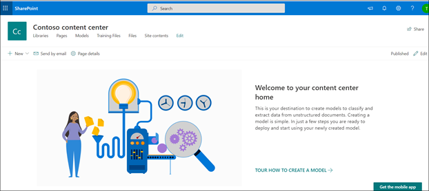

# Criar um centro de conteúdo no Microsoft SharePoint SyntexCreate a content center in Microsoft SharePoint Syntex

O conteúdo deste artigo é para a visualização privada do projeto Cortex.The content in this article is for the Project Cortex Private Preview. [Saiba mais sobre o Project Cortex](https://aka.ms/projectcortex).[Find out more about Project Cortex](https://aka.ms/projectcortex). 

 

> [!VIDEO https://www.microsoft.com/videoplayer/embed/RE4CPSF]

 

Para criar e gerenciar modelos de compreensão de documentos, primeiro você precisa de um centro de conteúdo.To create and manage document understanding models, you first need a content center. O centro de conteúdo é a interface de criação de modelo e também contém informações sobre quais modelos publicados de bibliotecas de documentos foram aplicados.The content center is the model creation interface and also contains information about which document libraries published models have been applied to. 

    

Você cria um centro de conteúdo inicial durante [a configuração](set-up-content-understanding.md).You create an initial content center during [setup](set-up-content-understanding.md). Mas um administrador do SharePoint também pode optar por criar centros adicionais, conforme necessário.But a SharePoint admin can also choose to create additional centers as needed. Embora um único centro de conteúdo possa ser bom para ambientes para os quais você deseja um lançamento de toda a atividade do modelo, talvez você queira ter centros adicionais para vários departamentos em sua organização, que podem ter necessidades e requisitos diferentes para seus modelos.While a single content center may be fine for environments for which you want a roll-up of all model activity, you may want to have additional centers for multiple departments within your organization, which may have different needs and requirements for their models.

> [!NOTE]
> Um administrador do SharePoint pode criar um site do centro de conteúdo como [criaria qualquer outro site do SharePoint](https://docs.microsoft.com/sharepoint/create-site-collection) usando um modelo de site.A SharePoint admin can create a content center site like they would [create any other SharePoint site](https://docs.microsoft.com/sharepoint/create-site-collection) by using a site template.

Para criar um novo centro de conteúdo:To create a new content center:

1. No centro de administração do Microsoft 365, vá para o centro de administração do SharePoint.From the Microsoft 365 admin center, go to the SharePoint admin center.
2. No centro de administração do SharePoint, em **sites**, selecione **sites ativos**.In the SharePoint admin center, under **Sites**, select **Active Sites**.
3. Na página **sites ativos** , clique em **criar**e, em seguida, selecione **outras opções**.On the **Active Sites** page, click **Create**, and then select **Other options**.
4. No menu **escolher um modelo** , selecione **central de conteúdo**.On the **Choose a template** menu, select **Content Center**.
5. Para o novo site, forneça um **nome de site**, **administrador principal**e um **idioma**.For the new site, provide a **Site Name**, **Primary administrator**, and a **Language**. 

> [!NOTE] 
> Opcionalmente, você pode selecionar um site de centro de conteúdo para renderizar em qualquer um dos idiomas disponíveis.You can optionally select a content center site to render in any of the available languages. Somente modelos atuais podem ser criados para arquivos em inglês.Only current models can be created for English files. 

6. Selecione **concluído**.Select **Finished**.

### Conceder acesso a usuários adicionaisGive access to additional users
 
Depois de criar o site, você pode permitir que usuários adicionais acessem o site por meio do [modelo de permissões de site padrão do SharePoint](https://docs.microsoft.com/sharepoint/modern-experience-sharing-permissions).After you create the site, you can give additional users access to the site through the standard [SharePoint site permissions model](https://docs.microsoft.com/sharepoint/modern-experience-sharing-permissions).

## Confira tambémSee Also
[Criar um classificadorCreate a classifier](create-a-classifier.md) 
[Criar um extratorCreate an extractor](create-an-extractor.md) 
[Criar um centro](create-a-content-center.md) 
 de conteúdo [Visão geral da compreensão do documento](document-understanding-overview.md)[Create a content center](create-a-content-center.md)
[Document understanding overview](document-understanding-overview.md) 
[Criar um modelo de processamento de formuláriosCreate a form processing model](create-a-form-processing-model.md) 
[Aplicar um modeloApply a model](apply-a-model.md)    
