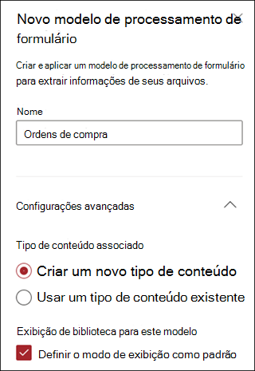
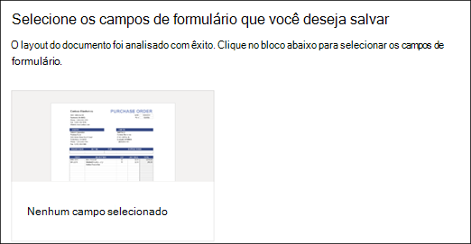
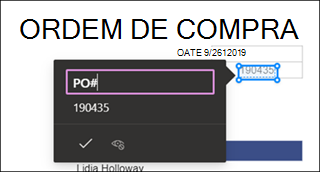
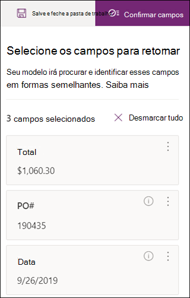
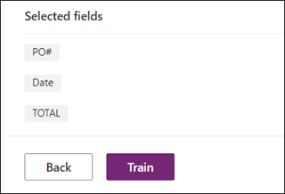
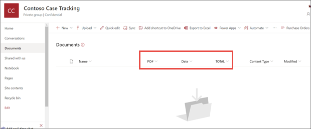
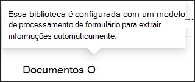

# Criar um modelo de processamento de formulário no Microsoft SharePoint Syntex

 

> [!VIDEO https://www.microsoft.com/videoplayer/embed/RE4GnhN]  

 

Usando o [AI Builder](https://docs.microsoft.com/ai-builder/overview), um recurso no Microsoft PowerApps, os usuários do SharePoint Syntex podem criar um [modelo de processamento de formulário](form-processing-overview.md) diretamente de uma biblioteca de documentos do SharePoint. 

A criação de um modelo de processamento de formulário envolve o seguinte:
 - Etapa 1: criar a partir do modelo de processamento para criar o tipo de conteúdo
 - Etapa 2: Adicionar e analisar arquivos de exemplo
 - Etapa 3: selecionar os campos de formulário
 - Etapa 4: treinar e testar o seu modelo
 - Etapa 5: publicar seu modelo
 - Etapa 6: usar o seu modelo

## Requisitos

Você só pode criar um modelo de processamento de formulário nas bibliotecas de documentos do SharePoint para os quais ele está habilitado. Se o processamento de formulário estiver habilitado, você poderá ver o **AI Builder** **"criar um modelo de processamento de formulário"** no menu **Automação** na biblioteca de documentos.  Se precisar de processamento habilitado na biblioteca de documentos, você deve contatar o administrador do SharePoint.

  

## Etapa 1: Criar um modelo de processamento de formulário

A primeira etapa na criação de um modelo de processamento de formulário é nomeá-lo e, em seguida, criar o novo tipo de conteúdo e criar um novo modo de exibição de biblioteca de documentos para ele.

1. Na biblioteca de documentos, selecione o menu **Automatizar**, selecione **AI Builder** e selecione **Criar um Modelo de Processamento de Formulário**.

     

2. No painel **Novo modelo de processamento de formulário**, no campo **Nome**, digite um nome para o seu modelo (por exemplo, *Ordens de Compra*).

      

3. Ao criar um modelo de processamento de formulário, você cria um novo tipo de conteúdo do SharePoint. Um tipo de conteúdo do SharePoint representa uma categoria de documentos que tem características comuns e compartilha um conjunto de propriedades de colunas ou metadados para esse conteúdo específico. Os tipos de conteúdo do SharePoint são gerenciados por meio da[Galeria de tipos de conteúdo]().

    Selecione **Configurações avançadas** se desejar mapear esse modelo para um tipo de conteúdo existente na Galeria de tipos de conteúdo do SharePoint para usar o esquema. 

4. Seu modelo cria um novo modo de exibição na biblioteca de documentos para seus dados extraídos. Se você não quiser usar o modo de exibição padrão, desmarque **Definir o modo de exibição como padrão**.

5. Selecione **Criar**.

## Etapa 2: Adicionar e analisar documentos

Depois de criar seu novo modelo de processamento de formulário, seu navegador abre uma nova página de modelo de processamento de formulários do AI Builder do PowerApps. Nesta página, você pode adicionar e analisar seus documentos de exemplo.  

> [!NOTE]
> Ao procurar os arquivos de exemplo que serão usados, confira as[informações sobre o modelo de processamento de formulário e dicas de otimização](https://docs.microsoft.com/ai-builder/form-processing-model-requirements). 

     
 
1. Selecione **Adicionar documentos** para começar a adicionar documentos de exemplo analisados para determinar os pares de valores nomeados que podem ser extraídos. Em seguida, você pode escolher **Carregar do armazenamento local**, **SharePoint** ou **Armazenamento de Blobs do Azure**. Você deve usar pelo menos cinco arquivos para treinamento.

2. Depois de adicionar arquivos, marque **Analisar** para verificar se há informações comuns a todos os arquivos. Esta ação pode levar vários minutos para ser concluída.  
 
      

3. Após a análise dos arquivos, na página **Selecionar os campos de formulário que você deseja salvar**, selecione o arquivo para exibir os campos detectados. 

      

## Etapa 3: Selecionar os campos de formulário

Depois de analisar os documentos dos campos, agora você pode ver os campos encontrados e identificar os que deseja salvar. Os campos salvos são exibidos como colunas no modo de exibição de biblioteca de documentos do modelo e mostram os valores extraídos de cada documento.

1. A próxima página exibe um dos seus arquivos de exemplo e realçará todos os campos comuns que foram detectados automaticamente pelo sistema.  

      

2. Selecione os campos que você deseja salvar e marque a caixa de seleção para confirmar a seleção. Por exemplo, no modelo de Pedido de Compra, escolha os campos *Data*, *Pedido de Compra* e *Total*.  Observe que você também pode optar por renomear um campo se escolher.  

      

3. Se um campo não foi detectado pela análise, ainda será possível adicioná-lo. Realce as informações que você deseja extrair e, na caixa nome, digite o nome desejado. Marque a caixa de seleção. Observe que você precisa confirmar campos não detectados em seus arquivos de exemplo restantes.

4. Clique em **Confirmar campos** depois de selecionar os campos que você deseja salvar.  
 
      
 
5. Na página **Selecionar os campos de formulário que você deseja salvar**, ele mostra o número de campos selecionados. Selecione **Concluído**.

## Etapa 4: treinar e testar o seu modelo

Depois de selecionar os campos que você deseja salvar, a página de **Resumo do modelo** permite treinar e testar o seu modelo.

1. Na página de **Resumo do Modelo**, os campos salvos serão exibidos na seção **Campos selecionados**. Marque **Treinar** para começar o treinamento em seus arquivos de exemplo. Observe que isso pode levar alguns minutos para ser concluído. 

       

2. Quando vir a notificação de que o treinamento foi concluído, marque **Acessar a página de detalhes**. 

3. Na página **Detalhes do modelo**, você pode optar por testar como seu modelo funciona selecionando **Teste rápido**. Isso permite arrastar e soltar arquivos para a página e ver se os campos são detectados.

      

2. Quando vir a notificação de que o treinamento foi concluído, marque **Acessar a página de detalhes**. 

3. Na página **detalhes do modelo**, opte por testar como seu modelo funciona selecionando **Teste rápido**. Isso permite arrastar e soltar arquivos para a página e ver se os campos são detectados.

## Etapa 5: publicar seu modelo

1. Se você estiver satisfeito com os resultados do modelo, selecione **Publicar** para disponibilizá-lo para uso.

2. Após a publicação do modelo, selecione **Usar modelo**. Isso cria um fluxo PowerAutomate que pode ser executado na biblioteca de documentos do SharePoint e extrai os campos identificados no modelo e, em seguida, selecione **Criar Fluxo**.
  
3. Quando concluir, você verá a mensagem **Seu fluxo foi criado com êxito**.
 
## Etapa 6: usar o seu modelo

Depois de publicar seu modelo e criar seu fluxo PowerAutomate, você pode usar o modelo na biblioteca de documentos do SharePoint.

1. Depois de publicar seu modelo, selecione **Acessar o SharePoint** para ir para a biblioteca de documentos.

2. No modo de exibição modelo de biblioteca de documentos, observe que os campos selecionados agora são exibidos como colunas. 

      

3. Observe que o link de informações ao lado de **Documentos** nota que um modelo de processamento de formulários foi aplicado a essa biblioteca de documentos.

       

4. Carregar arquivos para uma biblioteca de documentos. Todos os arquivos identificados pelo modelo, como o tipo de conteúdo, lista os arquivos em seu modo de exibição e exibe os dados extraídos nas colunas. 

       

## Confira também
  
[Documentação do Power Automate](https://docs.microsoft.com/power-automate/)

[Treinamento: Melhore o desempenho de negócios com o AI Builder](https://docs.microsoft.com/learn/paths/improve-business-performance-ai-builder/?source=learn)
