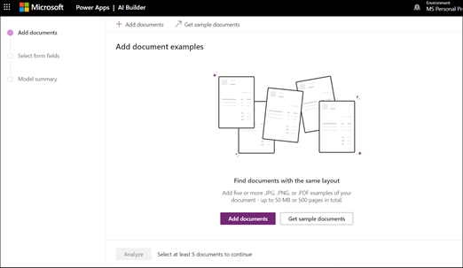

# Criar um modelo de processamento de formulários no Microsoft SharePoint SyntexCreate a form processing model in Microsoft SharePoint Syntex

O conteúdo deste artigo é para a visualização privada do projeto Cortex.The content in this article is for the Project Cortex Private Preview. [Saiba mais sobre o Project Cortex](https://aka.ms/projectcortex).[Find out more about Project Cortex](https://aka.ms/projectcortex).

Usando o [ai Builder](https://docs.microsoft.com/ai-builder/overview) -um recurso no Microsoft PowerApps-Project Cortex os usuários podem criar um [modelo de processamento de formulários](form-processing-overview.md) diretamente de uma biblioteca de documentos do SharePoint.Using [AI Builder](https://docs.microsoft.com/ai-builder/overview) - a feature in Microsoft PowerApps - Project Cortex users can create a [form processing model](form-processing-overview.md) directly from a SharePoint document library. 

A criação de um modelo de processamento de formulários envolve o seguinte:Creating a form processing model involves the following:
 - Etapa 1: criar o modelo de processamento do para criar o tipo de conteúdoStep 1: Create the from processing model to create the content type
 - Etapa 2: Adicionar e analisar arquivos de exemploStep 2: Add and analyze example files
 - Etapa 3: selecionar seus campos de formulárioStep 3: Select your form fields
 - Etapa 4: treinar e testar seu modeloStep 4: Train and test your model
 - Etapa 5: publicar seu modeloStep 5: Publish your model
 - Etapa 6: usar o modeloStep 6: Use your model

## RequisitosRequirements

Você só pode criar um modelo de processamento de formulário em bibliotecas de documentos do SharePoint para os quais ele está habilitado.You can only create a form processing model in SharePoint document libraries for which it is enabled. Se o processamento de formulários estiver habilitado, você poderá ver o **Construtor ai** **"criar um modelo de processamento de formulários** " no menu **automatizar** da biblioteca de documentos.If form processing is enabled, you are able to see the **AI Builder** **"Create a form processing model'** under the **Automate** menu in your document library.  Se você precisar de processamento habilitado em sua biblioteca de documentos, você deve entrar em contato com seu administrador do SharePoint.If you need processing enabled on your document library, you must contact your SharePoint administrator.

  

## Etapa 1: criar um modelo de processamento de formulárioStep 1: Create a form Processing model

A primeira etapa na criação de um modelo de processamento de formulários é nomeá-lo e criar o novo tipo de conteúdo e criar um novo modo de exibição de biblioteca de documentos.The first step in creating a form processing model is to name it and create the define the new content type and create a new document library view for it.

1. Na biblioteca de documentos, selecione o menu **automatizar** , selecione **Construtor ai**e, em seguida, selecione **criar um modelo de processamento de formulários**.From the document library, select the **Automate** menu, select **AI Builder**, and then select **Create a Form Processing model**.

     

2. No painel **novo modelo de processamento de formulário** , no campo  **nome** , digite um nome para o modelo (por exemplo, *ordens de compra*).In the **New form processing model** pane, in the  **Name** field, type a name for your model (for example, *Purchase Orders*).

      

3. Ao criar um modelo de processamento de formulário, você cria um novo tipo de conteúdo do SharePoint.When you create a form processing model, you create a new SharePoint content type. Um tipo de conteúdo do SharePoint representa uma categoria de documentos que têm características comuns e compartilham uma coleção de colunas ou propriedades de metadados para esse conteúdo específico.A SharePoint content type represents a category of documents that have common characteristics and share a collection of columns or metadata properties for that particular content. Os tipos de conteúdo do SharePoint são gerenciados por meio da [Galeria de tipos de conteúdo]().SharePoint Content Types are managed through the [Content types gallery]().

    Selecione **Configurações avançadas** se quiser mapear esse modelo para um tipo de conteúdo existente na Galeria de tipos de conteúdo do SharePoint para usar seu esquema.Select **Advanced settings** if you want to map this model to an existing content type in the SharePoint Content types gallery to use its schema. 

4. Seu modelo cria um novo modo de exibição na biblioteca de documentos para os dados extraídos.Your model creates a new view in your document library for your extracted data. Se você não quiser fazê-lo para o modo de exibição padrão, desmarque **definir o modo de exibição como padrão**.If you do not want it to the default view, deselect **Set the view as default**.

5. Selecione **Criar**.Select **Create**.

## Etapa 2: Adicionar e analisar documentosStep 2: Add and analyze documents

Depois de criar seu novo modelo de processamento de formulário, seu navegador abre uma nova página de modelo de processamento de formulários do Construtor AI.After you create your new form processing model, your browser opens a new PowerApps AI Builder forms processing model page. Nesta página, você pode adicionar e analisar seus documentos de exemplo.On this page you can add and analyze your example documents.  

> [!NOTE]
> Ao procurar por exemplos de arquivos a serem usados, consulte o [modelo de processamento de formulários de entrada e dicas de otimização](https://docs.microsoft.com/ai-builder/form-processing-model-requirements).When looking for example files to use, see the [form processing model input document requirements and optimization tips](https://docs.microsoft.com/ai-builder/form-processing-model-requirements). 

     
 
1. Selecione **adicionar documentos** para começar a adicionar documentos de exemplo analisados para determinar os pares de valores nomeados que podem ser extraídos.Select **Add documents** to begin adding example documents analyzed to determine the named value pairs that can be extracted. Em seguida, você pode escolher **carregar do armazenamento local**, **do SharePoint**ou **do armazenamento de blob do Azure**.You can then choose either **Upload from local storage**, **SharePoint**, or **Azure Blob storage**. Você precisa usar pelo menos cinco arquivos para treinamento.You need to use at least five files for training.

2. Após adicionar arquivos, selecione **analisar** para verificar se há informações comuns em todos os arquivos.After adding files, select **Analyze** to check for any information common is all files. Isso pode levar alguns minutos para ser concluído.This may take several minutes to complete.  
 
      

3. Após a análise dos arquivos, na página **Selecione os campos de formulário que você deseja salvar** , selecione o arquivo para exibir os campos detectados.After the files have been analyzed, in the **Select the form fields you want to save** page select the file to view the detected fields. 

      

## Etapa 3: selecionar seus campos de formulárioStep 3: Select your form fields

Após analisar os documentos de campos, agora você pode ver os campos que foram encontrados e identificar aqueles que você deseja salvar.After analyzing the documents for fields, you can now see the fields that were found, and identify the ones that you want to save. Os campos salvos são exibidos como colunas no modo de exibição de biblioteca de documentos do seu modelo e mostram os valores extraídos de cada documento.Saved fields display as columns in your model's document library view and show the values extracted from each document.

1. A próxima página exibe um de seus arquivos de amostra e realçará todos os campos comuns que foram detectados automaticamente pelo sistema.The next page displays one of your sample files and will highlight all common fields that were automatically detected by the system.  

      

2. Selecione os campos que você deseja salvar e marque a caixa de seleção para confirmar sua seleção.Select the fields that you want to save and select the checkbox to confirm your selection. Por exemplo, no modelo de ordem de compra, escolha a seleção dos campos *Data*, *OC*e *total* .For example, in the Purchase Order model, choose to select the *Date*, *PO*, and *Total* fields.  Observe que você também pode optar por renomear um campo se escolher.Note that you can also choose to rename a field if you choose.  

      

3. Se um campo não foi detectado pela análise, você ainda pode optar por adicioná-lo.If a field was not detected by analysis, you can still choose to add it. Destaque as informações que você deseja extrair e, na caixa nome, digite o nome desejado.Highlight the information you want to extract, and in the name box type in the name you want. Em seguida, marque a caixa de seleção.Then select the check box. Observe que você precisa confirmar campos não detectados em seus arquivos de amostra restantes.Note that you need to confirm undetected fields in your remaining sample files.

4. Clique em **confirmar campos** depois de selecionar os campos que você deseja salvar.Click **Confirm fields** after you have selected the fields that you want to save.  
 
      
 
5. Na página **selecionar os campos de formulário que você deseja salvar** , ele mostra o número de campos que você selecionou.On the **Select the form fields you want to save** page, it shows the number of fields you have selected. Selecione **Concluído**.Select **Done**.

## Etapa 4: treinar e testar seu modeloStep 4: Train and test your model

Depois de selecionar os campos que você deseja salvar, a página de **Resumo do modelo** permite treinar e testar o modelo.After selecting the fields you want to save, the **Model Summary** page lets you train and test your model.

1. Na página de **Resumo do modelo** , os campos salvos serão exibidos na seção **campos selecionados** .On the **Model Summary** page, the saved fields will show in the **Selected fields** section. Selecione **treinar** para começar o treinamento nos seus arquivos de exemplo.Select **Train** to begin training on your example files. Observe que isso pode levar alguns minutos para ser concluído.Note that this may take a few minutes to complete. 

       

2. Quando você vir a notificação de que o treinamento foi concluído, selecione **ir para a página de detalhes**.When you see the notification that training has completed, select **Go to details page**. 

3. Na página **detalhes do modelo** , você pode optar por testar como funciona o modelo selecionando **teste rápido**.On the **Model details** page, you can choose to test how your model works by selecting **Quick test**. Isso permite que você arraste e solte arquivos para a página e veja se os campos foram detectados.This lets you drag and drop files to the page and see if the fields are detected.

      

2. Quando você vir a notificação de que o treinamento foi concluído, selecione **ir para a página de detalhes**.When you see the notification that training has completed, select **Go to details page**. 

3. Na página **detalhes do modelo** , escolha testar como funciona o modelo selecionando **teste rápido**.On the **Model details** page, choose to test how your model works by selecting **Quick test**. Isso permite que você arraste e solte arquivos para a página e veja se os campos foram detectados.This lets you drag and drop files to the page and see if the fields are detected.

## Etapa 5: publicar seu modeloStep 5: Publish your model

1. Se estiver satisfeito com os resultados do modelo, selecione **publicar** para torná-lo disponível para uso.If you are satisfied with the results of your model, select **Publish** to make it available for use.

2. Depois que o modelo for publicado, selecione **usar modelo**.After the model is published, select **Use model**. Isso cria um fluxo de PowerAutomate que pode ser executado na biblioteca de documentos do SharePoint e extrai os campos que foram identificados no modelo e, em seguida, selecione **criar fluxo**.This creates a PowerAutomate flow that can run in your SharePoint document library and extracts the fields that have been identified in the model, then select **Create Flow**.
  
3. Quando for concluída, você verá a mensagem **de que o fluxo foi criado com êxito**.When completed, you will see the message **Your flow has been successfully created**.
 
## Etapa 6: usar o modeloStep 6: Use your model

Após publicar o modelo e criar o fluxo de PowerAutomate, você pode usar o modelo na biblioteca de documentos do SharePoint.After publishing your model and creating it's PowerAutomate flow, you can use your model in your SharePoint document library.

1. Após publicar o modelo, selecione **ir para o SharePoint** para ir para a biblioteca de documentos.After publishing your model, select **Go to SharePoint** to go to your document library.

2. No modo de exibição modelo de biblioteca de documentos, observe que os campos selecionados agora são exibidos como colunas.In the document library model view, notice that the fields you selected now display as columns. 

      

3. Observe que o link de informações ao lado de **documentos** avisa que um modelo de processamento de formulários é aplicado a esta biblioteca de documentos.Notice that the information link next to **Documents** notes that a forms processing model is applied to this document library.

       

4. Carregar arquivos para sua biblioteca de documentos.Upload files to your document library. Qualquer arquivo que o modelo identifica como o tipo de conteúdo lista os arquivos em seu modo de exibição e exibe os dados extraídos nas colunas.Any files that the model identifies as it's content type lists the files in your view and displays the extracted data in the columns. 

       

## Confira tambémSee Also
  
[Documentação da automatização de energiaPower Automate documentation](https://docs.microsoft.com/power-automate/) 
[Treinamento: aprimore o desempenho de negócios com o Construtor AITraining: Improve business performance with AI Builder](https://docs.microsoft.com/learn/paths/improve-business-performance-ai-builder/?source=learn) 
