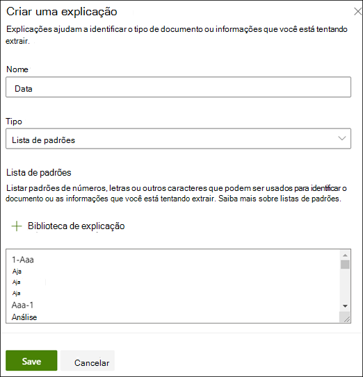
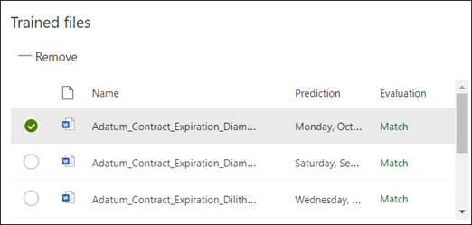
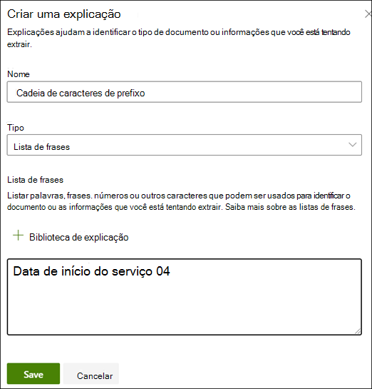
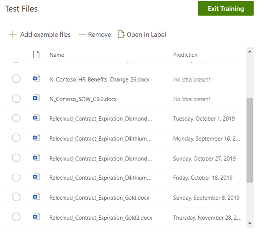

# Criar um extrator no Microsoft SharePoint Syntex

 

> [!VIDEO https://www.microsoft.com/videoplayer/embed/RE4CL2G]

  

Antes ou depois de criar um modelo de classificador para automatizar a identificação e classificação de tipos de documentos específicos, você pode optar por adicionar extratores ao seu modelo para extrair informações específicas desses documentos. Por exemplo, você pode desejar que seu modelo não apenas identifique todos os documentos de *Renovação do Contrato* adicionados à sua biblioteca de documentos, mas também exiba a *Data de Início do Serviço* para cada documento como um valor de coluna em a biblioteca de documentos.

É necessário criar um extrator para cada entidade no documento que se deseja extrair. No nosso exemplo, desejamos extrair a  **Data de Início do Serviço**  para cada documento de  **Renovação de Contrato**  que é identificado pelo modelo. Queremos ter uma visão na biblioteca de documentos de todos os documentos de  **Renovação de Contrato** , com uma coluna que mostra o valor da data de **Início do Serviço** de cada documento. 

> [!NOTE]
> Para criar um extrator, você utiliza os mesmos arquivos que carregou anteriormente para treinar o classificador. 

## Nomeie seu extrator

1. Na página inicial do modelo, no bloco **Criar e treinar extratores**, clique em **Extrator de treinamento**.
2. Na tela **Novo extrator de entidade**, digite o nome do seu extrator no campo **Novo nome do extrator**. Por exemplo, nomeie a **Data de Início do Serviço** se você quiser extrair a data de início do serviço de cada documento de Renovação do Contrato. Também é possível optar por reutilizar uma coluna anteriormente criada (por exemplo, uma coluna de metadados gerenciados).
> [!NOTE]
> Se você criar um novo extrator, selecione **Novo tipo de coluna** e escolha **Linha única de texto**, com o limite máximo de caracteres de 255. Qualquer caractere que você digitar excedendo o limite sairá truncado. 
3. Quando terminar, clique em **Criar**.

## Adicione um rótulo

A próxima etapa é rotular a entidade que você deseja extrair nos seus exemplos de arquivos de treinamento.

A criação do extrator abre a página do extrator. Aqui você vê uma lista com seus arquivos de amostra, e o primeiro arquivo da lista é exibido no visualizador.

1. No visualizador, selecione os dados que deseja extrair dos arquivos. Por exemplo, se quiser extrair a *Data de Início do Serviço*, você destaca o valor da data no primeiro arquivo (*Segunda-feira, 14 de outubro de 2019*). e depois clique em **Salvar**.  Você deve ver a exibição do valor do arquivo na lista de exemplos Rotulados, na coluna **Rótulo**.
2. Selecione o **Próximo arquivo** para salvar automaticamente e abrir o arquivo seguinte da lista no visualizador. Ou selecione **Salvar** e depois selecione outro arquivo da lista **Exemplos rotulados**.
3. No visualizador, repita as etapas 1 e 2 e, em seguida, repita até salvar o rótulo em todos os cinco arquivos.

     

 
Uma vez rotulados os cinco arquivos, um banner de notificação informa que você deve passar para o treinamento. É possível escolher entre etiquetar mais documentos ou avançar para o treinamento. 

## Adicione uma explicação

Para nosso exemplo, vamos criar uma explicação que fornece uma dica sobre o formato da entidade em si e as variações que ela pode ter nos modelos de documentos. Por exemplo, um valor de data pode estar em vários formatos diferentes, como por exemplo:
- 14/10/2019
- 14 de outubro de 2019
- Segunda-feira, 14 de outubro de 2019
 

Para ajudar a identificar a *Data de Início do Serviço*, você pode criar uma explicação padrão.

1. Na seção Explicação, selecione **Novo** e digite um nome (por exemplo, *Data*).
2. Para Tipo, selecione **Lista de padrões**.
3. Para Valor, forneça a variação de data conforme aparecem nos arquivos de amostra. Por exemplo, se você tem formatos de data que aparecem como 0/00/0000, digite quaisquer variações que aparecem em seus documentos, como por exemplo:
    - 0/0/0000
    - 0/00/0000
    - 00/0/0000
    - 00/00/0000
4. Selecione **Salvar**.

> [!NOTE]
> Para obter mais informações sobre os tipos de explicação, consulte [Tipos de explicação](https://docs.microsoft.com/microsoft-365/contentunderstanding/explanation-types-overview).  

### Utilize a biblioteca de explicações

Para criar explicações para itens como datas, é mais fácil [utilizar a biblioteca de explicações ](https://docs.microsoft.com/microsoft-365/contentunderstanding/explanation-types-overview#use-the-explanation-library) do que inserir manualmente todas as variações. A biblioteca de explicação é um conjunto de frases predefinidas e explicações de padrões. A biblioteca busca fornecer todos os formatos de frases comuns ou listas de padrões, como datas, números de telefone, CEPs e muitos outros. 

Para o exemplo de *Data de Início do Serviço*, é mais eficiente usar a explicação predefinida para *Data* na biblioteca de explicações:

1. Na seção **Explicação**, selecione **Novo**, e então selecione **Na biblioteca de explicações**.
2. Na biblioteca de explicações, selecione **Data**. Você pode ver todas as variações de data que são reconhecidas.
3. Clique em **Adicionar**. 

     

4. Na página **Criar uma explicação**, a informação *Data* da biblioteca de explicações preenche automaticamente os campos. Selecione **Salvar**. 

     

## Treine o modelo 

Salvando sua explicação, inicie o treinamento. Se o seu modelo tiver informações suficientes para extrair os dados dos seus arquivos de amostra rotulados, você verá cada arquivo rotulado com **Compatível**.  

 

Se a explicação não contém informações suficientes para localizar os dados que você deseja extrair, cada arquivo será rotulado com **Incompatível**. Você pode clicar nos arquivos **Incompatíveis** para ver mais informações sobre o motivo da incompatibilidade.

## Adicione outra explicação

Muitas vezes, a incompatibilidade é uma indicação de que a explicação que fornecemos não proporcionou informações suficientes para extrair o valor da data de início do serviço para corresponder aos nossos arquivos rotulados. Você pode precisar editá-lo ou acrescentar outra explicação.

Para nosso exemplo, observe que o texto *data de Início do Serviço de* sempre precede o valor real. Para ajudar a identificar a Data de Início do Serviço, você precisa criar uma explicação de frase.

1. Na seção Explicação, selecione **Novo**, e então digite um nome (por exemplo, *Sequencia de Prefixo*).
2. Para o Tipo, selecione **Lista de frases**.
3. Utilize a *Data de Início do Serviço* como o valor.
4. Selecione **Salvar**.

     

## Treine novamente o modelo

Salvar a explicação inicia o treinamento novamente, desta vez usando as duas explicações do exemplo. Se o seu modelo tiver informações suficientes para extrair os dados dos arquivos de amostra rotulados, você verá cada arquivo rotulado com **Compatível**. 

Se você receber novamente um **Incompatível** em seus arquivos rotulados, provavelmente precisará criar outra explicação para fornecer ao modelo mais informações para identificar o tipo de documento ou considerar fazer alterações nos existentes.

## Teste o seu modelo

Se você receber uma compatibilidade em seus arquivos de amostra rotulados, agora você pode testar seu modelo no restante dos arquivos de amostra não rotulados. Isso é opcional, mas uma etapa útil para avaliar a "adequação" ou prontidão do modelo antes de usá-lo, testando-o em arquivos que o modelo nunca viu antes.

1. Na página inicial do modelo, clique na guia **Teste**. Isso executa o modelo em seus arquivos de amostra não rotulados.
2. Na lista **Arquivos de teste**, seus arquivos de exemplo são exibidos para mostrar se o modelo é capaz de extrair as informações de que você precisa. Utilize essas informações para ajudar a determinar a eficácia do seu classificador na identificação dos seus documentos.

     

## Confira também
[Criar um classificador](create-a-classifier.md)

[Tipos de explicação](explanation-types-overview.md)

[Aproveitar a taxonomia do repositório de termos ao criar um extrator](leverage-term-store-taxonomy.md)

[Visão geral sobre Compreensão de Documentos](document-understanding-overview.md).

[Aplicar um modelo](apply-a-model.md) 
