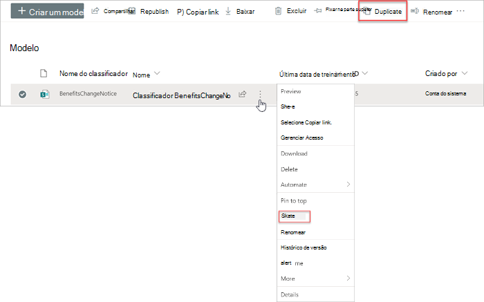
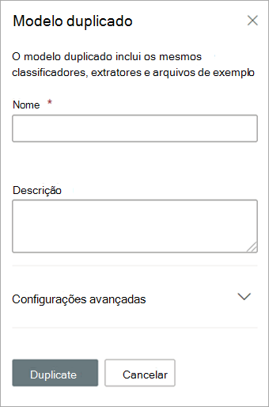

# Duplicar um modelo no Microsoft SharePoint SyntexDuplicate a model in Microsoft SharePoint Syntex

A duplicação de um modelo de compreensão de documento pode economizar tempo e esforço se você precisar criar um novo modelo e saber que um modelo existente é muito semelhante ao que você precisa.Duplicating a document understanding model can save you time and effort if you need to create a new model, and know that an existing model is very similar to what you need.

Por exemplo, um modelo existente denominado “Contratos” classifica os mesmos arquivos com os quais você precisa trabalhar.For example, an existing model named “Contracts” classifies the same files you need to work with. Seu novo modelo extrairá alguns dos dados existentes, mas precisará ser atualizado para extrair alguns dados adicionais.Your new model will extract some of the existing data, but will need to be updated to extract some additional data. Em vez de criar e treinar um novo modelo do zero, você pode usar o recurso de modelo duplicado para fazer uma cópia do modelo de Contratos, que também copiará todos os itens de treinamento associados, como arquivos de exemplo e extratores de entidade.Instead of creating and training a new model from scratch, you can use the duplicate model feature to make a copy of the Contracts model, which will also copy all associated training items, such as example files and entity extractors.

Ao duplicar o modelo, depois de renomeá-lo (por exemplo, para “Renovações de contrato”), você pode fazer atualizações nele.When you duplicate the model, after you rename it (for example, to “Contract Renewals”), you can then make updates to it. Por exemplo, você pode escolher remover alguns dos campos extraídos existentes que você não precisa e, em seguida, treinar o modelo para extrair um novo (por exemplo, "Data de renovação").For example, you can choose to remove some of the existing extracted fields that you don’t need, and then train the model to extract a new one (for example, “Renewal date”).

## Duplicar um modeloDuplicate a model

Siga estas etapas para duplicar um modelo de compreensão de documento.Follow these steps to duplicate a document understanding model.

1. No centro de conteúdo, selecione **Modelos** para ver sua lista de modelos.From the content center, select **Models** to see your models list.

2. Na página **Modelos**, selecione o modelo que deseja duplicar.On the **Models** page, select the model you want to duplicate.

3. Usando a faixa de opções ou o botão **Mostrar ações** (próxima ao nome do modelo), selecione **Duplicar**.By using either the ribbon or the **Show actions** button (next to the model name), select **Duplicate**. 

      

4. No painel **Modelo duplicado**:On the **Duplicate model** panel:

   a.a. Em **Nome**, insira o novo nome do modelo que deseja duplicar.Under **Name**, enter the new name of the model that you want to duplicate. 

      

   b.b. Em **Descrição**, adicione uma descrição de seu novo modelo.Under **Description**, add a description of your new model.

   c.c. (Opcional) Em **Configurações avançadas**, selecione se deseja associar um tipo de [conteúdo existente](/sharepoint/governance/content-type-and-workflow-planning#content-type-overview).(Optional) Under **Advanced settings**, select whether you want to associate an existing [content type](/sharepoint/governance/content-type-and-workflow-planning#content-type-overview).

5. Selecione **Duplicar**.Select **Duplicate**.

## Confira tambémSee Also
[Criar um classificadorCreate a classifier](create-a-classifier.md)

[Renomear um modeloRename a model](rename-a-model.md)

[Criar um extratorCreate an extractor](create-an-extractor.md)

[Visão geral sobre Compreensão de Documentos](document-understanding-overview.md).[Document Understanding overview](document-understanding-overview.md)

[Tipos de explicaçãoExplanation types](explanation-types-overview.md)

[Aplicar um modeloApply a model](apply-a-model.md) 

[Modo de Acessibilidade do SharePoint SyntexSharePoint Syntex Accessibility Mode](accessibility-mode.md)