# Introdução aos tipos de explicação

As explicações são usadas para ajudar a definir as informações que você deseja rotular e extrai para seus modelos de compreensão de documentos no Microsoft SharePoint Syntex. Ao criar uma explicação, você precisa selecionar um tipo de explicação. Este artigo ajuda você a entender os diferentes tipos de explicação e como eles são usados. 

   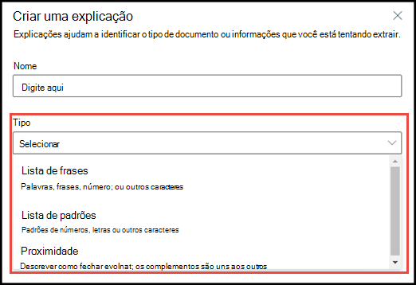 
   
Esses tipos de explicação estão disponíveis:

- **Lista de frases**: lista de palavras, frases, números ou outros caracteres que você pode usar no documento ou informações que você está extraindo. Por exemplo, a cadeia de texto **Médico encaminhador** está em todos os documentos de Encaminhamento Médico que você está identificando. 

- **Lista de padrões**: lista padrões de números, letras ou outros caracteres que você pode usar para identificar as informações que você está extraindo. Por exemplo, você pode extrair o **Número de telefone** do médico encaminhador de todos os documentos de Encaminhamento Médico que você está identificando. 

- **Proximidade**: descreve a proximidade das explicações entre si.  Por exemplo, uma lista de padrões de *número da rua* fica antes da lista de frases de *nome da rua*, sem tokens entre elas (você aprenderá sobre tokens mais adiante neste artigo). Usar o tipo de proximidade exige que você tenha pelo menos duas explicações em seu modelo, ou a opção será desabilitada. 
 
## Lista de frases

Um tipo de explicação de lista de frases geralmente é usado para identificar e classificar um documento por meio do seu modelo. Conforme descrito no exemplo de rótulo *Médico encaminhador*, é uma cadeia de cadeia de palavras, frases, números ou caracteres que está de maneira consistente nos documentos que você está identificando.

Embora não seja um requisito, você pode obter um sucesso melhor com a sua explicação se a frase que está capturando estiver localizada em um local consistente no documento. Por exemplo, o rótulo *Médico encaminhador* pode estar localizado, de maneira consistente, no primeiro parágrafo do documento.

Se a diferenciação de maiúsculas e minúsculas for um requisito para a identificação do seu rótulo, usar o tipo de lista de frases permite que você o especifique na sua explicação selecionando a caixa de seleção **Somente maiúsculas**.

   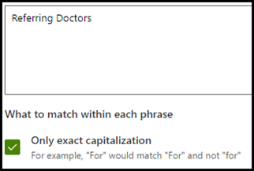 

## Listas de padrões

Um tipo de lista de padrões é especialmente útil quando você cria uma explicação que identifica e extrai informações de um documento. Geralmente, é apresentado em formatos diferentes, como datas, números de telefone e de cartão de crédito. Por exemplo, um data pode ser exibida em diversos formatos (1/1/2020, 1-1-2020, 01/01/20, 01/01/2020, 1º de janeiro de 2020, etc.). A definição de uma lista de padrões torna suas explicações mais eficientes, capturando todas as variações possíveis nos dados que você está tentando identificar e extrair. 

Para obter o exemplo de **Número de telefone**, extraia o número de telefone de cada médico encaminhador de todos os documentos de Encaminhamento Médico identificados pelo modelo. Ao criar a explicação, selecione o tipo de lista de padrões para permitir que os diferentes formados esperados sejam retornados.

   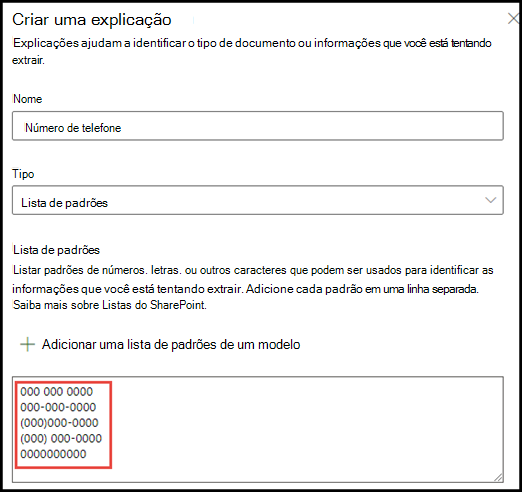

Para este exemplo, selecione a caixa de seleção **Qualquer dígito de 0-9** para reconhecer cada valor "0" usado em sua lista de padrões como qualquer dígito de 0 a 9.

   

Da mesma forma, se você criar uma lista de padrões que inclui caracteres de texto, selecione a caixa de seleção **Qualquer letra de a-z** para reconhecer cada caractere "a" usado na lista de padrões como qualquer caractere de "a" a "z".

Por exemplo, se você criar uma lista de padrões **Data** e desejar verificar se um formato de data como *1º de janeiro de 2020* é reconhecido, será necessário:
- Adicionar *aaa 0, 0000* e *aaa 00, 0000* à sua lista de padrões.
- Verificar se **Qualquer letra de a-z** também está selecionada.

   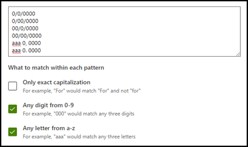

Além disso, se você tiver requisitos de uso de maiúsculas na sua lista de padrões, você tem a opção de selecionar a caixa de seleção **Somente maiúsculas**. Para o exemplo de Data, se for necessário que a primeira letra do mês seja maiúscula, você precisará:

- Adicionar *Aaa 0, 0000* e *Aaa 00, 0000* à sua lista de padrões.
- Verificar se **Somente maiúsculas** também está selecionada.

   

> [!NOTE]
> Em vez de criar uma explicação da lista de padrões manualmente, use a [biblioteca de explicações](#use-explanation-templates) para usar modelos de lista de padrões de uma lista de padrões comuns, como *data*, *número de telefone*, *número de cartão de crédito*, etc.

## Proximidade 

O tipo de explicação da proximidade ajuda seu modelo a identificar dados definindo a proximidade dos dados entre si. Por exemplo, em seu modelo, você definiu duas explicações que rotulam o *Número da rua* e *Número de telefone* do cliente. 

Observe que os números de telefone do cliente sempre aparecem antes do número da rua. 

Alex Wilburn 
555-555-5555 
One Microsoft Way 
Redmond, WA 98034 

Use a explicação de proximidade para definir a distância da explicação do número de telefone para identificar melhor o número da rua em seus documentos.

    

#### O que são tokens?

Para usar o tipo de explicação de proximidade, você precisa entender o que é um token, uma vez que o número de tokens é como a explicação de proximidade mede a distância de uma explicação para a outra. Um token é um intervalo contínuo (sem incluir espaços ou pontuação) de letras e números. 

A tabela a seguir mostra exemplos de como determinar o número de tokens em uma frase.

|Frase|Número de tokens|Explicação|
|--|--|--|
|`Dog`|1|Uma única palavra sem pontuação ou espaços.|
|`RMT33W`|1|Um número de localizador de registro. Pode incluir números e letras, mas não tem pontuação.|
|`425-555-5555`|5|Um número de telefone. Cada sinal de pontuação é um único token, assim `425-555-5555` equivale a 5 tokens: `425` `-` `555` `-` `5555` |
|`https://luis.ai`|7|`https` `:` `/` `/` `luis` `.` `ai` |

#### Configurar o tipo de explicação de proximidade

Para o exemplo, defina a configuração de proximidade para definir o intervalo do número de tokens na explicação do *Número de telefone* da explicação do *Número da rua*. Observe que o intervalo mínimo é “0”, pois não há nenhum token entre o número de telefone e o número da rua.

No entanto, alguns números de telefone nos documentos de exemplo são acrescentados no *(telefone)*.

Nestor Wilke 
111-111-1111 (móvel) 
One Microsoft Way 
Redmond, WA 98034 

Há três tokens em *(móvel)*:

|Frase|Contagem de tokens|
|--|--|
|(|1|
|móvel|2|
|)|3|

Definir a configuração de proximidade para ter um intervalo de 0 a 3.

    

## Configurar onde as frases ocorrem no documento

Quando você cria uma explicação, por padrão, todo o documento é pesquisado pela frase que você está tentando extrair. No entanto, você pode usar a configuração avançada <b>Onde essas frases ocorrem</b> para ajudar a isolar um local específico do documento em que ocorre uma frase. Isso é útil em situações em que instâncias semelhantes de uma frase podem aparecer em outro lugar no documento e você deseja ter certeza de que a correta está selecionada. Ao se referir ao nosso exemplo de documento de Referência Médica, o **Médico Encaminhador** sempre é mencionado no primeiro parágrafo do documento. Com a configuração <b>Onde essas frases ocorrem</b>, neste exemplo, você pode configurar a explicação para pesquisar por esse rótulo somente na seção inicial do documento ou em qualquer outro local em que ela possa ocorrer.

   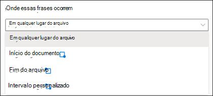 

Você pode escolher uma das três opções para esta configuração:

- Em qualquer lugar no arquivo: o documento inteiro é pesquisado pela frase.
- Início do arquivo: o documento é pesquisado do início até o local da frase.  
   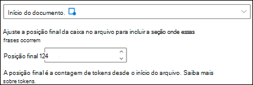 
No visualizador, você pode ajustar manualmente a caixa de seleção para incluir o local onde a fase ocorre. O valor <b>Posição final</b> será atualizado para mostrar o número de tokens que sua área selecionada inclui. Observe que você também pode atualizar o valor da Posição final para ajustar a área selecionada. 
   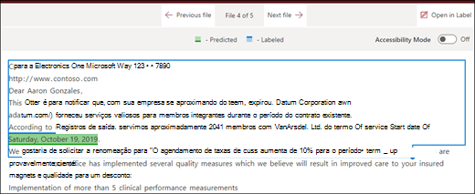 

- Final do arquivo: o documento é pesquisado do final até o local da frase.  
   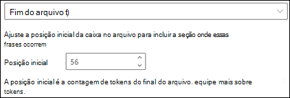 
No visualizador, você pode ajustar manualmente a caixa de seleção para incluir o local onde a fase ocorre. O valor <b>Posição incial</b> será atualizado para mostrar o número de tokens que sua área selecionada inclui. Observe que você também pode atualizar o valor da Posição inicial para ajustar a área selecionada.  
   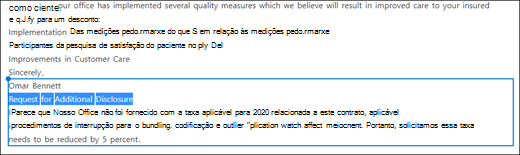 
- Intervalo personalizado: o documento é pesquisado em um intervalo especificado dentro dele para o local da frase.  
   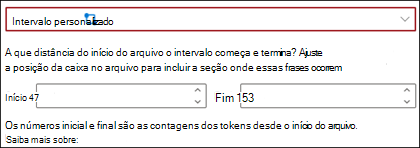 
No visualizador, você pode ajustar manualmente a caixa de seleção para incluir o local onde a fase ocorre. Para essa configuração, você precisa selecionar uma posição <b>Inicial</b> e uma <b>Final</b>. Esses valores representam o número de tokens do início do documento. Embora seja possível inserir manualmente esses valores, é mais fácil ajustar manualmente a caixa de seleção no visualizador.  
   
## Usar modelos de explicação

Embora você possa adicionar manualmente vários valores da lista de frases para sua explicação, pode ser mais fácil usar os modelos fornecidos a você na biblioteca de explicação.

Por exemplo, em vez de adicionar manualmente todas as variações de *Data*, você pode usar o modelo de lista de frases para *Data*, pois já inclui vários valores da listas de frases: 

    
 
A biblioteca de explicação inclui explicações da lista de frases comumente usadas, incluindo: 

- Data: datas do Calendário do Outlook, todos os formatos. Inclui texto e números (por exemplo, "9 de dezembro de 2020"). 
- Data (numérico): datas do Calendário do Outlook, todos os formatos. Inclui números (por exemplo, 1-11-2020). 
- Relógio: formatos de 12 e 24 horas. 
- Número: números positivos e negativos até 2 decimais.  
- Porcentagem: uma lista de padrões que representam uma porcentagem. Por exemplo, 1%, 11%, 100%, 11,11%, etc. 
- Número de telefone: formatos comuns nos EUA e internacionais. Por exemplo, 000 000 0000, 000-000-0000, (000) 000-0000, (000) 000-0000, etc. 
- Código postal: formatos de código postal dos EUA. Por exemplo, 11111, 11111-1111. 
- Primeira palavra da frase: padrões comuns para palavras de até 9 caracteres.  
- Fim da frase: pontuação comum para o final de uma frase 
- Cartão de crédito: formatos comuns de número de cartão de crédito. Por exemplo, 1111-1111-1111-1111.  
- Número da previdência social: formato do número da previdência social dos EUA. Por exemplo, 111-11-1111.  
- Caixa de seleção: uma lista de frases que representa variações de uma caixa de seleção preenchida. Por exemplo, _X_, _ _X_, etc. 
- Moeda: principais símbolos internacionais. Por exemplo, $.  
- CC de email: uma lista de frases com o termo 'CC:', geralmente encontrada perto dos nomes ou endereços de email de outras pessoas ou grupos para os quais a mensagem foi enviada. 
- Data do email: uma lista de frases com o termo 'Enviado em:', geralmente encontrada próximo à data em que o email foi enviado. 
- Saudação por email: linhas de abertura comuns para emails. 
- Destinatário do email: uma lista de frases com o termo 'Para:', geralmente encontrada próximo aos nomes ou endereços de email de pessoas ou grupos para os quais a mensagem foi enviada.  
- Remetente do email: uma lista de frases com o termo 'De:', geralmente encontrada próximo ao nome ou endereço de email do remetente.  
- Assunto do email: uma lista de frases com o termo 'Assunto:', geralmente encontrada próximo ao assunto do email.  

A biblioteca de explicação também inclui três tipos de modelos automáticos que funcionam com os dados que você rotulou em seus arquivos de exemplo:

- Depois do rótulo: As palavras ou caracteres que ocorrem após os rótulos nos arquivos de exemplo. 
- Antes do rótulo: As palavras ou caracteres que ocorrem antes dos rótulos nos arquivos de exemplo. 
- Rótulos: Até os primeiros 10 rótulos dos arquivos de exemplo. 

Para lhe dar um exemplo de como os modelos automáticos funcionam, no arquivo de exemplo a seguir, usaremos o modelo de explicação Antes do rótulo para ajudar a fornecer ao modelo mais informações para obter uma correspondência mais precisa.

    

Quando você seleciona o modelo de explicação Antes do Rótulo, ele procura o primeiro conjunto de palavras que aparece antes do rótulo em seus arquivos de exemplo. No exemplo, as palavras identificadas no primeiro arquivo de exemplo são "A partir de".

    

Você pode selecionar <b>Adicionar</b> para criar uma explicação a partir do modelo.  Conforme você adiciona mais arquivos de exemplo, palavras adicionais serão identificadas e adicionadas à lista de frases.

    
 
#### Para usar um modelo da biblioteca de explicações

1. Na seção **Explicações** da página de **Treinamento** do seu modelo, selecione **Novo** e, em seguida, selecione **De um modelo**. 

   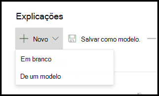 

2.  Na página **Modelos de explicação**, selecione a explicação que você deseja usar e, em seguida, selecione **Adicionar**. 

        

3. As informações do modelo que você selecionou são exibidas na página **Criar uma explicação**. Se necessário, edite o nome da explicação e adicione ou remova itens da lista de frases.   

    

4. Quando concluir, selecione **Salvar**.