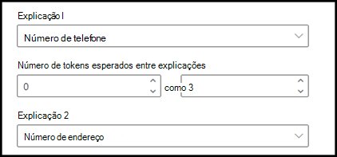

# Introdução aos tipos de explicação

As explicações são usadas para ajudar a definir as informações que você deseja rotular e extrai para seus modelos de compreensão de documentos no Microsoft SharePoint Syntex. Ao criar uma explicação, você precisa selecionar um tipo de explicação.Este artigo ajuda você a entender os diferentes tipos de explicação e como eles são usados. 

    
   
Esses tipos de explicação estão disponíveis:

- **Lista de frases**: lista de palavras, frases, números ou outros caracteres que você pode usar no documento ou informações que você está extraindo. Por exemplo, a cadeia de caracteres de texto **Médico de referência** está em todos os documentos de referências médicas que você está identificando. 

- **Lista de padrões**: lista padrões de números, letras ou outros caracteres que você pode usar para identificar as informações que você está extraindo. Por exemplo, você pode extrair o **número de telefone** do médico de referência de todos os documentos de Referência Médica identificados. 

- **Proximidade**: descreve como as explicações são próximas umas das outras. Por exemplo, uma lista de padrões de *número de rua* vai logo antes da lista de frases de *nomes de ruas*, sem tokens entre elas (você aprenderá sobre tokens posteriormente neste artigo). Usar o tipo de proximidade requer que você tenha pelo menos duas explicações em seu modelo ou a opção será desabilitada. 
 
## Lista de frases

Um tipo de explicação de lista de frases geralmente é usado para identificar e classificar um documento por meio do seu modelo. Conforme descrito no exemplo de rótulo *Médico de referência*, é uma cadeia de cadeia de palavras, frases, números ou caracteres que está de maneira consistente nos documentos que você está identificando.

Embora não seja um requisito, você pode obter um sucesso melhor com a sua explicação se a frase que está capturando estiver localizada em um local consistente no documento. Por exemplo, o rótulo *Médico de referência* pode estar localizado, de maneira consistente, no primeiro parágrafo do documento.

Se a diferenciação de maiúsculas e minúsculas for um requisito para a identificação do seu rótulo, usar o tipo de lista de frases permite que você o especifique na sua explicação selecionando a caixa de seleção **Somente maiúsculas**.

    

## Listas de padrões

Um tipo de lista de padrões é especialmente útil quando você cria uma explicação que identifique e extraia informações de um documento. Geralmente, é apresentado em formatos diferentes, como datas, números de telefone e números de cartão de crédito. Por exemplo, uma data pode ser exibida em diversos formatos (1/1/2020, 1-1-2020, 01/01/20, 01/01/2020, 1 de janeiro de 2020, etc.). A definição de uma lista de padrões torna suas explicações mais eficientes, capturando todas as variações possíveis nos dados que você está tentando identificar e extrair. 

Para obter o exemplo **número de telefone**, extraia o número de telefone de cada médico de referência de todos documentos de indicação médicas identificados pelo modelo. Ao criar a explicação, selecione o tipo de lista padrão para permitir que os diferentes formatos possam ser retornados.

   

Para este exemplo, selecione a caixa de seleção **Qualquer dígito de 0-9** para reconhecer cada valor "0" usado em sua lista de padrões como qualquer dígito de 0 a 9.

   

Da mesma forma, se você criar uma lista de padrões que inclui caracteres de texto, selecione a caixa de seleção **Qualquer letra de a-z** para reconhecer cada caractere "a" usado na lista de padrões como qualquer caractere de "a" a "z".

Por exemplo, se você criar uma lista de padrões **Data** e desejar verificar se um formato de data como *1º de janeiro de 2020* é reconhecido, será necessário:
- Adicionar *aaa 0, 0000* e *aaa 00, 0000* à sua lista de padrões.
- Verificar se **Qualquer letra de a-z** também está selecionada.

   

Além disso, se houver requisitos de capitalização em sua lista de padrões, você terá a opção de marcar a caixa de seleção **Somente capitalização exata**. Para o exemplo de data, se você deseja que a primeira letra do mês seja maiúscula, você precisa:

- Adicionar *Aaa 0, 0000* e *Aaa 00, 0000* à sua lista de padrões.
- Verificar se **Somente maiúsculas** também está selecionada.

   

> [!NOTE]
> Em vez de criar uma explicação da lista de padrões manualmente, use a [biblioteca de explicações](https://docs.microsoft.com/microsoft-365/contentunderstanding/explanation-types-overview#use-explanation-templates) para usar modelos de lista de padrões de uma lista de padrões comuns, como *data*, *número de telefone*, *número de cartão de crédito*, etc.

## Proximidade 

O tipo de explicação da proximidade ajuda seu modelo a identificar os dados, definindo o grau de fechamento de outros dados. Por exemplo, em seu modelo, digamos que você tenha definido duas explicações que rotulam o *número do endereço do cliente* e *Número de telefone*. 

Observe que os números de telefone do cliente sempre aparecem antes do número da rua. 

Alex Wilburn 
555-555-5555 
One Microsoft Way 
Redmond, WA 98034 

Use a explicação de proximidade para definir a distância da explicação do número de telefone para identificar melhor o número da rua em seus documentos.

    

#### O que são tokens?

Para usar o tipo de explicação de proximidade, você precisa entender o que é um token, uma vez que o número de tokens é como a explicação de proximidade mede a distância de uma explicação para a outra. Um token é um intervalo contínuo (sem incluir espaços ou pontuação) de letras e números. 

A tabela a seguir mostra exemplos de como determinar o número de tokens em uma frase.

|Frase|Número de tokens|Explicação|
|--|--|--|
|`Dog`|1|Uma única palavra sem pontuação ou espaços.|
|`RMT33W`|1|Um número de localizador de registro. Pode incluir números e letras, mas não tem pontuação.|
|`425-555-5555`|5|Número do Telefone. Cada sinal de pontuação é um único token, assim `425-555-5555` equivale a 5 tokens: `425` `-` `555` `-` `5555` |
|`https://luis.ai`|7|`https` `:` `/` `/` `luis` `.` `ai` |

#### Configurar o tipo de explicação de proximidade

Para o exemplo, configure a configuração de proximidade para definir o intervalo do número de tokens na explicação do *número de telefone* da explicação do *número de rua do endereço*. Observe que o intervalo mínimo é "0", porque não há tokens entre o número do telefone e o número do endereço.

No entanto, alguns números de telefone nos documentos de exemplo são acrescentados no *(telefone)*.

Nestor Wilke 
111-111-1111 (móvel) 
One Microsoft Way 
Redmond, WA 98034 

Há três tokens em *(móvel)*:

|Frase|Contagem de tokens|
|--|--|
|(|1|
|móvel|2|
|)|3|

Definir a configuração de proximidade para ter um intervalo de 0 a 3.

    

## Usar modelos de explicação

Embora seja possível adicionar vários valores da lista de padrões à sua explicação, pode ser mais fácil usar os modelos fornecidos na biblioteca de explicações.

Por exemplo, em vez de adicionar manualmente todas as variações para *Data*, você pode usar o modelo de lista de padrões para *Data*, pois já inclui diversos valores de listas de padrões: 

    
 
A biblioteca de explicações inclui explicações de lista de padrões usadas com frequência, incluindo: 

- Data 
- Data (numérico) 
- Hora 
- Número 
- Número de telefone 
- Código postal 
- Primeira palavra da frase 
- Cartão de crédito 
- Número do seguro social 

Observe que a biblioteca de explicações também inclui modelos de explicações de lista de frases:
- Fim da frase
- Moeda

#### Para usar um modelo da biblioteca de explicações

1. Na seção **Explicações** da página de **Treinamento** do seu modelo, selecione **Novo** e, em seguida, selecione **De um modelo**. 

    

2.  Na página **Modelos de explicação**, selecione a explicação que você deseja usar e, em seguida, selecione **Adicionar**. 

        

3. As informações do modelo que você selecionou são exibidas na página **Criar uma explicação**. Se necessário, edite o nome explicativo e adicione ou remova itens da lista padrão.   

    

4. Quando concluir, selecione **Salvar**.
