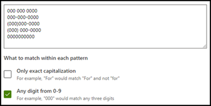

# Tipos de explicação no Microsoft SharePoint Syntex

As explicações são usadas para ajudar a definir as informações que você deseja rotular e extrai para seus modelos de compreensão de documentos no Microsoft SharePoint Syntex. Ao criar uma explicação, você precisa selecionar um tipo de explicação. Este artigo ajuda você a entender os diferentes tipos de explicação e como eles são usados.

 
   
Esses tipos de explicação estão disponíveis:

- [**Lista de frases**](#phrase-list): Lista de palavras, frases, números ou outros caracteres que você pode usar no documento ou nas informações que você está extraindo. Por exemplo, a cadeia de caracteres *médico encaminhador* está em todos os documentos de Referência Médica que você está identificando. Ou o *número de telefone* do médico encaminhador de todos os documentos de Referência Médica que você está identificando.

- [**Expressão regular**](#regular-expression): Usa uma notação de correspondência de padrão para encontrar padrões de caracteres específicos. Por exemplo, você pode usar uma expressão regular para encontrar todas as instâncias de um padrão de *endereço de email* em um conjunto de documentos.

- [**Proximidade**](#proximity): Descreve o quão próximas as explicações são umas das outras. Por exemplo, uma lista de frases de *número da rua* vai logo antes da lista de frases de *nome da rua*, sem tokens entre eles (você aprenderá sobre tokens posteriormente neste artigo). Usar o tipo de proximidade exige que você tenha pelo menos duas explicações em seu modelo, ou a opção será desabilitada. 

## Lista de frases

Um tipo de explicação de lista de frases geralmente é usado para identificar e classificar um documento por meio do seu modelo. Conforme descrito no exemplo de rótulo *médico encaminhador*, é uma cadeia de palavras, frases, números ou caracteres que está consistentemente nos documentos que você está identificando.

Embora não seja um requisito, você pode obter um sucesso melhor com a sua explicação se a frase que está capturando estiver localizada em um local consistente no documento. Por exemplo, o rótulo *médico encaminhador* poderia estar localizado consistentemente no primeiro parágrafo do documento. Você também pode usar a configuração avançada **[Configurar onde as frases ocorrem no documento](https://docs.microsoft.com/microsoft-365/contentunderstanding/explanation-types-overview#configure-where-phrases-occur-in-the-document)** para selecionar áreas específicas onde a frase se encontra, especialmente se houver uma chance de a frase ocorrer em vários locais no documento.

Se a diferenciação de maiúsculas e minúsculas for um requisito para a identificação do seu rótulo, usar o tipo de lista de frases permite que você o especifique na sua explicação selecionando a caixa de seleção **Somente maiúsculas**.

 

Um tipo de frase é especialmente útil quando você cria uma explicação que identifica e extrai informações em diferentes formatos, como datas, números de telefone e números de cartão de crédito. Por exemplo, uma data pode ser exibida em vários formatos diferentes (1/1/2020, 1-1-2020, 01/01/20, 01/01/2020 ou 1º de janeiro de 2020). Definir uma lista de frases torna sua explicação mais eficiente, capturando quaisquer variações possíveis nos dados que você está tentando identificar e extrair. 

Para o exemplo de *Número de telefone*, você extrai o número de telefone de cada médico encaminhador de todos os documentos de Referência Médica que o modelo identifica. Ao criar a explicação, digite os diferentes formatos que um número de telefone pode exibir em seu documento para que você possa capturar possíveis variações. 

Para este exemplo, em **Configurações Avançadas**, marque a caixa de seleção **Qualquer dígito de 0-9** para reconhecer cada valor "0" usado em sua lista de frases como qualquer dígito de 0 a 9.

Da mesma forma, se você criar uma lista de frases que inclua caracteres de texto, marque a caixa de seleção **Qualquer letra de a-z** para reconhecer cada caractere "a" usado na lista de frases como qualquer caractere de "a" a "z".

Por exemplo, se você criar uma lista de frases de **Data** e desejar ter certeza de que um formato de data como *Jan 1, 2020* será reconhecido, você precisará:

- Adicionar *aaa 0, 0000* e *aaa 00, 0000* à sua lista de frases.
- Verificar se **Qualquer letra de a-z** também está selecionada.

Se você tiver requisitos de uso de maiúsculas ou minúsculas na sua lista de frases, poderá marcar a caixa de seleção **Apenas capitalização exata**. Para o exemplo de data, se você exige que a primeira letra do mês seja maiúscula, você precisa:

- Adicionar *Aaa 0, 0000* e *Aaa 00, 0000* à sua lista de frases.
- Verificar se **Somente maiúsculas** também está selecionada.

> [!NOTE]
> Em vez de criar manualmente uma explicação de lista de frases, use a [biblioteca de explicações](https://docs.microsoft.com/microsoft-365/contentunderstanding/explanation-types-overview#use-explanation-templates) para usar modelos de lista de frases para uma lista de frases comuns, como *data*, *número de telefone* ou *número de cartão de crédito*.

## Expressão regular

Um tipo de explicação de expressão regular permite criar padrões que ajudam a encontrar e identificar determinadas cadeias de texto em documentos. Você pode usar expressões regulares para analisar rapidamente grandes quantidades de texto para:

- Encontrar padrões de caracteres específicos.
- Validar o texto para garantir que ele corresponde a um padrão predefinido (como um endereço de email).
- Extrair, editar, substituir ou excluir subseções de texto.

Um tipo de expressão regular é especialmente útil quando você cria uma explicação que identifica e extrai informações em formatos semelhantes, como endereços de email, números de conta bancária ou URLs. Por exemplo, um endereço de email, como megan@contoso.com, é exibido em um determinado padrão ("megan" é a primeira parte, e "com" é a última parte). 

A expressão regular para um endereço de email é: **[A-Za-z0-9._%-]+@[A-Za-z0-9.-]+.[A-Za-z]{2,6}**.

Essa expressão consiste em cinco partes, nesta ordem:

1. Qualquer quantidade dos seguintes caracteres:

   a. Letras de A a Z

   b. Números de 0 a 9

   c. Ponto, sublinhado, porcentagem ou traço

2. O símbolo @

3. Qualquer quantidade de caracteres iguais à primeira parte do endereço de email

4. Um ponto

5. De duas a seis letras

Para adicionar um tipo de explicação de expressão regular:

1. No painel **Criar uma explicação**, em **Tipo de explicação**, selecione **Expressão regular**.

   

2. Você pode digitar uma expressão na caixa de texto **Expressão regular** ou selecionar **Adicionar uma expressão regular a partir de um modelo**.

   Quando você adiciona uma expressão regular usando um modelo, ele adiciona automaticamente o nome e a expressão regular à caixa de texto. Por exemplo, se você escolher o modelo **Endereço de email**, o painel **Criar uma explicação** será preenchido.

   

### Limitações

A tabela a seguir mostra as opções de caracteres embutidos que atualmente não estão disponíveis para uso nos padrões de expressões regulares. 

|Opção  |Estado  |Funcionalidade atual  |
|---------|---------|---------|
|Diferenciação de maiúsculas e minúsculas | Sem suporte atualmente. | Todas as correspondências realizadas não diferenciam maiúsculas de minúsculas.  |
|Âncoras de linha     | Sem suporte atualmente. | Não é possível especificar uma posição específica em uma cadeia de caracteres onde uma correspondência deve acontecer.   |

## Proximidade 

O tipo de explicação da proximidade ajuda seu modelo a identificar dados definindo a proximidade dos dados entre si. Por exemplo, em seu modelo, você definiu duas explicações que rotulam o *Número da rua* e *Número de telefone* do cliente. 

Observe que os números de telefone do cliente sempre aparecem antes do número da rua. 

Alex Wilburn 
555-555-5555 
One Microsoft Way 
Redmond, WA 98034 

Use a explicação de proximidade para definir a distância da explicação do número de telefone para identificar melhor o número da rua em seus documentos.

#### O que são tokens?

Para usar o tipo de explicação de proximidade, você precisa entender o que é um token. O número de tokens é como a explicação de proximidade mede a distância de uma explicação para outra. Um token é um intervalo contínuo (sem incluir espaços ou pontuação) de letras e números. 

A tabela a seguir mostra exemplos de como determinar o número de tokens em uma frase.

|Frase|Número de tokens|Explicação|
|--|--|--|
|`Dog`|1|Uma única palavra sem pontuação ou espaços.|
|`RMT33W`|1|Um número de localizador de registro. Pode incluir números e letras, mas não tem pontuação.|
|`425-555-5555`|5|Um número de telefone. Cada sinal de pontuação é um único token, assim `425-555-5555` equivale a 5 tokens: `425` `-` `555` `-` `5555` |
|`https://luis.ai`|7|`https` `:` `/` `/` `luis` `.` `ai` |

#### Configurar o tipo de explicação de proximidade

Para o exemplo, defina a configuração de proximidade para definir o intervalo do número de tokens na explicação do *número de telefone* da explicação do *número da rua*. Observe que o intervalo mínimo é “0”, pois não há nenhum token entre o número de telefone e o número da rua.

No entanto, alguns números de telefone nos documentos de exemplo são acrescentados no *(telefone)*.

Nestor Wilke 
111-111-1111 (móvel) 
One Microsoft Way 
Redmond, WA 98034 

Há três tokens em *(móvel)*:

|Frase|Contagem de tokens|
|--|--|
|(|1|
|móvel|2|
|)|3|

Definir a configuração de proximidade para ter um intervalo de 0 a 3.

## Configurar onde as frases ocorrem no documento

Quando você cria uma explicação, por padrão, todo o documento é pesquisado pela frase que você está tentando extrair. No entanto, você pode usar a configuração avançada **Onde essas frases ocorrem** para ajudar a isolar um local específico do documento em que ocorre uma frase. Essa configuração é útil em situações em que instâncias semelhantes de uma frase podem aparecer em outro lugar no documento e você deseja ter certeza de que a correta está selecionada.

Ao se referir ao nosso exemplo de documento de Referência Médica, o *médico encaminhador* sempre é mencionado no primeiro parágrafo do documento. Com a configuração **Onde essas frases ocorrem**, neste exemplo, você pode configurar a explicação para pesquisar por esse rótulo somente na seção inicial do documento ou em qualquer outro local em que ela possa ocorrer.

Você pode escolher uma das três opções para esta configuração:

- Em qualquer lugar no arquivo: o documento inteiro é pesquisado pela frase.

- Início do arquivo: o documento é pesquisado do início até o local da frase.

   

    No visualizador, você pode ajustar manualmente a caixa de seleção para incluir o local onde a fase ocorre. O valor **Posição final** será atualizado para mostrar o número de tokens que sua área selecionada inclui. Você pode atualizar o valor da **Posição final** para ajustar a área selecionada.

   

- Fim do arquivo: O documento é pesquisado desde o final até a localização da frase.

   

    No visualizador, você pode ajustar manualmente a caixa de seleção para incluir o local onde a fase ocorre. O valor **Posição incial** será atualizado para mostrar o número de tokens que sua área selecionada inclui. Você também pode atualizar o valor da Posição inicial para ajustar a área selecionada.

   

- Intervalo personalizado: O documento é pesquisado dentro de um intervalo especificado para o local da frase.

   

    No visualizador, você pode ajustar manualmente a caixa de seleção para incluir o local onde a fase ocorre. Para essa configuração, você precisa selecionar uma posição **Inicial** e uma **Final**. Esses valores representam o número de tokens desde o início do documento. Embora seja possível inserir manualmente esses valores, é mais fácil ajustar manualmente a caixa de seleção no visualizador. 
   
## Usar modelos de explicação

Embora você possa adicionar manualmente vários valores da lista de frases para sua explicação, pode ser mais fácil usar os modelos fornecidos a você na biblioteca de explicação.

Por exemplo, em vez de adicionar manualmente todas as variações de *data*, você pode usar o modelo de lista de frases para *data* porque ele já inclui muitos valores de listas de frases:

 
A biblioteca de explicações inclui explicações de *lista de frases* frequentemente usadas, incluindo:

- Data: datas do Calendário do Outlook, todos os formatos. Inclui texto e números (por exemplo, "9 de dezembro de 2020").
- Data (numérico): datas do Calendário do Outlook, todos os formatos. Inclui números (por exemplo, 1-11-2020).
- Relógio: formatos de 12 e 24 horas.
- Número: números positivos e negativos até dois decimais. 
- Porcentagem: uma lista de padrões que representam uma porcentagem. Por exemplo, 1%, 11%, 100% ou 11,11%.
- Número de telefone: Formatos comuns nos EUA e internacionais. Por exemplo, 000 000 0000, 000-000-0000, (000)000-0000 ou (000) 000-0000.
- Código postal: formatos de código postal dos EUA. Por exemplo, 11111, 11111-1111.
- Primeira palavra da frase: Padrões comuns para palavras de até nove caracteres. 
- Fim da frase: pontuação comum para o final de uma frase.
- Cartão de crédito: formatos comuns de número de cartão de crédito. Por exemplo, 1111-1111-1111-1111. 
- Número da previdência social: Formato do número da previdência social dos EUA. Por exemplo, 111-11-1111. 
- Caixa de seleção: Uma lista de frases que representa variações de uma caixa de seleção preenchida. Por exemplo, _X_, _ _X_.
- Moeda: principais símbolos internacionais. Por exemplo, $. 
- CC de Email: uma lista de frases com o termo "CC:", muitas vezes encontrado perto dos nomes ou endereços de email de outras pessoas ou grupos para onde a mensagem foi enviada.
- Data do email: uma lista de frases com o termo 'Enviado em:', geralmente encontrada próximo à data em que o email foi enviado.
- Saudação por email: linhas de abertura comuns para emails.
- Destinatário do email: uma lista de frases com o termo 'Para:', geralmente encontrada próximo aos nomes ou endereços de email de pessoas ou grupos para os quais a mensagem foi enviada. 
- Remetente do email: uma lista de frases com o termo 'De:', geralmente encontrada próximo ao nome ou endereço de email do remetente. 
- Assunto do email: uma lista de frases com o termo 'Assunto:', geralmente encontrada próximo ao assunto do email.

A biblioteca de explicações também inclui explicações de *expressões regulares* frequentemente usadas, incluindo:

- Números de 6 a 17 dígitos: Corresponde qualquer número entre 6 e 17 dígitos. Números de contas bancárias dos EUA se ajustam a esse padrão.
- Endereço de email: Corresponde a um tipo comum de endereço de email como meganb@contoso.com.
- Número de Identificação de Contribuinte dos EUA: Corresponde a um número de três dígitos que começa com 9 seguido de um número de 6 dígitos, começando com 7 ou 8. 
- Endereço Web (URL): corresponde ao formato de um endereço Web, começando por http:// ou https://.

Além disso, a biblioteca de explicações inclui três tipos de modelos automáticos que funcionam com os dados rotulados nos seus arquivos de exemplo:

- Depois do rótulo: As palavras ou caracteres que ocorrem após os rótulos nos arquivos de exemplo.
- Antes do rótulo: As palavras ou caracteres que ocorrem antes dos rótulos nos arquivos de exemplo.
- Rótulos: Até os primeiros 10 rótulos dos arquivos de exemplo.

Para lhe dar um exemplo de como os modelos automáticos funcionam, no arquivo de exemplo a seguir, usaremos o modelo de explicação Antes do rótulo para ajudar a fornecer ao modelo mais informações para obter uma correspondência mais precisa.

Quando você seleciona o modelo de explicação Antes do rótulo, ele procura o primeiro conjunto de palavras que aparece antes do rótulo em seus arquivos de exemplo. No exemplo, as palavras identificadas no primeiro arquivo de exemplo são "A partir de".

Você pode selecionar **Adicionar** para criar uma explicação a partir do modelo.  Conforme você adiciona mais arquivos de exemplo, palavras adicionais serão identificadas e adicionadas à lista de frases.

 
#### Para usar um modelo da biblioteca de explicações

1. Na seção **Explicações** da página de **Treinamento** do seu modelo, selecione **Novo** e, em seguida, selecione **De um modelo**.

   

2.  Na página **Modelos de explicação**, selecione a explicação que você deseja usar e, em seguida, selecione **Adicionar**.

    

3. As informações do modelo que você selecionou são exibidas na página **Criar uma explicação**. Se necessário, edite o nome da explicação e adicione ou remova itens da lista de frases.  

    

4. Quando concluir, selecione **Salvar**.