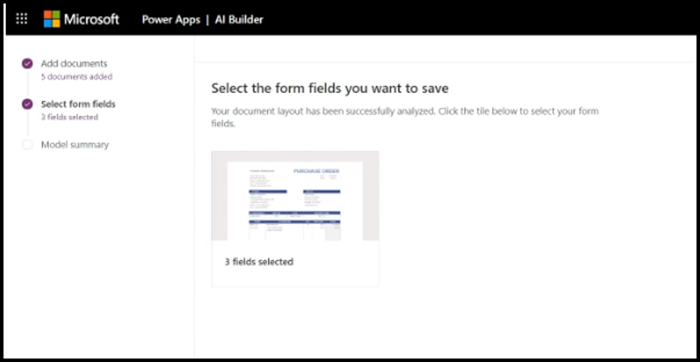

# Visão geral do processamento de formulário

  

O Microsoft SharePoint Syntex usa o processamento de formulário do [Construtor AI](https://docs.microsoft.com/ai-builder/overview) do Microsoft PowerApps para criar modelos nas bibliotecas de documentos do SharePoint.

Você pode usar o processamento de formulário do Construtor AI para criar modelos AI que usam a tecnologia de aprendizado de máquina para identificar e extrair os pares de chave/valor e os dados da tabela de documentos estruturados e semiestruturados, como formulários e faturas.

As organizações geralmente recebem faturas em grandes quantidades de diversas fontes, como correio, fax, email, etc. Processar esses documentos e inseri-los manualmente em um banco de dados pode demorar um período de tempo considerável. Ao usar AI para extrair o texto, os pares de chave/valor e tabelas dos seus documentos, o processamento de formulário automatiza esse processo. 

> [!NOTE]
> Confira [Adoção do SharePoint Syntex: guia de introdução](https://docs.microsoft.com/microsoft-365/contentunderstanding/adoption-getstarted#form-processing-scenario-example) para saber mais sobre os exemplos de cenários de processamento de formulário.

Por exemplo, você pode criar um modelo de processamento de formulário que identifique todos os documentos de pedido de compra carregados na biblioteca de documentos. De cada pedido de compra, você pode extrair e exibir dados específicos que são importantes para você, como *Número do PC*, *Data* ou *Custo Total*.

   

Você usa arquivos de exemplo para treinar seu modelo e definir as informações a serem extraídas do seu formulário. O layout do seu documento é aprendido treinando o seu modelo. Você só precisa de cinco documentos de formulário para começar. O Construtor AI analisará seus arquivos de exemplo para pares de chave/valor e você também pode identificar manualmente os que podem não ter sido detectados.  O Construtor AI permite testar a precisão do modelo em seus arquivos de exemplo.

Depois de treinar e publicar seu modelo, ele cria um [Fluxo do Power Automate](https://docs.microsoft.com/power-automate/getting-started). O fluxo será executado quando um arquivo for carregado na biblioteca de documentos do SharePoint e extrairá os dados identificados no modelo. Os dados extraídos serão exibidos em colunas no modo de exibição da biblioteca de documentos do seu modelo.

Um administrador do Office 365 precisa [habilitar o processamento de formulário](https://docs.microsoft.com/microsoft-365/contentunderstanding/set-up-content-understanding#to-set-up-content-understanding) da biblioteca de documentos do SharePoint para que os usuários possam [criar um modelo de processamento de formulário](create-a-form-processing-model.md) nele. Você pode selecionar os sites durante a instalação ou após a instalação das suas configurações de gerenciamento.

## Confira também
  
[Documentação do Power Automate](https://docs.microsoft.com/power-automate/)

[Criar um modelo de processamento de formulário](create-a-form-processing-model.md)

[Visão geral da compreensão de documentos](document-understanding-overview.md)

[Treinamento: melhorar o desempenho de negócios com o Construtor AI](https://docs.microsoft.com/learn/paths/improve-business-performance-ai-builder/?source=learn)
