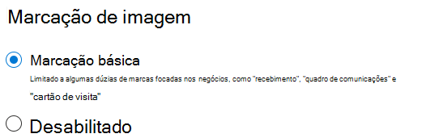

# Marcação de imagem no SharePoint Syntex

Por padrão, a marcação de imagem básica está habilitada no SharePoint e no OneDrive. As imagens carregadas para qualquer local são automaticamente verificadas e as marcas aplicáveis são aplicadas, caso disponíveis, em uma lista de 37 marcas básicas. Os usuários podem encontrar imagens pesquisando nas marcas de imagem.

Quando um usuário carrega uma imagem, o processo de marcação é executado automaticamente. Se uma imagem for editada, o processo de marcação será executado novamente para atualizar as marcas.

Os usuários com permissões para o arquivo de imagem podem ver e editar as marcas no painel de informações do arquivo ou na página de resultados da pesquisa. Quando um usuário edita as marcas de uma imagem, o sistema não executa mais a marcação automática nessa imagem, mesmo que ela seja editada.

Se você desativar a marcação, imagens não serão mais marcadas automaticamente. As marcas existentes não serão removidas.

## Configurar marcação de imagem

Você pode configurar a marcação de imagens no centro de administração do Microsoft 365.  

Para ativar ou desativar a marcação de imagem

1. No Centro de Administração do Microsoft 365, clique em **Configurar**.

2. Em **Conhecimento organizacional**, clique em **Automatizar o entendimento do conteúdo**.

3. Clique em **Gerenciar**.

4. Na guia **Marcação de imagem**, clique em **Editar**.

5. Opte por permitir a **marcação básica** ou **desabilite**a marcação.

6. Clique em **Salvar**.

    

## Confira também

[Configurar o entendimento de conteúdo](set-up-content-understanding.md)