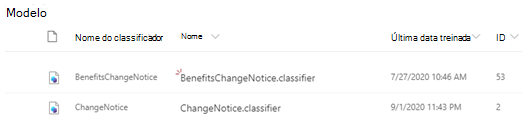

# Saiba mais sobre documentos entendendo modelos por meio de um modelo de exemploLearn about document understanding models through a sample model

O Microsoft SharePoint Syntex fornece um modelo de exemplo que você pode usar para examinar, dando a você uma compreensão melhor de como criar seus próprios modelos.Microsoft SharePoint Syntex provides you a with a sample model you can use to examine, giving you a better understanding of how to create your own models. O modelo de amostra também permite examinar componentes de modelo, como classificador, extratores e explicações.The sample model also allows you to examine model components, such as its classifier, extractors, and explanations. Você também pode usar os arquivos de exemplo para treinar o modelo.You can also use the sample files to train the model.

## Importar o modelo de amostraImport the sample model

Para acessar o modelo de amostra, você precisa primeiro importar o modelo para o seu centro de conteúdo.To access the sample model, you need to first import the model to your content center.

1. No centro de conteúdo, selecione **modelos** para ver sua lista de modelos.From the content center, select **Models** to see your models list. 
2. Na página **modelos** , selecione **modelo de amostra de importação**.On the **Models** page, select **Import sample model**. 

      

3. Procure o modelo de exemplo intitulado *BenefitsChangeNotice. classificador* que aparece na sua lista de modelos.Look for the sample model titled *BenefitsChangeNotice.classifier* that appears in your models list. 

      

4. Selecione o *BenefitsChangeNotice. classificador*, para abrir a home page do modelo.Select the *BenefitsChangeNotice.classifier*, to open the model's home page. 
  
     

5. Na home page do modelo, examine o modelo mais atentamente para ver como ele foi criado.From the model home page, examine the model more closely to see how it was created.
 
- Exibir os arquivos de exemplo usados para treinar o modelo.View the sample files used to train the model.
- Examine os extratores de entidade do modelo mais atentamente para ver como o modelo de exemplo configurou as explicações.Examine the model's entity extractors more closely to see how the sample model configured the explanations.

     

## Confira tambémSee Also
[Criar um classificadorCreate a classifier](create-a-classifier.md) 
[Criar um extratorCreate an extractor](create-an-extractor.md) 
[Visão geral da compreensão do documentoDocument Understanding overview](document-understanding-overview.md) 
[Criar um modelo de processamento de formuláriosCreate a form processing model](create-a-form-processing-model.md)  
