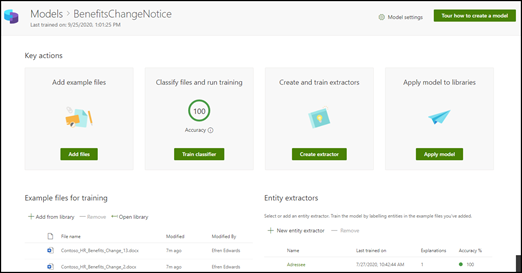

# Saiba mais sobre os modelos de compreensão de documentos por meio de um modelo de exemplo

O Microsoft SharePoint Syntex fornece um modelo de exemplo que você pode usar para examinar, dando a você uma melhor compreensão sobre como criar seus próprios modelos. O modelo de exemplo também permite que você examine componentes do modelo, como classificador, extratores e explicações. Você também pode usar os arquivos de exemplo para treinar o modelo.

## Importar o modelo de exemplo

Para acessar o modelo de exemplo, primeiro é necessário importar o modelo para o seu centro de conteúdo.

1. No centro de conteúdo, selecione **Modelos** para ver a lista de modelos. 
2. Na página **Modelos**, selecione **Importar modelo de exemplo**. 

      

3. Quando a importação for concluída, a página modelo **BenefitsChangeNotice** será aberta. Se você precisar abrir o modelo de exemplo no futuro, poderá fazer isso na lista de modelos no centro de conteúdo.  

      

Você não só pode examinar a análise do modelo de exemplo para ter uma melhor compreensão de como o modelo é construído, mas como um modelo funcional pode ir além e fazer coisas como:

- Adicionar um outro extrator. Por exemplo, adicione um que extraia a *taxa de desconto*.
- Aplique o modelo a uma biblioteca de documentos e carregue alguns arquivos de treinamento nela para ver como o modelo classifica arquivos e extrai os dados.

## Confira também
[Criar um classificador](create-a-classifier.md)

[Criar um extrator](create-an-extractor.md)

[Visão geral da compreensão de documentos](document-understanding-overview.md)

[Criar um modelo de processamento de formulário](create-a-form-processing-model.md)  
