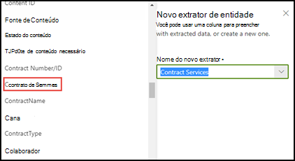
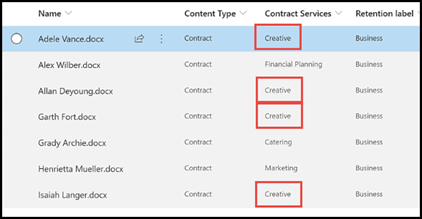

# Aproveitar a taxonomia do repositório de termos ao criar um extratorLeverage term store taxonomy when creating an extractor

 

> [!VIDEO https://www.microsoft.com/videoplayer/embed/RE4GpJJ]  

 

Ao criar um extrator em seu modelo de compreensão de documento usando o SharePoint Syntex, você pode aproveitar os conjuntos de termos globais no [repositório de termos](https://docs.microsoft.com/sharepoint/managed-metadata) para exibir os termos preferenciais para os dados extraídos.When you create an extractor in your document understanding model using SharePoint Syntex, you can take advantage of global term sets in the [term store](https://docs.microsoft.com/sharepoint/managed-metadata) to display preferred terms for data that you extract.  

Por exemplo, o modelo identifica e classifica todos os documentos de **Contrato** que são carregados na biblioteca de documentos.As an example, your model identifies and classifies all **Contract** documents that are uploaded to the document library.  Além disso, o modelo também extrai um valor de **Serviços contratados** de cada contrato e o exibirá em uma coluna no modo de exibição de biblioteca.Additionally, the model also extracts a **Contract Service** value from each contract, and will display it in a column in your library view. Entre os vários valores dos Serviços contratados nos contratos, há vários valores mais antigos que a sua empresa não usa mais e foi renomeado.Among the various Contract Services values in the contracts, there are several older values that your company no longer uses and have been renamed. Por exemplo, todas as referências aos termos de serviços contratados *Design*, *Gráficos* ou *Topografia* devem agora ser chamados *Criativo*.For example, all references to the terms *Design*, *Graphics*, or *Topography* contract services should now be called *Creative*. Sempre que seu modelo extrai um dos termos desatualizados de um documento de contrato, você quer que ele exiba o termo atual - Criativo - no modo de exibição da biblioteca.Whenever your model extracts one of the outdated terms from a contract document, you want it to display the current term - Creative - in your library view. No exemplo a seguir, enquanto treina o modelo, vemos que um documento de exemplo contém o termo desatualizado *Design*.In the example below, while training the model we see that one sample document contains the outdated term of *Design*.

    

## Usar uma coluna de metadados gerenciados no extratorUse a Managed metadata column in your extractor

Os conjuntos de termos são configurados no repositório de termos de serviços de Metadados Gerenciados (MMS) no Centro de administração do SharePoint.Term sets are configured in the Managed Metadata services (MMS) term store in the SharePoint admin center. No exemplo abaixo, o *Contrato de Serviços* [conjunto de termos](https://docs.microsoft.com/sharepoint/managed-metadata#term-set) está configurado para incluir vários termos, incluindo o *Criativo*.In the example below, the *Contract Services* [term set](https://docs.microsoft.com/sharepoint/managed-metadata#term-set) is configured to include several terms, including *Creative*.  Os detalhes mostram que o termo tem três sinônimos (*Design*, *Gráficos* e *Topografia*) e os sinônimos devem ser traduzidos para *Criativo*.The details for it show that the term has three synonyms (*Design*, *Graphics*, and *Topography*) and the synonyms should be translated to *Creative*. 

    

Pode haver muitos motivos pelos quais você pode querer usar um sinônimo em seu conjunto de termos.There could be many reasons why you might want to use a synonym in your term set. Por exemplo, pode haver termos desatualizados, termos renomeados ou variações de nome entre seus departamentos de organizações.For example, there could be outdated terms, renamed terms, or variations between your organizations departments on naming.

Para disponibilizar o campo de metadados gerenciados para seleção ao criar seu extrator em seu modelo, você precisa [adicioná-lo como uma coluna de site de metadados gerenciados](https://support.microsoft.com/office/8fad9e35-a618-4400-b3c7-46f02785d27f).To make the managed metadata field available to select when you create your extractor in your model, you need to [add it as a managed-metadata site column](https://support.microsoft.com/office/8fad9e35-a618-4400-b3c7-46f02785d27f). Depois de adicionar a coluna do site, você pode selecioná-la ao criar o extrator para o seu modelo.After you add the site column, you can select it when you create the extractor for your model.

    

Depois de aplicar seu modelo à biblioteca de documentos, quando os documentos forem carregados na biblioteca, a coluna de *Serviços criativos* exibirá o termo preferido (*Criativo*) quando o extrator encontrar qualquer um dos valores de sinônimos (*Design*, *Gráficos* e *Topografia*).After applying your model to the document library, when documents are uploaded to library, the *Creative Services* column will display the preferred term (*Creative*) when the extractor finds any of the synonym values (*Design*, *Graphics*, and *Topography*).

    

## Confira tambémSee Also
[Introdução a Metadados gerenciadosIntroduction to Managed Metadata](https://docs.microsoft.com/sharepoint/managed-metadata#terms)

[Criar um extratorCreate an extractor](create-an-extractor.md)

[Criar uma coluna de metadados gerenciadosCreate a managed metadata column](https://support.microsoft.com/office/create-a-managed-metadata-column-8fad9e35-a618-4400-b3c7-46f02785d27f?redirectSourcePath=%252farticle%252fc2a06717-8105-4aea-890d-3082853ab7b7&ui=en-US&rs=en-US&ad=US)

