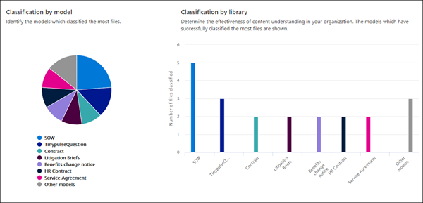
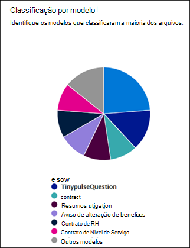
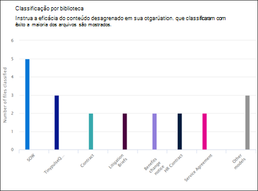

# Análise do uso do modelo de compreensão de documentos

 

> [!VIDEO https://www.microsoft.com/videoplayer/embed/RE4GpJY]  

 

O centro de conteúdo do Microsoft SharePoint Syntex disponibiliza a você análises de uso de modelos para fornecer mais informações de como seus modelos publicados no centro de conteúdo estão sendo usados. Isso inclui um conjunto das seguintes informações:

- Onde seus modelos estão sendo aplicados
- Quantos arquivos estão sendo processadas ao longo do tempo

   

## Porcentagem total dos modelos

     

O gráfico de pizza da **porcentagem total dos modelos** exibe cada modelo publicado como uma porcentagem do total de arquivos processados por todos os modelos publicados no centro de conteúdo.

Cada modelo também mostra a **Taxa de conclusão**, a porcentagem de arquivos carregados que foram analisados com êxito pelo modelo. Uma taxa de conclusão insuficiente pode significar que há problemas com o modelo ou com os arquivos que estão sendo analisados.

## Arquivos processados ao longo do tempo

     

O gráfico de barras dos **arquivos processados ao longo do tempo**mostra não apenas o número de arquivos processados ao longo do tempo para cada modelo, mas também mostra a biblioteca de documentos para a qual o modelo foi aplicado.

     

## Confira também
[Criar um classificador](create-a-classifier.md)

[Criar um extrator](create-an-extractor.md)

[Visão geral da compreensão de documentos](document-understanding-overview.md)

[Criar um modelo de processamento de formulário](create-a-form-processing-model.md)  
