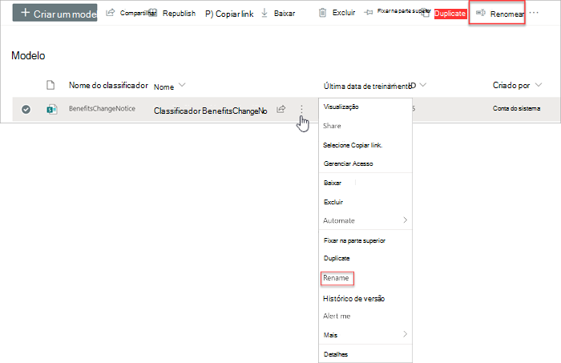
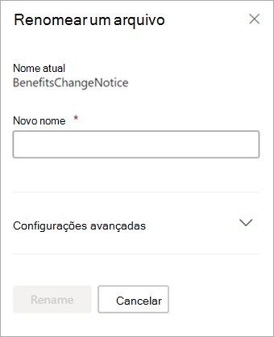

# Renomear um modelo no Microsoft SharePoint Syntex

Em algum ponto, você pode querer renomear um modelo de compreensão de documentos. Um exemplo comum é quando você cria um rascunho inicial de um modelo, você pode não ter pensado muito sobre o nome final (por exemplo, você pode ter chamado de “AlexWilburModel1”). À medida que você chega mais perto de finalizar o modelo e colocá-lo em uso, percebe que um nome mais adequado seria “Renovações de Contrato” e deseja renomeá-lo.  

Outro exemplo é quando sua organização toma a decisão de se referir a um processo ou tipo de documento com um nome diferente. Por exemplo, depois de criar seu modelo e estar pronto para aplicá-lo, sua organização pode exigir que todos os "Contratos" sejam agora formalmente chamados de "Acordos". Se necessário, você pode escolher renomear seu modelo de "Renovações de Contrato" para "Renovações de Contrato".

> [!IMPORTANT]
> Você só pode renomear um modelo de compreensão de documento se ele não tiver sido aplicado a uma biblioteca de documentos. 

Renomear um modelo também renomeia o [tipo de conteúdo](/sharepoint/governance/content-type-and-workflow-planning#content-type-overview) associado ao modelo.

## Renomear um arquivo

Siga estas etapas para renomear um modelo de compreensão de documento.

1. No centro de conteúdo, selecione **Modelos** para ver a lista de modelos.

2. Na página **Modelos**, selecione o modelo que deseja renomear.

3. Usando a faixa de opções ou o botão **Mostrar ações** (ao lado do nome do modelo), selecione **Renomear**.  

      

4. No painel **Renomear modelo**:

   a. Em **Novo nome**, insira o novo nome do modelo que deseja renomear. 

      

   b. (Opcional) Em **Configurações avançadas**, selecione se deseja associar um tipo de [conteúdo existente](/sharepoint/governance/content-type-and-workflow-planning#content-type-overview). Se você escolher **Usar um tipo de conteúdo existente**, o modelo será renomeado para corresponder ao tipo de conteúdo selecionado.

5. Selecione **Renomear**.

## Confira também
[Criar um classificador](create-a-classifier.md)

[Criar um extrator](create-an-extractor.md)

[Renomear um extrator](rename-an-extractor.md)

[Visão geral sobre Compreensão de Documentos](document-understanding-overview.md).

[Tipos de explicação](explanation-types-overview.md)

[Aplicar um modelo](apply-a-model.md) 
