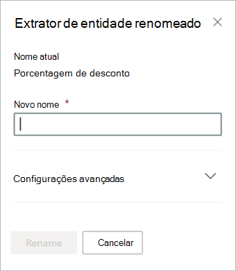

# Renomear um extrator no Microsoft SharePoint SyntexRename an extractor in Microsoft SharePoint Syntex

Em algum ponto, você pode precisar renomear um extrator se quiser se referir a um campo de dados extraído com um nome diferente.At some point, you might need to rename an extractor if you want to refer to an extracted data field by a different name. Por exemplo, sua organização decide fazer alterações em seus documentos de contrato e se refere a “consumidor” como “clientes” em seus documentos.For example, your organization decides to make changes to their contract documents, and refers to “customers” as “clients” in their documents. Se você estava extraindo um campo "Consumidor" em seu modelo, pode escolher renomeá-lo para "Cliente".If you were extracting a “Customer” field in your model, you can choose to rename it to “Client.”

Ao sincronizar o modelo atualizado com a biblioteca de documentos do Microsoft Office SharePoint Online, você verá uma nova coluna “Cliente” na exibição da biblioteca de documentos.When you sync your updated model to your SharePoint document library, you will see a new “Client” column in your document library view. Sua exibição manterá a coluna “Consumidor” para atividades anteriores, mas atualizará a nova coluna “Cliente” para todos os novos documentos que são processados por seu modelo.Your view will retain the “Customer” column for past activity, but will update the new “Client” column for all new documents that are processed by your model. 

> [!IMPORTANT]
>  Certifique-se de sincronizar seu modelo atualizado com as bibliotecas de documentos onde você o aplicou anteriormente para que o novo nome da coluna seja exibido.Make sure to sync your updated model to the document libraries where you had previously applied it for the new column name to display. 

## Renomear um extratorRename an extractor

Siga estas etapas para renomear um extrator de entidade.Follow these steps to rename an entity extractor.

1. No centro de conteúdo, selecione **Modelos** para ver a lista de modelos.From the content center, select **Models** to see your models list.

2. Na página **Modelos**, na coluna **Nome**, selecione o modelo para o qual deseja renomear um extrator.On the **Models** page, in the **Name** column, select the model for which you want to rename an extractor.

3. Em **Extratores de entidades**, selecione o nome do extrator que deseja renomear e, a seguir, selecione **Renomear**.Under **Entity extractors**, select the name of the extractor you want to rename, and then select **Rename**. 

      

4. No painel **Renomear extrator de entidade**:On the **Rename entity extractor** panel:

   a.a. Em **Novo nome**, insira o novo nome do extrator.Under **New name**, enter the new name of the extractor. 

      

   b.b. (Opcional) Em **Configurações avançadas**, selecione se deseja associar uma coluna de site existente.(Optional) Under **Advanced settings**, select whether you want to associate an existing site column.

5. Selecione **Renomear**.Select **Rename**.

## Confira tambémSee Also
[Criar um extratorCreate an extractor](create-an-extractor.md)

[Criar um classificadorCreate a classifier](create-a-classifier.md)

[Renomear um modeloRename a model](rename-a-model.md)

[Tipos de explicaçãoExplanation types](explanation-types-overview.md)

[Aproveitar a taxonomia do repositório de termos ao criar um extratorLeverage term store taxonomy when creating an extractor](leverage-term-store-taxonomy.md)

[Visão geral sobre Compreensão de Documentos](document-understanding-overview.md).[Document Understanding overview](document-understanding-overview.md)

[Aplicar um modeloApply a model](apply-a-model.md) 
