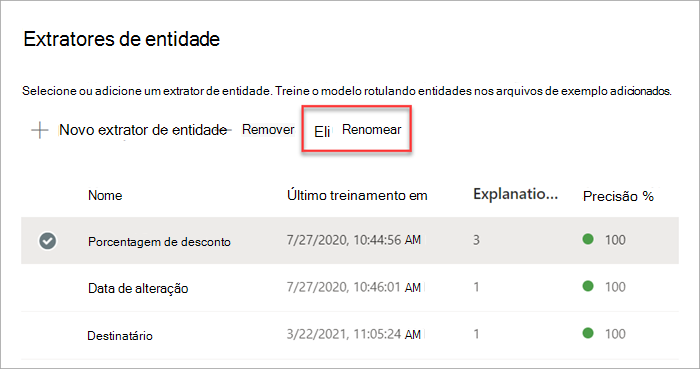

# Renomear um extrator no Microsoft SharePoint Syntex

Em algum ponto, você pode precisar renomear um extrator se quiser se referir a um campo de dados extraído com um nome diferente. Por exemplo, sua organização decide fazer alterações em seus documentos de contrato e se refere a “consumidor” como “clientes” em seus documentos. Se você estava extraindo um campo "Consumidor" em seu modelo, pode escolher renomeá-lo para "Cliente".

Ao sincronizar o modelo atualizado com a biblioteca de documentos do Microsoft Office SharePoint Online, você verá uma nova coluna “Cliente” na exibição da biblioteca de documentos. Sua exibição manterá a coluna “Consumidor” para atividades anteriores, mas atualizará a nova coluna “Cliente” para todos os novos documentos que são processados por seu modelo. 

> [!IMPORTANT]
>  Certifique-se de sincronizar seu modelo atualizado com as bibliotecas de documentos onde você o aplicou anteriormente para que o novo nome da coluna seja exibido. 

## Renomear um extrator

Siga estas etapas para renomear um extrator de entidade.

1. No centro de conteúdo, selecione **Modelos** para ver a lista de modelos.

2. Na página **Modelos**, na coluna **Nome**, selecione o modelo para o qual deseja renomear um extrator.

3. Em **Extratores de entidades**, selecione o nome do extrator que deseja renomear e, a seguir, selecione **Renomear**. 

      

4. No painel **Renomear extrator de entidade**:

   a. Em **Novo nome**, insira o novo nome do extrator. 

      

   b. (Opcional) Em **Configurações avançadas**, selecione se deseja associar uma coluna de site existente.

5. Selecione **Renomear**.

## Confira também
[Criar um extrator](create-an-extractor.md)

[Criar um classificador](create-a-classifier.md)

[Renomear um modelo](rename-a-model.md)

[Tipos de explicação](explanation-types-overview.md)

[Aproveitar a taxonomia do repositório de termos ao criar um extrator](leverage-term-store-taxonomy.md)

[Visão geral sobre Compreensão de Documentos](document-understanding-overview.md).

[Aplicar um modelo](apply-a-model.md) 
