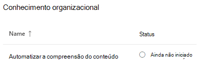
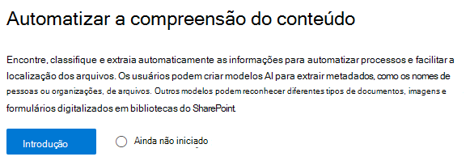
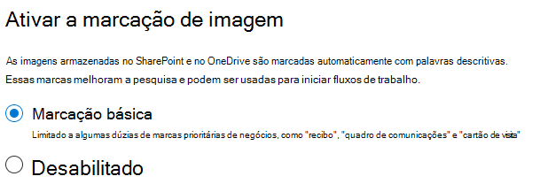
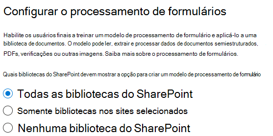
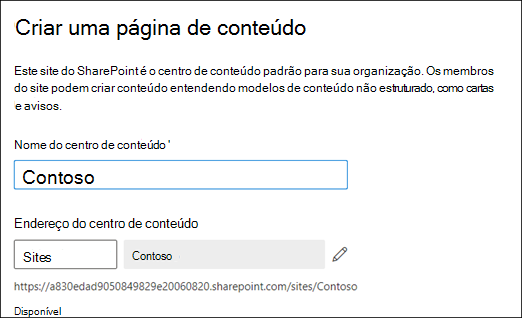
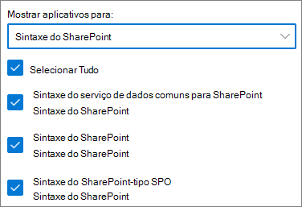

# Configuração do SharePoint Syntex

Os administradores podem usar o Centro de administração do Microsoft 365 para configurar o [Microsoft SharePoint Syntex](document-understanding-overview.md). 

Considere o seguinte antes de começar:

- Em quais sites do SharePoint você vai ativar o processamento de formulários? Todos, alguns ou sites selecionados?
- Qual será o nome do seu centro de conteúdo padrão?

É possível alterar suas configurações após a configuração inicial no Centro de administração do Microsoft 365.

O conteúdo deste artigo é para a visualização do Projeto Particular Cortex. [Mais informações sobre o Projeto Cortex](https://aka.ms/projectcortex).

Antes da configuração, certifique-se de planejar a melhor maneira de estabelecer e configurar a compreensão de conteúdo no seu ambiente. Por exemplo, você precisa levar em consideração os seguintes nomes de:

- Sites do SharePoint que você deseja ativar o processamento de formulários - todos, alguns ou sites selecionados
- Seu centro de conteúdo e o nome do administrador do site principal

## Requisitos 

> [!NOTE]
> Você deve ter permissões administrativas globais ou de administrador do SharePoint para poder acessar o Centro de administração do Microsoft 365 e configurar a compreensão de conteúdo.

Como administrador, também é possível fazer alterações nas configurações selecionadas a qualquer momento após a configuração e ao longo das configurações de gerenciamento de compreensão de conteúdo no Centro de Administração do Microsoft 365.

## Para configurar o SharePoint Syntex

1. No Centro de administração do Microsoft 365, selecione **Configuração**, e depois veja a seção **Conhecimento organizacional**.

2. Na seção **Conhecimento organizacional**, selecione **Compreensão automatizada de conteúdo**. 

     

3. Na página **Compreensão automatizada de conteúdo**, clique em **Começar** para percorrer o processo de instalação. 

     

4. Na página Ativar marcação de imagem, escolha se você quer permitir a [ marcação de imagens](image-tagging.md).

     

5. Na página **Configurar Processamento de Formulário**, você pode escolher se quer permitir que os usuários sejam capazes de criar modelos de processamento de formulários em bibliotecas específicas de documentos do SharePoint. Uma opção de menu estará disponível na faixa de opções da biblioteca de documentos para **Criar um modelo de processamento de formulário** nas bibliotecas de documentos do SharePoint nas quais ele está ativado.
 
     Para **Quais bibliotecas do SharePoint devem exibir a opção para criar um modelo de processamento de formulário**, você pode selecionar: 
      - **Todas as bibliotecas do SharePoint** para torná-lo disponível em todas as bibliotecas do SharePoint em sua organização. 
      - **Bibliotecas somente em sites selecionados**, e então selecione os sites nos quais você quer disponibilizá-lo ou carregue uma lista de até 50 sites. 
      - **Nenhuma biblioteca do SharePoint** se você não deseja torná-lo disponível para nenhum site (você pode alterar isto após a configuração).

   

   > [!Note]
   > A remoção de um site após a sua insalubridade não afeta os modelos existentes aplicados às bibliotecas naquele site ou a capacidade de aplicar modelos de compreensão de documentos a uma biblioteca. 
    
6. Na página **Criar Centro de Conteúdo**, você pode criar um site de centro de conteúdo do SharePoint, no qual seus usuários poderão criar e gerenciar modelos de compreensão de documentos.  
    a. Para **Nome do site**, digite o nome que você quer dar ao seu site do centro de conteúdo. 
    b. O **Endereço do site** mostrará o URL do seu site, baseado no que você selecionou para o nome do site. Se você desejar mudá-lo, clique em **Editar**. 

       

    Selecione **Avançar**.

7. Na página **Revisão e acabamento**, você pode olhar para a configuração selecionada e escolher fazer alterações. Se estiver satisfeito com as suas seleções, selecione **Ativar**.

8. Na página de confirmação, clique em **Concluído**.

9. Você retornará à sua página **Compreensão automatizada de conteúdo**. A partir desta página, é possível selecionar **Gerenciar** para fazer quaisquer alterações em suas configurações. 

## Atribua licenças

Uma vez configurado o SharePoint Syntex, será necessário atribuir licenças para os usuários que farão uso dos recursos do SharePoint Syntex.

Atribuição de licenças:

1. No Centro de administração do Microsoft 365, em **Usuários**, clique em **Usuários ativos**.

2. Selecione os usuários que você deseja licenciar, e clique **Gerenciar licenças de produtos**.

3. Selecione **Atribuir mais**.

4. Selecione **Serviços de Conteúdo Inteligente**. Em **Aplicativos**, certifique-se de que **Serviço de Dados Comum para Serviços de Conteúdo Inteligente** e **Serviços de Conteúdo Inteligente** estejam ambos selecionados.

    

5. Clique em **Salvar alterações**.

## Créditos do Construtor de IA

Se você tiver 300 ou mais licenças do SharePoint Syntex para o SharePoint Syntex na sua organização, você receberá um milhão de créditos do Construtor de IA. Se você tiver menos de 300 licenças, você deve comprar créditos do Construtor de IA para usar o processamento de formulários.

Você pode estimar a capacidade correta do Construtor de IA com a [calculadora do Construtor de IA](https://powerapps.microsoft.com/ai-builder-calculator).

Vá até o [Centro de administração da Plataforma Power ](https://admin.powerplatform.microsoft.com/resources/capacity) para verificar seus créditos e uso.

## Confira também

[Visão geral do modelo de processamento de formulários](https://docs.microsoft.com/ai-builder/form-processing-model-overview).

[Passo a passo: como construir um modelo de compreensão de documentos (vídeo)](https://www.youtube.com/watch?v=DymSHObD-bg)

